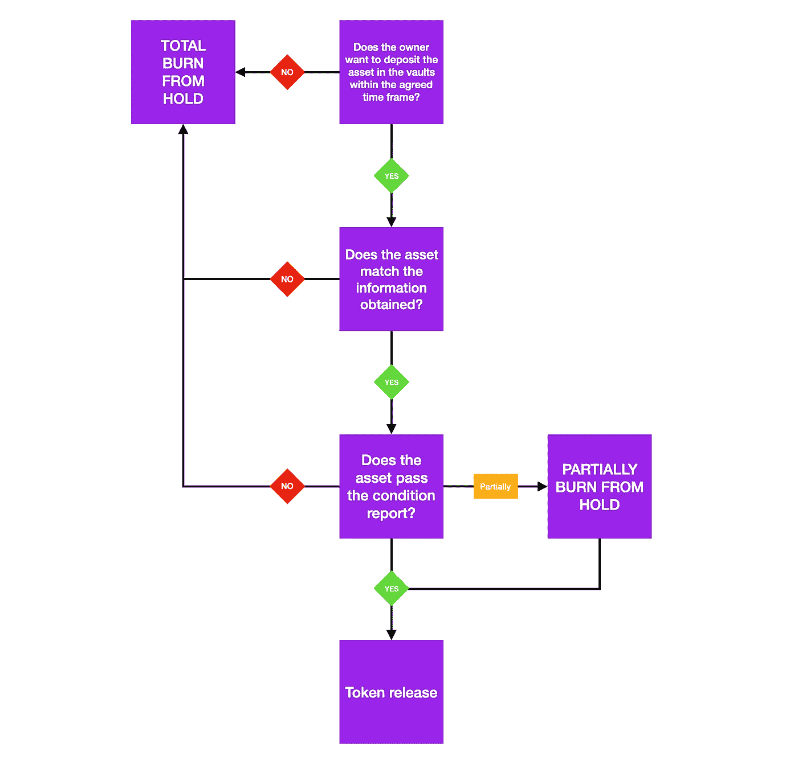

# 刺激令牌释放过程

> 原文：<https://medium.com/coinmonks/stima-token-release-process-73156962a0e7?source=collection_archive---------78----------------------->

为了更好地解释解锁过程，绘制了决策过程的详细图表:

该流程分为 3 个步骤:

所有者是否决定将资产存放在金库中？
代币铸造时，STIMA 与所有者签订合同，合同包含以下数据:
-资产描述，
-约定的美元价值，
-STIMA 在特定时刻的代币价值，
-将资产存入金库的时间。
如果所有者没有在约定的时间范围内将资产存放在保险库中，锁定的令牌将被销毁

**b)资产是否与信息相符？**
在铸造过程中，所有者完成 AML 程序，包括 KYC 和 KYO。
如果收到的信息与在 caveau 中接收资产时发现的信息不同，所有锁定的令牌都会被烧毁。

**c)资产是否通过条件报告？**
对资产进行深入的条件分析。
-如果发现不可接受的损坏，所有锁定的令牌都会被烧毁。
-如果发现可接受的损坏，将重新计算资产价值，并烧掉多余的代币。

**最后，如果点 a、b & c 中列出的所有条件都得到满足，代币解锁。
从那一刻起，代币不能再被 STIMA 操纵，被认为是在自由流通。**

查看我们的网站了解更多信息:https://stima.io/🟣

关注我们:insta gram:[https://www.instagram.com/stima.io](https://www.instagram.com/stima.io)
脸书:[https://www.facebook.com/stima.io](https://www.facebook.com/stima.io)
推特:[https://twitter.com/STIMA_Crypto](https://twitter.com/STIMA_Crypto)
Reddit:[https://www.reddit.com/r/stima](https://www.reddit.com/r/stima)

> 加入 Coinmonks [电报频道](https://t.me/coincodecap)和 [Youtube 频道](https://www.youtube.com/c/coinmonks/videos)了解加密交易和投资

# 另外，阅读

*   [如何在印度购买比特币？](/coinmonks/buy-bitcoin-in-india-feb50ddfef94) | [WazirX 评论](/coinmonks/wazirx-review-5c811b074f5b)
*   [隐翅虫替代品](/coinmonks/cryptohopper-alternatives-d67287b16d27) | [HitBTC 审查](/coinmonks/hitbtc-review-c5143c5d53c2)
*   [CBET 点评](https://coincodecap.com/cbet-casino-review) | [库币 vs 比特币基地](https://coincodecap.com/kucoin-vs-coinbase)
*   [折叠 App 审核](https://coincodecap.com/fold-app-review) | [Kucoin 交易机器人](/coinmonks/kucoin-trading-bot-automate-your-trades-8cf0ca2138e0) | [Probit 审核](https://coincodecap.com/probit-review)
*   [如何匿名购买比特币](https://coincodecap.com/buy-bitcoin-anonymously) | [比特币现金钱包](https://coincodecap.com/bitcoin-cash-wallets)
*   [币安 vs FTX](https://coincodecap.com/binance-vs-ftx) | [最佳(索尔)索拉纳钱包](https://coincodecap.com/solana-wallets)
*   [比诺莫评论](https://coincodecap.com/binomo-review) | [斯多葛派 vs 3Commas vs TradeSanta](https://coincodecap.com/stoic-vs-3commas-vs-tradesanta)
*   [Capital.com 评论](https://coincodecap.com/capital-com-review) | [香港的加密借贷平台](https://coincodecap.com/crypto-lending-hong-kong)