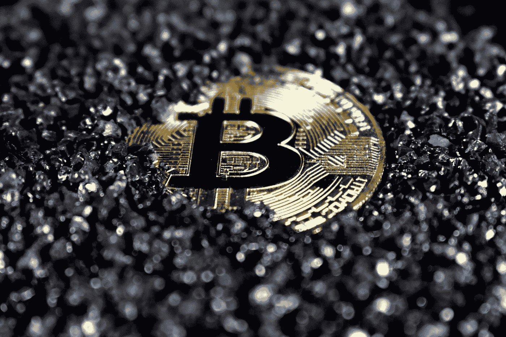

# 股票，加密，还是加密股票？股票期权如何解锁加密收益

> 原文：<https://medium.com/coinmonks/stocks-crypto-or-stocks-for-crypto-how-stock-options-could-unlock-crypto-gains-f36daeb2b092?source=collection_archive---------73----------------------->

## 对许多投资者来说，交易加密货币意味着离开舒适区。通常情况下，这是一个太大的飞跃。但是，如果有一种方法可以接触到密码，而实际上并不拥有任何密码呢？信不信由你，传统的股票期权可能是答案。

Photo by [Kanchanara](https://unsplash.com/@kanchanara?utm_source=medium&utm_medium=referral) on [Unsplash](https://unsplash.com?utm_source=medium&utm_medium=referral)

# 为什么加密有风险

在开始寻找解决方案之前，让我们先检查一下问题本身。简而言之，我们大多数人都想进入最好的加密世界。无论是因为潜在的概念还是为了利润。但这通常需要付出我们大多数人都不愿意付出的代价。也就是这些新奇的虚拟资产臭名昭著的波动性。两位数的价格百分比变化并不罕见，尽管是正向和负向变化。无论如何，更厌恶风险的交易员不愿接受加密货币的原因是完全可以理解的。即使他们相信 cryptos 的长寿和长期效用，也不能让他们让步。

# 交易的新时代

在另一个非常相关的话题上，让我们来谈谈交易在过去十年中是如何改变的。理论是，在你我这样的散户繁荣之前，数字资产的主要影响因素是基本面。这些包括财务报表、预测和总体前景，所有这些都由专家进行彻底分析，然后得出手头资产的准确估值，并得出结论，例如，股票是否被高估或低估。

不要误解我的意思，这些要点现在仍然有效，但它们远没有以前那么重要了。我们现在处于趋势投资的时代。简而言之，这基本上意味着我们大多数人投资或交易我们相信的东西，我们看到做得很好的东西，或影响者支持的东西。在这一点上，我们得到了股票期权和密码。

# **股票期权如何帮助**

既然我们在为什么避免直接接触加密是合理的，以及影响者如何实际影响价格和趋势的问题上意见一致，让我们看看特斯拉和埃隆·马斯克。很可能这两者几乎不需要介绍，但是它们在这里是如何发挥作用的呢？事实上，整个信息可以总结如下:由于特斯拉公开倡导比特币，并作为一家公司持有相当数量的比特币，通过交易特斯拉股票期权，你实际上可以间接接触到加密(具体来说，就是比特币)，而无需拥有比特币。

埃隆·马斯克是我们这个时代最重要的交易趋势引领者之一，他的评论也往往会对加密货币的价格产生影响。由于大部分投资者都追随这种趋势，如果你交易与他相关的另一项资产特斯拉(Tesla)的期权，你可以使用更传统的工具毫不费力地跳上这些波浪。

# 最后的想法

归根结底，投资加密货币是许多人心照不宣的愿望，只是这些不稳定且相对年轻的新资产的性质阻止了这一愿望。然而，通过认识到当今的趋势投资环境，并选择正确的传统工具，如特斯拉股票和股票期权，任何人都可以间接接触加密，并从被“中间人”软化的市场波动中获得公平份额。

剩下的唯一问题是:这种投资对你来说是正确的选择吗？

# 输入罢工。

Strikes 是一个股票和期权交易应用程序，它可以帮助您发现新的交易机会，并在您交易旅程的每一步节省您的时间和金钱。同时尽量少用术语。

听起来不错？现在就试试吧！

在[trystrikes.com](https://www.trystrikes.com/)上注册，成为第一批尝试罢工的人之一。

如果你设法看完了整本书，并且正在阅读这篇文章，感谢你的时间！非常感谢任何反馈。

> *加入 Coinmonks* [*电报频道*](https://t.me/coincodecap) *和* [*Youtube 频道*](https://www.youtube.com/c/coinmonks/videos) *了解加密交易和投资*

# 另外，阅读

*   [有哪些交易信号？](https://coincodecap.com/trading-signal) | [Bitstamp vs 比特币基地](https://coincodecap.com/bitstamp-coinbase) | [买索拉纳](https://coincodecap.com/buy-solana)
*   [ProfitFarmers 回顾](https://coincodecap.com/profitfarmers-review) | [如何使用 Cornix Trading Bot](https://coincodecap.com/cornix-trading-bot)
*   [十大最佳加密货币博客](https://coincodecap.com/best-cryptocurrency-blogs) | [YouHodler 评论](https://coincodecap.com/youhodler-review)
*   [my constant Review](https://coincodecap.com/myconstant-review)|[8 款最佳摇摆交易机器人](https://coincodecap.com/best-swing-trading-bots)
*   [MXC 交易所评论](/coinmonks/mxc-exchange-review-3af0ec1cba8c) | [Pionex vs 币安](https://coincodecap.com/pionex-vs-binance) | [Pionex 套利机器人](https://coincodecap.com/pionex-arbitrage-bot)