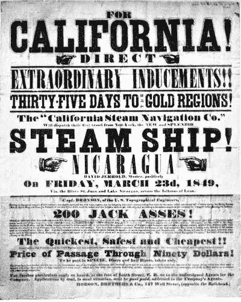
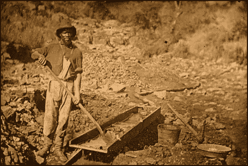
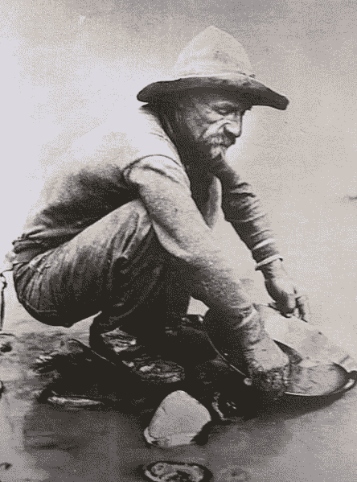

# 停止购买蘸酱，开始出售铲子

> 原文：<https://medium.com/coinmonks/stop-buying-the-dip-start-selling-the-shovel-be94ce11f7a5?source=collection_archive---------16----------------------->

# 如果加密正在杀死你，这里有一个低竞争的成功商业策略，你可以执行，它已经有近两个世纪的历史了。这种商业模式是自淘金热以来发展起来的，并被亚马逊、优步和其他财富 500 强企业所采用。看看他们是怎么做到的。

An ad for shipping to California during the Gold Rush

1848 年，詹姆斯·马歇尔在河边的萨特磨坊发现了黄金。他和萨特正在建造一座水力锯木厂。在他的搭档萨特证实他发现的矿物确实是黄金后，他们决定保守秘密。消息传出后不久，寻求财富的人开始涌向加利福尼亚，想得到一些闲置的黄金。淘金热开始于 1848 年，在 1852 年达到顶峰，并在那十年中结束。这股热潮将导致约 30 万人大规模迁移到加州。这被认为是那个世纪最重大的事件。

## 长达十年的淘金热

约翰·萨特和詹姆斯·马歇尔试图将黄金的发现保密的努力失败了。有许多报道解释了这一发现是如何公之于众的。有人说[的真相是由建造萨特锯木厂](https://spartacus-educational.com/USAgoldrushC.htm)的一名工人泄露的。萨姆·布兰南靠卖铲子发了财，他在报纸上报道了这条新闻。

其他报道称，军事长官理查德·b·梅森上校在视察金矿后报告了这一发现。结果，关于这一发现的消息被[传开了。詹姆斯·K·伯克尔总统在 1848 年 12 月 5 日的国情咨文中宣布了梅森上校的报告。](https://www.pbs.org/wgbh/americanexperience/features/goldrush-california/)

A '49er digging for gold

布兰南在他的报纸上报道了黄金*发现的几周内，三藩市四分之三的人口迁移到了加州。尽管旧金山人最初对加州有黄金的传言表示怀疑，但布兰南用一小瓶黄金的展示说服了他们。不久，人们借了钱，在去加利福尼亚的旅途中花了很多钱。这些移民大多是男性，他们离开妻子去照顾家庭，承担新的责任，比如管理企业等等。到 1849 年，超过 100，000 人到达加利福尼亚寻找黄金，与 1848 年底的 20，000 人形成对比。*

随着 49 年代的人来到这里追逐财富，加州人口迅速膨胀。1853 年，在淘金热的高峰期，人口增长到大约 30 万。49 人，主要是乘船，将长途跋涉，受到沉船，蛇咬和死亡的威胁，以达到加州。但是，旅程并不是最艰难的部分。这个州的生活条件很差，没有为人口爆炸做好准备。这项工作并不容易，许多人因职业危害而遭受更糟糕的命运。

Gold panning in 1852

早在 1848 年，大部分黄金都是从地表开采出来的。到了接下来的十年，1850 年，地表黄金已经基本耗尽。寻找黄金变得越来越难，复杂的方法被开发出来从地表深处开采黄金。个体采矿不屈不挠，工业化招募独立矿工加入他们的劳动大军。因此，尽管开采了大约 20 亿美元的黄金，只有少数 49 人中了头彩。毕竟，采矿与运气有关，因为不是每个人都那么幸运，第一个到达的人通常会因为早到而得到奖励。[这股热潮在 1852 年达到顶峰，并逐渐下降，直到 1857 年，每年的票房收入稳定地达到 4500 万美元。](https://www.history.com/topics/westward-expansion/gold-rush-of-1849)

## 当今的淘金热

将近两个世纪过去了，很多东西还是老样子。人们可能不会从地下捡金子，但他们仍然准备好为一些大的快速赚钱计划放弃他们的一切。当他们第一次听到这个消息时，他们仍然持怀疑态度，但很容易被结果所说服，无论是假的还是真的，他们相信在地面上找到黄金的可能性。他们追逐每一个关于金钱的谣言，就像跳蚤追逐狗一样追逐金钱的气味。

这就是为什么人们如此容易陷入庞氏骗局和赚钱计划，这些计划承诺通过很少的工作就能获得财富。在没有掌握任何技能的情况下，从一种技能跳到另一种技能，会使一种技能看起来比另一种更耀眼。他们很容易被外表所欺骗，并且不明白黄金通常不是任何人都能轻易得到的——你必须为之努力，你不会在去超市的路上错误地踩到它。所以，你看，几乎没有什么变化。

同样，新市场几乎每天都在涌现。就像马歇尔发现了金子一样，许多创业公司都是在冒险中被金子绊倒的。他们可能会发明一种新产品，新市场很快就会繁荣起来。很快，关于他们成功的谣言传遍了全球，人们被吸引去建立类似的商业模式，而无需努力创新。不久之后，就像 1852 年加州淘金热的高峰期一样，只有一个玩家的市场被模仿者饱和了。对客户的争夺变得激烈，只有最原创的品牌才经得起时间的考验。

## 意外的赢家

如果没有山姆·布兰南的商店，淘金热的故事将是不完整的。在告诉全世界加利福尼亚的黄金发现后，他得到了加利福尼亚所有可用的铲子、镐和锅。在 70 天内，他卖出了价值 3.6 万美元的采矿设备(约合今天的 100 万美元)。尽管他的设备很贵，因为他对耶稣基督后期圣徒教会征收了特别税，但需求的增加自然会导致设备价格的飙升。

布伦南不是唯一一个不开采黄金而发财的人。其他人靠出售高价食品和供应品致富。49 年的涌入创造了对基本生活设施的新需求，许多人通过开办满足伴随需求的企业获利。矿工终究要吃饭睡觉，所以食品店、妓院和其他提供基本服务的商店间接地从抢购中受益。

在某种程度上，另一个金子并不像真的那样闪闪发光，但仍然让布兰南有足够的财富，他不必再工作。他靠卖铲子赚钱！多疯狂啊。与此同时，发现这一现象的詹姆斯·马歇尔因为匆忙而痛苦不堪。他的工人放弃了建造锯木厂去挖金子。甚至店员和厨师也离开了他的工作岗位，去寻找加利福尼亚土地上的黄金。弄清楚他为什么没有在发现后跳槽会很有趣。他已经有了大量的劳动力，他可以用铁锹和镐武装他们去挖金子。

然而，他眼睁睁地看着他的劳工抛弃了他。他是太骄傲了还是只是讨厌金子？我们永远不会知道。我们所知道的是布兰南找到了他的金子，而不是马歇尔在美国河边发现的那块。对布兰南来说，铲子就是他的金子。他眼光很好，预见到了黄金发现后的需求。他很快找到了自己的位置，从不可避免的向加利福尼亚的人口流动中获利。当他买下那些铲子时，人们一定认为他疯了，但很快他们就会意识到他通过合理的举动赚了很多钱。一个疯狂的人在加利福尼亚宣扬黄金的信息，他将通过卖铲子发大财。

## 真金:掘金铲

在我们这个时代，存在着一种冲动。这是一场创业热潮。每个人都想自己创业，因为别人成功的谣言。科技是新的金矿，这一点也很流行。每个人都想拥有一项技术技能，这样他们就可以挖掘这口财富之井。这股热潮不会停止。我们处在一个数字时代，一切都将数字化。机器人正在接管一切，很快你喜爱的那些科幻电影就会变成现实。我们有很多马歇尔宣扬的财富的好消息等着我们去抓住它，我们是信徒。这就是问题所在。每个人都想要闪光的金子，但几乎忽略了马歇尔发现的金子。

二十年后，金子是科技，铲子是科技技能。现在是 21 世纪，新的黄金是每个人都在谈论的生意，铲子是一种成功的商业模式，拥有现成的购买客户。不要错过角度。重要的是要明白铲子是允许人们(矿工)挖掘和开采黄金的工具；没有他们，他们对黄金的寻找，尤其是在地表下，将是徒劳的。铲子正在帮助那些匆忙中的人得到他们的金子。你不必兜售关于黄金的虚假梦想——它确实存在！

作为卖铲子的，你要么提供藏宝图，要么给他们配备必要的工具(最常见的是知识)。你免除了自己寻宝或淘金失败的风险。不管他们是否找到黄金，你都可以卖掉铲子赚钱。自然，你的长期成功将取决于金矿开采的成功；但是总会有抢购的时候，所以你卖铲子的成功几率比找金子的几率高。你甚至不必从事采矿和淘金的累死累活的工作；你只需要为财富寻求者的需求提供解决方案。如果他们发现了金子，他们会需要更多的铲子，所以这对你来说也是一个胜利。

## 卖铲子的

在每个行业，我们都有卖铲子的和矿工。比如零售业，我们有超市，有亚马逊。你觉得卖铲子的是谁？如果你猜是亚马逊，那你相当聪明。亚马逊已经成长为全球最大的在线市场。全球有 1.97 亿人访问 Amazon.com 并在网站上购物，2021 年移动应用用户将超过 9800 万，仅次于沃尔玛。它在 2022 年 1 月拥有[28 亿网站访问者](https://capitalcounselor.com/amazon-statistics/)，控制着大约 50%的市场份额。有了这样的统计数据，每个零售商都会想在亚马逊上为他们的产品做广告。所以，亚马逊卖的铲子是全球曝光。通过在亚马逊上为你的产品做广告，你可以利用它庞大的顾客群。

同样，随着加密和区块链行业的繁荣，每个人都想交易加密，不管他们是否了解这项技术。市场的波动性和它让百万富翁如此迅速的成长，会吸引任何想赚快钱的人。是的，别人也在亏损；但是大多数人从来没有想到他们会是输家。密码交易量的上升导致了几个密码交易和交换平台的出现。

它们允许人们交易他们的加密货币，无论市场是下跌还是上涨，都可以赚钱。当人们恐慌并出售加密资产以挽回损失时，[币安和其他加密交易平台从交易费用中获利](https://productmint.com/binance-business-model-how-does-binance-make-money/)。当市场繁荣时，币安从因购买加密资产激增而增加的交易费用中赚钱。市场的走向并不重要，他们无论如何都能赚钱。

## 卖掉铲子

如果你想卖掉铲子，你必须找出可能的突破点。一旦你知道什么样的风险投资会吸引那些有希望赚钱的人，你就可以想办法帮助他们赚钱。最常见的形式是出售课程，教授人们技术技能以及如何将这些技能货币化。如此多的人声称自己掌握了一项有望赚钱的技能，他们通过兜售谎言发了大财。这并不诚实，但确实有效。

无论你想在哪个行业定位自己的品牌，都要想办法帮助那些被这个行业的热潮所吸引的财富寻求者。作为一个卖铲子的人，你的竞争会更少，因为大多数人都想挖金子。这就是你如何发财的方法，不是靠挖金子，而是靠卖铲子。

> 加入 Coinmonks [电报频道](https://t.me/coincodecap)和 [Youtube 频道](https://www.youtube.com/c/coinmonks/videos)了解加密交易和投资

# 另外，阅读

*   [本地比特币审核](/coinmonks/localbitcoins-review-6cc001c6ed56) | [加密货币储蓄账户](https://coincodecap.com/cryptocurrency-savings-accounts)
*   [什么是融资融券交易](https://coincodecap.com/margin-trading) | [成本平均法](https://coincodecap.com/dca)
*   [支持卡审核](https://coincodecap.com/uphold-card-review) | [信任钱包 vs 元掩码](https://coincodecap.com/trust-wallet-vs-metamask)
*   [Exness 回顾](https://coincodecap.com/exness-review)|[moon xbt Vs bit get Vs Bingbon](https://coincodecap.com/bingbon-vs-bitget-vs-moonxbt)
*   [如何开始用加密贷款赚取被动收入](https://coincodecap.com/passive-income-crypto-lending)