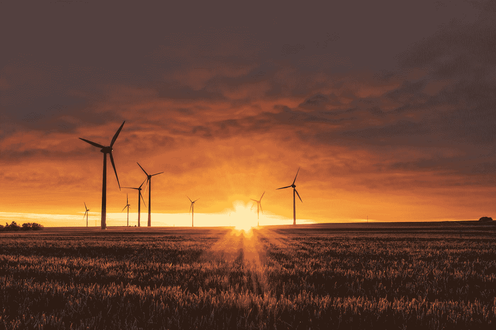

# 别再自欺欺人了:比特币不是“绿色”的

> 原文：<https://medium.com/coinmonks/stop-fooling-yourself-bitcoin-is-not-green-6ad4b8fa8881?source=collection_archive---------5----------------------->

Photo by [Karsten Würth](https://unsplash.com/@karsten_wuerth?utm_source=medium&utm_medium=referral) on [Unsplash](https://unsplash.com?utm_source=medium&utm_medium=referral)

所以我最近写了一篇关于比特币将在 2022 年消亡的文章:

 [## 2022 年是比特币消亡的一年

### 去年我写过以太坊的日子是如何屈指可数的。

andrewzuo.com](https://andrewzuo.com/2022-is-the-year-bitcoin-dies-b93ea5ac45f4)