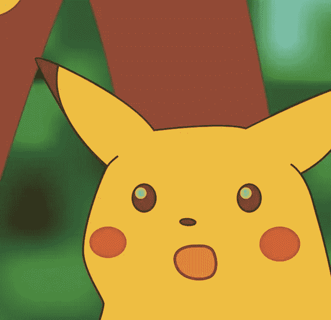
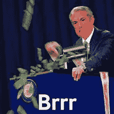

# 停止把你的比特币放在交易所——你在做空 BTC…

> 原文：<https://medium.com/coinmonks/stop-keeping-your-bitcoin-in-exchanges-youre-shorting-btc-c9d435a64111?source=collection_archive---------25----------------------->

当你购买比特币并将其存放在交易所时，你就是净空头，因此，即使你看好 BTC，你也在推动比特币价格下跌。

原因如下:

当你从一个集中的交易所购买比特币时，你永远不知道你的账户是实际的比特币还是纸质的比特币。这是因为你正在购买纸质比特币，这是一种来自交易所的借据，在你决定将比特币转移到交易所外的那一刻就已结算。纸质比特币是一种“我欠你”的比特币，暗示交易所欠你一定数量的比特币。确保你购买的比特币是真币的唯一方法是将其提取到一个自储钱包中，或者将其出售给另一种资产或产品。

为了节省交易费用，大多数交易所不会为你的账户创建一个单独的钱包，并将你的比特币转移到你假设的那个地址，而是在你的集中交易所账户上显示的比特币余额是一个数字，就像电子表格(确切地说是一个仪表板)上你名字旁边的数字。这解释了为什么尽管比特币有 10 分钟的封锁时间，但交易所可以立即将比特币转移到你的账户上。简而言之，将比特币从一个地址转移到另一个地址的时间大约为 10 分钟，但交易所似乎可以立即转移比特币，因此提现和交易费用较高😉。

为了阻止你提取比特币，交易所根据你的交易余额给你交易成本折扣，你在交易所保留的越多，馅饼就越大

交易所将比特币保存在一个或一组钱包中，拥有私钥并安全存放。如果每次你在生态系统内进行买卖时，他们都会向你的交易所钱包转移少量资金，他们会从交易费中损失很多钱。

绝大多数主要交易所不提供客户存款证明。因此，对于交易所持有的所有“我欠你的”比特币，没有关于储备中持有多少真实比特币以支持客户余额的透明度。

那么，为什么交易所需要你随身携带你的 BTC 呢？

答:部分准备金银行系统。交易所是一个 DeFi 银行。它出售并借出你的比特币来获利。

比方说，你在交易所押 1 个比特币，为期 1 年，但不碰它。

交易所出售/借给 X 先生你的 0.9 个比特币，但在你的仪表盘上，你仍然有你的 BTC 欠条(1 个比特币)，你很满意，因为一年后你会得到一个小 APY。

X 先生还钱，他们冲洗，一遍又一遍地重复这个过程。简单来说，他们印刷 BTC

那么，这是如何让 u net 变短的呢？嗯，比特币的价格是通过需求和供给决定的。稀缺时，价格上涨。当充足时，价格下降。当交易所印刷时，他们增加了供给，也就是说，使供给充足。

因此，当一个新人购买一定数量的比特币时，人们通常会认为他们会减少供应量。但这只有在他们从交易所购买借据，然后立即将资金取出进行自我保管的情况下才会发生。

如果他们将新获得的比特币留在交易所，他们并没有减少供应，事实上，他们给了交易所更多的流动性，以创造更多的分数。

这推动比特币价格下跌。

然而，如果你决定将你的比特币从一个集中的交易所取出，用于自我存储到一个非托管钱包或硬件钱包中，交易所将被迫将比特币交付到你的钱包中。这保证了你的钱包里收到的是真的比特币，排除了你购买的比特币是纸质比特币的可能性。这一行动减少了流通中的比特币数量，前提是你不会很快购买并转售。

当谈到为购买、出售和押注比特币提供市场的交易所时，他们(交易所)出售的比特币可能多于他们持有的比特币。这意味着，如果所有在交易所持有比特币的比特币所有者决定同时提取他们所有的比特币，那么他们集体发行的纸质比特币很有可能大于他们持有的比特币。这导致人们认为他们正在印刷纸质比特币，并将其出售给不知情的客户。

如果交易所出售的比特币(真实的和纸质的)多于它们拥有的，它们将成为净空头。也就是说，如果比特币的价格大幅上涨，他们将对客户的账户拥有更大的索赔权。这鼓励交易所倡导更低的比特币价格。

我们所知的比特币是一种托管资产。真正拥有它的唯一方法是拥有你的私钥。如果你想利用比特币的所有功能，比如无许可交易、伪匿名和防审查货币等，你必须拥有自己的私钥。正如在最近的 Luna events 和 Gamestop 中看到的那样，交易所可以限制你的比特币提款，交易你的比特币，并在破产的情况下接管你的比特币的所有权。

> *加入 Coinmonks* [*电报频道*](https://t.me/coincodecap) *和* [*Youtube 频道*](https://www.youtube.com/c/coinmonks/videos) *了解加密交易和投资*

# 另外，阅读

*   [Bookmap 评论](https://coincodecap.com/bookmap-review-2021-best-trading-software) | [美国 5 大最佳加密交易所](https://coincodecap.com/crypto-exchange-usa)
*   最佳加密[硬件钱包](/coinmonks/hardware-wallets-dfa1211730c6) | [Bitbns 评论](/coinmonks/bitbns-review-38256a07e161)
*   [新加坡十大最佳密码交易所](https://coincodecap.com/crypto-exchange-in-singapore) | [收购 AXS](https://coincodecap.com/buy-axs-token)
*   [红狗赌场评论](https://coincodecap.com/red-dog-casino-review) | [Swyftx 评论](https://coincodecap.com/swyftx-review) | [CoinGate 评论](https://coincodecap.com/coingate-review)
*   [投资印度的最佳加密软件](https://coincodecap.com/best-crypto-to-invest-in-india-in-2021)|[WazirX P2P](https://coincodecap.com/wazirx-p2p)|[Hi Dollar Review](https://coincodecap.com/hi-dollar-review)
*   [加拿大最好的加密交易机器人](https://coincodecap.com/5-best-crypto-trading-bots-in-canada) | [库币评论](https://coincodecap.com/kucoin-review)