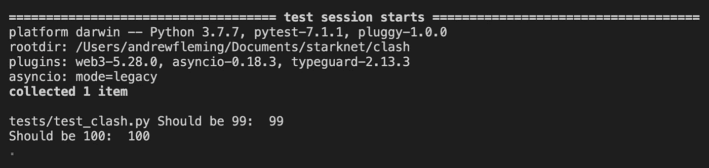

# StarkNet 中的存储变量冲突

> 原文：<https://medium.com/coinmonks/storage-variable-clashing-in-starknet-ce5f28e60886?source=collection_archive---------4----------------------->

## StarkNet 智能合同和最佳预防实践如何导致存储冲突


## 🗄️:仓库是如何处理的？

StarkNet 上的合同存储通过简单的键/值对来处理。根据 [StarkNet 文档:](https://starknet.io/documentation/contracts/#contracts_storage)

> **存储布局**
> 
> 协定存储是一个持久性存储空间，您可以在其中读取、写入、修改和保存数据。存储是一个具有 2 个⁵槽的映射，其中每个槽是一个毛毡，并被初始化为 0。
> 
> **存储基本功能**
> 
> 读取存储的基本函数返回存储在`key`中的`value`
> 
> `let (value) = storage_read(key)`
> 
> 写入存储器的基本功能是将`value`写入`key`
> 
> `storage_write(key, value)`

用`@storage_var`修饰的存储变量有一点复杂。StarkNet 编译器将它们的名称和值(用 Cairo 代码)映射到 StarkNet 自己的`sn_keccak`方法生成的地址(按原样或通过散列链进行嵌套映射)。然而，这里重要的一点是，存储变量被简单地视为散列的键/值对。

## StarkNet 中的合同可扩展性

OpenZeppelin 开创了[可扩展性模式](https://github.com/OpenZeppelin/cairo-contracts/blob/main/docs/Extensibility.md)，它包含了从久经考验的库中安全导入功能和状态的契约指南。基本思想是契约从库中导入和公开(用`@external`和`@view`decorator)它们想要使用的方法。例如，考虑流行的 ERC20 库。部署 ERC20 令牌的所有方法和状态管理都已经存在于库中。用户只需要在合同中公开必要的方法，瞧！您的合同已准备好部署。

> 库不公开它们的方法的原因是 Cairo 会自动导出它们，不管它们是否被导入。这可能很危险。

这种模式的有趣问题是:如果库用存储变量设置自己的状态，那么当一个契约从多个共享相同存储变量名称的库导入时会发生什么？

## 💥来自不同库的存储冲突

让我们来看看这两个库:

虽然示例方法共享相同的名称，但是它们属于它们各自的名称空间，即`LIBRARY_A.increase_balance`和`LIBRARY_B_increase_balance`。然而，存储变量`balance`不包含在任何一个名称空间中。记住这一点很重要。

现在，让我们看一个将从这些库导入并公开它们的方法的契约。

注意，两个库的存储都没有显式地导入到契约中——只有名称空间。现在，让我们测试一下 *contract_c* 的公开方法，看看库各自的存储发生了什么。

结果是:


等等，发生什么事了？StarkNet 编译器没有*而不是*区分这两个`balance`存储变量，尽管它们似乎“私下”属于各自的库。换句话说，编译器将两个`balance`存储变量视为对同一个变量的引用。

然而，如果同名存储变量有任何不同，StarkNet 编译器*将*失败。这些差异包括变量名、返回值名和键的数量。这里有一个简单的例子来说明:

```
# library_a
...@storage_var
func balance() -> (**res**: felt):
end
...
-----------------------------------------# library_b
...@storage_var
func balance() -> (**var**: felt):
end
...
```

如果我们如上修改 *library_b* 中的返回变量名，并尝试编译 *contract_c* ，编译将会失败。任何此类差异都将返回此 AssertionError:

```
f'Found two versions of auto-generated file "{input_file.filename}":\n'
AssertionError: Found two versions of auto-generated file "autogen/starknet/storage_var/balance/impl.cairo":
...
```

要点:如果一个契约从多个库导入，而这些库恰好共享一个存储变量名(即`balance`)，那么如果编译器没有捕捉到这些变量，它们很可能会发生冲突。

## 🛡 ️Prevent 存储变量冲突

在撰写本文时，最好的解决方案是在存储变量名前加上库的名称或命名空间。比如:`ERC20_balances`、`ReentrancyGuard_start`、`Ownable_owner`。

为了验证概念，让我们将示例库的存储变量改为`LIBRARY_A_balance`和`LIBRARY_B_balance`。

运行完全相同的测试后，结果如下:



## 结论

鉴于 StarkNet 网络和 Cairo 编程语言是如此新颖和先进，最佳实践将不可避免地随着现有模式和惯例的发展和新的模式和惯例的出现而改变。同时，给你的存储变量加上前缀！

特别感谢马丁·特里、朱丽莎·邓蒂斯和 [OpenZeppelin](https://openzeppelin.com/) 激发了这项研究。点击查看原讨论[。](https://github.com/OpenZeppelin/cairo-contracts/pull/236#discussion_r838265315)

有兴趣了解更多关于 StarkNet 和 Cairo 的信息吗？查看这些优秀的资源:

*   [StarkNet 和 Cairo 官方文档](https://www.cairo-lang.org/docs/)
*   [斯塔克尼萨满](https://community.starknet.io/)
*   [Cairo open zeppelin 合同入门](https://blog.openzeppelin.com/getting-started-with-openzeppelin-contracts-for-cairo/)
*   为了更全面的名单:[真棒 StarkNet](https://github.com/gakonst/awesome-starknet)

> 加入 Coinmonks [电报频道](https://t.me/coincodecap)和 [Youtube 频道](https://www.youtube.com/c/coinmonks/videos)了解加密交易和投资

# 另外，阅读

*   [最佳以太坊钱包](https://coincodecap.com/best-ethereum-wallets) | [电报上的加密货币机器人](https://coincodecap.com/telegram-crypto-bots)
*   交易杠杆代币的最佳交易所 | [购买弗洛基](https://coincodecap.com/buy-floki-inu-token)
*   [3Commas 对 Pionex 对 Cryptohopper](https://coincodecap.com/3commas-vs-pionex-vs-cryptohopper) | [Bingbon 评论](https://coincodecap.com/bingbon-review)
*   [加密复制交易平台](/coinmonks/top-10-crypto-copy-trading-platforms-for-beginners-d0c37c7d698c) | [如何在 WazirX 上购买比特币](/coinmonks/buy-bitcoin-on-wazirx-2d12b7989af1)
*   [CoinLoan 评论](https://coincodecap.com/coinloan-review)|[Crypto.com 评论](/coinmonks/crypto-com-review-f143dca1f74c)