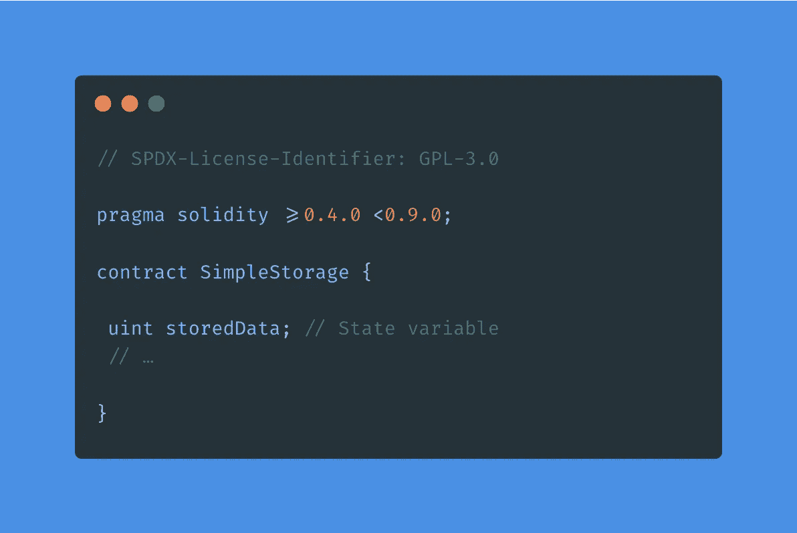
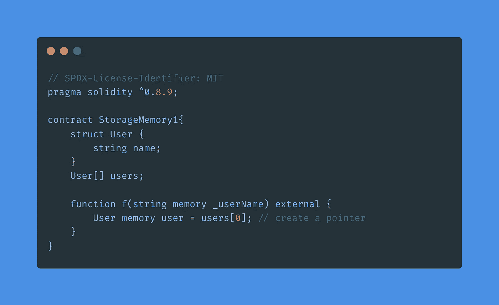

# 存储与存储的稳固性

> 原文：<https://medium.com/coinmonks/storage-vs-memory-in-solidity-ac95ff6c628?source=collection_archive---------15----------------------->

大家好，我非常兴奋地分享我的第一篇关于媒体的文章。这是我的一些情况。我是 Shahir Zain，我毕业于计算机科学领域，我自称是一名技术爱好者，从第一天起，我就一直参与尖端技术。我攻读了计算机视觉的纳米学位，我喜欢编写与网络应用或人工智能相关的代码。我刚刚开始探索区块链技术，所以我在这里写了一篇全新的文章。

在固体中，有两种类型的变量。

*   态变数
*   记忆变量

> 态变数

合同的状态变量存储在存储器中(区块链)。你可以把它比作数据库，它将永远保存在区块链中。状态变量的值总是存储在协定存储中。存储变量不能在创建合同时实际创建的函数执行期间创建。状态变量在合同级别定义，例如，如下所示:

# 状态变量如何存储在区块链中

状态变量总是以紧凑的方式存储，使得多个值有时使用同一个存储槽。除了**动态调整大小的数组和映射**。数据是按顺序存储的。对于每个变量，以字节为单位的大小由其类型决定。如果可能的话，需要少于 32 字节的多个连续项目被打包到单个存储槽中。

> 如何将槽分配给变量？

*   存储槽中的第一项按低位对齐存储。
*   值类型使用必要的字节来存储值。
*   如果值类型不适合存储槽的剩余部分，则将使用下一个存储槽。
*   结构和数组数据总是开始一个新的槽，并且它们的项根据这些规则紧密打包。
*   结构或数组数据后面的项总是开始一个新的存储槽。

# 固体中的记忆变量

内存变量是在协定初始化时创建的运行时变量，它保存运行时的函数参数和数据，并在执行后被清除。它不像状态变量那样消耗任何气费。内存变量最适合中间计算。下面给出了一个内存变量的例子:

一些要点:

*   每当我们将一个存储变量分配给内存变量**时，新的内存将被分配**，数据将从存储器复制到内存。
*   当我们将内存变量复制到存储变量**时，将不会分配新的存储空间。**因为存储是在创建合同时分配的。
*   我们可以改变存储变量，但不能分配新的存储，因为所有存储变量都是预先分配的，不能更改。

我没有涵盖所有的概念，但对于刚开始学习可靠性的人来说，这可能是一个好的开始。

就这样，伙计们！希望对你来说是本好书。谢谢大家！✨

👉联系我:shahirzain100@gmail.com

👉关注我:[GitHub](https://github.com/ShahirZain)LinkedIn

> 加入 Coinmonks [电报频道](https://t.me/coincodecap)和 [Youtube 频道](https://www.youtube.com/c/coinmonks/videos)了解加密交易和投资

# 另外，阅读

*   [如何开始通过加密贷款赚取被动收入](https://coincodecap.com/passive-income-crypto-lending)
*   [加密货币储蓄账户](/coinmonks/cryptocurrency-savings-accounts-be3bc0feffbf) | [加密交易机器人](https://coincodecap.com/best-crypto-trading-bots)
*   [BigONE 交易所评论](/coinmonks/bigone-exchange-review-64705d85a1d4) | [CEX。IO 审查](https://coincodecap.com/cex-io-review) | [交换区审查](/coinmonks/swapzone-review-crypto-exchange-data-aggregator-e0ad78e55ed7)
*   [最佳比特币保证金交易](/coinmonks/bitcoin-margin-trading-exchange-bcbfcbf7b8e3) | [比特币保证金交易](https://coincodecap.com/bityard-margin-trading)
*   [加密保证金交易交易所](/coinmonks/crypto-margin-trading-exchanges-428b1f7ad108) | [赚取比特币](/coinmonks/earn-bitcoin-6e8bd3c592d9)
*   [WazirX vs CoinDCX vs bit bns](/coinmonks/wazirx-vs-coindcx-vs-bitbns-149f4f19a2f1)|[block fi vs coin loan vs Nexo](/coinmonks/blockfi-vs-coinloan-vs-nexo-cb624635230d)