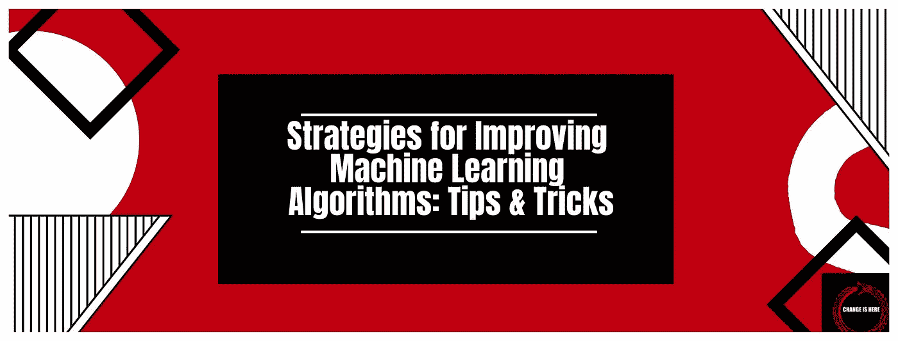

# 改进机器学习算法的策略:技巧和窍门

> 原文：<https://medium.com/coinmonks/strategies-for-improving-machine-learning-algorithms-tips-tricks-cf2f1143d0e1?source=collection_archive---------22----------------------->

机器学习和深度学习算法在现代商业中无处不在。随着新算法、更便宜的计算和更大的数据可用性的快速发展，可以使用的人工智能应用的数量一直在快速增加。每个领域，从银行业到医疗保健到教育到制造业、建筑业等等，都有自己的一套…