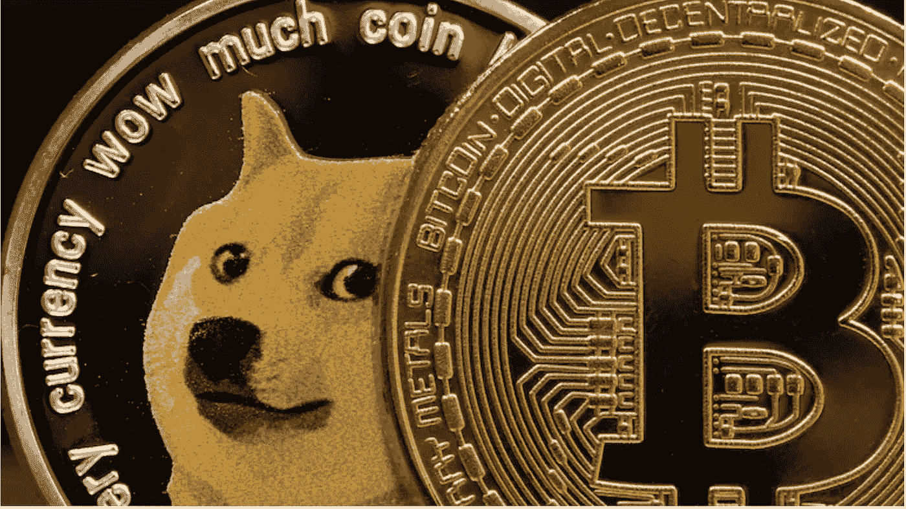
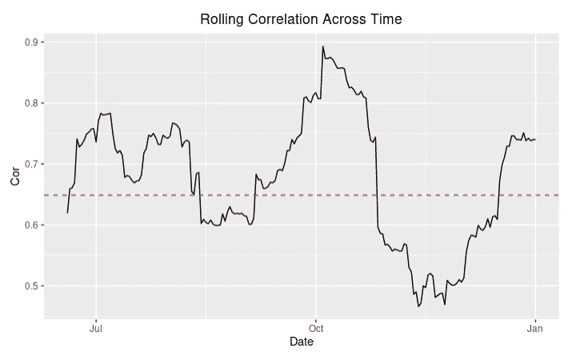
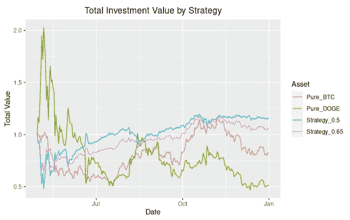
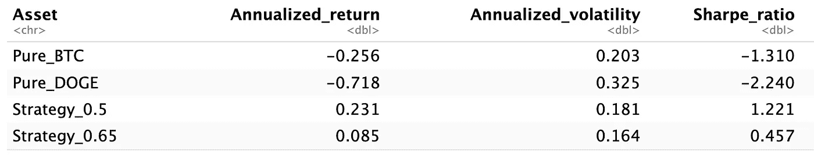
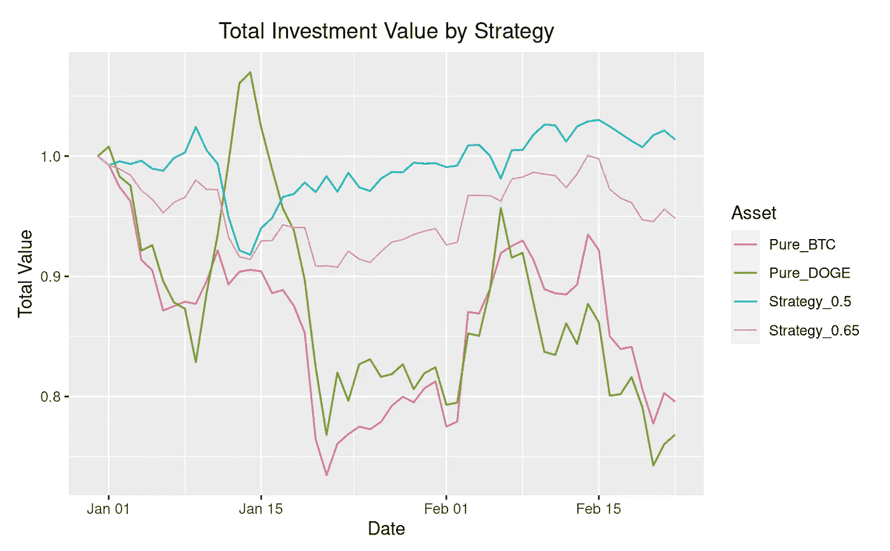
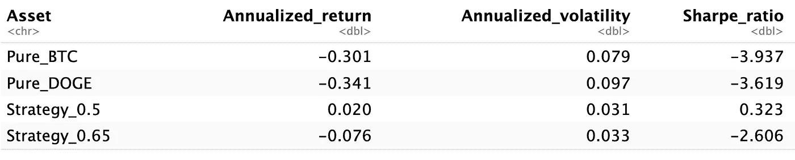

# 策略分析:50/50 长比特币，短多格

> 原文：<https://medium.com/coinmonks/strategy-analysis-50-50-long-bitcoin-short-doge-617626cd7268?source=collection_archive---------25----------------------->

# 简介:

在过去的几个月里，密码市场经历了一场混乱。旗舰加密货币比特币已经从最近的历史高点 67k 美元暴跌 40%以上。与此同时，许多替代硬币，从以太坊、卡尔达诺、索拉纳等突出的 1 层到这些层上的衍生硬币，也表现不佳。

比回报更让人心灰意冷的是高波动性。由于每日波动持续超过 3%，比特币的年化波动率持续保持在 80%左右。

制定一项投资策略，让投资者接触比特币/密码，同时将波动性降至最低，变得至关重要。传统的多头/空头策略可能有效，因为许多密码彼此高度相关。

DogeCoin 使用了“模因证明”,是由两名软件工程师开发的，他们使用了当时流行的模因——柴犬来标记加密货币的标志。它原本是一个嘲笑比特币创造的模因。然而，在 2021 年，DogeCoin 的价值已经爆炸式增长，涨幅超过 5000%。埃隆·马斯克还将 Dogecoin 命名为“人民的密码”，进一步推动了 DogeCoin 的发展。

与比特币不同，DogeCoin 不具备与比特币相同的安全级别和令牌组学。由于没有硬性规定，DogeCoin 的供应是无限的，因为每天有数百万只 Doge 被提供给它的矿工。另一方面，比特币的固定供应造成了稀缺性，这使它像黄金一样成为一种有吸引力的投资。

# **投资论文**

> 多头比特币和空头多格。

模因注定是短命的。随着密码市场的成熟，迷因币将被具有实际效用的币所取代。因此，押注领先的比特币胜过 Doge 等迷因币就变得相当明显了。

# 回溯测试:

获取比特币和 DogeCoin 的每日价格进行分析。

为了检查这两种资产的相关性，比特币和 Doge 之间的滚动相关性是在 2021 年 5 月 1 日至 2022 年 1 月 1 日的 50 天基础上计算的。

相关性在 0.5 到 0.9 之间波动，样本期内的平均值为 0.65。结果证明了这两种资产高度相关的经验假设。

随后构建了四个投资组合:Pure_BTC、Pure_Doge、Strategy_0.5 和 Strategy_0.65。例如，Strategy_0.5 将一半的投资放在渴望比特币上，而另一半则做空 Doge。出于简单的原因，没有考虑交易费用/再平衡。

在 crypto 2021 年末的牛市中，混合策略的表现明显优于纯 BTC，波动性更低，回报率更高。

从 2022 年 1 月 1 日到 2022 年 2 月 22 日，收到了类似的结果。

根据研究结果，在 2021 年的牛市和 2022 年初的熊市中，50/50 的比特币多头空头策略似乎都非常有效。

# **结论:**

历史回溯测试支持投资论点。该策略允许投资者接触比特币的优势，同时提供低波动性。只要投资者认为比特币的表现将优于其模因对应物 Doge，我认为 50/50 的 BTC 多头 Doge 将是一个不错的选择。

> *加入 Coinmonks* [*电报频道*](https://t.me/coincodecap) *和* [*Youtube 频道*](https://www.youtube.com/c/coinmonks/videos) *了解加密交易和投资*

# 另外，阅读

*   [有哪些交易信号？](https://coincodecap.com/trading-signal) | [Bitstamp vs 比特币基地](https://coincodecap.com/bitstamp-coinbase) | [买索拉纳](https://coincodecap.com/buy-solana)
*   [ProfitFarmers 点评](https://coincodecap.com/profitfarmers-review) | [如何使用 Cornix 交易机器人](https://coincodecap.com/cornix-trading-bot)
*   [十大最佳加密货币博客](https://coincodecap.com/best-cryptocurrency-blogs) | [YouHodler 评论](https://coincodecap.com/youhodler-review)
*   [my constant Review](https://coincodecap.com/myconstant-review)|[8 款最佳摇摆交易机器人](https://coincodecap.com/best-swing-trading-bots)
*   [MXC 交易所评论](/coinmonks/mxc-exchange-review-3af0ec1cba8c) | [Pionex vs 币安](https://coincodecap.com/pionex-vs-binance) | [Pionex 套利机器人](https://coincodecap.com/pionex-arbitrage-bot)
*   [我的密码交易经验](/coinmonks/my-experience-with-crypto-copy-trading-d6feb2ce3ac5) | [比特币基地评论](/coinmonks/coinbase-review-6ef4e0f56064)
*   [CoinFLEX 评论](https://coincodecap.com/coinflex-review) | [AEX 交易所评论](https://coincodecap.com/aex-exchange-review) | [UPbit 评论](https://coincodecap.com/upbit-review)
*   [AscendEx 保证金交易](https://coincodecap.com/ascendex-margin-trading) | [Bitfinex 赌注](https://coincodecap.com/bitfinex-staking) | [bitFlyer 点评](https://coincodecap.com/bitflyer-review)