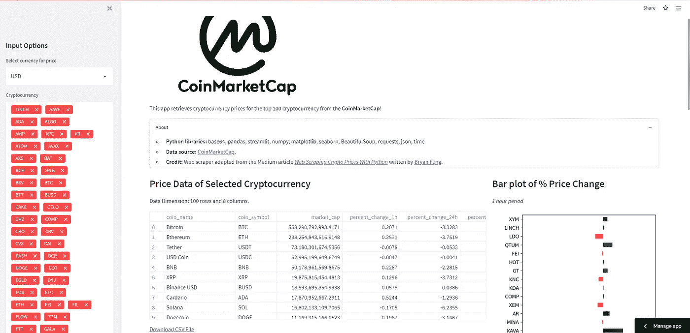
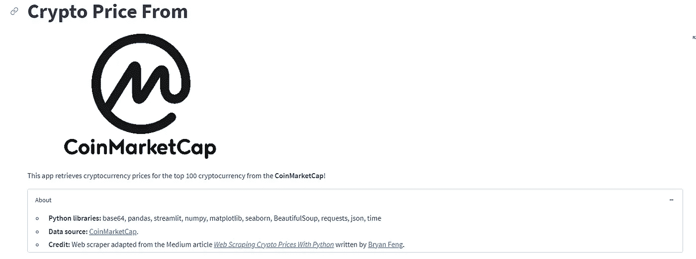
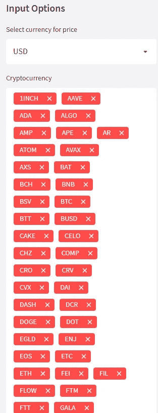
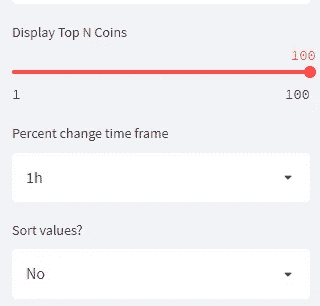
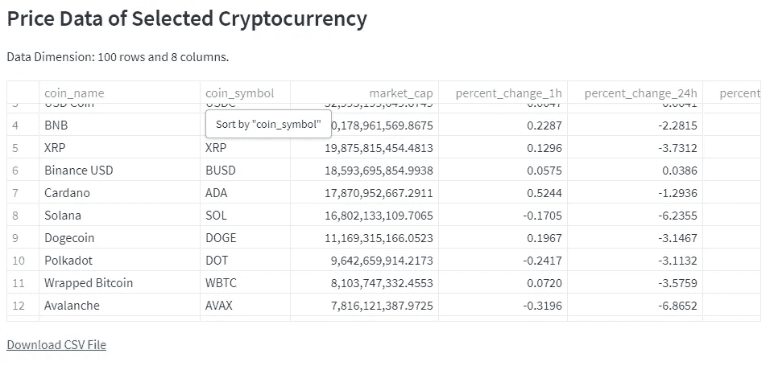
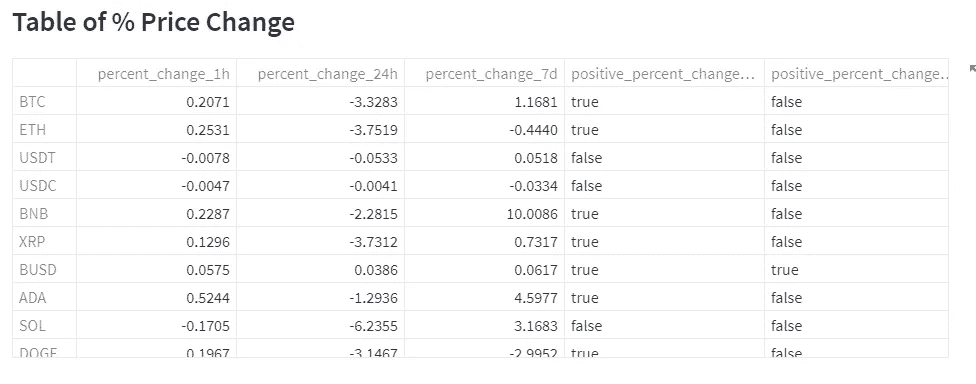
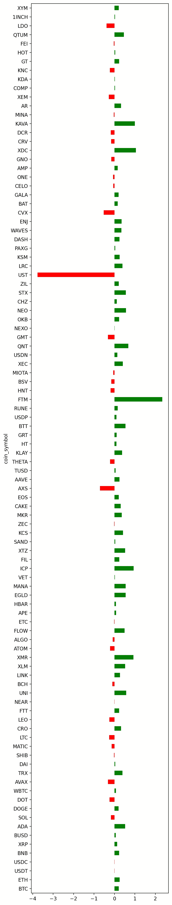

# 利用 Coinmarketcap 数据简化 Web 应用程序

> 原文：<https://medium.com/coinmonks/streamlit-web-app-with-coinmarketcap-data-1e5a2c46650f?source=collection_archive---------13----------------------->

我们将建立一个 web 应用程序，抓取和显示来自 coinmarketcap.com 的数据。



结果:

[https://share . streamlit . io/noedgeatlife/streamlit-data-we B- app/main/CMC/CMC . py](https://share.streamlit.io/noedgeatlife/streamlit-data-web-app/main/cmc/cmc.py)

```
import streamlit as st
from PIL import Image
import pandas as pd
import base64
import matplotlib.pyplot as plt
from bs4 import BeautifulSoup
import requests
import json
import time
```

导入包。

```
#---------------------------------## Titlest.title('Crypto Price From')image = Image.open('cmc/logo.png')st.image(image, width = 500)st.markdown("""This app retrieves cryptocurrency prices for the top 100 cryptocurrency from the **CoinMarketCap**!""")#---------------------------------## Aboutexpander_bar = st.expander("About")expander_bar.markdown("""* **Python libraries:** base64, pandas, streamlit, numpy, matplotlib, seaborn, BeautifulSoup, requests, json, time* **Data source:** [CoinMarketCap](http://coinmarketcap.com).* **Credit:** Web scraper adapted from the Medium article *[Web Scraping Crypto Prices With Python](https://towardsdatascience.com/web-scraping-crypto-prices-with-python-41072ea5b5bf)* written by [Bryan Feng](https://medium.com/@bryanf).""")
```

定义标题和关于扩展器。



```
#---------------------------------## Page layout (continued)## Divide page to 3 columns (col1 = sidebar, col2 and col3 = page contents)col1 = st.sidebarcol2, col3 = st.columns((2,1))#---------------------------------## Sidebar + Main panelcol1.header('Input Options')## Sidebar - base_currencybase_currency = col1.selectbox('Select currency for price', ('USD', 'BTC', 'ETH'))
```

向正文添加 1 个侧栏 col1 和 2 列布局(col2，col3)。



```
# Web scraping of CoinMarketCap data@st.cachedef load_data():cmc = requests.get('https://coinmarketcap.com')soup = BeautifulSoup(cmc.content, 'html.parser')data = soup.find('script', id='__NEXT_DATA__', type='application/json')coin_data = json.loads(data.contents[0])listings = coin_data['props']['initialState']['cryptocurrency']['listingLatest']['data']slugindex = listings[0]['keysArr'].index('name')symbolindex = listings[0]['keysArr'].index('symbol')priceindex= listings[0]['keysArr'].index('quote.'+base_currency+'.price')percent_change1hindex= listings[0]['keysArr'].index('quote.'+base_currency+'.percentChange1h')percent_change24hindex= listings[0]['keysArr'].index('quote.'+base_currency+'.percentChange24h')percent_change7dindex= listings[0]['keysArr'].index('quote.'+base_currency+'.percentChange7d')MarketCapindex= listings[0]['keysArr'].index('quote.'+base_currency+'.marketCap')volume24hindex= listings[0]['keysArr'].index('quote.'+base_currency+'.volume24h')coin_name = []coin_symbol = []market_cap = []percent_change_1h = []percent_change_24h = []percent_change_7d = []price = []volume_24h = []for i in listings[1:]:coin_name.append(i[slugindex])coin_symbol.append(i[symbolindex])price.append(i[priceindex])percent_change_1h.append(i[percent_change1hindex])percent_change_24h.append(i[percent_change24hindex])percent_change_7d.append(i[percent_change7dindex])market_cap.append(i[MarketCapindex])volume_24h.append(i[volume24hindex])df = pd.DataFrame(columns=['coin_name', 'coin_symbol', 'market_cap', 'percent_change_1h', 'percent_change_24h', 'percent_change_7d', 'price', 'volume_24h'])df['coin_name'] = coin_namedf['coin_symbol'] = coin_symboldf['price'] = pricedf['percent_change_1h'] = percent_change_1hdf['percent_change_24h'] = percent_change_24hdf['percent_change_7d'] = percent_change_7ddf['market_cap'] = market_capdf['volume_24h'] = volume_24hreturn dfdf = load_data()
```

从 CMC 中抓取数据。

更多选项进入侧栏:

```
## Sidebar - Cryptocurrency selectionssorted_coin = sorted( df['coin_symbol'] )selected_coin = col1.multiselect('Cryptocurrency', sorted_coin, sorted_coin)df_selected_coin = df[ (df['coin_symbol'].isin(selected_coin)) ] # Filtering data## Sidebar - Number of coins to displaynum_coin = col1.slider('Display Top N Coins', 1, 100, 100)df_coins = df_selected_coin[:num_coin]## Sidebar - Percent change timeframepercent_timeframe = col1.selectbox('Percent change time frame',['7d','24h', '1h'])percent_dict = {"7d":'percent_change_7d',"24h":'percent_change_24h',"1h":'percent_change_1h'}selected_percent_timeframe = percent_dict[percent_timeframe]## Sidebar - Sorting valuessort_values = col1.selectbox('Sort values?', ['Yes', 'No'])
```



我们显示数据并为一个. csv 文件添加一个下载按钮。

```
col2.subheader('Price Data of Selected Cryptocurrency')col2.write('Data Dimension: ' + str(df_selected_coin.shape[0]) + ' rows and ' + str(df_selected_coin.shape[1]) + ' columns.')col2.dataframe(df_coins)# Download CSV data# https://discuss.streamlit.io/t/how-to-download-file-in-streamlit/1806def filedownload(df):csv = df.to_csv(index=False)b64 = base64.b64encode(csv.encode()).decode()  # strings <-> bytes conversionshref = f'<a href="data:file/csv;base64,{b64}" download="crypto.csv">Download CSV File</a>'return hrefcol2.markdown(filedownload(df_selected_coin), unsafe_allow_html=True)
```



```
#---------------------------------## Preparing data for Bar plot of % Price changecol2.subheader('Table of % Price Change')df_change = pd.concat([df_coins.coin_symbol, df_coins.percent_change_1h, df_coins.percent_change_24h, df_coins.percent_change_7d], axis=1)df_change = df_change.set_index('coin_symbol')df_change['positive_percent_change_1h'] = df_change['percent_change_1h'] > 0df_change['positive_percent_change_24h'] = df_change['percent_change_24h'] > 0df_change['positive_percent_change_7d'] = df_change['percent_change_7d'] > 0col2.dataframe(df_change)
```



为了进行数据处理，您可以隐藏这一部分。

最后一列:

```
# Conditional creation of Bar plot (time frame)col3.subheader('Bar plot of % Price Change')if percent_timeframe == '7d':if sort_values == 'Yes':df_change = df_change.sort_values(by=['percent_change_7d'])col3.write('*7 days period*')plt.figure(figsize=(5,25))plt.subplots_adjust(top = 1, bottom = 0)df_change['percent_change_7d'].plot(kind='barh', color=df_change.positive_percent_change_7d.map({True: 'g', False: 'r'}))col3.pyplot(plt)elif percent_timeframe == '24h':if sort_values == 'Yes':df_change = df_change.sort_values(by=['percent_change_24h'])col3.write('*24 hour period*')plt.figure(figsize=(5,25))plt.subplots_adjust(top = 1, bottom = 0)df_change['percent_change_24h'].plot(kind='barh', color=df_change.positive_percent_change_24h.map({True: 'g', False: 'r'}))col3.pyplot(plt)else:if sort_values == 'Yes':df_change = df_change.sort_values(by=['percent_change_1h'])col3.write('*1 hour period*')plt.figure(figsize=(5,25))plt.subplots_adjust(top = 1, bottom = 0)df_change['percent_change_1h'].plot(kind='barh', color=df_change.positive_percent_change_1h.map({True: 'g', False: 'r'}))col3.pyplot(plt)
```



github:[https://github . com/NoEdgeAtLife/Streamlit-data-we B- app/tree/main/CMC](https://github.com/NoEdgeAtLife/Streamlit-data-web-app/tree/main/cmc)

> 加入 Coinmonks [电报频道](https://t.me/coincodecap)和 [Youtube 频道](https://www.youtube.com/c/coinmonks/videos)了解加密交易和投资

# 另外，阅读

*   [德国最佳加密交易所](https://coincodecap.com/crypto-exchanges-in-germany) | [Arbitrum:第二层解决方案](https://coincodecap.com/arbitrum)
*   [币安交易机器人](/coinmonks/binance-trading-bots-d0d57bb62c4c) | [OKEx 评论](/coinmonks/okex-review-6b369304110f) | [Atani 评论](https://coincodecap.com/atani-review)
*   [最佳加密交易信号电报](/coinmonks/best-crypto-signals-telegram-5785cdbc4b2b) | [MoonXBT 评论](/coinmonks/moonxbt-review-6e4ab26d037)
*   [如何在 Bitbns 上购买柴犬(SHIB)币？](https://coincodecap.com/buy-shiba-bitbns) | [买弗洛基](https://coincodecap.com/buy-floki-inu-token)
*   [CoinFLEX 评论](https://coincodecap.com/coinflex-review) | [AEX 交易所评论](https://coincodecap.com/aex-exchange-review) | [UPbit 评论](https://coincodecap.com/upbit-review)
*   [十大最佳加密货币博客](https://coincodecap.com/best-cryptocurrency-blogs) | [YouHodler 评论](https://coincodecap.com/youhodler-review)