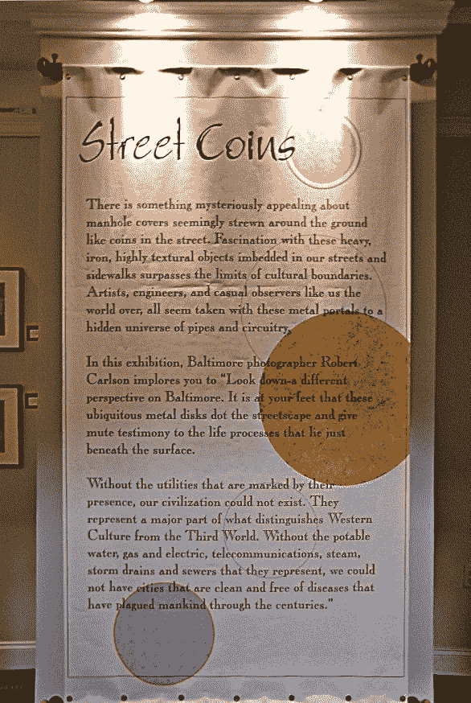

# 街头硬币

> 原文：<https://medium.com/coinmonks/street-coins-457b4f7a4574?source=collection_archive---------61----------------------->

## 照片主题的演变

当我第一次在人行道上发表我的井盖和其他公用事业盘的肖像时，它们的名字被巴尔的摩公共工程博物馆的馆长建议为“街头硬币”。我们正准备展出 21 幅巴尔的摩主题肖像。没有人听说过加密货币或数字硬币是一种交易手段，当然也不是一种投资。

