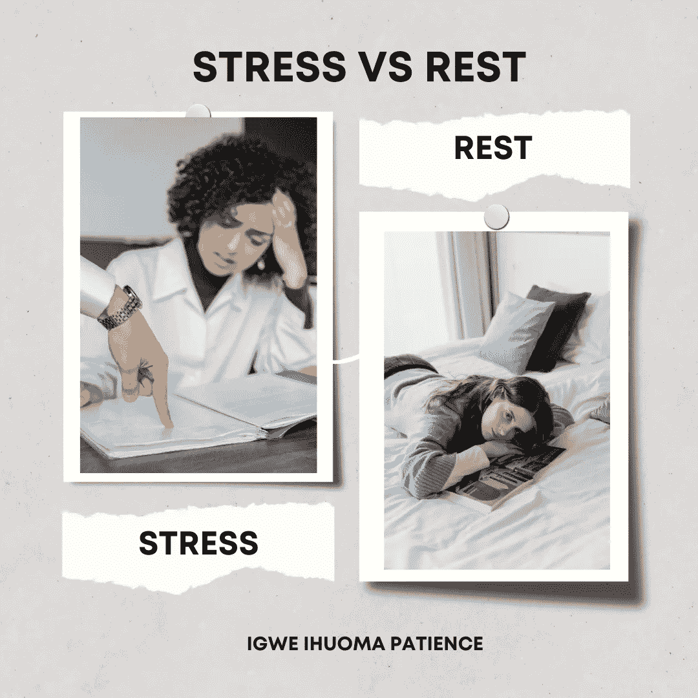
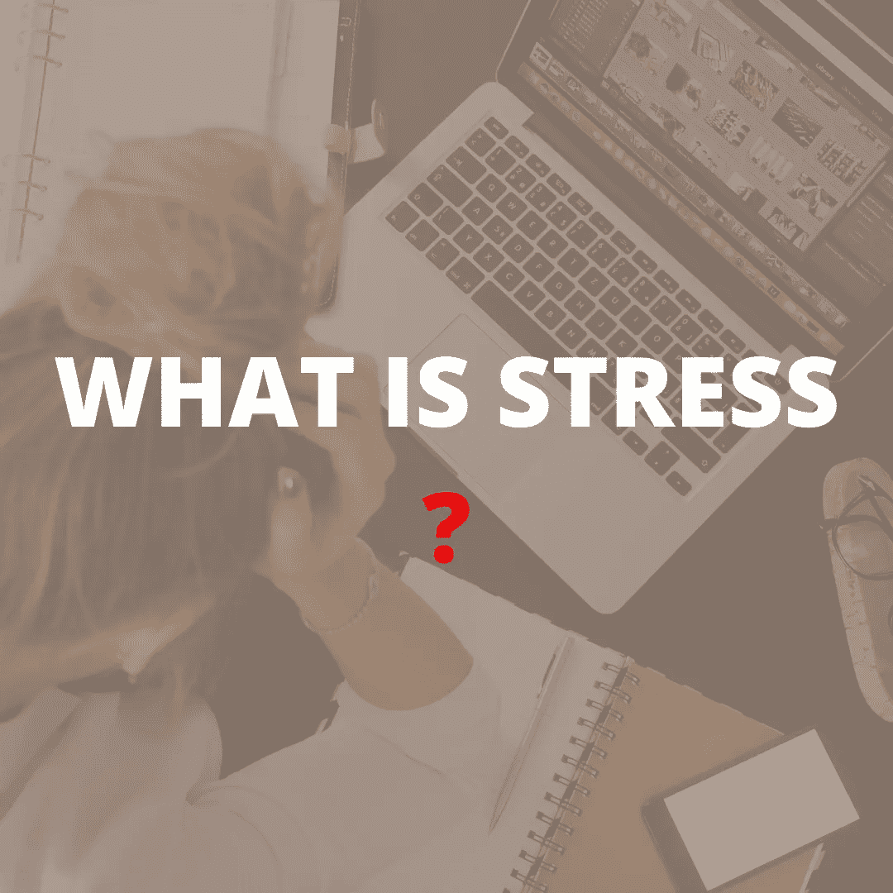
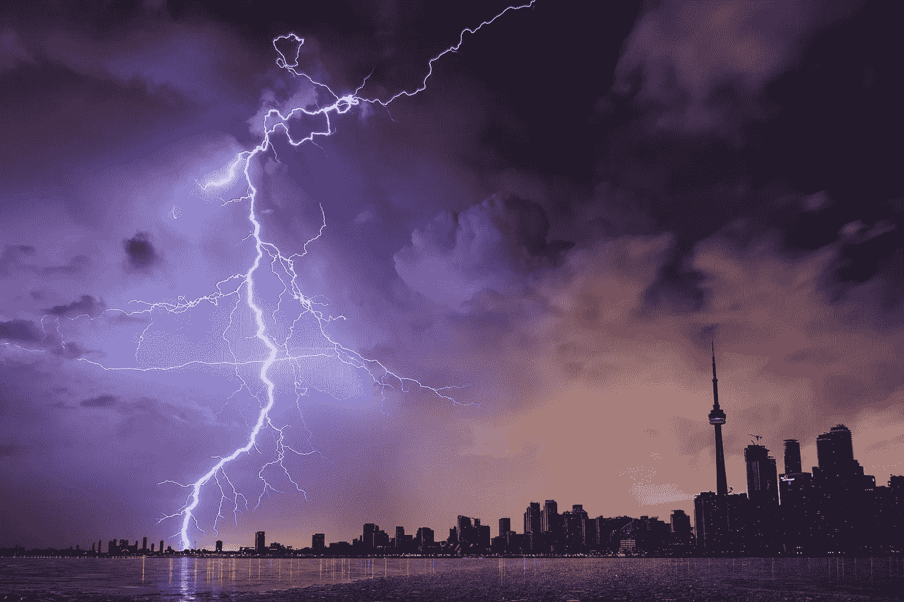

# 压力与休息

> 原文：<https://medium.com/coinmonks/stress-vs-rest-26231e466465?source=collection_archive---------22----------------------->

STRESS vs REST

# 介绍

在这个竞争激烈、价格昂贵、要求极高的世界里，生活对我们提出了如此多的要求，现在看来，我们一天中的 24 小时似乎已不足以满足这些要求。因此，我们试图最大限度地利用这一明显不足以给我们一天时间的时间框架。因此，我们发现自己全神贯注于那些现在休息一下对我们来说变得陌生的任务。

很多因素都会导致压力，但是工作中产生的压力是最常见的。有几种方法可以让我们远离压力，但在这次讨论中，我们将限制自己休息，因为这是远离压力的关键。在更进一步之前，我们必须了解压力的意义和休息的意义。

## 什么是压力？

WHAT IS STRESS

《牛津词典》将压力定义为“由不利或苛刻的环境导致的精神或情感紧张或紧张状态”。这仅仅意味着当一个人超负荷工作时，压力就会增加。根据一份名为《阿达利亚杂志》的印度医学杂志第八卷题为“压力对人类生活的影响”的报道。据说压力是双重的。通常是身体上和感情上的。长期不加注意的压力会导致一种被称为苦恼的医学状况，这是一种消极的压力反应。

## 压力的危险

DANGERS OF STRESS

压力改变了身体的内部平衡，导致以下情况

1.头痛

2.高血压

3.性功能障碍

4.抑郁

5.焦虑

6.惊恐发作和

7.除了许多其他问题之外，它还加速了老化过程。

## 什么是休息？

根据牛津词典，休息被定义为“停止工作或运动，以便放松、睡眠或恢复体力”。换句话说，休息意味着给大脑和灵魂一些自由的时间。

## 休息对我们的重要性

休息有几个好处。一些优点是

1.它减少压力和焦虑

2.它改善了情绪降低了血压

3.缓解慢性疼痛和改善免疫健康

4.它改善心血管系统等

# 结论

我们经常被收支平衡或满足特定需求的欲望冲昏头脑。这反过来又使我们的生活因压力而处于危险之中。正如已经讨论过的，压力是我们日常生活中面临的一个致命问题。缓解压力最有效的方法是适时充分休息。这是我们健康快乐生活的唯一方式。

感谢您的阅读。

# 关于作者

Igwe Ihuoma Patience 是一名自学成才的创意和特定行业内容作家，也是一名加密货币爱好者，拥有 2 年多的经验和不断发展的区块链空间的知识。

我擅长内容创作、文案撰写、字幕管理、视频编辑和手机图形设计，我教其他人如何在加密货币和区块链领域起步，我的目标是让区块链的学习和更新易于任何人理解。

> 加入 Coinmonks [电报频道](https://t.me/coincodecap)和 [Youtube 频道](https://www.youtube.com/c/coinmonks/videos)了解加密交易和投资

# 另外，阅读

*   [用于 Huobi 的加密交易信号](https://coincodecap.com/huobi-crypto-trading-signals) | [Swapzone 审查](/coinmonks/swapzone-review-crypto-exchange-data-aggregator-e0ad78e55ed7)
*   最佳[密码交易机器人](https://coincodecap.com/best-crypto-trading-bots) | [购买索拉纳](https://coincodecap.com/buy-solana) | [矩阵导出评论](https://coincodecap.com/matrixport-review)
*   [Coldcard 评论](https://coincodecap.com/coldcard-review) | [BOXtradEX 评论](https://coincodecap.com/boxtradex-review)|[uni swap 指南](https://coincodecap.com/uniswap)
*   [比特币基地评论](/coinmonks/coinbase-review-6ef4e0f56064) | [德里比特评论](/coinmonks/deribit-review-options-fees-apis-and-testnet-2ca16c4bbdb2) | [FTX 评论](/coinmonks/ftx-crypto-exchange-review-53664ac1198f)
*   [Coinmetro 评论](https://coincodecap.com/coinmetro-review) | [VirgoCX 评论](https://coincodecap.com/virgocx-review)
*   [法国 4 大最佳加密副本交易平台](https://coincodecap.com/copy-trading-platforms-france)