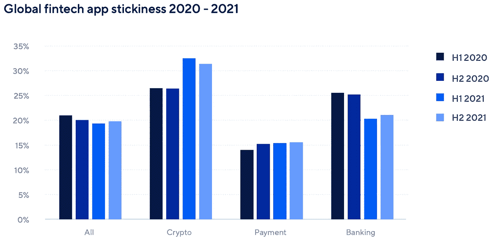
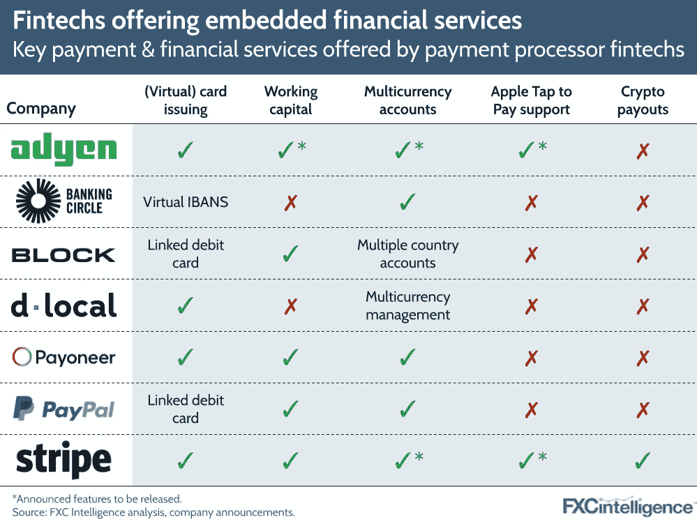
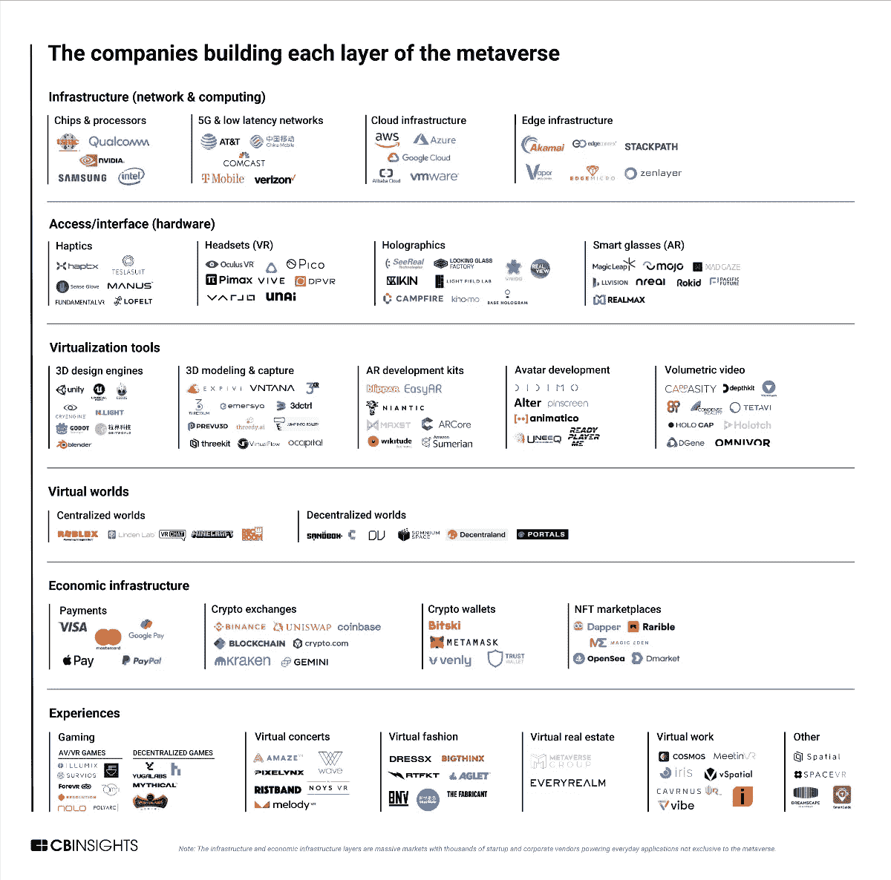
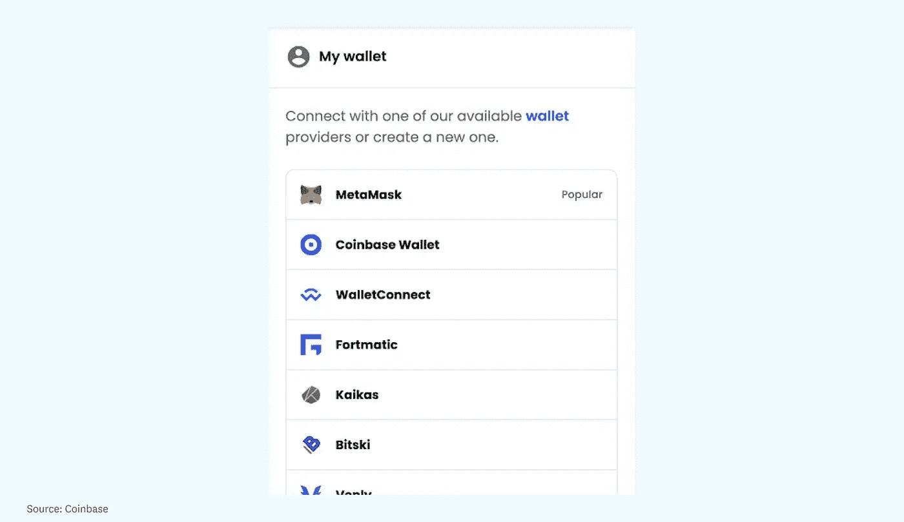
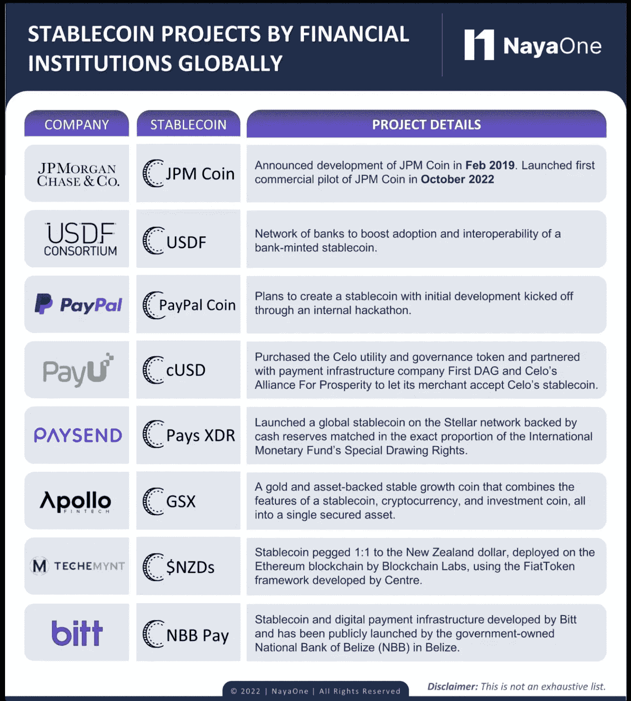
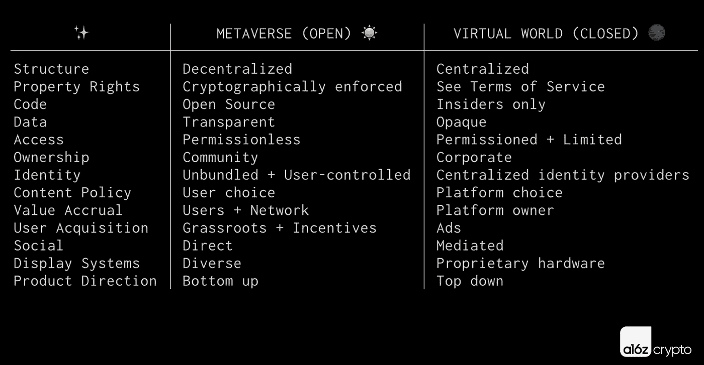
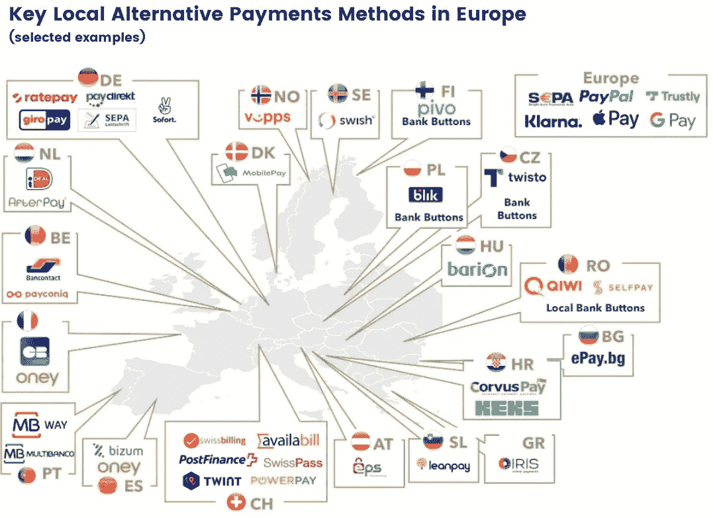

# 条纹 vs 格子？；嵌入式金融正在兴起；重新想象 Cryptos

> 原文：<https://medium.com/coinmonks/stripe-vs-plaid-embedded-finance-is-on-the-rise-re-imagining-cryptos-46ab20523e55?source=collection_archive---------12----------------------->

# 在这个版本中:

1.  金融科技应用
2.  条纹 vs 格子？
3.  嵌入式金融正在兴起
4.  元宇宙的经济基础设施层
5.  加密使用之旅:通过熟悉的 Web2 结构首次使用加密的用户
6.  重新想象密码
7.  安德森·霍洛维茨的《元宇宙的 7 个要素》
8.  Revolut 的英国银行执照是怎么回事？
9.  替代支付:为什么“替代支付”在增加？

# 金融科技应用

从全球来看，从 2020 年到 2021 年，金融科技应用的安装量同比增长了 35%，其中 11 月的峰值最大，比 2021 年的平均水平增长了 26%，比 2020 年增长了 82%。

后疫情时代的用户对投资应用的兴趣在 2021 年继续增长，资产管理应用在美国 Q1 的安装量创下纪录，季度环比增长 198%。

虽然“meme stock”趋势在年初推动了 Robinhood 等股票交易应用的高容量，但用户对加密货币的兴趣激增导致加密应用超过股票交易应用，成为资产管理应用的大部分下载量。比特币和整体加密市值在 4 月和 11 月创下历史新高，用户兴趣紧随其后，而 Dogecoin 和 Shiba Inu 等“meme coins”的主流报道以及以太坊区块链上 NFTs 的流行推动了大量新用户进入该领域。

许多安装 fintech 应用程序的用户都是重新归属的用户，这凸显了保持强大的保留策略和创造出色用户体验的重要性。2020 年，H2 的再归因比例达到 0.07，此后降至 0.05。支付应用代表了最高的再归因数量，在 2021 年的 H2 为 0.09。

查看每天花在应用程序上的总时间，我们可以看到这些会话总共花费了多少分钟。2021 年的 H1 是最高点，第 0 天平均每天 2.8 分钟，第 7 天 3.7 分钟，第 14 天 3.3 分钟，第 30 天 3.1 分钟。H2 紧随其后，从第 0 天的 2.7 分钟和第 30 天的 3 分钟开始。对于加密和股票交易，这些数字要高得多，前者在第 0 天平均每天 6.6 分钟，在第 30 天平均每天 5 分钟，而后者在这两天分别为 4.7 分钟和 6.8 分钟。

[来源](https://a.storyblok.com/f/47007/x/9bc36de121/220412_apptrends2022_ebook.pdf)

# 条纹 vs 格子？

据 TC 的 Ingrid Lunden 报道，今天早些时候，支付巨头 Stripe 宣布推出一款新产品，填补了其作为商户和其他业务的金融服务层的一些重大空白，这些业务的模式是基于支持交易的。

该新产品名为 Financial Connections，该公司表示，它将为 Stripe 的客户提供一种直接连接到其客户银行账户的方式，以访问财务数据来加速或运行某些类型的交易。

如果这听起来很熟悉，那是因为这几乎正是另一家金融科技巨头 Plaid 已经在做的事情。Stripe 的这一举动使该公司直接与以前的合作伙伴 Plaid 竞争。

现在的紧张局势是，包括 Plaid 首席执行官和联合创始人扎卡里·佩雷特在内的一些人认为，Stripe 可能利用了与 Plaid 的关系来收集如何开发这种产品的信息。

格子和条纹都拒绝对这个话题发表评论。

但在一条回应 Stripe PM Jay Shah 自己关于其公司新产品的推文中，Perret 写道:“哇！Jay，在过去几年中，你多次接受了 Plaid 的采访并问了一些试探性的问题，你的团队也反复发送了 RFP(在 NDA 名下！)向我们索要大量的详细数据。我希望你们在这些产品上一切顺利，但看到这些方法还是令人惊讶。”

现在的紧张局势是，包括 Plaid 首席执行官和联合创始人扎卡里·佩雷特在内的一些人认为，Stripe 可能利用了与 Plaid 的关系来收集如何开发这种产品的信息。

格子和条纹都拒绝对这个话题发表评论。

但在一条回应 Stripe PM Jay Shah 自己关于其公司新产品的推文中，Perret 写道:“哇！Jay，在过去几年中，你多次接受了 Plaid 的采访并问了一些试探性的问题，你的团队也反复发送了 RFP(在 NDA 名下！)向我们索要大量的详细数据。我希望你们在这些产品上一切顺利，但看到这些方法还是令人惊讶。”

这两家公司曾经是合作伙伴。在 Plaid 的网站上，有两家公司合作的细节，以“提供无摩擦的资金转移，而无需处理帐户或路由号码。”

没有消息表明这种合作关系是否仍然存在。但是从今天的新闻来看，即使从技术上来说仍然如此，它的未来似乎也岌岌可危。

[来源](https://techcrunch.com/2022/05/04/from-partners-to-competitors-what-stripes-latest-move-means-for-plaid/)

# 嵌入式金融正在兴起

支付处理竞争持续加剧，该领域的许多金融科技公司正在推出新产品，以扩大份额和提高利润率。 [Adyen](https://www.linkedin.com/company/adyen/) 宣布扩大其金融服务产品，作为其更广泛地进军市场的一部分，而 Stripe 增加了以加密货币支付的能力。

支付处理器 fintechs 提供的主要支付和金融服务

作为其针对市场客户的一系列服务的一部分，Adyen 现在将提供发行功能，使市场能够向其卖家发行卡，并为商家提供多货币账户，以接收付款，启动支出和存储不同货币的资金。

Adyen 2021 年获得的美国银行牌照和 2017 年获得的欧洲牌照，将使其产品范围包括资本和外汇服务，尽管后者的细节仍然有限。然而，该公司表示，从长远来看，预计将从发行和资本两方面看到有意义的收入贡献。

此举使 Adyen 与 Payoneer 等其他支付服务提供商展开了更直接的竞争，Payoneer 已经在市场领域建立了强大的基础，包括通过亚马逊的批准程序。然而，Adyen 的客户中已经有脸书、[、](https://www.linkedin.com/company/uber-com/)、H & M、[、](https://www.linkedin.com/company/ebay/)和[微软](https://www.linkedin.com/company/microsoft/)，这给了它在市场舞台上挑战的强大基础。

与此同时，苹果在 2 月份推出了新的“点击支付”功能，允许美国商家使用合作伙伴的 iOS 应用程序，在 iPhone 而不是读卡器设备上接受卡、非接触式和数字钱包支付。Stripe 将在今年春天成为第一家提供此类功能的支付处理器，Adyen 将在今年晚些时候推出。对于中小企业客户来说，这可能是一个特别有吸引力的功能，这是支付处理器中越来越重要的领域。

[Stripe](https://www.linkedin.com/company/stripe/) 希望通过扩大其产品范围来进一步区分支付，以加密货币支付，最初通过 [Circle](https://www.linkedin.com/company/circle-internet-financial/) 发行的 USDC 稳定货币支付。该公司已与 Twitter 合作进行该服务的试点，使一组精选的创作者能够使用基于加密货币的 rails 从 Twitter 接收他们的收入。

鉴于本周 Twitter[可能出售给 Elon Musk，我们可能会看到这一领域的进一步发展，请继续关注。](https://www.linkedin.com/company/twitter/)

[来源](https://www.fxcintel.com/research/analysis/payment-processors-new-revenue-streams)

# 元宇宙的经济基础设施层

这一层包括将使人们能够在元宇宙购买、销售和存储商品和服务的技术。

尽管人们对加密和 NFT 的兴趣激增，但进入这一领域的初创公司和公司可能只会服务于元宇宙的一小部分——分散化的元宇宙。因此，传统支付公司仍将保持高度相关性。毕竟，如果元宇宙完全由分散金融运营，公司将失去为非加密客户服务的巨大机会。

付款:

传统支付方式在元宇宙不会过时。随着虚拟世界经济的增长，客户会出于方便而使用他们典型的支付系统，提供商也会渴望从这些交易中分得一杯羹。

PayPal 已经可以用来在 Roblox、《我的世界》和 Second Life 购买虚拟货币。与此同时，《我的世界》接受其在世界范围内的货币 Minecoin 的多种支付方式，包括 [Visa](https://www.linkedin.com/company/visa/) 、 [Google](https://www.linkedin.com/company/google/) Pay、 [Apple](https://www.linkedin.com/company/apple/) Pay 和 [Mastercard](https://www.linkedin.com/company/mastercard/) 。

加密交换:

这些公司提供买卖密码的平台，包括分散数字世界中的加密货币。

例如，[沙盒](https://www.linkedin.com/company/thesandbox-game/)的加密货币 Sand 可以在类似[双子星](https://www.linkedin.com/company/geminitrust/)、[Crypto.com](https://www.linkedin.com/company/cryptocom/)和[币安](https://www.linkedin.com/company/binance/)的交易所交易。同样，分散地的加密货币 MANA 也可以在比特币基地、北海巨妖和其他地方买到。

加密钱包:

加密钱包充当分散世界的登录凭证。

为了登录一个像 Cryptovoxels 或[分散化](https://www.linkedin.com/company/decentralandorg/)的世界，用户需要有一个加密钱包。钱包的唯一 ID 允许它作为用户的个人账户。只要他们可以访问钱包，他们就可以从多个设备登录到分散的世界，并接收数字资产，如虚拟土地的世界货币或 NFTs。

例如，沙盒允许用户注册一些最流行的加密钱包，包括 [Venly](https://www.linkedin.com/company/venly-io/) 、 [Bitski](https://www.linkedin.com/company/bitski/) 和 [MetaMask](https://www.linkedin.com/company/metamask/) 。

NFT 市场:这些初创公司正在通过开发平台来支持去中心化世界的商业，用户可以在这些平台上买卖从虚拟土地到虚拟服装到虚拟游艇的各种物品。

不可替代令牌(NFT)不仅仅是元宇宙的概念——人们可以买卖推文、视频等的 NFT，而无需参与元宇宙。然而，NFT 正在成为去中心化虚拟世界中经济活动的支柱，因为它们为元宇宙的财产提供了所有权证明。

元宇宙商品的非关税壁垒也可以在外部 NFT 市场上列出。例如，像 OpenSea 或 Rarible 这样的市场已经支持虚拟房地产和来自分散土地和沙盒的物品的销售。类似地，像 DMarket 这样的初创公司正在开发 NFT 市场，专门为去中心化的世界和游戏提供商品交易。

[来源](https://bit.ly/3vPKhKf)

# 加密使用之旅:通过熟悉的 Web2 结构首次使用加密的用户

通过熟悉的 Web2 结构(例如，使用您的电子邮件地址登录)，首次使用加密技术的用户可以无缝地参与进来。今天存在的许多 web3 应用邀请用户通过连接他们的钱包来登录。

这可能会成为未来许多应用程序的默认选项——钱包登录非常方便和安全。但是第一次使用密码的用户可能会感到困惑，不知所措，甚至怀疑，如果他们不知道他们在看什么。对于许多没有钱包的首次加密用户来说，传统的登录方法是他们在尝试新应用程序时唯一愿意使用的选项。

对于越来越多地寻求使用 web3 技术来创造新形式的粉丝参与的创作者来说，这是用户旅程中特别重要的一步。在艺术家职业生涯早期支持他的粉丝可能会获得创作者访问权、认可和额外津贴等形式的好处。(这里的设计空间几乎是无限的，创新和实验的浪潮才刚刚开始。)

然而，大多数爱好者不会是加密原生的，要求他们获得硬件钱包和创建安全系统是过分的要求。粉丝应该能够注册，拿出他们的信用卡，购买他们最喜欢的创作者的令牌，并在他们的帐户中看到它——它必须是直观的，必须反映熟悉的 web2 体验，以便看到用户的整个旅程。没有加密钱包、密钥管理、“汽油”(交易)费、停滞交易或任何其他外国用户体验。

通过这种方式，创作者可以与粉丝建立共享的数字经济，他们可以在互联网上的任何地方随身携带，但对粉丝来说，加入的方式不会太吓人或太繁琐。

[来源](https://future.a16z.com/missing-link-web2-web3-custody-wallets/)

# 重新想象密码

由于稳定货币通常与法定货币挂钩，它们可以在交易所之间转移。这使得交易者和投资者可以利用跨交易所仲裁、借贷的机会。在分散金融(DeFi)中，通过智能合约，稳定存款的储户可以在赚取利息的同时向借款人提供即时流动性。

尽管监管机构和行业机构正在考虑建立监管框架，但 stablecoins 的使用预计将会扩大。[摩根大通&公司](https://www.linkedin.com/company/jpmorganchase/)于 2021 年 10 月推出的 JPM 硬币，以及美国一些银行于 2022 年 1 月推出的 USDF 稳定硬币，预计将推动稳定硬币的采用。

JPM 币的诞生是为了简化跨境支付中普遍存在的复杂问题。它允许该公司的客户在系统内转移美元，并简化了流动性融资和支付的过程。它还支持交付对支付、支付对支付和机器对机器支付。预计领先的金融科技公司，如 [PayPal](https://www.linkedin.com/company/paypal/) 和 [PayU](https://www.linkedin.com/company/payu/) 将很快带着自己的稳定账户加入这场竞赛。

非洲的阿波罗金融科技公司(Apollo Fintech)推出了一种黄金支持的稳定币，它结合了稳定币、加密货币和投资币的特点。这种被称为黄金担保货币(GSX)的货币随着新资产加入到支持它的信托中而增值。GSX 稳定债券的持有人可以很容易地跟踪每项基础资产的价值，同时还可以获得年度股息作为回报。

在巴西，移动优先的 DeFi 平台 [Celo](https://www.linkedin.com/company/celoorg/) 的 cREAL stablecoin 与当地货币挂钩，而由金融服务提供商 Techemynt 创建的$NZDS 是第一种与新西兰元挂钩的 stablecoin。 [Techemynt](https://www.linkedin.com/company/techemynt/) 的投资者门户网站为消费者提供入职帮助以及买卖服务。$NZDS 建立在以太坊网络上，符合新西兰的法规，并利用区块链使所有交易透明。该公司的目标是在未来几个月内将$NZDS 与钱包提供商和金融科技应用整合在一起。

在英国，该国首个抵押贷款稳定币(mortgage stablecoin)将由房地产市场实时网络与科技公司 [R3](https://www.linkedin.com/company/r3cev-llc/) 合作推出。R3 的区块链技术已经在许多金融网络中使用。预计这些 stablecoins 将通过提高整个价值链的效率、减少欺诈，以及最重要的是降低专业赔偿保险的保费，来改变抵押贷款交易。

[来源。](https://nayaone.com/beyond-the-crypto-hype/)

# 安德森·霍洛维茨的《元宇宙的 7 个要素》

1.分散

集中式平台往往在开始时友好合作，以吸引用户和开发者，但一旦增长放缓，它们在关系中就会变得竞争、榨取和零和。通常，这些强大的中介从事用户权利滥用和去平台化，并以激进的费率托管垄断经济。另一方面，分散的系统在利益相关者中表现出更公平的所有权，更少的审查和更大的多样性。

2.财产权

人们已经变得如此习惯于从 web2 的集中服务中租赁，以至于实际拥有东西的想法——你可以出售、交易或带到其他地方的数字对象——经常让人们感到奇怪。但是数字世界应该遵守和物理世界相同的逻辑:当你买了东西，你就拥有了它。它是你的了。

3.自我主权身份

web3 核心的加密技术使人们能够在不依赖中介的情况下进行身份验证，因此人们可以直接或在他们选择的服务的帮助下控制自己的身份。钱包(像[元面具](https://www.linkedin.com/company/metamask/)和[幻影](https://www.linkedin.com/company/phantomwallet/))为人们提供了验证自己的方式。

4.可组合性

为了突出可组合性——一个与互操作性紧密相关的概念——元宇宙必须提供高质量、开放的技术标准作为基础。

在它们最强的形式中，可组合性和互操作性在软件栈的广泛范围内都是可能的。分散融资(DeFi)就是这种强大形式的例证。任何人都可以修改、回收、更改或导入现有代码。

5.开放性/开源

那么，在元宇宙开发环境中，开源意味着什么呢？最好的程序员和创造者——而不是平台——需要完全控制才能充分创新。开源和开放有助于确保这一点。当代码库、算法、市场和协议成为透明的公共产品时，构建者可以追求他们的愿景和雄心，以构建更复杂、更可信的体验。

6.社区所有权

社区所有权是拼图的一部分，它将网络参与者——建设者、创造者、投资者和用户——团结起来，为共同利益而合作和奋斗。这种协调的奇迹——如果没有加密和区块链的出现，以前是笨拙的或不可能的——是通过令牌的所有权来协调的，令牌是网络的固有资产。

7.融入社会

元宇宙不一定要存在于 VR/AR 中。元宇宙存在的所有必要条件是广义上的社会融入。比硬件更重要的是元和支持的活动类型。他们将让人们远程闲逛，一起工作，与朋友打成一片，玩得开心，就像他们今天使用 [Discord](https://www.linkedin.com/company/discord/) 、 [Twitter](https://www.linkedin.com/company/twitter/) Spaces 或 [Clubhouse](https://www.linkedin.com/company/clubhouse-app/) 一样。

[来源。](https://bit.ly/3FrKpTp)

# Revolut 的英国银行执照是怎么回事？

Revolut 已经申请了英国银行牌照，这是其成为全球金融“超级应用”计划的关键一步。它已经提供资金转账、商店购物、股票交易和宠物保险。许可证将增加受保护的英国经常账户，包括透支和贷款，这是任何成熟银行的支柱。

但首先，英国人希望确保 Revolut 具有合规和风险管理能力，以避免其他金融“颠覆者”的失误，特别是在加密货币方面。据在场的人说，沮丧的 Storonsky 曾希望在 2022 年初获得许可，他问 Sunak 为什么花了这么长时间:三个月过去了，批准仍未到来。对任何与俄罗斯有关联的企业的新警惕也于事无补。

这关系到一大笔钱。虽然 Revolut 确实拥有欧盟的许可，但英国和美国是主要地区。其估值很大程度上取决于打入全球主流银行市场。其 2020 年的收入仅为 3.25 亿美元，因此距离证明 330 亿美元的数字还有很长的路要走。

背景并不简单。知情人士说，英国对 Revolut 的加密交易服务感到担忧，该服务是一大收入来源，英国还担心新兴的银行应用程序是否有能力应对洗钱和欺诈行为。

在英国，Revolut 的加密交易产品已经成为焦点。监管机构认为它“不合适”，因为担心其了解客户的方法和交易监控，尽管它仍可在英国使用。据一名知情人士透露，Revolut 表示，在处理几个不同的 FCA 联系人时感到沮丧，每次都必须重新开始加密讨论。

它必须向金融行为监管局证明，对于一家获得全面许可的银行，它拥有正确的合规和反欺诈工具——这是一项昂贵而繁重的任务。大型贷款机构花费数十亿美元监控交易和客户。Revolut 的风险和合规团队约有 300 人。

“在英国获得银行执照的标准非常高，”马克·希珀森说，他在 2014 年共同创立了斯特林银行后经历了这个过程。“你必须非常彻底地了解你的客户。”另一家英国初创企业 Monument Bank 花了三年时间才获得批准。

潜在的奖励是巨大的。有了 superapp 的概念，“我们将回到客户在一个地方拥有活期账户、贷款、保险的时代，”Hipperson 说，他正在经营一家名为 Ziglu 的新金融科技公司。在 90 年代，客户对这种方法冷淡了，因为银行利用了这一点。

[出处。](https://www.bloomberg.com/news/articles/2022-05-06/revolut-33-billion-banking-app-wants-to-play-in-the-big-league)

# 替代支付:为什么“替代支付”在增加？

监管情报专家 VIXIO 的新研究表明，美国和英国一半的主要商家计划在 2022 年推出自己的“闭环”支付计划。

“闭环”方案通过将整个支付生态系统——发行自有品牌的卡、获取和处理交易、忠诚度和客户管理——置于商家的控制之下来发挥作用。

支持者认为，这有助于降低成本，并为客户带来更大的好处。特别是，商家正在考虑推出可以在参与的合作商家处使用的亲和支付卡。

这种例子已经存在，法国的 Lyf Pay 数字钱包允许在道达尔(加油站)、欧尚(食品杂货)和 T2 巴黎银行(银行业务)支付。

在创建这种生态系统的过程中，商家免除了交换费，并且——按照这种观点——可以通过共享忠诚度计划和其他促销活动鼓励合作伙伴之间的交叉销售。

这种“闭环”方案的挑战是在商家创造的伙伴关系之外更广泛的接受。

尽管如此，这种方案越来越流行，尤其是在北美，这或许更多地说明了商户对收单机构收取的高额费用和有限的服务选择的不满，而不是向普通客户发放支付卡的好处。

一路 A2A

VIXIO 的研究还表示，美国和英国不到一半的支付公司希望在销售点(POS)推出账户对账户(A2A)支付。

他们的研究声称，45%的支付 FinTechs 和 PSP 计划在 2022 年推出闭环支付产品，53%的人表示他们将在 2023 年底前开发 A2A 功能。

A2A 支付承诺即时结算，这一特点使其特别受“零工”经济工作者的欢迎。

如果消费者对 A2A 支付持压倒性的积极态度，在最近的 Icon Solutions 调查中，约 87%的受访者表示他们更喜欢 A2A 支付，而不是直接借记和借记卡，那么就有问题了。

Icon 的研究还显示，不到五分之一的银行目前提供 A2A 解决方案，只有 27%的银行计划在未来 18 个月内提供这种解决方案。

在某种程度上，这可以解释为与 interchange 相比相对较低的费用收入，也可以解释为 A2A 专业提供商的出现，如 [Tink](https://www.linkedin.com/company/tink-ab/) 、[trusted](https://www.linkedin.com/company/trustly/)和 [Zimpler](https://www.linkedin.com/company/zimpler/) 。

然而，Icon 的工作揭示了一个更熟悉和令人不安的模式:54%的银行和 PSP 受访者表示，他们现有的技术和系统太有限了。

这反映了现有基础设施根本不具备将差异化服务快速、安全地推向市场的灵活性。

[来源。](https://bit.ly/3wAFTOr)

> 加入 Coinmonks [电报频道](https://t.me/coincodecap)和 [Youtube 频道](https://www.youtube.com/c/coinmonks/videos)了解加密交易和投资

# 另外，阅读

*   [有哪些交易信号？](https://coincodecap.com/trading-signal) | [Bitstamp vs 比特币基地](https://coincodecap.com/bitstamp-coinbase)
*   [ProfitFarmers 回顾](https://coincodecap.com/profitfarmers-review) | [如何使用 Cornix Trading Bot](https://coincodecap.com/cornix-trading-bot)
*   [如何在势不可挡的域名上购买域名？](https://coincodecap.com/buy-domain-on-unstoppable-domains)
*   [印度的秘密税](https://coincodecap.com/crypto-tax-india) | [altFINS 审查](https://coincodecap.com/altfins-review) | [Prokey 审查](/coinmonks/prokey-review-26611173c13c)
*   [赢取注册奖金——10 大最佳加密平台](https://coincodecap.com/earn-sign-up-bonus)
*   [Blockfi vs 比特币基地](https://coincodecap.com/blockfi-vs-coinbase) | [BitKan 评论](https://coincodecap.com/bitkan-review) | [Bexplus 评论](https://coincodecap.com/bexplus-review)