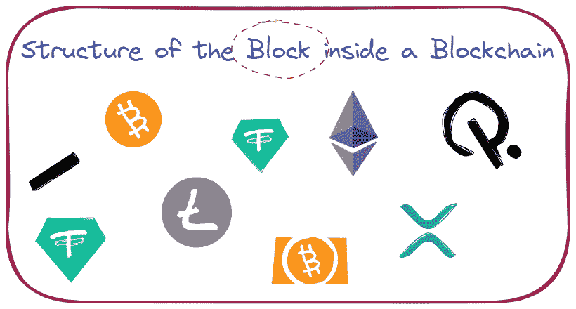

# 区块链网络内部的区块结构

> 原文：<https://medium.com/coinmonks/structure-of-the-block-inside-a-blockchain-network-7ad66ea5bea?source=collection_archive---------20----------------------->

**嘿伙计们，**

怎么了？

**那么**，今天我们就来看看，*街区的结构*里面有一个*区块链*的网络。

开始吧！

等等，等等…

在开始之前，我猜你对*区块链*很熟悉，如果没有，那么请在这里阅读我之前的文章[。](https://saroj.hashnode.dev/how-does-the-blockchain-work)

对你有用吗？

厉害！

那为什么要等？开始吧:)

如你所知，*区块链*是由一连串的*块*组成的，在一个*块*中一定要有一些数据。没有任何数据，不可能插入新的*块*。数据对于人类来说就像氧气；没有氧气，人类无法生存。像这种方式，没有数据，*块*在一个*区块链*的网络里面是不可能存在的(*里面肯定有一些数据*)。

我找不到比这更好的例子了。开玩笑的。:)

酷！

现在，我们来看看一个 block 的*结构！*

如上图所示，一个*块*被分成两部分。

1.  分程序首部
2.  分程序体

**先说*缸体头*。**

*缸体头部*也分为六个部件。那些是

*   **版本号**
*   **前一个块哈希**
*   **Merkle 树根哈希**
*   **Nbits**
*   **随机数**
*   **时间戳**

***块版本*号**表示遵循哪组*块*验证规则。这对于想要在*区块链*网络内挖掘(*插入新块*)的矿工来说很有用。也就是说，假设我想采矿，我需要*区块版本*来检查该版本提供的规章制度。每个*区块版本*都有一些规律可循，由区块链网提供。

一棵 ***马克尔树*** 以一种高效和安全的方式对*区块链*数据进行编码。它能够快速验证*区块链*数据。

数据本身首先被散列。然后，散列被再次散列并合并。最后， *Merkle 树*合并成一个哈希，叫做*根哈希*。它也被称为树根。

**前面的*块*** 的散列就是*区块链*的链。因为先前的*块*的散列包含在新的*块*的散列中。*区块链*的积木都是相互搭建的。

在 **n 位**的帮助下，当前难度用于创建这个*块*。这意味着它将决定如何创建*块*。

一个 ***随机数*** 是由工作证明 [(PoW)](https://www.investopedia.com/terms/p/proof-work.asp) 产生的变量增量。通过这种方式，挖掘器猜测一个有效的散列，一个比目标更小的散列。

而 ***时间戳*** 就是*块*本身。每个*块*包含一个唯一的时间戳。如果一个*时间戳*大于前 11 个*块*的中值并且小于网络调整时间，则该时间戳被接受为有效。网络调整时间是出现在*区块链*网络中的所有*模块*的中间值。

**现在，让我们来谈谈块体。**

***交易柜台*** 是完成所有交易的地方。比方说，在一个块中完成了 10 个事务，然后*事务计数器*为每个事务创建一个副本以供将来参考。并且这些事务被分开存储。

在这里，我们以一个*区块链*网络中的一个块的*结构结束。我知道，这有点令人困惑，如果你是第一次接触区块链的话。不过我很确定，你一定对*座*有所了解。*

对吗？

厉害！

如果你进一步需要任何帮助，设法与我联系。我很乐意解决你的疑惑。

在那之前，继续学习，保持微笑:)

感谢你阅读这篇文章。很快会看到你的新文章。

[LinkedIn](https://www.linkedin.com/in/sarojvrc/)[Twitter](https://twitter.com/iamsarojb)

> 加入 Coinmonks [电报频道](https://t.me/coincodecap)和 [Youtube 频道](https://www.youtube.com/c/coinmonks/videos)了解加密交易和投资

# 另外，阅读

*   [币安 vs FTX](https://coincodecap.com/binance-vs-ftx) | [最佳(SOL)索拉纳钱包](https://coincodecap.com/solana-wallets)
*   [如何在 Uniswap 上交换加密？](https://coincodecap.com/swap-crypto-on-uniswap) | [A-Ads 审核](https://coincodecap.com/a-ads-review)
*   [加密货币储蓄账户](/coinmonks/cryptocurrency-savings-accounts-be3bc0feffbf) | [YoBit 评论](/coinmonks/yobit-review-175464162c62)
*   [Botsfolio vs nap bots vs Mudrex](/coinmonks/botsfolio-vs-napbots-vs-mudrex-c81344970c02)|[gate . io 交流回顾](/coinmonks/gate-io-exchange-review-61bf87b7078f)
*   [CoinFLEX 评论](https://coincodecap.com/coinflex-review) | [AEX 交易所评论](https://coincodecap.com/aex-exchange-review) | [UPbit 评论](https://coincodecap.com/upbit-review)
*   [AscendEx 保证金交易](https://coincodecap.com/ascendex-margin-trading) | [Bitfinex 赌注](https://coincodecap.com/bitfinex-staking) | [bitFlyer 审核](https://coincodecap.com/bitflyer-review)