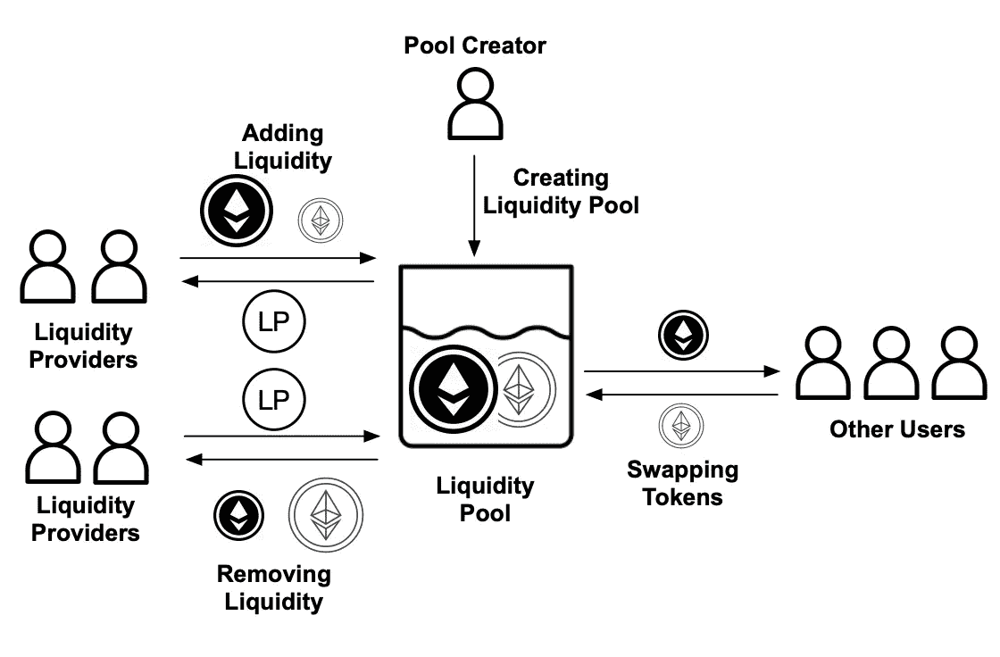

# 研究:Uniswap 上列出的一半代币是骗局

> 原文：<https://medium.com/coinmonks/study-half-of-all-the-tokens-listed-on-uniswap-are-scams-c9e271f08e72?source=collection_archive---------30----------------------->

niswap 是 Defi 领域最可靠的所谓“蓝筹股”分散式交易所之一。(*)甚至有可能把不到 10 年的股票称为蓝筹股吗？*)

它创建于 2018 年 11 月，允许任何用户列出新令牌，并以最低的费用为其创建流动性池。

容易和完全缺乏监督和监管是它吸引投资者和骗子的原因。

2021 年一项名为 *T* [*rade 还是 Trick？检测和描述 Uniswap 分散式交易所的诈骗代币*](https://arxiv.org/pdf/2109.00229.pdf) 分析了 unis WAP V2 代币和流动性池的整体情况。

结果堪忧！

# ***骗局是如何运作的？***

Uniswap 上最常见的诈骗通常是通过引入一个与真实令牌名称相似的“假”令牌来实现的。不知情的用户无法分辨其中的区别。

例如，2020 年 8 月 19 日，即将推出的 DeFi lending protocol Teller Finance 在推特上发布消息称，已经创建了一个假的 Teller token 和一个骗局 Uniswap 池，许多用户被骗。

2022 年 11 月 23 日，Andre Cronje 宣布了一个名为 Deriswap 的新 DeFi 项目。几分钟后，有人在 Uniswap 上创建了一个名为$Dwap 的假令牌。不到 15 分钟，骗子带着价值 53，000 美元的 Eth 逃走了。

在验证了数千个代币名称后，研究人员发现了 429 个与[渴望金融](https://yearnfinance.notion.site/yearnfinance/Welcome-to-Yearn-Finance-26d6c4210e3e405c9f02f84ba567a249)代币同名的诈骗代币，以及 12 个以[无聊刀](https://www.boringdao.com/)命名的诈骗代币。

不胜枚举！

其他骗局可能不会遵循相同的技术。研究人员使用机器学习来注意流动性池的寿命、投资者的特征、整个以太坊网络上所研究的代币的交易数量以及相关的地址，以尽可能多地识别骗局。

Visual Representation of how Uniswap Works

# **骗子是怎么赚钱的？**

最常见的方式是臭名昭著的“拉地毯”,在投资者交易或撤回资金之前，骗子们会迅速抽干资金池。

这通常伴随着 *"* ***泵送转储*** "方案，骗子通过社交媒体、4chan 和 Reddit 板宣传新代币以吸引新投资者。

***预付费用代币:*** 投资者被承诺参与奖励池。该池的资金来自用户铸造、交换或焚烧代币时收取的费用。例如，奖励可以是 5%的费用，在分发日期之前被发送到特定的地址。当然，分享奖励的承诺永远不会实现，

***限售代币合约:*** 智能合约禁止持有者向代币创建者自己以外的任何人出售代币，认为代币毫无价值。

***【免费铸造代币合同:*** 这基本上是一个后门，骗局代币的创造者可以铸造无限量的代币而不留下任何痕迹，减少受害者的怀疑。

# **骗子行为注意事项**

一些骗子比其他人更大胆，更进一步，进行“第二轮骗局”，他们抽干资金池，再次提供流动性，然后再次抽干。

*   超过 86%的骗局流动性池持续 1 天
*   约 37%的资金池流动性在 1 小时内被移除。

这表明攻击者更喜欢在受害者采取行动之前迅速采取行动来保护他们被骗的钱

比如 10 月 9 日。2022 年，一个骗子为一个名为 Xfinancs 的令牌创建了一个流动性池。他在大约 30 分钟内通过拉地毯骗局赚了超过 72 ETHs(大约 4.3 万美元)。

4 分钟后，他再次添加流动性，然后在 6 小时后再次移除流动性，再次获利 26 ETHs(约合 16K 美元)！

但有些比这更复杂。他们可能会在令牌的智能合约中插入恶意后门和代码，包括:

# ***如此..Uniswap 中的诈骗问题有多严重？***

*   在 Uniswap 上列出的所有令牌中， **10，920 个(50%以上)**总共是**个骗局**。这是保守的估计。实际数字可能要高得多。
*   这些诈骗代币与**11215 流动性池**相关联，意味着一个假代币可以参与多个流动性池。
*   这些代币是由 **6288** 骗子创造的
*   这些诈骗代币总共获利超过**1600 万美元**，包括超过 28000 个 eth 和其他领先的官方代币，来自**39762 个潜在受害者**地址

研究人员注意到，80%的投资者的 Uniswap 交易少于 15 笔，这表明大多数投资者缺乏经验。

他们认为，投资者的意识，加上对代币声誉进行排名的机器学习技术，可能会在不失去 DEX 分散化方面的情况下缓解这个问题。

在那之前，安全交易！

> 加入 Coinmonks [电报频道](https://t.me/coincodecap)和 [Youtube 频道](https://www.youtube.com/c/coinmonks/videos)了解加密交易和投资

# 另外，阅读

*   [7 大顶级副本交易平台](https://coincodecap.com/copy-trading-platforms) | [BuyCoins 审核](https://coincodecap.com/buycoins-review)
*   [MyConstant Review](https://coincodecap.com/myconstant-review) | [8 款最佳摇摆交易机器人](https://coincodecap.com/best-swing-trading-bots)
*   [Godex.io 审核](/coinmonks/godex-io-review-7366086519fb) | [邀请审核](/coinmonks/invity-review-70f3030c0502) | [BitForex 审核](https://coincodecap.com/bitforex-review)
*   [10 本关于加密的最佳书籍](https://coincodecap.com/best-crypto-books) | [英国 5 个最佳加密机器人](https://coincodecap.com/uk-trading-bots)
*   [ko only Review](https://coincodecap.com/koinly-review)|[Binaryx Review](https://coincodecap.com/binaryx-review)|[Hodlnaut vs CakeDefi](https://coincodecap.com/hodlnaut-vs-cakedefi-vs-celsius)
*   [MoonXBT vs Bybit vs 币安](https://coincodecap.com/bybit-binance-moonxbt) | [硬件钱包](/coinmonks/hardware-wallets-dfa1211730c6)
*   [火币交易机器人](https://coincodecap.com/huobi-trading-bot) | [如何购买 ADA](https://coincodecap.com/buy-ada-cardano) | [Geco？一次审查](https://coincodecap.com/geco-one-review)