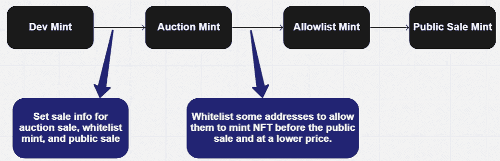

# 研究 NFT 铸造代码——ERC 721 a 的始祖志那都红豆

> 原文：<https://medium.com/coinmonks/study-nft-minting-code-azuki-the-ancestor-of-erc721a-bf94ce211039?source=collection_archive---------1----------------------->

我主要回顾铸造 NFT 和志那都红豆代码的整体工作流程。在本文中，我不会深入探讨 ERC721A 是如何工作的，以及它为什么会节省造币的汽油。

*   我学习的志那都红豆合同地址和进口的 ERC721A 是:0 xed 5 af 388653567 af 2f 388 e 6224 DC 7 C4 b 3241 c 544
*   关于 ethers can:[https://ethers can . io/address/0x ed 5 af 388653567 af 2f 388 e 6224 DC 7 C4 b 3241 c 544 # code](https://etherscan.io/address/0xed5af388653567af2f388e6224dc7c4b3241c544#code)
*   ERC721A 更新:[https://github.com/chiru-labs/ERC721A](https://github.com/chiru-labs/ERC721A)
*   **ERC 721 a 为何以及如何为您节省大量天然气:**[https://www.azuki.com/erc721a](https://www.azuki.com/erc721a)

# 铸造 NFT 的销售逻辑(理想状态)

workflow of the NFT minting

*   至少在拍卖前收集一些销售信息。
*   *销售信息可以随时更新。*
*   至少在允许列表创建之前设置白名单地址。
*   *以后可以添加白名单。*

# 拆分志那都红豆的代码

## 一些配置和修改器

## 构造器

**maxBatchSize**

*   在`ERC721A`中的`_safeMint()`中定义一个铸币者可以铸造的最大 NFT
*   在`ownershipOf()`中使用来检查`ERC721A`中所有者的 tokenId
*   `devMint()`的数量需要是它的倍数
*   拍卖造币厂和公开出售时 NFT 每个地址的最大值

## ERC721A 关于 maxBatchSize 的片段

## 免费造币厂(用于营销等)

## 拍卖造币厂和设置拍卖后的销售信息

## 白名单造币厂

## 公开销售造币厂

## 基地 URI 和其他一些功能

## 总体审查

这里的是对志那都红豆电码的整体回顾。

希望有帮助。