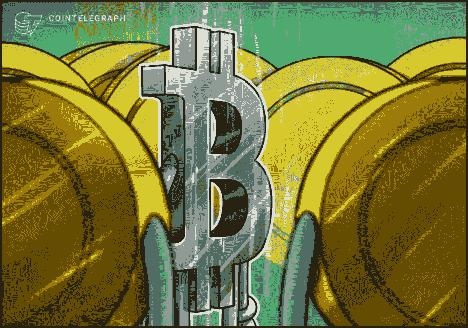
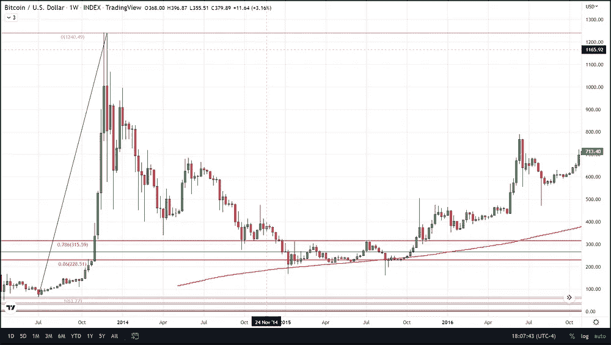
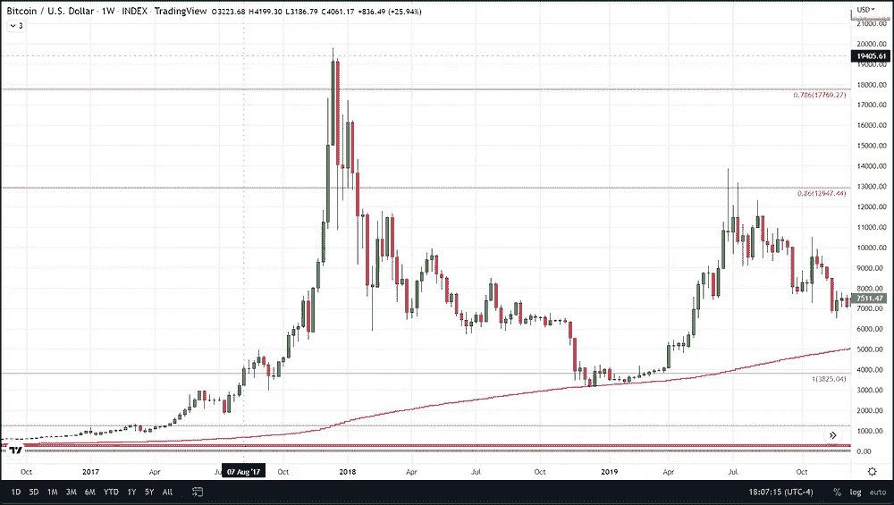
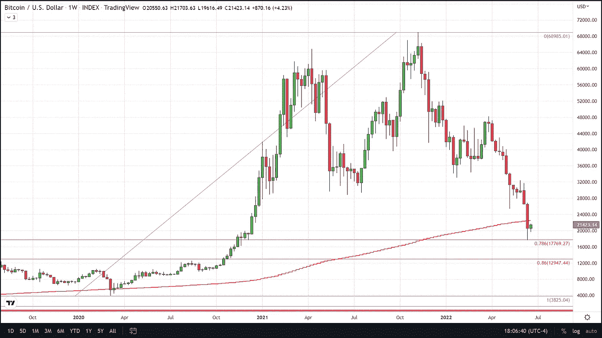
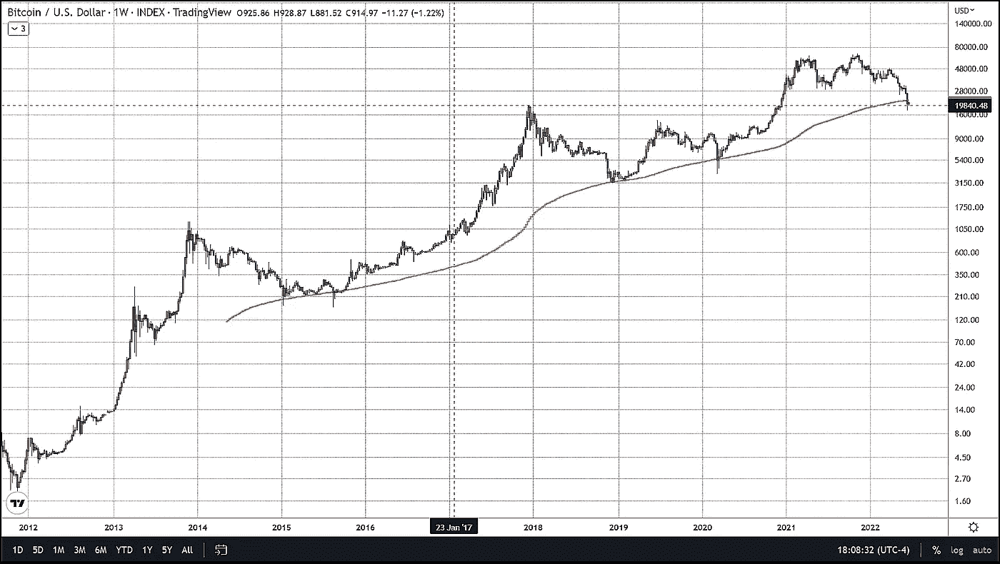

# 研究显示底部可能在，但是 200 周的 SMA 说不是这样

> 原文：<https://medium.com/coinmonks/study-shows-the-bottom-may-be-in-but-200-week-sma-says-otherwise-9d7eeed86918?source=collection_archive---------53----------------------->

比特币似乎已经触底，因为它确实达到了我们的最低目标 17，770 美元，这代表了 78%的回撤，并从该水平略有反弹。使用的回撤从 covid 崩盘的低点(3825 美元)延伸到历史高点(69000 美元)。我们已经多次注意到，BTC 历史上的每次抛物线运动都有 78%-86%的回撤。这一直是 BTC 的技术要求，在下一次抛物线拉力赛开始前必须满足。

然而，请记住，78%的回撤是它必须下跌到的最低水平，86%的水平位于大约 13，000 美元。除此之外，比特币目前面临着一个技术指标的阻力，该指标在比特币自 2015 年以来的许多重大调整中起到了支撑作用，并代表了价格底部。我指的是 200 周简单移动平均线，这一技术指标一直是比特币最悲观的修正期间的主要支撑，只是在 2020 年 3 月与 Covid 相关的崩溃期间被短暂打破。在这种情况下，BTC 收盘时比 200 周的均线低了大约 100 美元。这是比特币历史上唯一一次周收盘低于这一平均水平，直到上周。

上周，在 6 月 13 日触及 78%回撤水平的那一周，我们第一次收盘明显低于 200 周的 SMA，当时我们收盘时比该指标低了近 2000 美元。本周是第一次也是唯一一次周线蜡烛线在 200 周均线下方开盘和收盘，均线目前位于 22，500 美元。就阻力位而言，这可能是一个棘手的问题，因为它在很多情况下都是如此强大的支撑位，现在似乎已经转向阻力位。

任何对我们致力于比特币交易的免费服务感兴趣的人，只需点击这个[链接](https://www.thegoldforecast.com/bitcoin)。

> 加入 Coinmonks [电报频道](https://t.me/coincodecap)和 [Youtube 频道](https://www.youtube.com/c/coinmonks/videos)获取每日[加密新闻](http://coincodecap.com/)

# 另外，阅读

*   [币安 vs FTX](https://coincodecap.com/binance-vs-ftx) | [最佳(SOL)索拉纳钱包](https://coincodecap.com/solana-wallets)
*   [比诺莫评论](https://coincodecap.com/binomo-review) | [斯多葛派 vs 3Commas vs TradeSanta](https://coincodecap.com/stoic-vs-3commas-vs-tradesanta)
*   【Capital.com】|[港加密借贷平台](https://coincodecap.com/crypto-lending-hong-kong)
*   [如何在 Uniswap 上交换加密？](https://coincodecap.com/swap-crypto-on-uniswap) | [A-Ads 评论](https://coincodecap.com/a-ads-review)
*   [WazirX vs CoinDCX vs bit bns](/coinmonks/wazirx-vs-coindcx-vs-bitbns-149f4f19a2f1)|[block fi vs coin loan vs Nexo](/coinmonks/blockfi-vs-coinloan-vs-nexo-cb624635230d)
*   [本地比特币审核](/coinmonks/localbitcoins-review-6cc001c6ed56) | [加密货币储蓄账户](https://coincodecap.com/cryptocurrency-savings-accounts)