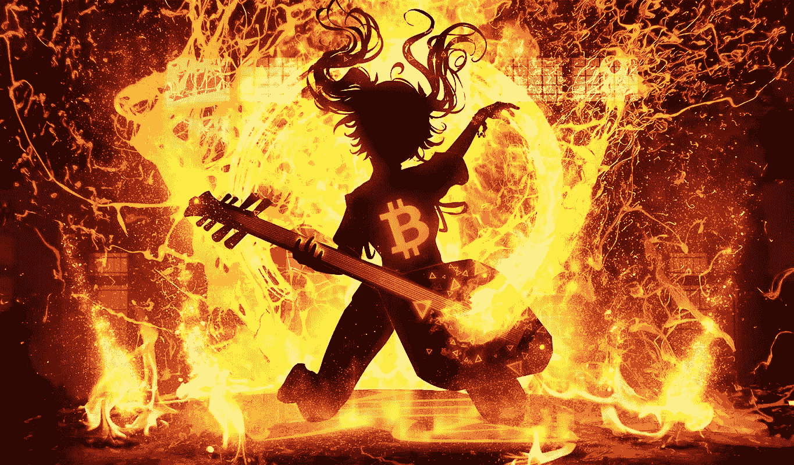
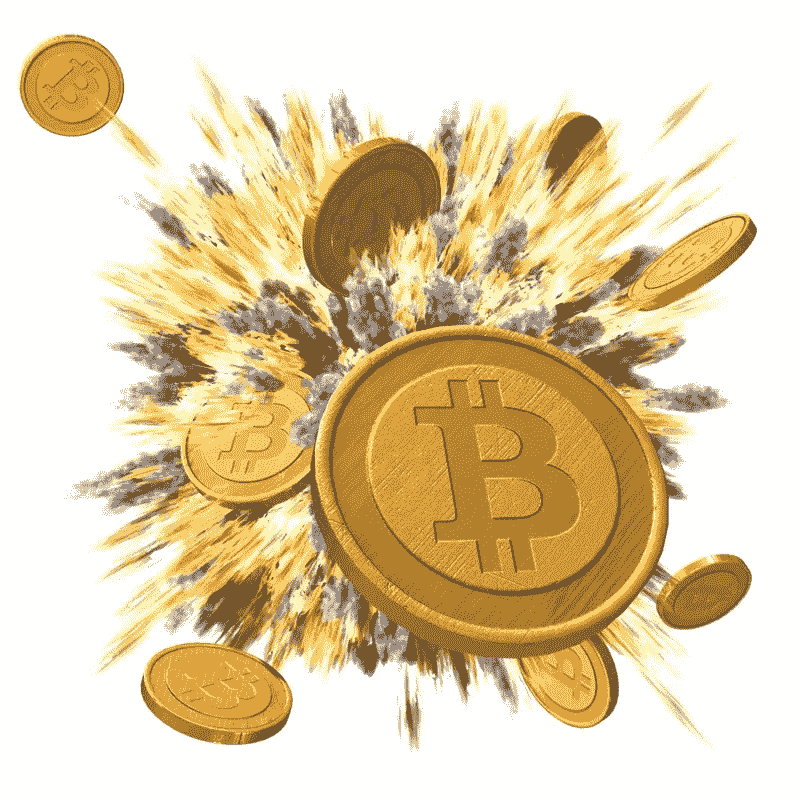

# 研究 Terra/Luna 崩溃的后果..

> 原文：<https://medium.com/coinmonks/studying-the-aftermath-of-terra-luna-collapse-b43a14132ea2?source=collection_archive---------41----------------------->

Luna/Terra might have been the first, but they won’t be the last.

随着 Terra/Luna 的倒下，400 亿美元从加密市场上消失了。

关于秘密核爆炸和它曾经高高在上的创始人权道，已经说了很多。

警方已经报案，投资者正在起诉，韩国政府正在用他们的“死神”调查金融犯罪，权道甚至成功推出了不再受算法支持的 Luna 2.0。

这是 crypto 已经布满岩石和坑坑洼洼的肤色上的一个讨厌的疙瘩。

但是在那之后到底发生了什么？

零售业的人受伤了，很严重。

一些人失去了全部财富，另一些人贪婪地借钱投资，结果只能眼睁睁地看着财富在一夜之间蒸发，还有一些人甚至在事后自杀。

政府和监管机构开始介入。

现在，重要职位上的重要人物都在问难题。

监管审查将不可避免地增加。

许多人不仅会对某些硬币失去信心，还会对加密行业失去信心。

对 crypto 来说没什么新鲜的。

就连当初的黑帮比特币，也见过厉害得多的，活了下来。

我在以前的帖子中详细描述了这次崩溃，但我确实想回答，至少是部分回答这个问题:那些把船停泊在 Terra/Luna 的其他企业发生了什么？

看来猫已经从袋子里出来了。

在 Terra 的 LUNA 崩溃后，Delphi Digital 披露了损失。

总部位于首尔的基金 Hashed 在 2021 年投资了 TeraForm Labs 的 2500 万美元，对 Luna token 的敞口非常大。

高峰时，德尔福数码在 Luna 的投资占其净资产的近 13%。

Everyone and everything is going bad in the bear market.

但是最令人吃惊的是一家 YC 公司(YC W22 稳定公司),他们损失了所有客户的钱。

“Stablegains 是一家在美国注册的公司，通过电汇从客户那里获取 USDC 和美元，承诺给他们 15%，在没有告诉他们的情况下将所有资金投入锚定，他们已经失去了 5000 名客户中的 4200 万美元。”

看到他们在那里做了什么吗？

他们向客户承诺 15%的利息，把钱投入锚定协议，给他们带来 19-20%的收益。

他们中饱私囊。

如果你投资 1000 美元或者用你的午餐钱，这只是微不足道的一笔钱。

但凭借良好的营销和强烈的信号(比如得到 YC 的支持)，他们成功说服了客户投资他们。

4200 万美元的 5%相当于 210 万美元，可以用来摆弄手指，把钱投入锚中。

他们可能收取较少的费用等等。

当然，事情要比这复杂得多。

他们不得不担心安全性、合规性、营销、账户管理、多样化等等。

说到多样化。

这正是他们没有做的。

他们把所有的资金都投入锚中，希望出现最好的情况。

所以你可以想象当 Terra/Luna 坠毁燃烧时发生了什么。

稳定不再稳定。

他们锚定的所有 UST 一文不值。

他们继续清理他们的网站并延迟提款，这让顾客们非常沮丧。

我真不知道他们将如何摆脱这种困境。

这对创业者来说是一个教训，让他们对自己的行为更加谨慎和负责。

仅仅因为你能，并不意味着你必须。

如果你能承担得起，就不要冒不必要的高风险。

永远坚持多样化和耐心这样的老规矩。

-

crypto 能挺过这次熊市周期吗？

-

# startups # business # startupx # growth # success # social media # culture # entrepreneur # strategy # dokwon # luna # terra # terraformlabs # stable coin # luna crash # cryptoland # ust # cryptogeddon #比特币#死亡螺旋#stablegains

> 加入 Coinmonks [电报频道](https://t.me/coincodecap)和 [Youtube 频道](https://www.youtube.com/c/coinmonks/videos)了解加密交易和投资

# 另外，阅读

*   [CoinFLEX 评论](https://coincodecap.com/coinflex-review) | [AEX 交易所评论](https://coincodecap.com/aex-exchange-review) | [UPbit 评论](https://coincodecap.com/upbit-review)
*   [AscendEx 保证金交易](https://coincodecap.com/ascendex-margin-trading) | [Bitfinex 赌注](https://coincodecap.com/bitfinex-staking) | [bitFlyer 审核](https://coincodecap.com/bitflyer-review)
*   [Bitget 回顾](https://coincodecap.com/bitget-review)|[Gemini vs block fi](https://coincodecap.com/gemini-vs-blockfi)cmd |[OKEx 期货交易](https://coincodecap.com/okex-futures-trading)
*   [AscendEx Staking](https://coincodecap.com/ascendex-staking)|[Bot Ocean Review](https://coincodecap.com/bot-ocean-review)|[最佳比特币钱包](https://coincodecap.com/bitcoin-wallets-india)
*   [霍比评论](https://coincodecap.com/huobi-review) | [OKEx 保证金交易](https://coincodecap.com/okex-margin-trading) | [期货交易](https://coincodecap.com/futures-trading)
*   [电网交易机器人](https://coincodecap.com/grid-trading) | [Cryptohopper 审核](/coinmonks/cryptohopper-review-a388ff5bae88) | [Bexplus 审核](https://coincodecap.com/bexplus-review)