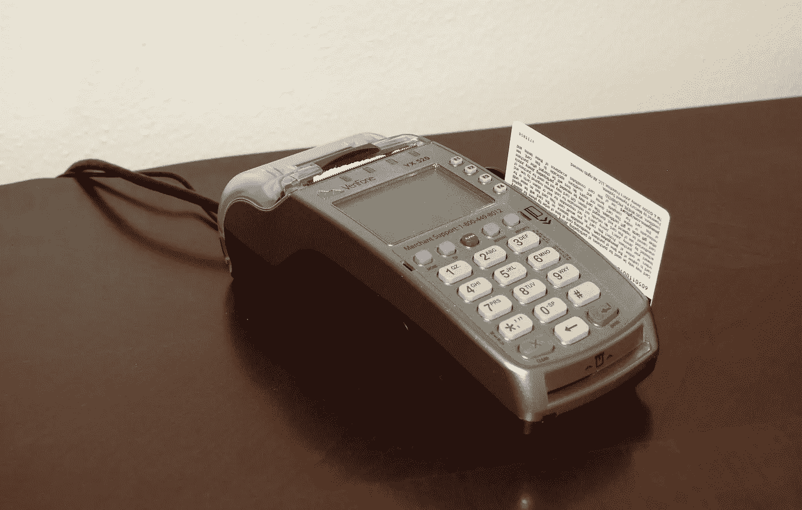

# 比特币终极指南|迷人的比特币

> 原文：<https://medium.com/coinmonks/stunning-details-you-must-know-about-bitcoin-revealed-in-10-minutes-cdc525839749?source=collection_archive---------32----------------------->

你听说过比特币吗？我很确定你听说过比特币。你知道这是什么吗？。它是如何工作的？。我们为什么需要它？。如果你说你不在乎这件事，我警告你。你至少应该知道它是什么。**比特币可能会成为我们日常生活的一部分。所以了解比特币是值得的。**

在开始之前，我想让你知道有这么多的比特币百万富翁。所以很多人会试图说服你成为其中一员。但是，在完成我们关于比特币的讨论之前，不要跳入任何方案。你现在准备好了吗？我们开始吧。

# 我们为什么需要比特币？

所以在了解比特币是什么之前，我们需要先了解一下为什么？是的。我们需要了解我们系统中现存的缺陷。那么只有我们才能看到比特币给我们带来的价值。现在，我想让你知道**比特币是一种数字货币。**现实世界中不存在的东西。比特币以软件或程序代码的数字形式存在。

现在，看看货币的演变。我们在历史上见过多种形式的货币。现在我们正在见证另一个。让我们更详细地看看它们。

*   **易货系统**
*   **资产支持的货币**
*   **法定货币**
*   **数字货币**
*   **去中心化数字货币**

## 易货系统

Barter System Illustration

我们大多数人都知道，物物交换系统是用某种东西交换另一种东西。困难在于找到一个需要我们所拥有的和我们所需要的人。假设我们需要一个苹果，而我们有一个香蕉。然后，现在我们应该寻找一个需要一根香蕉和一个苹果的人。对吗？那是一项艰巨的任务。

现实与此不同。在现实世界中，人们使用的是一种“我欠你的”货币。是的。如果我们需要一个苹果，我们就向别人借。现在，我们欠那个人苹果的数量。如果这是一个小社区，那就很好了。随着人们开始探索世界，社区变得越来越大。交易发生在陌生人身上。所以用一张“我欠你的”钞票来兑换货币是不好的。

## 资产支持的货币

易货制度之后，银行的到来改变了交易方式。银行开始发行纸币来交换像黄金这样的资产。所以如果人们有黄金，他们可以把它交给银行。人们以货币的形式获得黄金的价值作为回报。如果一个人想要黄金，他可以把纸币换成黄金。这使得交易更加容易。因为与现金相比，用黄金买东西不容易。

## 法定货币

然后每个国家的当局开始印刷他们的货币。他们告诉人们它有价值。所以人们开始使用法定货币进行交易。唯一能够控制法定货币价值的权力机构是中央权力机构。在大多数情况下，是各自国家的储备银行。

## 数字货币

互联网成为日常生活的一部分后，银行开发了数字货币。任何人都可以通过互联网向任何人汇款。我们需要在银行账户上有规定的余额。仅此而已。我们已经看到了很多这样的例子。甚至还有那么多非银行的收发款应用。Paypal、西联汇款等……就是其中的一些例子。

## 分散的数字货币

所以我们已经看到了货币在历史上是如何演变的。你看到了吗？你注意到了吗？。上述每个系统都有许多缺陷。我们不必谈论早期的易货体系或资产支持货币。但是，法定货币呢？是啊。现在你看到了。

中央权力机构控制法定货币的价值。这有什么问题？如果有人这样告诉他们，我们的钱将变得一文不值。非常糟糕的事情。对吗？这正是几年前在印度发生的事情。印度政府决定印刷新的货币来代替旧的。人们对它没有任何控制。现在你知道了。

所以去中心化的数字货币会解决这个问题。如果我们使用像比特币这样的数字货币，我们就不必相信任何中央权威机构。这个我们以后再说。

# 比特币是什么？

比特币是一种去中心化的数字货币。官方文件提到比特币是一种点对点的电子现金系统。是的。比特币旨在取代我们使用普通货币的支付方式。但是为什么要用比特币呢？原因太多了。

*   **比特币没有中央权威**。通过使用区块链技术，比特币成为了一种去中心化的数字货币。
*   **比特币是一种点对点支付系统。**这样我们就不必依赖像银行或支付处理商这样的中间人。
*   **比特币限量供应**。所以如果我们使用比特币，通货膨胀就不是问题。
*   避免重复花费的问题。由于比特币使用区块链技术。我们不能重复花费相同的比特币。
*   **未知发明人**。没人知道比特币是谁开发的。别担心，因为它运行在区块链上，所以是安全的。
*   **比特币可以成为价值储存手段**。那就是比特币的价值会随着需求的增加而增加。

那么从以上几点，你明白了什么？我会帮你理清思路。由于我们不知道比特币是谁建立的，所以它是一种真正的去中心化的数字货币。白皮书提到了中本聪这个名字。但是世界各地的人们仍然对此感到困惑。有人说是一群人。

比特币的价值在增加，因为需求也在增加。全球很多大公司都在投资比特币。普通人也一样。还有，比特币的供应量非常有限。永远只会有 2100 万个比特币。如果你对投资或交易有所了解，你就猜对了。随着世界走向比特币，对比特币的需求将会飙升。所以有限的供应会造成比特币价值的增加。但如果人们开始回避比特币，它的价值就会下降。正如我所说的，在这里，普通用户控制着价值。

现在，我们对比特币有了一个概念。让我们了解一下它是如何工作的。

# 比特币是如何运作的？

现在，我看到了你对比特币的兴奋。你仍然不确定它有多安全。对吗？。让我们深入研究一下，了解更多关于比特币工作原理的信息。那你就清楚多了。

正如我前面所说，比特币使用区块链网络来存储交易细节。比特币网络就是比特币的区块链。如果你不确定什么是区块链。[点击这里了解更多区块链技术](/the-best-explanation-of-fundamentals-of-blockchain-for-everyone-c3a54c0e253)。

在这里，我们将讨论比特币的工作原理。区块链的理念是用密码术保护每一笔交易。和将细节存储在网络上的分布式分类帐中。这样我们可以保护所有的交易。此外，修改交易是不可能的。所有设备都将有副本原件详细信息。所以没有人能改变区块链的任何东西。

在比特币网络中，我们每 10 分钟创建一个新块。因此，10 分钟内发生的所有交易都将位于相应的块中。创建一个块并不那么简单。比特币网络中只有一台设备可以做到这一点。可能是任何人。但是，该设备应该解决一个复杂的数学问题，称为工作证明。

采矿是创造一个新区块的过程。参与采矿过程的设备是矿工。希望你注意到我们使用的术语是“设备”。那是故意的。人类无法控制这个过程。我们所能做的就是增加更多的计算能力，这样我们就可以增加挖掘下一个区块的可能性。

## 工作证明

工作证明是一种**共识算法**。在区块链网络中，设备应该与区块链的当前状态一致。网络中的每台设备都有一份分类帐副本。分类账包含交易明细。所以是必不可少的。这些算法确保没有人操纵网络状态。那么它是如何工作的呢？

区块链中的每个区块都将有一个目标哈希值。比特币使用 SHA-256 算法来生成这个哈希值。哈希是我们用来保护每个块的东西。为了创建块的散列，我们使用先前的块散列和事务细节。此外，一个随机数被称为 nonce。随机数是只使用一次的数字。矿工们会试图找到一个随机数。nonce 生成小于或等于目标散列的散列值。

因此，如果一个矿工破解了当前块的随机数，网络就会生成一个新的块。但是其他用户会验证这个块。验证是验证这些块的过程。

在工作证明的情况下，挖掘需要如此多的计算能力。那么矿工为什么要这么做呢？奖励。是的。开采新区块的矿工将获得比特币形式的奖励。这种情况只有在未成年人创造了一个真正的块。如果该区块是欺诈性的，其他矿工将不会核实该区块。这将导致欺诈矿工的损失。这就是为什么比特币要安全得多。

你明白为什么很难拿下比特币了吧。对吗？是啊。

# 比特币至今的历程。

正如我们之前讨论的，没有人知道比特币的发明者。但在比特币白皮书中，给出的名字是中本聪。白皮书有点像公司为投资者发布的年度报告。在一个区块链项目中，一般都是在前期发布白皮书。它将有关于那个项目的所有细节。同样，比特币也有白皮书。

比特币白皮书于 2008 年 10 月问世。2009 年 1 月，中本聪创造了比特币的创世纪区块。创世纪区块是任何区块链网络中的第一个区块。

比特币的第一个接收者是计算机科学家哈尔·芬尼(Hal Finney)。他在 2004 年创建了一个可重复使用的工作证明系统。还有，有一个人花了一万个比特币买了两个披萨。他也是一名电脑程序员。他叫拉斯洛·汉耶茨。我很确定他讨厌那些价值百万的披萨。这件事发生在 2010 年。所以我们不能责怪任何人。为什么？

2012 年是人们意识到比特币价值的一年。2011 年，暗网上一个名为 Silkroad 的黑市使用比特币作为支付手段。但是在 2012 年，比特币的价格从 5 美元涨到了 13 美元。明年，价格会涨到 770 美元。这只是开始。于是很多人开始积累比特币。现在大家都知道比特币的价值会随着时间的推移而增加。

你觉得怎么样？你要用比特币吗？坚持住。关于这个我们再多了解一下。然后我们可以决定。

# 如何存储比特币？

你可能想知道这些比特币都储存在哪里？我明白。我们可以将黄金和现金存放在银行、金库或手中。但是，我们如何存储不以物理形式存在的东西呢？这就是为什么我们需要一个数字钱包。是的。比特币是一种去中心化的数字货币。为了储存它，我们需要一种叫做数字钱包的东西。你可以在那里找到如此多的数字钱包。但在此之前，我们需要知道这些钱包是如何工作的。让我们开始吧。

# 数字钱包是如何工作的？

每当你创建一个数字钱包，你必须知道两个关键。一个是私钥，你永远不想与任何人分享。接下来是公钥，接收比特币需要和外界共享。公钥是你的钱包地址。我们使用公钥发送或接收来自其他人的比特币。你可能会问为什么我们需要一个私钥？

私钥由 12 或 24 个普通随机字组成。大多数人认为私钥的目的是备份我们的数字钱包。是的。这是私钥的目的之一。我们需要保证私钥的安全。因为任何拥有你的私钥的人都可以访问你的比特币，他们可以窃取它们。此外，如果我们丢失了我们的私钥，我们就会失去我们的比特币。因此，请确保您的私钥是安全的。我更喜欢写下别人看不到的东西，比如你的私人日记。

签署从我们的钱包发生的交易是私钥的目的。是的。这就是我们如何从发送方本身验证每笔交易的发生。因为私钥是私有的，所以没有人能够伪造那个签名。对吗？。但我们不必为此担心。这是发生在数字钱包内部的事情。我们需要做的就是确保我们的私钥是安全的。

现在，让我们来看看不同类型的数字钱包。比特币的钱包有三种。

*   **热门钱包(在线)**
*   **冷钱包(离线)**
*   **纸钱包**

## 热门钱包

热钱包是在任何有互联网连接的设备上创建的钱包。由于该设备有互联网连接，设备中的比特币也不安全。一些恶意软件可能会偷走你的钱包。热门钱包包括移动钱包、笔记本电脑钱包、台式机钱包等，但热门钱包对许多用户来说很方便，因为它使交易变得容易。此外，我们可以检查我们的比特币的实时价值。

确保你使用的是好的杀毒软件，远离垃圾邮件。

## 冰冷的钱包

与热门钱包相反。没有互联网的设备中的任何钱包都是冷钱包。你可以在与网络完全隔离的手机上设置一个冷钱包。但最受欢迎的冷钱包是硬件钱包，如 Ledger，Trezor 等。我们可以使用软件管理这些钱包。

冷钱包比热钱包安全得多。尽管如此，还是有可能有人会偷你的 Pendrive 钱包或者毁掉它。

## 纸质钱包

最安全的钱包是纸钱包。因为它是一张纸，包含打印的公钥和私钥。您可以使用这些密钥从区块链本身访问您的硬币。这是一个超级安全的钱包，但不适合经常交易的人。

现在你知道如何存储你的比特币，让我们讨论一下比特币的缺点。

# 比特币的缺点

尽管有这些安全性和广泛的用户基础，比特币也有一些缺点。但我们不必太担心他们。这些不利因素可以归为次要不利因素。他们是

*   **有时候比特币交易有点慢**。你还记得比特币网络是如何运作的吗？。每 10 分钟就有一个新的区块诞生。这些区块需要得到其他人的验证。那么只有它成为有效块。这可能需要几分钟到几小时。现在，随着用户群的扩大，这个过程不需要太多时间。不过，这取决于网络流量。
*   **比特币只有在人们使用时才有价值**。如果所有人都决定退出比特币会怎样？我知道。你是说这是个坏主意。但是，谁知道呢。未来什么都有可能发生。因此，比特币的价值存在潜在风险。如果没有人认为比特币有它的价值，它就没有价值。反之亦然。所以如果每个人都需要比特币，它的价值就增加了。这是一个简单的供求博弈。
*   **高昂的交易费用**。由于网络每秒钟有大量的交易，交易费用也更高。如果比特币成为一种支付方式，社区将会找到降低费用的方法。就目前而言，比特币不适合为你的咖啡买单。但是，值得注意的是萨尔瓦多将比特币作为有效货币进行监管。此外，当地企业开始接受比特币作为支付手段。所以社区希望同样的变化在未来几年也能体现出来。
*   新技术的实施非常缓慢。迷惑？我会解释的。比特币背后有一个社区在为它更美好的未来而努力。他们维护和更新网络。这在某种意义上是好的，因为我们不知道这些新的更新会给我们带来什么。如果出了什么差错，将会影响整个密码市场。因此，社区将在其他网络上观看这些新技术。如果他们做得很好，他们也会更新比特币网络。

这是比特币的一些缺点。与比特币解决的问题相比，这些弊端并没有那么大。尽管如此，使用比特币进行小额交易并不是一个好主意。但是我们可以使用比特币进行更大规模的跨境交易，而不需要任何中间人。万岁…！

# 结论

如果你成功了，我祝贺你。因为不是每个人都能做到。我敢肯定，现在你知道了很多世界上大部分人不知道的关于比特币的事情。不要止步于此，继续学习。你在问我比特币作为投资的问题？我会说是。比特币是一项不错的投资，但风险高于平均水平。如果未来发展顺利，比特币将会有如此大的价值。所以比特币作为一种投资，我们改天再讨论。

现在，你知道什么是比特币吗？。比特币是一种去中心化的数字货币。比特币是如何运作的？。比特币使用区块链网络，工作证明作为共识算法，SHA-256 作为哈希算法。怎样才能存储比特币？。冷钱包比热钱包更安全。所以是的…！我印象深刻。你对这种新货币了解如此之多，以至于能永远改变世界。

我希望你和我一样喜欢学习比特币。我想感谢你的时间。此外，如果你学到了新的东西，请随时与朋友和家人分享。保持幸福。谢谢:)

贾比尔侯赛因国王

> 加入 Coinmonks [电报频道](https://t.me/coincodecap)和 [Youtube 频道](https://www.youtube.com/c/coinmonks/videos)了解加密交易和投资

# 另外，阅读

*   [TraderWagon 回顾](https://coincodecap.com/traderwagon-review) | [北海巨妖 vs 双子星 vs BitYard](https://coincodecap.com/kraken-vs-gemini-vs-bityard)
*   [如何在 FTX 交易所交易期货](https://coincodecap.com/ftx-futures-trading) | [OKEx vs 币安](https://coincodecap.com/okex-vs-binance)
*   [OKEx vs KuCoin](https://coincodecap.com/okex-kucoin) | [摄氏替代品](https://coincodecap.com/celsius-alternatives) | [如何购买 VeChain](https://coincodecap.com/buy-vechain)
*   [ProfitFarmers 点评](https://coincodecap.com/profitfarmers-review) | [如何使用 Cornix 交易机器人](https://coincodecap.com/cornix-trading-bot)
*   [如何匿名购买比特币](https://coincodecap.com/buy-bitcoin-anonymously) | [比特币现金钱包](https://coincodecap.com/bitcoin-cash-wallets)