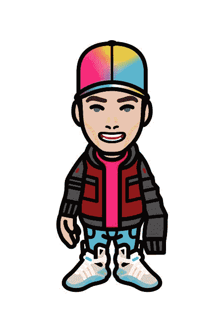
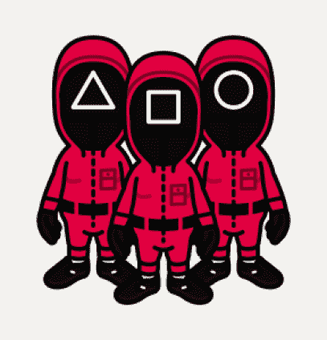
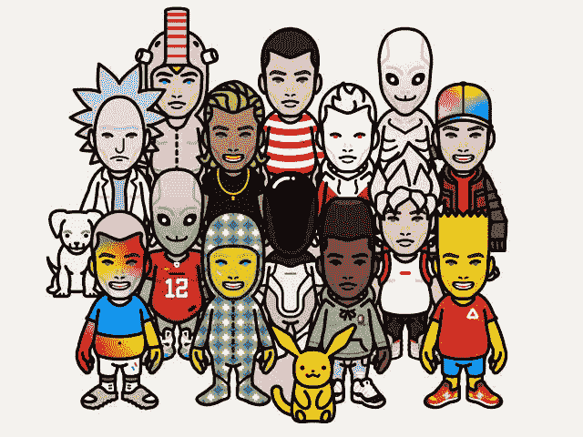

# 时尚 NFT 空投——获取 STYL 代币和时尚 NFTs 空投

> 原文：<https://medium.com/coinmonks/styllar-nft-airdrop-get-styl-tokens-and-styllar-nfts-airdrop-6fe11f75d915?source=collection_archive---------20----------------------->

Styllar nft 三(3)天前宣布为他们的收藏持有者提供一次空投，许多 nft 收藏者都渴望了解更多，如何参与并获得空投

Styllar NFT 将空投战利品箱，这是他们的新收藏，以符合条件的用户谁满足了要求，得到空投

同时，风格图由 10，050 个独特生成的头像组成。每个头像都有由物品和元素组成的独特特征，其中一些与其他相比非常有限。台标可由 Terra 区块链上的任何个人正式拥有。

# 如何获得战利品箱？

战利品箱将对那些持有来自原始 Styllar 收藏的头像的人进行认领。无论您是在第一天铸造还是在第二天购买 Styllar，他们都符合条件。您拥有的每一个 Styllar 意味着您将能够获得一个额外的战利品箱。您可以在这里购买或验证集合

快照日期为 4 月 22 日星期五东部标准时间下午 12 点。您不需要为了获取快照而撤回或删除台标。时尚元素或定制时尚元素此时不可用于战利品箱

**亦作 Read**T4【月鸟 NFT】——您需要了解的一切

# 不同种类的战利品箱

为了奖励 Styllar 的不同稀世珍品，战利品箱将与 Styllar 的稀世珍品相关联。这意味着将会有普通的，稀有的，史诗的，传奇的，超稀有的，不可能的，和独特的战利品箱。战利品箱越少，里面的物品就越少。

*更稀有的战利品箱也意味着更高的几率获得独一无二的，如下所示；*

*   共性:1 次独一无二的机会
*   罕见:2 次独特的机会
*   史诗:3 次独一无二的机会
*   传奇:4 次独一无二的机会
*   极罕见:5 次独特的机会
*   不可能:6 次独一无二的机会
*   独一无二:10 次独一无二的机会

# 这些战利品盒子里有什么？

战利品箱将包含物品、独一无二的物品和可以兑换成未来$ STYLtokens 的门票的组合。这些物品将是有用物品、装备、材料、武器和更多的混合。

就像最初的收藏一样，将会有 31 个独特的项目。除了这一次，它们将略有不同。为了不稀释原始收藏，这些单品将成为物品供应的一部分。这些独一无二的动物都是不同的有趣的小双猴，也许在 Styllaverse 中会很有用。

# 如何申请战利品箱？

在快照日期之后，战利品箱将在美国东部时间 4 月 23 日星期六下午 17 点被认领。你可以在 stylar[网站](https://app.styllar.com/?view=airdrop)领取战利品箱。一旦被认领，战利品箱将成为可交易的单独的非战斗单位。

该团队正在最终确定将所有酷项目放入盒子中，并将于 5 月初在 Styllar Fuser 上打开。同时，这意味着你可以持有、交易或出售战利品盒。但是不要错过你找到一个独特的机会！

**也退房；** [志那都红豆 Nft——你需要知道的一切](https://bulliscoming.com/azuki-nft/)

# 结论

战利品箱可以在美国东部时间 5 月 31 日晚上 9 点前领取。在那个日期之后，任何无人认领的战利品盒子将被收回并用于造福 Styllar 社区。这将确保他们可以利用并找到所有的独特之处！

他们一直致力于为原创系列带来价值。他们计划继续提供战利品箱(根据物品供应看季度)。它将适用于即将到来的$STYL 和其他下降。

同时，要非常谨慎，这样你就不会错过这个潜在的 NFTs 空投

加入我们的电报社区，获取加密新闻、加密宝石、支持和加密教程；

电报链接:[https://t.me/+6ek5FpdVW89jNjE0](https://t.me/+6ek5FpdVW89jNjE0)

> 加入 Coinmonks [电报频道](https://t.me/coincodecap)和 [Youtube 频道](https://www.youtube.com/c/coinmonks/videos)了解加密交易和投资

# 另外，阅读

*   [Bookmap 评论](https://coincodecap.com/bookmap-review-2021-best-trading-software) | [美国 5 大最佳加密交易所](https://coincodecap.com/crypto-exchange-usa)
*   最佳加密[硬件钱包](/coinmonks/hardware-wallets-dfa1211730c6) | [Bitbns 评论](/coinmonks/bitbns-review-38256a07e161)
*   [新加坡十大最佳加密交易所](https://coincodecap.com/crypto-exchange-in-singapore) | [购买 AXS](https://coincodecap.com/buy-axs-token)
*   [红狗赌场评论](https://coincodecap.com/red-dog-casino-review) | [Swyftx 评论](https://coincodecap.com/swyftx-review) | [造币厂评论](https://coincodecap.com/coingate-review)
*   [投资印度的最佳密码](https://coincodecap.com/best-crypto-to-invest-in-india-in-2021)|[WazirX P2P](https://coincodecap.com/wazirx-p2p)|[Hi Dollar Review](https://coincodecap.com/hi-dollar-review)
*   [加拿大最佳加密交易机器人](https://coincodecap.com/5-best-crypto-trading-bots-in-canada) | [库币评论](https://coincodecap.com/kucoin-review)