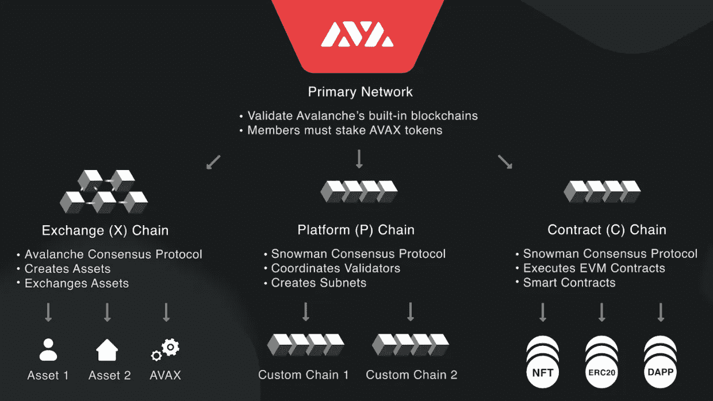

# 子网——区块链的未来？

> 原文：<https://medium.com/coinmonks/subnets-the-future-of-blockchains-713ea49d3f47?source=collection_archive---------26----------------------->

继上周的雪崩峰会之后，我们想与您一起探讨子网的概念。

## **雪崩**

首先，对于那些不熟悉区块链的人来说，一些介绍可能会派上用场。

Avalanche 是第 1 层区块链，旨在更快、更便宜、更环保和适应性更强。

他们实现这一目标的方式是通过对区块链不同方面的细分。例如，验证由特定验证器的子组进行，而不是每次都由整个网络的子组进行。区块链本身分为三个链:x 链、p 链和 c 链。

你可以在下图中看到这些链条的所有细节:

Overview of the Avalanche network of blockchains. From https://docs.avax.network

## **子网**

每个子网是一个较小的验证器组，它们协作管理一个特定的区块链。验证器可以在不同的子网上工作。

顺便说一下，Avalanche 使用了一个整体委托的利益证明协议，这意味着要成为一个验证器，你需要相当大数量的 AVAX 利益。要了解更多关于不同共识协议的信息，请阅读我们以前的文章:

> [https://medium . com/@ tomshnaider/understanding-consensus-34f 0596 b 6 a2f](/@tomshnaider/understanding-consensus-34f0596b6a2f)

这个想法是创造更小的区块链，为他们的目的而优化。

在这些子网上可能的定制程度是令人难以置信的，即使这种方法的其他例子存在，这里的项目是带来一个非常友好的用户体验，并使区块链的使用民主化。

举几个定制的例子，你可以:

*   定制您子网的共识协议
*   定义区块链是公共的还是私有的
*   添加任何你能想象的条件，比如 KYC 的要求

每个区块链都有自己的虚拟机，这基本上是管理区块链的一组规则，它还运行最终用户将用来与区块链交互的 API(应用程序编程接口)。

## **差异**

大多数其他区块链运行在单个虚拟机上，这意味着他们对整个生态系统有一套规则。

这绝对是一种过度简化:以太坊有智能合约来定义子生态系统中的不同规则，Polkadot 有副链来桥接不同的协议文化和区块链。但我们会继续前进，专注于雪崩。

如果你想在一个只有一套规则的区块链上做些改变，你需要将整个区块链分叉并重新开始。你会有一个非常适合你的项目的区块链，但是你需要很多人加入你的项目，这样才能有一个分散的、安全的网络/社区。

Avalanche 对此的解决方案是让技术优化的区块链的创建变得简单易行。这让你得到优化，享受雪崩般的巨大区块链的安全性。

哦，我有没有提到每个子网都可以启动自己的令牌？想象一下各种可能性:筹资、Dao、新项目……任何事情。这就是你在以太坊上所能做的一切，当然，只是更便宜，并且用一种可以在未来几个月或几年吸引很多项目的方法。

## 总结想法

就像 WordPress 使创建网站变得相对容易一样，子网将允许任何人创建自己的区块链。这是雪崩的一个关键点，我们将在未来几个月内看到市场对这一历史时刻的反应——剧透警告，迄今为止市场反应一直非常积极。

可以找到一些关于这些子网的批评。主要是唤起了这样一个事实，子网并不是一场革命，它们基本上是侧链，或者是波尔卡多特生态系统中的副链。

但我们认为这无关紧要，这只能证明区块链的分裂很可能是区块链的未来。这是一个非常聪明的方法来使这项技术的使用大众化。

值得停下来欣赏每天展现在我们面前的技术革命。这些技术进步背后的思想、独创性和努力将需要数年才能理解。

说得轻一点，这是令人兴奋的，非常酷，甚至没有进入这些向导是如何开发的细节。

## **奖金:核心钱包**

Avalabs 刚刚宣布推出 Core，这是他们自己的非保管钱包。旨在通过整个生态系统提供无缝体验。

该钱包与分类账兼容，可以存储和显示 NFT，并通过 moonpay 提供集成的掉期和接入解决方案。

此外，他们还提到了联系人列表界面和将钱包分成多个账户的能力。

## **求更**

如果您对某项技术潜水感兴趣，请点击以下链接:

*   【https://www.kraken.com/en-us/learn/what-is-avalanche-avax 

 [## Avalanche 平台概述| Avalanche 文档

### Avalanche 具有 3 个内置区块链:交换链(X 链)、平台链(P 链)和合同链…

docs.avax.network](https://docs.avax.network/learn/platform-overview/)  [## Avalanche:速度惊人、成本低廉且环保| Dapps 平台

### 以最少的硬件投入扩展到数百万个验证器，或锁定您的 AVAX，以帮助处理交易和…

www.avax.network](https://www.avax.network/) 

感谢您的阅读，

保重。

> 加入 Coinmonks [电报频道](https://t.me/coincodecap)和 [Youtube 频道](https://www.youtube.com/c/coinmonks/videos)了解加密交易和投资

# 另外，阅读

*   [如何开始用加密贷款赚取被动收入](https://coincodecap.com/passive-income-crypto-lending)
*   [BigONE 交易所评论](/coinmonks/bigone-exchange-review-64705d85a1d4) | [电网交易机器人](https://coincodecap.com/grid-trading)
*   [氹欞侊贸易评论](https://coincodecap.com/anny-trade-review) | [CoinSpot 评论](https://coincodecap.com/coinspot-review)
*   [新加坡十大最佳加密交易所](https://coincodecap.com/crypto-exchange-in-singapore) | [购买 AXS](https://coincodecap.com/buy-axs-token)
*   [投资印度的最佳加密软件](https://coincodecap.com/best-crypto-to-invest-in-india-in-2021) | [WazirX P2P](https://coincodecap.com/wazirx-p2p)
*   [7 个最佳零费用加密交易平台](https://coincodecap.com/zero-fee-crypto-exchanges)