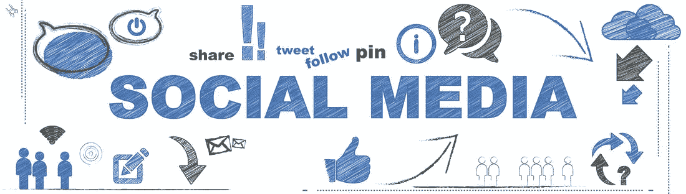
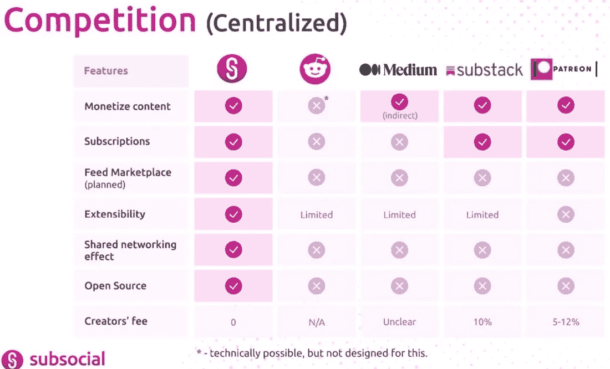
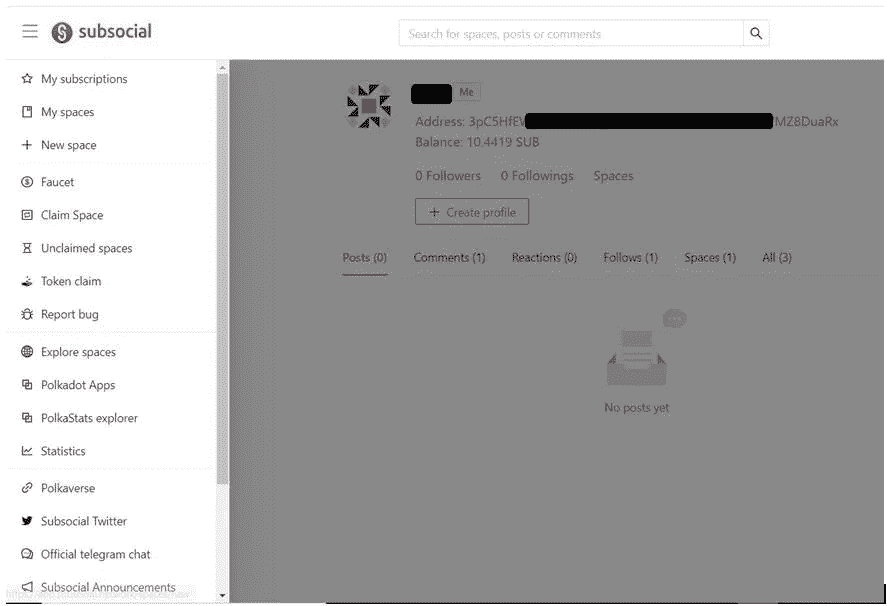
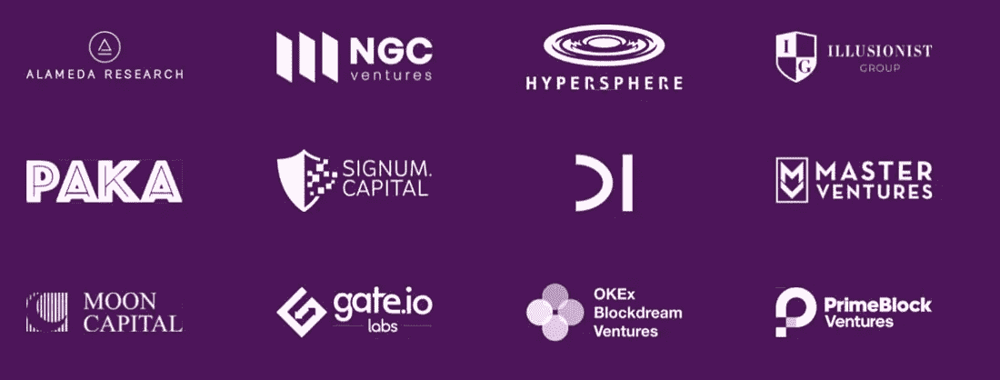

# Subsocial-区块链驱动的社交平台

> 原文：<https://medium.com/coinmonks/subsocial-a-blockchain-powered-social-platform-8b9faf481be9?source=collection_archive---------9----------------------->

Subsocial 是一个区块链驱动的开放平台，提供去中心化的抵制审查的社交网络和市场。你可以把它看作是脸书、媒体、推特等的统一版本，具有去中心化、隐私和货币价值的概念。它将作为 Polkadot 生态系统中的一个副链，并使用基质区块链框架和 IPFS 技术进行分散式文件存储。

该项目旨在解决集中式社交平台的现有问题，即审查、出售用户的私人数据以及内容创作者缺乏盈利能力。该项目代码是开源的，高度可定制的，允许用户根据自己的需要进行定制。

用户可以创建空间并为其定义规则。这些规则将决定谁能够写文章、删除或编辑文章。他们还可以设置自己是空间的唯一所有者，还是其他用户共享空间权限。空间所有者还可以发行用于投票的令牌，允许访问私人内容，或者可以用来交换 Polkadot 生态系统的其他令牌。

这些空间甚至可以充当 DAO 社区，允许社区成员更改/升级社区规则并运行其操作和治理。

**亚社会成分**

子社交界面包括空间、帖子、评论、喜欢和关注。这些词听起来很熟悉，因为我们在使用任何现有的社交媒体平台时都遇到过它们。你可能会想

空格类似于:

媒体上的出版物

关于脸书的群组或页面，

推特和 Instagram 上的账号，

YouTube 上的频道，

不和谐的服务器

并且，帖子类似于:

脸书上的帖子，

媒体上的文章，

推特上的推文。

[图片来源](/polkadot-ecosystem-promoteam/subsocial-the-next-all-in-one-generation-of-blockchain-social-networks-63401cce14bd)

**令牌实用程序**

该项目有一个名为 SUB 的本地令牌，总共提供了**100 万个令牌。它在 Subsocial 平台中有多个用例。以下是平台令牌的主要实用程序:**

**支付交易**

**内容货币化**

> ***o 提示***
> 
> ***o 订阅***
> 
> ***出售或出租你的空间***

**部署智能合同**

**提供对特殊内容(特殊空间)的访问**

**部署新代币(希望购买特定空间代币的用户需要持有子社交主代币)**

**管理**

**整理器需要持有子令牌来运行子社会副链的网络验证器节点**

****如何使用和赢取子代币****

**用户可以通过访问这个[链接](https://app.subsocial.network/)登录 testnet 上直播的 Subsocial dapp。您需要一个 Polkadot.js 扩展来访问平台并登录您的交易。**

****

**这是你赚取一些次级代币的黄金机会。该平台计划向特定账户持有人分发 100 个次级代币，其中 10 个已经空投，其余 90 个将在未来 3-6 个月内分发。第一轮已经结束，下一次投币将在 2021 年 10 月 10 日之前的任何时间进行。**

****谁有资格降****

**以下是平台列出的符合令牌丢弃条件的规则:**

**将在 2021 年 4 月 15 日和 5 月 21 日拍摄 DOT 和 KSM 持有人的两张账户快照。只有在两次快照期间至少持有 1 点或 0.1 KSM 的客户才有资格**

**参与赢得草间弥生众筹贷款的用户也有资格**

**通过交易所和交易所钱包余额进行的众筹贷款不符合资格**

**索赔必须在授权开始前完成，或者直到提出 10，000 份索赔**

****货币化****

**Subsocial 允许用户将他们的内容货币化。该平台提供以下功能来支持内容创作者赚钱:**

> *****提示-*** *如果您喜欢任何帖子或评论，那么您可以使用提示*来奖励作者**
> 
> *****消息传递提示****——支付提示以锁定并高亮显示评论。空间所有者可以为这些提示设定价格。空间所有者越受欢迎，他的空间就越能吸引人们的注意力***
> 
> *****订阅-*** *Subsocial 提供订阅功能，帮助内容创作者增加粉丝群，并与他们紧密联系***
> 
> *****出售或出租你的内容****——帖子作者可以将他们的热门帖子出租到另一个空间，甚至可以将其移动到其他用户的博客上，并完全控制它。***
> 
> *****未来计划-*** *该平台计划实施一些额外的功能，如按次付费、与多个作者共享内容的货币化，以及部署智能合同，这将在未来引入更多高级支付功能***
> 
> *****广告-*** *不通过任何第三方直接出售广告位。链上并完全由您控制***

****支持者****

**Subsocial 平台得到了区块链业界许多知名企业的支持，如 Master Ventures、Alameda Research 等等。**

****

****识别****

**亚社会性是波尔卡多特生态系统的活跃成员之一。该项目获得了 Web3 基金会的两项技术资助。它已被奇偶校验选择参与基板建设者计划。**

**这个项目似乎很有创意。它为大型波尔卡多特项目免费提供场地。如果它能把它们纳入自己的平台，那么它将会大受欢迎。**

****资源:** [亚社交博客](/polkadot-ecosystem-promoteam/subsocial-the-next-all-in-one-generation-of-blockchain-social-networks-63401cce14bd)**

*****注:*** *本帖首次发表* [*此处*](https://crypto.writer.io/p/subsocial-a-blockchain-powered-social) *与* [*上的子帖同*](https://crypto.writer.io/) *。***

****通过我的推荐加入****

**[Crypto.com](https://binance.com/en/register?ref=E8PCD3AF)——[币安](https://platinum.crypto.com/r/sut3pd9bzn)**

**跟我来吧**

****👉** [推特](https://twitter.com/rumadas123)**

****👉**[**Linkedin**](https://www.linkedin.com/in/ruma-das-a1439320/)**