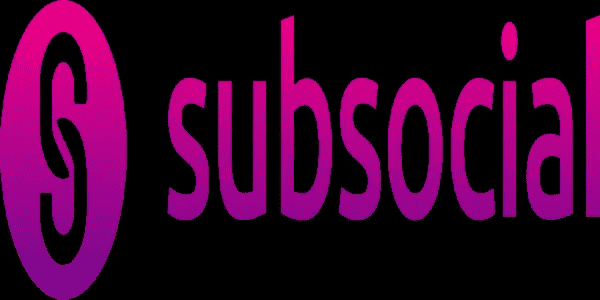

# 社会金融与亚社会

> 原文：<https://medium.com/coinmonks/subsocial-get-on-the-train-d151d71c3498?source=collection_archive---------39----------------------->

**THE FUTURE OF SOCIAL NETWORKS**

Subsocial 是一个开放的平台，允许任何人推出自己的抵制审查的分散式社交网络。除此之外，您可以创建自己的空间来附加您的出版物；可以配置角色和权限来管理空间(空间可以有多个所有者，他们可以控制社区的方向和管理)。同样，这些可以设置为 Dao。简而言之，Subsocial 就是用户的社交网络。

Subsocial 基于底层区块链框架，使用 IPFS。它建立在基板上，允许 Subsocial 连接到波尔卡多特和草间弥生网络。Subsocial 目前是草间弥生的副链，所以草间弥生提供了跨链交互和共享的安全平台，Subsocial 可以在这个平台上扩展。关于 IPFS(星际文件系统)，它是一个分散式存储网络，被区块链项目用来寻找分散式文件存储的解决方案。因此，Subsocial 使用 IPFS 进行媒体存储。

随着 Subsocial 这一新的经济范式的到来，出现了“**社会金融**”(SoFi)的概念。这就是社交网络与去中心化金融的联系。有了 Subsocial，你可以在没有金融中介的情况下将你的内容和社区货币化，因为你可以:

*   **发送评论、出版物或空间的提示**。
*   **突出显示评论**让内容创作者首先注意到它们。
*   在 NFT 转换你的出版物以便出租或出售。
*   通过**在你的空间放置广告**来赚钱。
*   **为空格实现你自己的**标记。
*   在空白处创建**每周竞赛**。
*   配置**订阅**。
*   **通过 Subsocial DEX 在平台上兑换代币**。

换句话说，有了 Subsocial，你就有了公平的货币化。Subsocial 反对集中式平台从内容创作者身上榨取太多价值的事实。而且大部分平台支付选择有限。

此外，Subsocial 解决了现代社交网络的许多问题:

*   **对审查说不**
    真正的言论自由，不用担心你的账户可能会被删除，就像集中式社交网络 TW，FB 一样……
    Subsocial 对链级审查说不，但用户可以为自己的空间设定规则。
*   **更大的定制**
    解决了现有平台定制受限的问题。
*   **消除算法独裁**
    内容算法与用户福祉不一致，这个问题用 Subsocial 解决。
*   **垄断网络效应**
    新的社交网络很难获得牵引力，也很难与老牌社交网络竞争，因为它们没有分享自己庞大的用户群和网络效应。

总之，有了 Subsocial，我们就进入了真正的去中心化社交网络模式。

最后，如果你能在推特上关注我 [@Mikefosk](https://twitter.com/Mikefosk) &我的[媒体简介](/@Mikefosk)，我将不胜感激！

> 加入 Coinmonks [电报频道](https://t.me/coincodecap)和 [Youtube 频道](https://www.youtube.com/c/coinmonks/videos)了解加密交易和投资

# 另外，阅读

*   [密码本交易平台](/coinmonks/top-10-crypto-copy-trading-platforms-for-beginners-d0c37c7d698c) | [Coinmama 审核](/coinmonks/coinmama-review-ace5641bde6e)
*   [印度的加密交易所](/coinmonks/bitcoin-exchange-in-india-7f1fe79715c9) | [比特币储蓄账户](/coinmonks/bitcoin-savings-account-e65b13f92451)
*   [OKEx vs KuCoin](https://coincodecap.com/okex-kucoin) | [摄氏替代品](https://coincodecap.com/celsius-alternatives) | [如何购买 VeChain](https://coincodecap.com/buy-vechain)
*   [币安期货交易](https://coincodecap.com/binance-futures-trading)|[3 commas vs Mudrex vs eToro](https://coincodecap.com/mudrex-3commas-etoro)
*   [如何购买 Monero](https://coincodecap.com/buy-monero) | [IDEX 评论](https://coincodecap.com/idex-review) | [BitKan 交易机器人](https://coincodecap.com/bitkan-trading-bot)