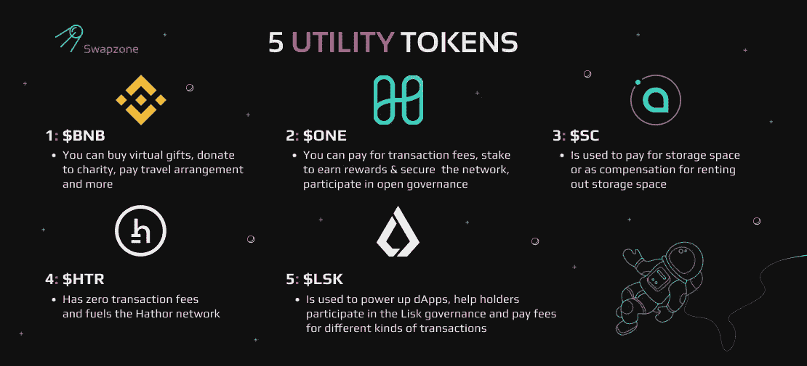
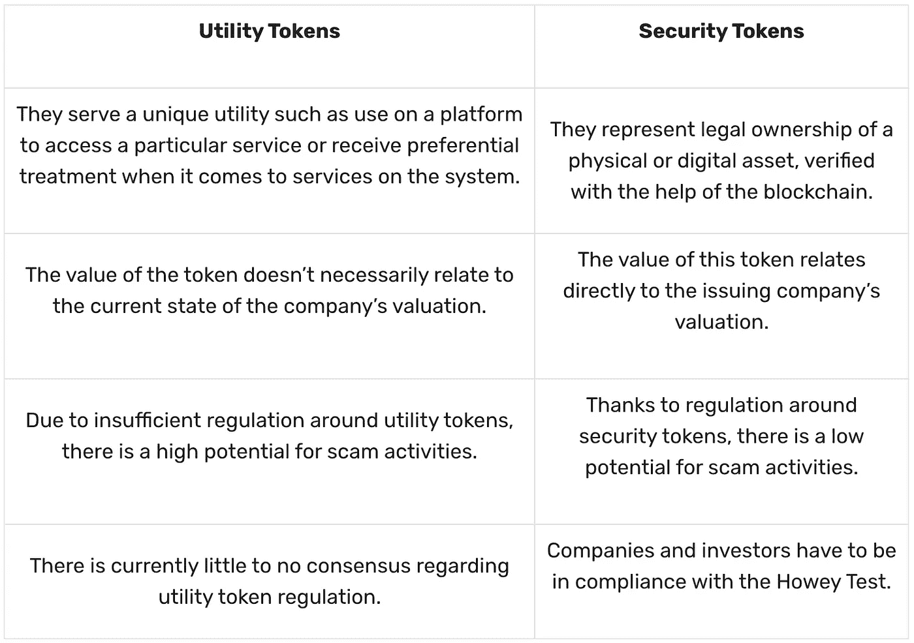
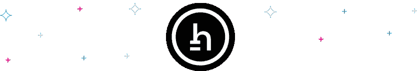

# 如此多样的加密实用程序:概述 5 个实用程序令牌

> 原文：<https://medium.com/coinmonks/such-a-diverse-crypto-utility-overviewing-5-utility-tokens-6543ade6e878?source=collection_archive---------30----------------------->

大多数人都不知道，术语加密货币是一个笼统的词，用于描述所有类型的数字资产。在现实中，加密货币实际上有几种类型。其中大多数属于两个不同的类别；硬币或代币。代币是一种完全不同的加密货币。这就是为什么他们有两个子类别；实用令牌和安全令牌。安全或实用令牌是什么意思&它们之间有什么区别？这里有一个实用令牌的列表，以及你需要知道的关于它们的一切。

# 什么是实用程序令牌？

公用设施令牌是一种加密货币令牌，服务于特定生态系统中的特定用例。因此，它允许用户在某个网络上或网络内执行特定的操作。因此，实用程序令牌不可挖掘。通常情况下，它是预先开采的，一次创建，并以项目背后的团队选择的方式分发。因此，它们不是原始意义上的投资。

大多数情况下，实用程序令牌资助加密项目的开发。随后，它可以用来购买发行者提供的商品或服务。它还可以为其所属的生态系统提供特定的效用。例如，它可以向持有者提供访问或访问网络的权利。例如，AXS 代币允许玩家玩 Axie Infinity 游戏。

此外，公用设施代币可用于提供奖励和忠诚度优惠。通过持有或下注某种公用代币，用户可以赢得更多代币。此外，一些实用令牌甚至为用户提供投票或治理权。根据持有的令牌数量，人们可以投票决定网络下一步可以进行哪些项目或升级。

# 实用令牌与安全令牌

如果公用事业和安全令牌的价格在市场内上涨，它们的价值都会增加。因此，它们既可以赚取用户的利润，也可以赚取持有者的利润，这使得人们区分它们有点挑战性。为此，SEC 创建了 Howey 测试，使人们能够将令牌分类为安全令牌或实用令牌。

也就是说，下面是实用令牌和安全令牌之间的一些主要区别。

# 实用工具令牌列表

有许多加密货币项目利用了公用令牌。下面是一个流行的实用令牌密码列表。它们包括:

# 实用令牌列表:币安令牌

[币安代币](https://www.binance.com/en)，俗称 [BNB](https://swapzone.io/currencies/binance-coin) ，是币安的公用事业代币，最初是为了 2017 年的交易费打折。然而，今天，BNB 用例已经发展到其他应用程序，如:购买虚拟礼物，捐赠给慈善机构，进行信用卡支付，支付旅行安排，等等。

# 实用令牌列表:和谐令牌

[和谐令牌](https://www.harmony.one/)是和谐的本地公用令牌，支持整个和谐生态系统的货币流通。一个令牌有几个用途，包括:支付交易费用、下注赢取奖励、保护网络安全以及参与开放治理。

# 实用令牌列表:Siacoin

Siacoin 或 SC，是 Sia 的原生令牌，分别用作平台上租户和主机的支付和奖励。Sia 平台使任何人都可以将他们未使用的硬盘空间出租给那些寻找文件存储的人。因此，Siacoin 用于支付存储空间或作为出租存储空间的补偿。

# 实用代币清单:哈索尔硬币

[哈索尔币](https://hathor.network/)是哈索尔的原生效用令牌。它的缩写是 HTR，有无限的供应。它也没有交易费用，这也是 Hathor 网络的动力所在。HTR 目前在 CoinMarketCap 上的排名是第 344 位，市值为 12，753，568 美元，提供了 227，259，896 个 HTR 代币。

# 实用代币清单:利斯克硬币

[Lisk coin](https://lisk.com/) ，又名 LSK，是驱动 Lisk 生态系统的代币。因为它是一个实用令牌，它的主要功能是为在 [Lisk 平台](https://swapzone.io/blog/lisk-lsk)上的不同种类的交易支付费用。此外，LSK 还用于为 dApps 提供动力，并帮助持有者参与 Lisk 的治理。

# 实用令牌交换:在哪里和如何交换？

如果你想知道在哪里可以得到一些公用设施代币，我们建议你试试 [Swapzone](https://swapzone.io/) 。这是市场上最好的实用令牌交换，有一个初学者友好的界面。此外，整个交换过程相当简单。只需前往 Swapzone 并遵循以下说明:

1.  在主页上，找到 ***【选择配对】*** 页签。在 ***“发送”*** 部分，选择您希望交换成实用程序令牌的加密类型。请确保您也指定了金额。
2.  在 ***“到达”*** 部分，选择您希望接收的实用程序令牌。
3.  Swapzone 将自动为您提供来自其合作伙伴的不同汇率报价。您会注意到有一个选项可以过滤掉结果。慢慢来，做出正确的选择。
4.  一旦你找到你想要的报价，只需点击它，然后点击 ***【交换】*** 。这将触发一个新窗口打开，要求您填写一些细节，如您的电子邮件地址和钱包，以防退款。
5.  填写完这些信息后，只需点击 ***【进行交易】*** 即可开始交易。
6.  您选择的 Swapzone 合作伙伴将收到交易提醒，并开始为您交换加密货币。可能会有一点延迟。这很正常。在交易完成时要有耐心。
7.  完成后，您将在您的钱包地址收到您的实用工具代币。此时，请花点时间对交换伙伴进行评价。就是这样！

> 加入 Coinmonks [电报频道](https://t.me/coincodecap)和 [Youtube 频道](https://www.youtube.com/c/coinmonks/videos)了解加密交易和投资

# 另外，阅读

*   [Bookmap 评论](https://coincodecap.com/bookmap-review-2021-best-trading-software) | [美国 5 大最佳加密交易所](https://coincodecap.com/crypto-exchange-usa)
*   [加密交易机器人](/coinmonks/crypto-trading-bot-c2ffce8acb2a) | [造币评论](https://coincodecap.com/coingate-review)
*   最佳加密[硬件钱包](/coinmonks/hardware-wallets-dfa1211730c6) | [Bitbns 评论](/coinmonks/bitbns-review-38256a07e161)
*   [新加坡十大最佳加密交易所](https://coincodecap.com/crypto-exchange-in-singapore) | [收购 AXS](https://coincodecap.com/buy-axs-token)
*   [红狗赌场评论](https://coincodecap.com/red-dog-casino-review) | [Swyftx 评论](https://coincodecap.com/swyftx-review)
*   [投资印度的最佳密码](https://coincodecap.com/best-crypto-to-invest-in-india-in-2021)|[WazirX P2P](https://coincodecap.com/wazirx-p2p)|[Hi Dollar Review](https://coincodecap.com/hi-dollar-review)