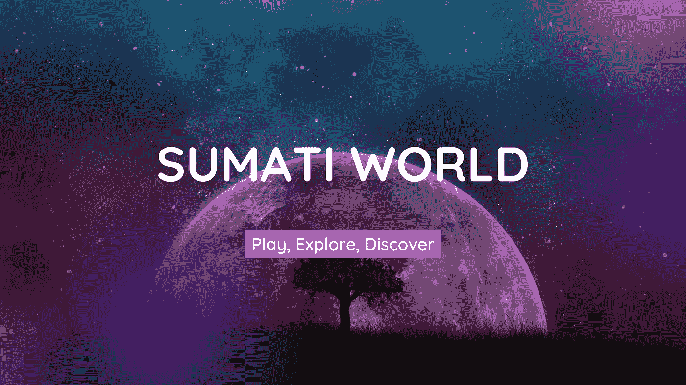
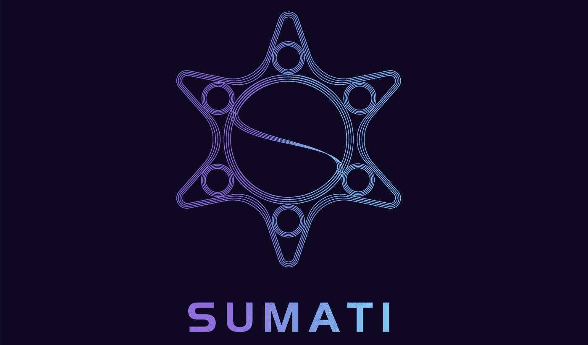
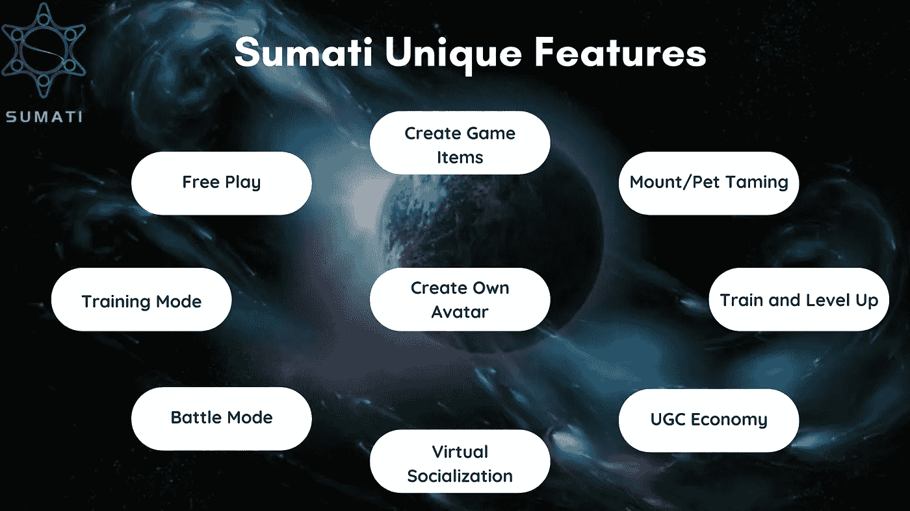

# 苏马蒂世界:一款 3D 开放世界区块链游戏

> 原文：<https://medium.com/coinmonks/sumati-world-a-3d-open-world-blockchain-game-daca9e4fb4e1?source=collection_archive---------40----------------------->

游戏业务无疑是当今科技行业最重要和最具创新性的领域之一。它在文化、社交网络和娱乐方面的重要性是不可否认的。游戏目前正在为全球超过 30 亿人提供最具沉浸感和最令人敬畏的娱乐类型之一。

在 20 世纪 70 年代和 80 年代，当他们在地下室摆弄乒乓操纵杆，与朋友争夺吃豆人的最高分时，没有人能预测到游戏业会变成什么样。一夜之间，这些简单的游戏将成为今天游戏产业的基石和一种文化现象。

今天的游戏业务已经突破了 3000 亿美元大关，并且还在继续拓展科技和娱乐的边界。我们不仅不断推出新的游戏机、电脑和设备，让我们沉浸在游戏中，而且我们还能够通过 Twitch 等流媒体网站观看世界上一些最优秀的游戏玩家参与电子竞技和在线游戏。

然后，区块链技术的出现引发了科技行业发生的重大变化，导致区块链和加密货币以及 NFT 行业成为自互联网诞生以来发展最快的科技行业。

NFTs 催生了“玩即赚”游戏(GameFi)，是这项极具革命性的技术的一个应用案例。一种相对较新的游戏类型，玩家可以通过游戏赚取、交易和拥有游戏中的物品以及加密货币代币。加密货币促进了游戏到收入模式的“收入”部分，而数字环境中的“资产所有权”则由非功能性交易促进。这些区块链技术的结合产生了一个真正创新的游戏方向。

GameFi 1.0 由包括卡牌游戏、农场游戏、口袋妖怪游戏在内的游戏类型组成，可玩性低，扩展能力低，经济模式简单，缺乏游戏性。GameFi 2.0 的诞生就是为了解决这个问题。GameFi 2.0 预计将有更精彩的游戏，更好的经济模式，将 DAO(去中心化自治组织)引入 GameFi 行业，并打破游戏之间的壁垒，建立元宇宙生态，以增强各种游戏平台之间的互操作性。

其中一个将导致 GameFi 2.0 诞生的游戏是 **Sumati World** ，这是一个创新的游戏产品，甚至在游戏类别中也是如此。

苏马蒂世界是一款结合了 **SLG** (模拟游戏)**【ARPG】**(动作角色扮演游戏) **DeFi** (去中心化财务)**社交功能**的 3D 开放世界区块链游戏。作为一款开放世界的游戏，Sumati World 为玩家提供了更好的可玩性高的游戏性。

Sumati World 由 UE 运营，作为游戏开发的框架，尽可能地复制现实，为玩家提供身临其境的体验。

为了创建一个更好的经济模型，Sumati World 使用了两种令牌来构建他们的整个政治经济生态系统: **ERC20/BEP20** 协议令牌作为货币使用； **ERC998/BEP998** 、 **ERC1155/BEP1155** 和**ERC 721/BEP 721**NFT 协议用于维持生态系统中所有类型的资产。

同样在苏马蒂世界，玩家可以享受极大的自由。有了 Sumati World，玩家可以做以下事情:

*   创建和个性化他们的超自然化身。
*   虚拟社交。
*   驯服稀有生物成为坐骑。
*   创建游戏物品
*   训练他们的头像，提升属性。
*   与其他玩家对战。
*   作为公会的一部分，设计和建造世界上的土地。
*   利用苏马蒂世界的舍利 NFT 和许多其他奇妙的东西从采矿中获得被动收入。

综上所述，我非常期待当 Sumati 世界游戏正式发布时，它会在 GameFi 世界掀起一场风暴。期待更多关于苏马蒂世界的详细文章。

如需更多信息和更新，请关注以下官方手柄上的 Sumati World:

🔶[网站](https://sumati.world/#/)🔶[推特](https://twitter.com/SumatiSpace)🔶[电报](https://t.me/metasumati)🔶[不和](https://discord.gg/sumatiworld)🔶 [YouTube](https://www.youtube.com/channel/UCo2hXXzr3Flhk5wNA50xF4Q) 🔶[中等](/@metasumati)

> 加入 Coinmonks [电报频道](https://t.me/coincodecap)和 [Youtube 频道](https://www.youtube.com/c/coinmonks/videos)了解加密交易和投资

# 另外，阅读

*   [币安 vs FTX](https://coincodecap.com/binance-vs-ftx) | [最佳(索尔)索拉纳钱包](https://coincodecap.com/solana-wallets)
*   [比诺莫评论](https://coincodecap.com/binomo-review) | [斯多葛派 vs 3Commas vs TradeSanta](https://coincodecap.com/stoic-vs-3commas-vs-tradesanta)
*   【Capital.com】|[港加密借贷平台](https://coincodecap.com/crypto-lending-hong-kong)
*   [如何在 Uniswap 上交换加密？](https://coincodecap.com/swap-crypto-on-uniswap) | [A-Ads 评论](https://coincodecap.com/a-ads-review)
*   [WazirX vs CoinDCX vs bit bns](/coinmonks/wazirx-vs-coindcx-vs-bitbns-149f4f19a2f1)|[block fi vs coin loan vs Nexo](/coinmonks/blockfi-vs-coinloan-vs-nexo-cb624635230d)