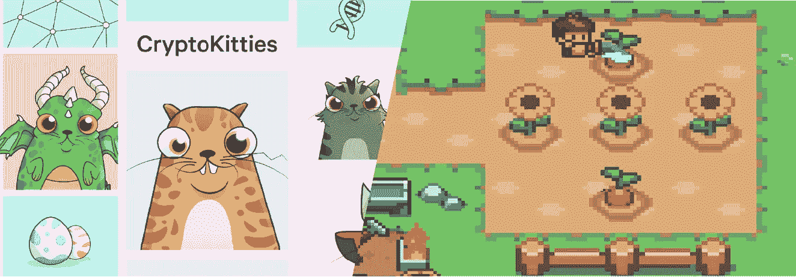
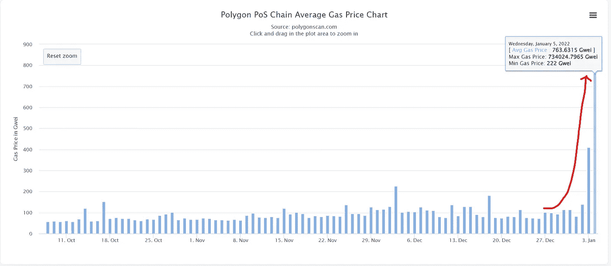
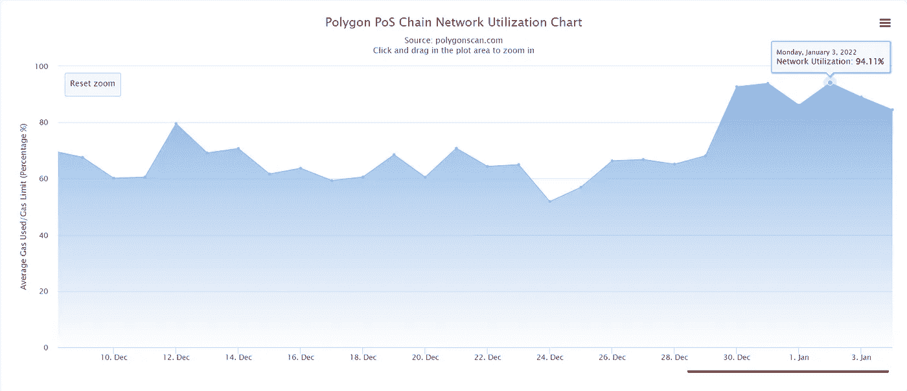
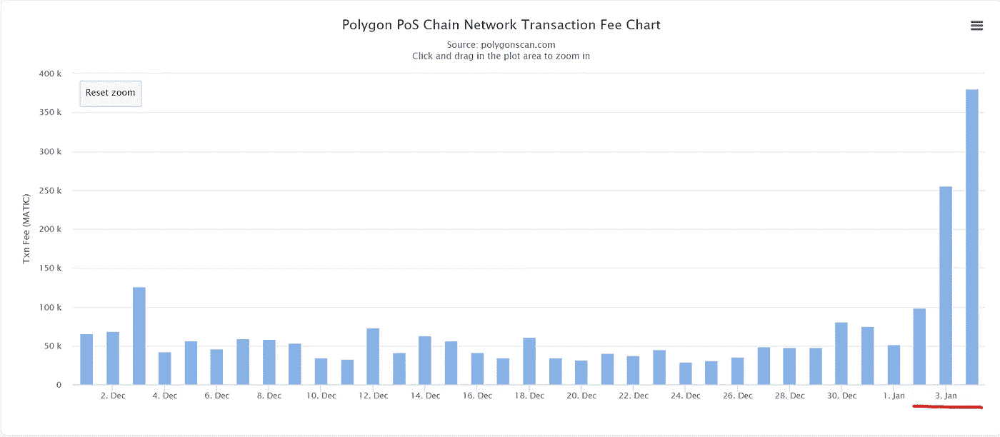
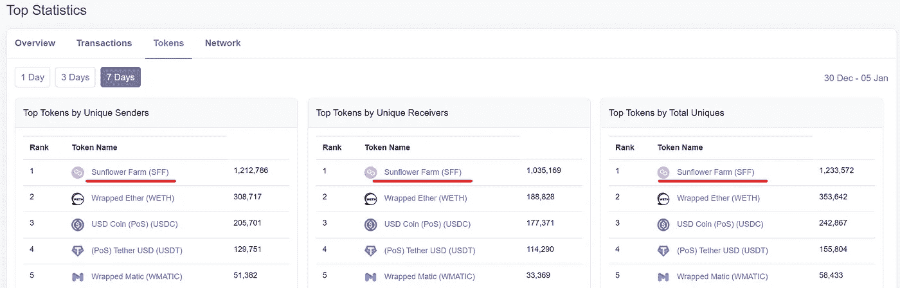
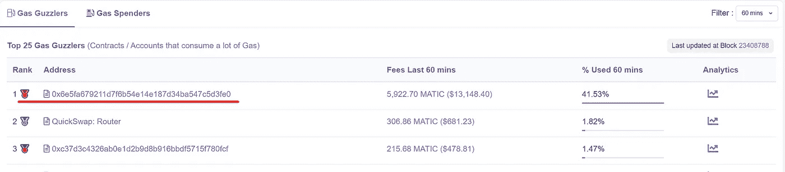
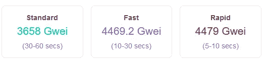
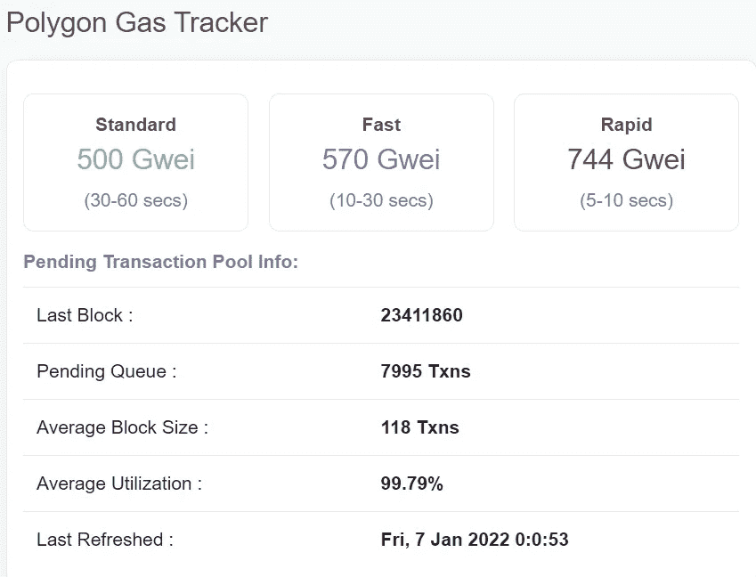
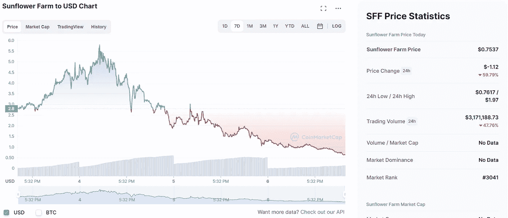

# 向日葵农民:多边形的密码猫时刻？

> 原文：<https://medium.com/coinmonks/sunflower-farmers-polygons-cryptokitties-moment-7b47081d1538?source=collection_archive---------9----------------------->

## 似曾相识

# 发生了什么事？

[向日葵农民](https://sunflower-farmers.com/)，一款在 polygon 网络上运行的从玩到赚游戏，在过去几天造成了空前的网络拥堵。在游戏中，玩家建造并种植他们的农场以赚取游戏中的 ERC20 代币。大多数农民通过种植和收割来赚取向日葵代币。然后玩家可以使用这些 [SFF 代币](https://coinmarketcap.com/currencies/sunflower-farm/)和收集的资源开始[制作](https://docs.sunflower-farmers.com/crafting-guide)工具，并使用它们收集更多的资源，如木材、黄金等。这些资源也可以用来铸造游戏中的 NFT。向日葵农民中有 3 个主要项目:

*   工具—用于收集资源(ERC20)
*   资源——工艺中使用的原材料(ERC20)
*   NFTs——用于装饰和/或高级农业的独特有限物品(作为 ERC721 令牌发放)

所有这些物品都可以在玩家之间或者公开的交易所进行交易和交换。可以从他们的[白皮书](https://docs.sunflower-farmers.com/tokenomics)中读到更多关于这个主题的内容。这款游戏在过去的两周内爆炸式增长，多边形网络的油费增加了 10 倍以上。参考下面来自 polygonscan 网站的统计数据。

**Gas price has increased from 60–70 Gwei to 750 Gwei over the course of past few days, a 10x increase**

**Network utilization at over 90%**

**Txn fee increased more than 7x from 50k Matic on 1 Jan to almost 400k Matic on 4 Jan**

# **这是什么原因造成的？**

根据向日葵农民网站:

> 该游戏有一个内置的供求机制，奖励那些早到游戏中并推动稀缺的农民。没有 ICO 或奖金，赚取代币的唯一方法是种植作物或在交易所购买。

根据他们的记号组学:

> 当在游戏中赢得奖励时，玩家将获得基本的 ERC20 代币。随着越来越多的人务农，总供应量增加，回报也会减少。这意味着与未来的人相比，早期玩游戏的人收获向日葵将获得更高的奖励。你越早开始耕种，随着供应量的增加，你得到的回报就越多。

所以可以理解为什么人们都涌向这个游戏。你参加聚会越早，得到的奖励就越多。

要深入分析为什么会发生这种情况，请阅读 [r/0xPolygon](https://www.reddit.com/r/0xPolygon/) subreddit 上这篇令人惊叹的 [reddit 帖子](https://www.reddit.com/r/0xPolygon/comments/rwntst/explainer_howwhy_sff_has_brought_the_polygon/)。我在这里简单总结一下。

玩家不是随着时间的推移获得奖励，而是每次点击获得奖励。点击越快，进步越快。你知道什么比人类更快吗？机器人。他们从不休息。游戏的设计也是这样的，每一个农场的每一个动作都必须在链上验证，每一次保存。这意味着大量的交易。

当每个人都试图在其他人之前登记他们的交易时，汽油费飙升。机器人希望领先用户，最大化他们的“每秒点击量”，并确保他们的点击量首先被计算在内。这导致他们集体提高天然气价格——这导致天然气定价的网络底价上升。随着越来越多的机器人参与到游戏中，汽油价格不断上涨。有点恶性循环。

这可以从下面的[统计数据](https://polygonscan.com/topstat#Token)中反映出来。

**Polygon** [**Top Stats**](https://polygonscan.com/topstat#Token)

**Gas guzzler**: The game is using more than **40% of the gas** over a 1 hour period. Quickswap is second with just 1.8%.

这导致普通用户由于高额的燃气费而无法在 polygon 网络上进行交易。

# **什么是正常？**

50-70 Gwei 的燃气费是正常的。不正常的是:

Not normal!

At the time of writing this article ([Source](https://polygonscan.com/gastracker))

# **神秘小猫——历史重演**

对于那些不熟悉 crypto world 的人来说，CryptoKitties 是一款区块链游戏，它在 2017 年 12 月让以太坊屈服(时间框架惊人地相似)。问题是完全一样的——一个让网络拥堵到汽油费爆炸的游戏。但这是第 1 层区块链，每个人都知道可伸缩性根本不是它擅长的东西。在此之后，人们意识到，如果一个游戏可以搞垮以太坊(全新行业未来的承诺链)，那就真的有问题了。于是开始了使用 Eth 2.0 和扩展解决方案来扩展以太坊的旅程。

切到现在。 [Polygon](https://polygon.technology/) 是以太坊缩放解决方案的保护伞。它包括 Polygon plasma、独立侧链、Polygon POS、乐观汇总和 ZK 汇总。简而言之，他们武装到了牙齿。

但是这不应该发生在多边形网络上。毕竟，他们是 L1 缩放问题的解决方案。因此，很自然地，问题出现了:如果 L2 扩展解决方案本身开始变得拥挤，会发生什么？它们的建立是为了解决 L1 面临的这个问题。我们现在需要《L2》的 L3 缩放吗？

# **多边形社区的反应**

它基本上分为两部分。

一方认为是**游戏和它的开发者错在了**。如果他们优化了游戏，许多不必要的交易就可以避免，所有这些惨败也是如此。该游戏被比作多边形网络上的 DDoS 类型攻击。有人建议取消游戏。(这违背了权力下放的本质，审查制度让你想起什么了吗？)

另一方认为是多边形网络本身的 T2 问题。由于 polygon 将自己定位为以太坊扩展的最终解决方案，它应该能够处理这样的活动。毕竟，如果一个游戏就能让你的网络瘫痪，你就不能称自己是以太坊的扩展解决方案。此外，删除这个游戏不是解决办法，因为它是开源的，任何人都可以复制它，并在网络上再次部署他们自己的版本。那么这将成为一个审查问题。如果去掉游戏，网络本质上就不再是去中心化的了。

# **我的看法**

我主要支持第二种观点。第一个论点把矛头指向了这个项目。在理想的情况下，所有的项目都将得到完美的优化，并与网络和谐相处。但世界远非理想，网络需要强大，并准备好应对这种不确定性。将来，可能会有几十个这样的项目启动，网络需要准备好容纳所有这些项目而不会中断。网络需要有弹性。所以，我认为这是 Polygon 团队解决这些问题的一个很好的机会。这是一个令人大开眼界的东西，就像 CryptoKitties 在 2017 年用于以太坊一样。

但我也认为，游戏开发者应该尽可能地优化游戏，因为他们也会受到游戏带来的负面影响和网络拥堵的伤害。毕竟，你不会恩将仇报。

# 这个传奇将如何结束

回到 u/lleti 在 reddit 上发布的这篇[精彩分析](https://www.reddit.com/r/0xPolygon/comments/rwntst/explainer_howwhy_sff_has_brought_the_polygon/)，我转述如下:

> SFF 游戏设计/开发只有在代币价值超过汽油价格并保持流动性的情况下才是可持续的。

一旦油费超过了获得的回报，机器人就没有动力继续玩这个游戏了。

> 像这样的系统被设计成需要以指数速度持续增长——简而言之，这是不可能的。随着利润的下降，gwei 将被机器人减少，只提交有利可图的交易。一旦他们的 gwei 下降，用户的底线也会下降。我们继续减速，直到它回到正常水平，机器人被完全关闭，因为它们不再有利可图。最有可能的结局是 SFF 的股票大规模崩盘。

**The token is already down 60% over the past 24 hours**

随着大家开始套现，代币跌得更厉害。随着令牌下降，农业奖励等同于更少的价值。因此，保持高油价的动机也降低了。希望这是一个良性循环，让网络恢复正常。

# 未来展望

这一惨败让很多多边形支持者非常愤怒。他们中的一些人准备放弃这个项目，转向其他解决方案。但是我不敢苟同。这是一个改进的机会，Polygon 团队能够很好地处理这个问题。他们不叫 ***瑞士军刀的伸缩方案*** 一点用都没有。Polygon 团队正忙于收购其他惊人的项目来证明自己的未来，并保持其与以太坊的区块链互联网愿景一致。

在最近的一次行动中，他们[以 4 亿美元收购了 Mir protocol](https://blog.polygon.technology/polygon-takes-a-major-lead-in-zk-rollups-welcomes-mir-a-groundbreaking-zk-startup-in-a-400m-deal/) ，这是一个 ZK rollup 专注的扩展解决方案。他们还承诺投资 10 亿美元用于零知识技术的开发。对于那些不熟悉缩放解决方案的人来说，ZK 理工大学被认为是以太坊缩放的圣杯。所以从中长期来看，我看好多边形。但在另一篇文章中会有更多。你对此有什么想法？如果你想知道更多关于密码世界的事情，请关注我，在下面评论你想知道的。

# **免责声明**

我持有 Matic 令牌(因此可能有点偏颇😬).本文不是理财建议。我与提到的任何项目都没有关系，我以个人身份写这篇文章。

> 加入 Coinmonks [电报频道](https://t.me/coincodecap)和 [Youtube 频道](https://www.youtube.com/c/coinmonks/videos)了解加密交易和投资

## 另外，阅读

*   [盈利农民回顾](https://blog.coincodecap.com/profitfarmers-review) | [如何使用康沃尔交易机器人](https://blog.coincodecap.com/cornix-trading-bot)
*   [10 大最佳隐币博客](https://blog.coincodecap.com/best-cryptocurrency-blogs) | [有奖点评](https://blog.coincodecap.com/youhodler-review)
*   [my instance Review](https://blog.coincodecap.com/myconstant-review)|[8 款最佳摇摆交易机器人](https://blog.coincodecap.com/best-swing-trading-bots)
*   [MXC 交易所评论](/coinmonks/mxc-exchange-review-3af0ec1cba8c) | [Pionex 诉币安](https://blog.coincodecap.com/pionex-vs-binance) | [Pionex 套利机器人](https://blog.coincodecap.com/pionex-arbitrage-bot)
*   [我的加密副本交易经验](/coinmonks/my-experience-with-crypto-copy-trading-d6feb2ce3ac5) | [比特币基地评论](/coinmonks/coinbase-review-6ef4e0f56064)
*   [CoinFLEX 点评](https://blog.coincodecap.com/coinflex-review) | [AEX 交易所点评](https://blog.coincodecap.com/aex-exchange-review) | [UPbit 点评](https://blog.coincodecap.com/upbit-review)
*   [上行保证金交易](https://blog.coincodecap.com/ascendex-margin-trading)|[Bitfinex Staking](https://blog.coincodecap.com/bitfinex-staking)|[bitFlyer Review](https://blog.coincodecap.com/bitflyer-review)