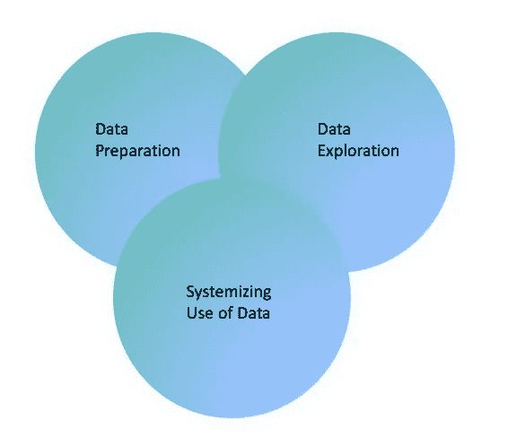

# 数据管理平台的日落:当务之急是系统化数据的使用

> 原文：<https://medium.com/coinmonks/sunset-of-data-management-platform-the-need-of-the-hour-is-to-systemize-the-use-of-data-2d834bf76a63?source=collection_archive---------11----------------------->

Missing links in DMP

客户 360 是数据管理平台或 DMP 的代名词。DMP 是 MarTech 和 AdTech 之间的纽带。没错，我对 DMP 使用“was ”,因为我们正在稳步过渡到客户数据平台。该行业就像对待 DMP 一样渴望采用 CDP。在我们开始之前，让我们试着多了解一点 DMP，数据管理是一个统一的平台，用于收集、组织和激活来自任何来源的第一、第二和第三方受众数据，以收集和统一为关键词。

我们经常感到困惑，认为数据收集就是数据准备的同义词。

“数据收集”不等于“数据准备”

我们再次混淆了数据收集和“数据准备”。我们有没有可能在 CDP 问题上重蹈 DMP 的覆辙？

**“数据准备”可复制配方与 DMP 一起丢失，CDP 呢？**

有些人可能同意，有些人可能不同意，但 DMP 不是为了数据准备；相反，它们是一个数据收集平台。数据准备与数据收集有何不同？教科书对数据准备的定义是收集、清理数据并将其整合到单个文件或数据表中的过程。

为什么数据准备如此重要，它提供了什么价值？让我们更深入地了解一下关键的竞争优势是什么。

**1。数据的转换**:数据准备的一个阶段是数据收集。数据准备是数据管理生命周期中的一个重要阶段，位于分析之前。它使我们能够将原始数据转换成有用的信息，这使我们能够跨多个其他系统共享见解。

**2。数据发现**:数据收集让我们从各种来源收集信息，而数据准备让我们发现信息。有些人会不同意，但数据管理平台涉及数据发现的各个方面，但不是真正的数据发现平台。数据准备能够识别无序数据，并使用第一个核心特征将该数据转换为有序数据。

**3。质量控制** : DMP 严重依赖其他来源系统提供优质数据，这意味着你的营销计划的有效性取决于输入 DMP 的数据的有效性。

a)我们将只接收元宇宙中的结构化数据，还是也会接收非结构化数据？

b)纠正数据错误的能力？在任何宇宙中，数据都不可能没有异常。

数据准备通过过滤和纠正数据异常来提高数据质量。

客户数据平台(CDP)怎么样？它不是也有能力收集数据而不是准备数据吗？

如果我们将 CDP 视为营销解决方案的单一数据平台，我认为了解它将如何提高数据质量以及它将提供哪些数据发现功能来激活有意义的对话至关重要。

DMP 在“数据探索”上过于宽容，但 CDP 不也是如此吗？

“数据探索”一词含义广泛，但对决策至关重要。但是，当涉及到长相相似的模特或数字双胞胎时，DMP 怎么能在“数据探索”方面太软弱或太宽容呢？答案在时机；数据转换前后的数据探索输出会有很大的不同。

1.数据管理平台从转换的数据中探索数据。

在被称为“数据挖掘”的数据探索的关键阶段，DMP 的能力非常有限识别数据集的特征对于扩展数据探索的选项是重要的。在变量被确定为数据集或特征的一部分之前，必须调查它们的经验关系。这产生了关于数据趋势的见解，可用于减少数据不匹配，这在 DMPs 中是常见的。

**CDP 怎么样？是否配备了强大的数据挖掘能力进行多元分析？**

如果答案是否定的，考虑一下这条道路与 DMP 有何不同。

**DMP 未能将数据的使用系统化。**

我们当然未能将 DMP 的数据使用系统化，它最终成为了 MarTech 和 AdTech 之间的纽带。但是为什么会这样呢？

重点是两个关键词:“内置集成”和“连接器”

**集成或连接器:**我们相信，如果平台具有更好的集成能力或更多的内置连接器，他们会相信它会自动解决问题。拥有大量的连接器是有益的，但更重要的是将数据使用系统化。

1.重点是获取数据，而不是它如何有助于从现有数据集产生更多价值。

2.我们没有强调系统化的重要性，没有强调不同的组织如何采用 DMP，也没有强调如何简化流程以更好地利用数据。

3.我们没有强调 DMP 如何与 Slack 等协作平台无缝通信，以提高数据质量、数据发现，当然还有数据探索。

系统化将带来简化的数据自动化、洞察力共享、更高的敏捷性和时间节约，尤其是在 MarTech 和 AdTech 领域。

当然，还有其他重要因素导致了数据管理平台的消亡。

1.第三方 Cookie，不适用于第一方 Cookie。

2.昂贵的数据读写操作

3.它总是投机的。

最重要的因素是缺乏对第一方数据的探索。

我相信行业已经从错误中吸取了教训，我们现在强调第一方数据客户数据平台，但当我看到客户数据平台讲台上缺少数据准备、数据探索和系统化数据使用时，我感到担忧。这些是将数据转化为可操作见解的重要组成部分。如果没有这些元素，我相信您会看到与使用 DMP 生成的输出相同的输出，这更令人担忧。

我已经发表了我对 DMP 的看法和对 CDP 的担忧；请随时与 DMP 分享你的想法和经验。

> 交易新手？试试[加密交易机器人](/coinmonks/crypto-trading-bot-c2ffce8acb2a)或者[复制交易](/coinmonks/top-10-crypto-copy-trading-platforms-for-beginners-d0c37c7d698c)