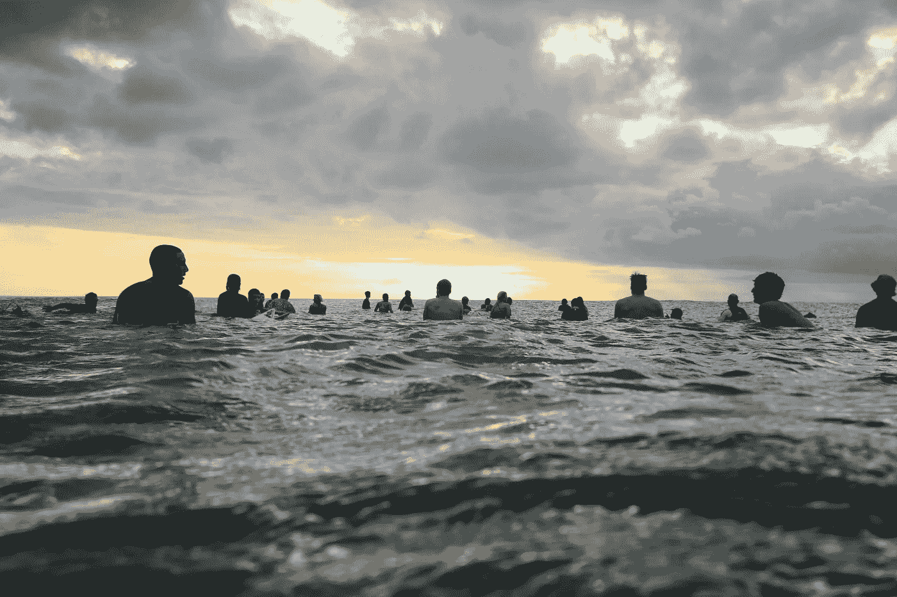
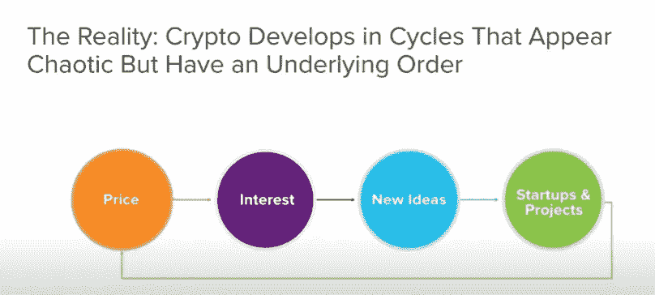
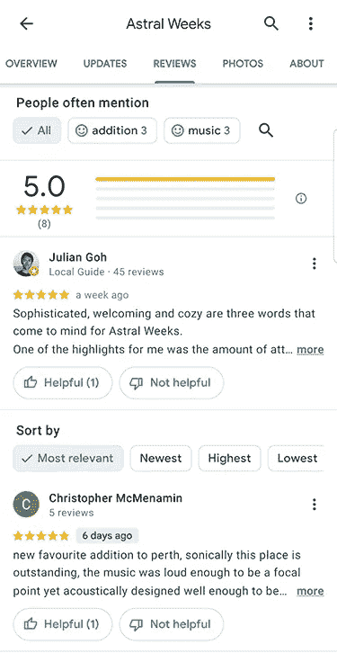
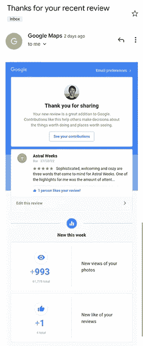

# 超局部

> 原文：<https://medium.com/coinmonks/superlocal-38bb324e3db3?source=collection_archive---------33----------------------->

## 2022 年 3 月 11 日

## 什么是哈希，涉足 Web3 和不断发展的社交网络

[Photo by Jeremy Bishop on Unsplash](https://unsplash.com/photos/wF5qPDY_zFA)

这是我个人探索加密前沿的继续，从上一次探索中拾起对“钱是什么？”这个问题的思考。

我早在 2021 年 12 月就写了那篇博客，这是对之前试图通过研究“文学”来掌握区块链的基本机制的冒险的反思，事实证明，这些“文学”是惊人的开源和广泛可用的。这源于一种挫折感，即听到很多关于“区块链”和“加密货币”的说法，但不知道人们实际上指的是什么。

一开始，“区块链”是一个令人生畏的[黑箱](https://en.wikipedia.org/wiki/Black_box)，来源白皮书只是为了加强这一点(参考:[比特币白皮书](https://bitcoin.org/bitcoin.pdf))。

密码学，双重花费，点对点，密钥，验证，工作证明，区块，节点，激励机制，Merkle 树，公共分类帐，51%攻击。这是什么？

然而，隧道的尽头有一丝曙光。大约在写博客的同时，我参加了一些由珀斯技术社区举办的专门围绕区块链技术的面对面聚会。有一个具体的例子激发了我的灵感:在一次活动中，一位专家小组成员分享了她的一个副业项目，她在过去的 4-5 年里一直在积极构建区块链解决方案。她坦率地谈到了在区块链之间转移一个不可替代的象征(NFT)所涉及的许多错综复杂的考验和磨难。虽然我无法回忆起更多的具体细节，但仍然提醒我们，鉴于变化的速度之快，即使对于一个精通领域的专家来说，这些空间也是非常棘手的。

所以我问自己，“如果他们还在试图解决这个问题，*为什么我不能*？”

正如在之前的博客中所分享的，与直接阅读白皮书相比，这些资源对于理解区块链来说更容易获得——这一步需要一定程度的先决知识。

*   Nakamoto.com——Haseeb Qureshi 的[加密货币简介](https://nakamoto.com/introduction-to-cryptocurrency/)
*   a16z Crypto Startup School——由一群巨头制作的 14 个视频系列，我最喜欢的是斯坦福大学教授丹·博纳(Dan Boneh)的《区块链原语:密码学和共识》(block chain primitive:Cryptography and Consensus)。我一直很钦佩那些能够将极其复杂的主题浓缩成易于理解的对话片段的人，Boneh 也不例外。

从那以后，随着对基础知识的掌握，我的注意力转移到了区块链相关“应用”的广阔领域，主要围绕以下领域:

*   通过 Twitter 管理每日加密新闻
*   NFT 项目和它们周围的社区
*   加密货币钱包安全性
*   作为上述工作的一部分，监控比特币(BTC) /以太坊(ETH)的价格走势

## 迈出第一步

尽管可以接触到大量的开源文献，接触到这个领域中最伟大的建设者、创造者和思想家的思想，但还是会有一点……太可怕了？

但是，有什么损失呢？

在“[web 3](https://future.a16z.com/why-web3-matters/)”虚拟社区中似乎有一句格言，大意是:“要最好地了解这个空间，就一头扎进去，开始行动。”

到目前为止，这与我在这个领域尝试自我教育的经历非常吻合。从一开始作为一个局外人的角度来看，一切看起来都很混乱(*因为是*)，并且因为有大量的东西需要了解而感到害怕，但是这个障碍是最重要的一个需要克服的。

我认为可以进一步阐明这一点的类比是这样的:

想象一下，站在一片开阔的蓝色海洋的边缘。阳光明媚，你可以看到一大群人已经在水里游来游去，有些人在做他们自己的事，但许多人在相互交流，玩得更开心。一段时间后，你还会注意到水实际上并不那么温和或友好。海浪越来越高，波涛汹涌，但水中的每个人都管理得很好，做着他们需要做的事情来保持漂浮。在这个时刻，你有两个选择:继续做一个局外人，或者和其他人一起尝试乘风破浪。

这两种选择之间有着巨大的经验差异。毕竟，通过观察和询问人们在水中的经历，人们能学到的东西是有限的。

到目前为止，我的个人经历大致如下:

1.  开始关注并听到人们谈论比特币和以太坊的价格走势——2020 年末至 2021 年 3 月

感觉就像是我已经*很晚很晚*才开始游戏。BTC 于 2009 年发布，瑞士联邦理工学院于 2015 年发布。迟做总比不做好，我安慰自己…

在克里斯·迪克森(Chris Dixon)关于“密码网络及其重要性”的演讲中，他用了一个简单但有效的类比来描述密码的发展周期——这个类比表明，价格行为是激发外界对该技术兴趣的根源，然后他们会在该领域建立初创公司和项目。

Chris Dixon (2020)

2.从 2021 年 4 月起，开始涉足托管交易所，用现金交易 BTC 和联邦医疗保险的名义金额

是的，回顾价格历史，在最初的飙升之后，我就开始购买*。2020 年 12 月，BTC 约为 26-32K 澳元，联邦医疗保险约为 1.1 千澳元。截至 4 月，这一数字约为 2 倍。尽管如此…*

3.通过关注有趣的人并每天保持更新，开始在推特上变得更加活跃，最终在 2021 年 12 月跌跌撞撞地进入了“加密推特”世界

4.开始挖掘 NFT 炒作的表面之下，寻找有趣的项目和社区——2022 年 2 月

5.创造了一个[元面具](https://metamask.io/)热钱包，经历了我的第一个 NFT 交易数字货币的神奇过程——2022 年 2 月

6.通过“不和”频道加入 NFT 社区，被动地参加 Web3 / NFT 特定的炉边对话——当前

## 进入超级焦点——它不在于底层技术，而在于您可以使用它做什么

你以前使用过谷歌地图吗？如果没有，您可能已经使用了某种类似于地图的应用程序来解决一些问题。

a)您要去哪里+导航到目的地

b)如果地点不熟悉(很可能)，根据别人留下的评论来评估你要去的地方是否值得你花时间

c)成功到达最终目的地

评论是地图生态系统的重要组成部分，因为它直接服务于“发现”功能，允许用户探索可见的地标，并自行决定是否访问这些位置。

我越深入研究这个问题，就越意识到，尽管评论可能很重要，但这个系统完全依赖于热情的用户自愿加入，并愿意分享他们对某个地方的看法(积极的或消极的)。

这就是在谷歌地图上留下评论的过程。

1.  寻找地标(可以是餐馆、咖啡馆、博物馆等)

2.选择留下评论(简短的文字描述加上照片)

3.评论发表

4.谷歌会给你发一封“谢谢”电子邮件，感谢你评论的浏览量

一封*感谢您的*电子邮件，以换取该平台获得“浏览量”的多巴胺点击量。

*我为什么还要麻烦再做一次？*

一个偶然的机会，我最近偶然发现了 [Superlocal](https://superlocal.com/) ，这是一个即将推出的社交网络，让你在访问和评论现实世界的地方时赚取数字货币。

这个项目在所有的噪音中脱颖而出有几个原因:

1.  我个人很久以前就对现有的社交媒体平台(脸书、Instagram、Snapchat)失去了兴趣，纯粹是因为残余的动力而留下来的
2.  2021 年，我创建了[前馈](https://feedforward.me/)，这是一个支持 JavaScript 的网络应用程序，旨在通过允许参与者将他们花费的时间作为一种“货币”来累积，从而激励伟大的面对面对话。在运行这些聚会和测试应用程序的过程中，这一经历帮助我思考了很多关于社区建设、将人们聚集在一个地理位置的激励机制，以及如何与当地企业合作。
3.  通过加密货币整合来发展片面的谷歌地图审核机制的潜力

在通过阅读他们的[白皮书](https://whitepaper.superlocal.com/white-paper/superlocal)进行了更深入的探索之后，我完全认同了他们想要做的事情。我找到了一个团队，他们正在做我去年一直在想的事情。

以下是基于现有信息的 Superlocal 概要:

*   作为一个初级用户，你可以“签到”你在现实世界中访问的地方。“签到”可以与朋友分享，用于社交信号，但 web3 允许用户提交他们的签到以获得批准，并兑换“本地令牌”，从而提供了一个新的财务激励层。这些令牌是位于区块链的 ERC20 令牌，既能在超本地应用中使用，又能在加密货币交易所进行交易。
*   超级地方通过允许他们创造“超级地方市长”来激励早期采用者和超级用户，超级地方市长是地理上的 NFT，允许这些用户对现实世界的地方进行 1 对 1 的“声明”。每当其他人在他们收集的地方进行批准的登记时，这些市长职位的收集者都会赚取当地代币的佣金，如果他们选择，还可以在二级市场上出售他们的市长职位代币。
*   咖啡馆和餐馆这样的企业有什么好处？他们有权加入超级本地网络，通过提供真实世界的折扣来换取本地代币，以及可能进行 NFT 下降，来展示他们的业务和激励游客。

[Source: Superlocal whitepaper](https://whitepaper.superlocal.com/white-paper/superlocal)

## 早期

最有趣的是，我愿意花时间写下以上所有支持 Superlocal 的内容——尽管社交网络非常难上手，但该应用程序仍处于仅限 IOS 的 Testflight 测试阶段，在集中签到审批过程中存在不确定性。

为什么会这样？

很明显，这个平台还处于早期阶段，我们无法判断我们是否真的会看到一个超级焦点变得家喻户晓的世界。但关键是，Web3 如何解锁全球性的、无权限的参与和游戏体验。

NFT 使我有能力参与进来，并在早期和尚未被证实的超级本地网络中拥有实际的财务利益。这是*疯狂的*。

想象一下，如果最早的、最先信奉优步的司机或者 Airbnbs 的主持人能够在他们个人选择作为*投资的网络中拥有财务利益——用他们的时间、注意力和资源——以及这将会带来多少广泛的繁荣。最早的驱动程序和主机与最早的客户一样，对网络的成功不可或缺，为什么他们不应该在参与网络的早期就获得奖励呢？*

*回到 Superlocal，在某件事上拥有股份是一条双向的路。我不仅被激励去分享我的乐观信念，让更多的人加入到这个平台中来，我也受到了传播错误观点的抑制因素的影响——如果这个平台从长远来看没有效果的话，这是真正的财务上的负面影响。*

> *在过去，跟随成年人是一个相对安全的选择，因为他们非常了解这个世界，而且这个世界变化缓慢。但是 21 世纪将会不同。不管成年人学到了什么，经济、政治或人际关系可能都已经过时了。*
> 
> *同样，不要太信任技术。你必须让技术为你服务，而不是你为它服务。如果你不小心，科技会开始支配你的目标，并把你束缚在它的议程上。*
> 
> *所以你别无选择，只能真正更好地了解自己。知道你是谁，知道你真正想从生活中得到什么……一旦公司和政府比你更了解你自己，他们就会控制和操纵你，而你甚至不会意识到这一点。*
> 
> *-尤瓦尔·诺亚·哈拉里*

*你有问题吗？反馈？让我们[谈谈](https://twitter.com/_JulianGoh)。*

**不是中等会员？更多见我的作品免费在*[*https://www.juliangoh.me/blog*](https://www.juliangoh.me/blog)*。**