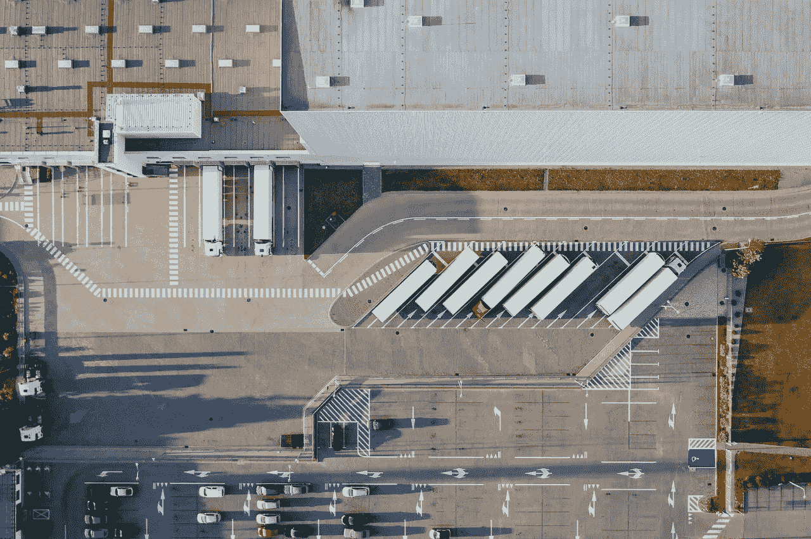

# 包含区块链、物联网和分析的供应链

> 原文：<https://medium.com/coinmonks/supply-chains-with-blockchain-iot-and-analytics-91d3ea096eff?source=collection_archive---------6----------------------->

## 探索利用这些技术所需的能力以及如何构建这些能力。

随着区块链、物联网(IoT)和分析的出现，供应链在过去十年中发生了巨大的变化。供应链是一个将货物和服务从供应商转移到零售商的过程