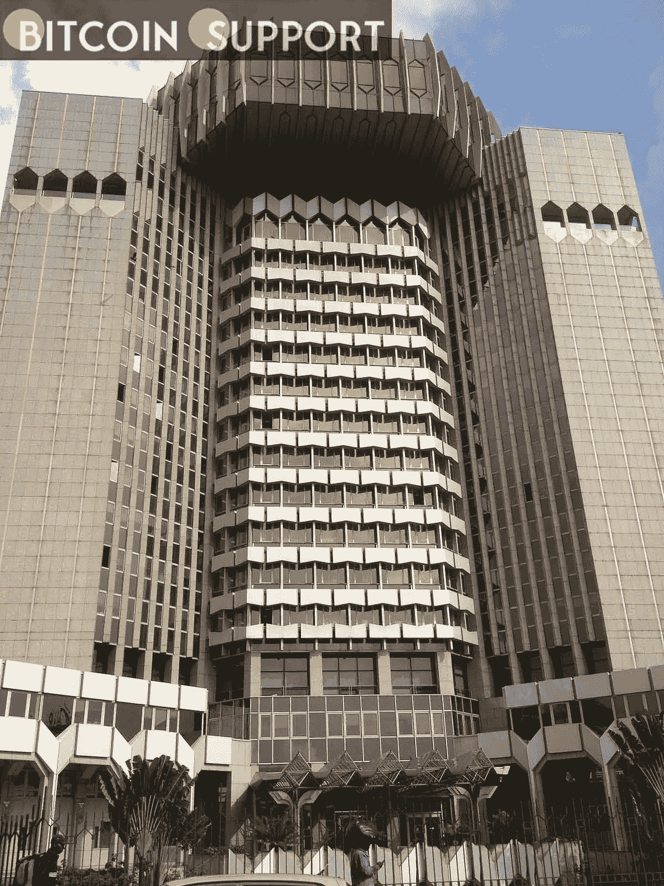
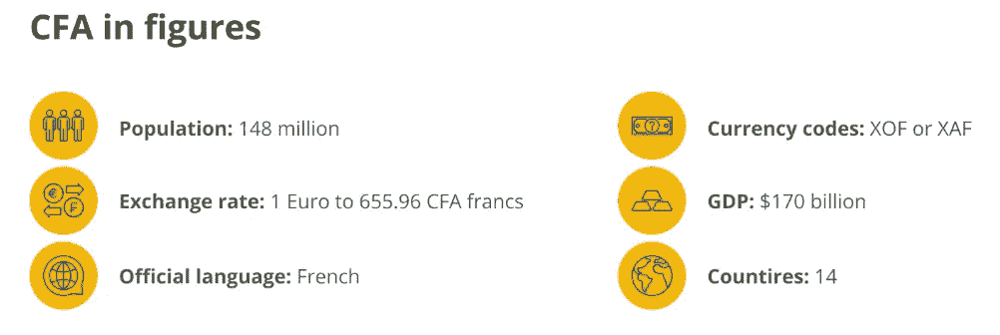

# 令人惊讶的是，一家中非银行谴责中非共和国采用比特币

> 原文：<https://medium.com/coinmonks/surprisingly-a-central-african-bank-has-chastised-the-car-for-adopting-bitcoin-81a16663c920?source=collection_archive---------55----------------------->

**For full blog visit:-**[**https://bitcoinsupports.com/surprisingly-a-central-african-bank-has-chastised-the-car-for-adopting-bitcoin/**](https://bitcoinsupports.com/surprisingly-a-central-african-bank-has-chastised-the-car-for-adopting-bitcoin/)

根据中非国家银行行长的一封信，中非共和国采用加密危及货币稳定。中非共和国(CAR)收到了中非国家银行(Banque desétats de l ' Afrique Centrale，BEAC)行长关于该国采用加密货币的一封措辞严厉的信。BEAC 省长 Abbas Mahamat Tolli 写信给中非共和国财政部长 Hervé Ndoba，描述了中非共和国采用加密将对中非货币联盟产生的“重大负面影响”。

4 月，中非共和国颁布了一项措施，宣布其打算采用加密货币。国际货币基金组织(IMF)已经对这一决定表示担忧。然而，BEAC 现在正在火上浇油。BEAC 还表示，加密货币在汽车中的采用，以及从非洲金融共同体货币的潜在转变，是“有问题的”中非和西非的前法国殖民地使用两种几乎相同的非洲金融共同体货币。它与欧元挂钩，这是许多比特币制造者和居民不喜欢的。

**For full blog visit:-**[**https://bitcoinsupports.com/surprisingly-a-central-african-bank-has-chastised-the-car-for-adopting-bitcoin/**](https://bitcoinsupports.com/surprisingly-a-central-african-bank-has-chastised-the-car-for-adopting-bitcoin/)

邻国刚果的比特币海滩难民项目 Kiveclair 的创始人 Gloire 说，CFA“让整个国家都依赖于它。”“非洲法郎是法国制造的，而且——因为找不到更好的词，是殖民货币，”塞内加尔第一个接受比特币支付的人 Mama Bitcoin 告诉记者。BEAC 总督希望保留终审法院，这是可以理解的。他认识到采用比特币(BTC)和其他加密货币给汽车带来的危险。根据这封信:

**“这部法律的主要目标似乎是建立一个独立于 BEAC 的中非货币，这可能会与中非经货共同体的法定货币竞争或取代它，并危及货币稳定。”中非经济共同体(CEMAC)是中部非洲的一个经济共同体。在中部非洲，中非经货共同体促进区域经济合作。托里州长称，中非经货共同体的“主要目标”是支持 BEAC。人权基金会(Human Rights Foundation)首席战略官、定期撰稿人亚历克斯·格拉德斯坦(Alex Gladstein)表示:“在 BEAC‘管辖范围之外’建立一种中非货币，正是中非共和国正在遵循的路线。

[https://twitter.com/gladstein/status/1523298432621842433](https://twitter.com/gladstein/status/1523298432621842433)

继萨尔瓦多采用全球最大加密货币的日益有效的方法后，中非共和国是全球第二个这样做的国家。萨尔瓦多也受到包括联合国和国际货币基金组织在内的主要机构和国家的抨击。中非总督的信以呼吁“严格遵守”中非货币联盟的命令结尾。尽管如此，在撰写本文时，密码法仍然有效。

**完整博客访问:-**[**https://bitcoinsupports . com/exceptible-a-central-African-bank-has-chicked-the-car-For-adopting-bit coin/**](https://bitcoinsupports.com/surprisingly-a-central-african-bank-has-chastised-the-car-for-adopting-bitcoin/)

**免责声明:以上为作者观点，不应视为投资建议。读者应该自己做研究。****

> 加入 Coinmonks [电报频道](https://t.me/coincodecap)和 [Youtube 频道](https://www.youtube.com/c/coinmonks/videos)了解加密交易和投资

# 另外，阅读

*   [Bookmap 点评](https://coincodecap.com/bookmap-review-2021-best-trading-software) | [美国 5 大最佳加密交易所](https://coincodecap.com/crypto-exchange-usa)
*   最佳加密[硬件钱包](/coinmonks/hardware-wallets-dfa1211730c6) | [Bitbns 评论](/coinmonks/bitbns-review-38256a07e161)
*   [新加坡十大最佳加密交易所](https://coincodecap.com/crypto-exchange-in-singapore) | [购买 AXS](https://coincodecap.com/buy-axs-token)
*   [红狗赌场评论](https://coincodecap.com/red-dog-casino-review) | [Swyftx 评论](https://coincodecap.com/swyftx-review) | [CoinGate 评论](https://coincodecap.com/coingate-review)
*   [投资印度的最佳密码](https://coincodecap.com/best-crypto-to-invest-in-india-in-2021)|[WazirX P2P](https://coincodecap.com/wazirx-p2p)|[Hi Dollar Review](https://coincodecap.com/hi-dollar-review)