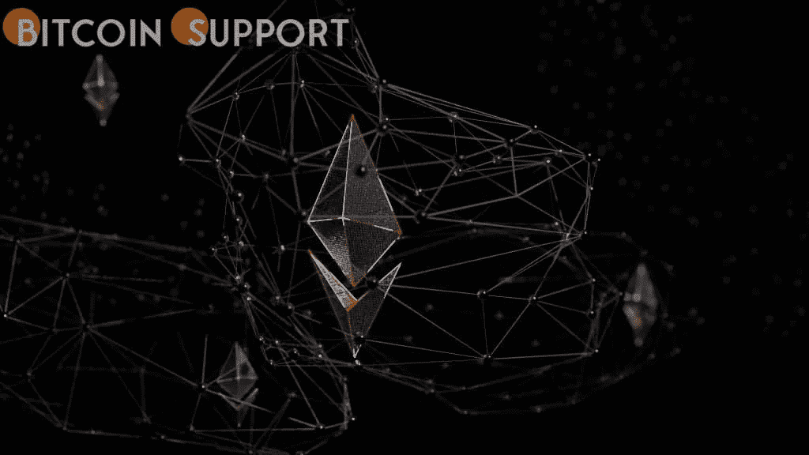

# 调查:美国人对 Web2 不满意，也不太了解 Web3

> 原文：<https://medium.com/coinmonks/survey-people-in-the-united-states-arent-happy-with-web2-and-don-t-know-much-about-web3-c19903bb4d3a?source=collection_archive---------58----------------------->

**Visit our website:-** [**https://bitcoinsupports.com/**](https://bitcoinsupports.com/)

虽然 Web3 叙事尚未获得广泛的吸引力，但未来的接受似乎有一个坚实的基础。

一项针对美国 1500 名客户的在线调查结果反映出人们对隐私和科技平台主导地位的严重担忧，同时也表明 Web3 尚未成为一个家喻户晓的名字。

跨国洞察与战略咨询公司国家研究集团(NRG)于 2022 年 1 月进行了这项研究。54%的受访者表示，他们担心技术正在威胁他们的权利和自由，44%的人表示担心在线隐私，38%的人对在线营销不满意，35%的人声称对他们的数据缺乏控制。几乎一半的受访者认为互联网公司积聚了太多的影响力，应该被解散。尽管如此，只有 13%的受访者知道 Web3 是什么意思，54%的人以前从未听说过这个词。83%的人说他们相信新版本的互联网将改善他们的生活。当被问及新网络的潜在缺点时，33%的人表示担心一旦去中心化的互联网全面运行，犯罪和欺诈会增加。

值得注意的是，美国的消费者并不认为监管机构对确保未来互联网产生有益的社会影响负有主要责任:只有 32%的人认为政治家和监管机构在这方面发挥了领导作用。超过一半(51%)的人说这主要是科技公司的责任，而 50%的人认为这是开发者和工程师的责任。

关于加密的采用，57%的受访者表示他们已经购买或正在考虑购买加密货币。39%的受访者表示，加密货币最类似于股票，而不是法定货币(18%)或黄金等商品(15%)。

NRG 高级副总裁兼全球洞察主管马龙·康伯巴奇:

“在我看来，这项研究得出的最令人惊讶的结论是，有多少客户强烈地感觉到在线渠道缺乏代理。”在这个日益两极分化的世界里，越来越难找到能把我们团结在一起的东西。然而，似乎所有美国人，无论收入、政治或种族如何，都认为他们对如何与互联网信息互动以及公司如何利用他们的个人数据缺乏足够的控制。康伯巴奇接着说，调查结果显示“消费者明显渴望一个新的互联网时代”，一个让他们对自己的网上体验有更多代理和控制的时代。在这个阶段，主要的障碍似乎是缺乏知识和缺乏公众意识的网络 3 相关的想法。这项研究的参与者是根据美国人口普查数据的年龄(18 至 64 岁)、性别、种族、地区、收入和教育水平的配额选择的。虽然这种方法不能产生一个严格意义上代表一般人群的样本，但它确实允许对人们的思想是如何传播的进行可靠的概括。

**访问我们的网站:-**[**https://bitcoinsupports.com/**](https://bitcoinsupports.com/)

**免责声明:以上为作者观点，不应视为投资建议。读者应该自己做研究。**

> 加入 Coinmonks [电报频道](https://t.me/coincodecap)和 [Youtube 频道](https://www.youtube.com/c/coinmonks/videos)了解加密交易和投资

# 另外，阅读

*   [在印度利用加密套利赚取被动收入](https://coincodecap.com/crypto-arbitrage-in-india)
*   [Godex.io 审核](/coinmonks/godex-io-review-7366086519fb) | [邀请审核](/coinmonks/invity-review-70f3030c0502) | [BitForex 审核](https://coincodecap.com/bitforex-review)
*   [最佳比特币保证金交易](/coinmonks/bitcoin-margin-trading-exchange-bcbfcbf7b8e3) | [萝莉点评](/coinmonks/lolli-review-e6ddc7895ad8) | [比特币保证金交易](https://coincodecap.com/bityard-margin-trading)
*   创造并出售你的第一个 NFT | [密码交易机器人](https://coincodecap.com/best-crypto-trading-bots)
*   [如何在 CoinDCX 上购买柴犬(SHIB)币？](https://coincodecap.com/buy-shiba-coindcx)
*   [CBET 评论](https://coincodecap.com/cbet-casino-review) | [库科恩 vs 比特币基地](https://coincodecap.com/kucoin-vs-coinbase)
*   [折叠 App 回顾](https://coincodecap.com/fold-app-review) | [LocalBitcoins 回顾](/coinmonks/localbitcoins-review-6cc001c6ed56) | [Bybit vs 币安](https://coincodecap.com/bybit-binance-moonxbt)
*   [加密保证金交易交易所](/coinmonks/crypto-margin-trading-exchanges-428b1f7ad108) | [赚取比特币](/coinmonks/earn-bitcoin-6e8bd3c592d9) | [Mudrex 投资](https://coincodecap.com/mudrex-invest-review-the-best-way-to-invest-in-crypto)