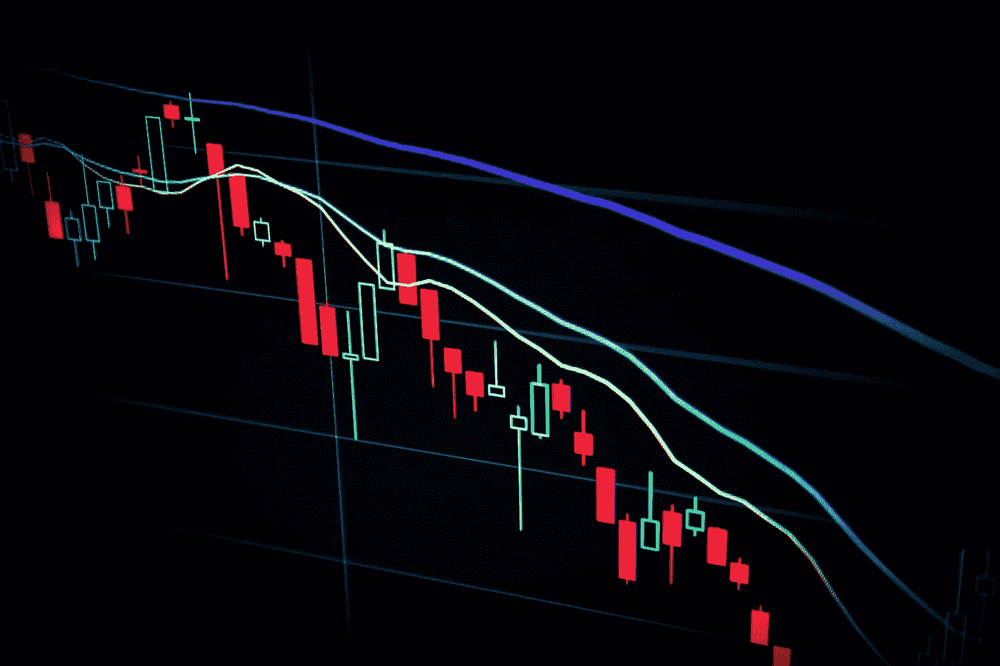
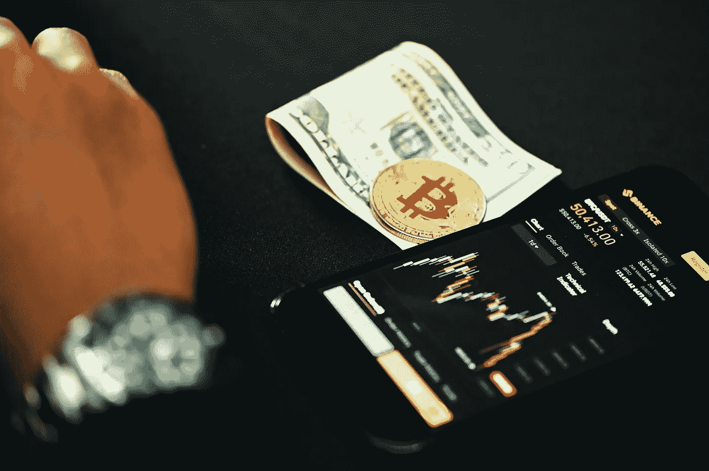
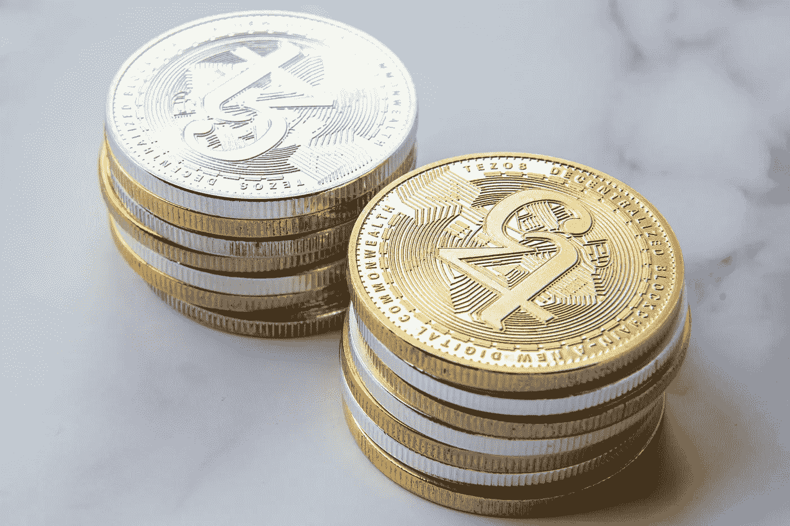
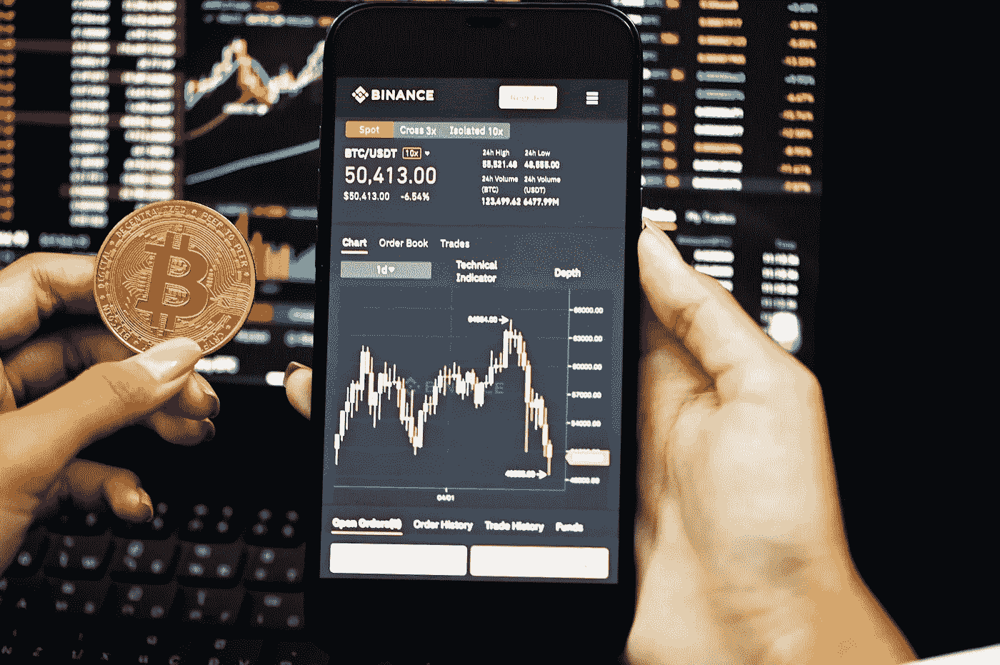
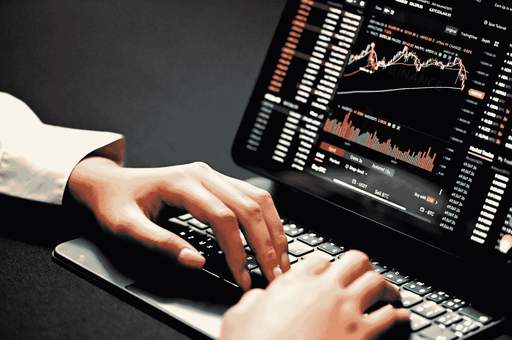
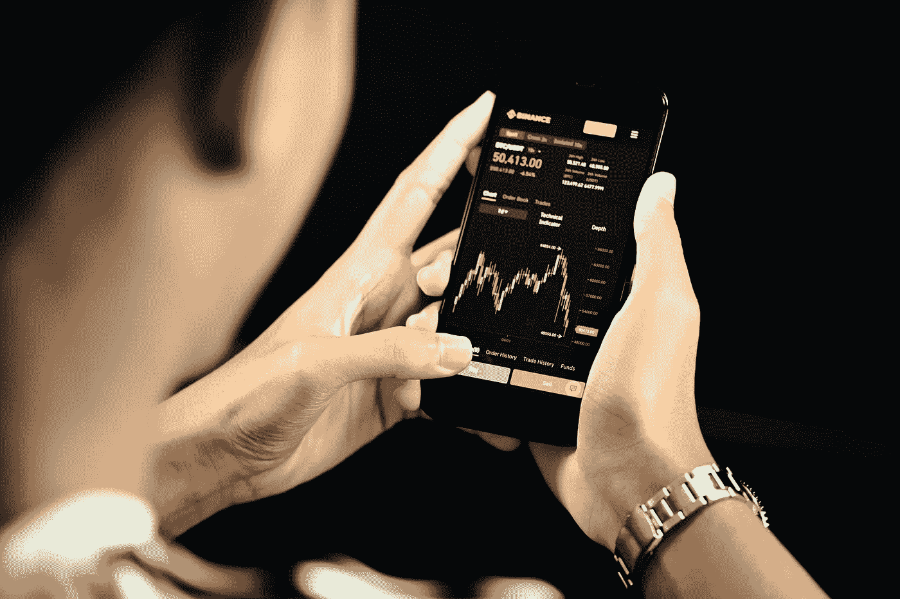

# 在熊市中生存:6 个实用步骤。

> 原文：<https://medium.com/coinmonks/surviving-a-bear-market-6-practical-steps-888e2b61c79d?source=collection_archive---------42----------------------->

Source: Unsplash.com

加密货币交易不是一门科学，但它遵循牛顿第三运动定律和万有引力定律。世事有起终有落。不管牛市有多好，总有一天你醒来会发现，金融世界发生了你意想不到的转变，要避免损失可能已经太晚了。那么，欢迎来到熊市。

以下是一些度过加密货币寒冬或熊市的技巧:

> **又见:** [**为什么加密市场如此狂野？推动密码市场的因素。**](/geekculture/why-is-the-crypto-market-so-wild-factors-that-move-the-crypto-market-10f9267e3d1c)

1.  克制住打包走人的冲动。

Source: Unsplash.com

在熊市的第一个迹象出现时，你可能会想卖掉你所有的密码来限制你的损失。事实证明，这种策略与富人的心态背道而驰。

“在经济低迷或熊市期间，投资者必须能够坚持投资；不幸的是，大多数投资者可能会卖掉他们的密码，而不是钻研他们的长期投资。

避免这种情况的关键之一是在经济不稳定时手头有流动现金。这将使你在这段时间内不去关注你的投资。

**2。与其兑换成现金，不如兑换成稳定的硬币。**

Source: Unsplash.com

稳定硬币是由储备资产支持的加密货币，旨在提供价格稳定。交易者利用这些来保持稳定，进出头寸。持有稳定硬币的另一个优势是赌注支付的丰富性，通常可高达 6%。

当你将资产转换为稳定的硬币时，你保持了美元的价值，并以恒定的速度扩张，而不管市场情况如何。

**3。尝试打桩**

Source: Unsplash.com

当在加密熊市中形势变得艰难，你的投资组合开始左右贬值时，下注似乎是一个从你的加密堆栈中创造被动收入的绝妙策略。赌注是将您的资金存储在赌注凭证(PoS)区块链上一段时间以换取奖励的过程。

> **另见:** [**区块链在加密货币之外的惊人用途。**](/@ilekeairende/surprising-uses-of-blockchain-outside-cryptocurrencies-7a59bfdb2699)

**4。避免在熊市做空**

Source: Unsplash.com

做空是一种交易策略，允许交易者从加密货币价格下跌中获利。这应该使它非常适合熊市，在熊市中，价格下跌是普遍现象。然而，大多数专家建议不要做空比特币和其他加密货币，因为这可能导致永久性损失或平仓。这是做空的一个基本问题，再多的练习也不能让你为出错时等待你的不愉快的惊喜做好准备。

**5。不要把你的加密货币存在交易所里。**

Source: Unsplash.com

“也不是你的钥匙，也不是你的硬币，”就像他们说的。这适用于几乎所有涉及集中式托管加密货币交易所的场景。然而，在一个严重的熊市期间，损失你存在这些交易所的现金的危险变得非常大。

想想如果股市突然崩盘会发生什么。数千亿美元将从市场上抹去，导致几家交易所破产。

要完全控制您的加密资产，请始终使用非保管钱包程序，或者更好的是，使用久经考验的硬件钱包。

**6。将止损单纳入你的交易策略**

Source: Unsplash.com

利用止损单来帮助限制更大的损失并不是一个糟糕的主意。事实上，在秘密熊市中，它们应该是你大部分交易的基础。当价格下跌时，买家可以利用这些订单，通过设定下限，然后卖出硬币来限制损失。这个下限被设置为低于资产购买价格的百分比，假设一旦价格达到这个下限，它很可能会进一步下跌。

最后，要明白，这只是整个市场周期的一个阶段。很快，牛市将收回市场，你将再次获得巨额利润。

> 加入 Coinmonks [电报频道](https://t.me/coincodecap)和 [Youtube 频道](https://www.youtube.com/c/coinmonks/videos)了解加密交易和投资

# 另外，阅读

*   [用信用卡购买密码的 10 个最佳地点](https://coincodecap.com/buy-crypto-with-credit-card)
*   [加拿大最佳加密交易机器人](https://coincodecap.com/5-best-crypto-trading-bots-in-canada) | [Bybit vs 币安](https://coincodecap.com/bybit-binance-moonxbt)
*   [阿联酋 5 大最佳加密交易所](https://coincodecap.com/best-crypto-exchanges-in-uae) | [SimpleSwap 评论](https://coincodecap.com/simpleswap-review)
*   购买 Dogecoin 的 7 种最佳方式 | [ZebPay 评论](https://coincodecap.com/zebpay-review)
*   [最佳期货交易信号](https://coincodecap.com/futures-trading-signals) | [流动性交易回顾](https://coincodecap.com/liquid-exchange-review)
*   【Huobi 的加密交易信号 | [Swapzone 审查](/coinmonks/swapzone-review-crypto-exchange-data-aggregator-e0ad78e55ed7)