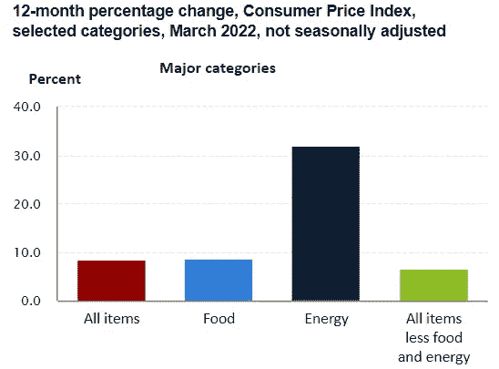
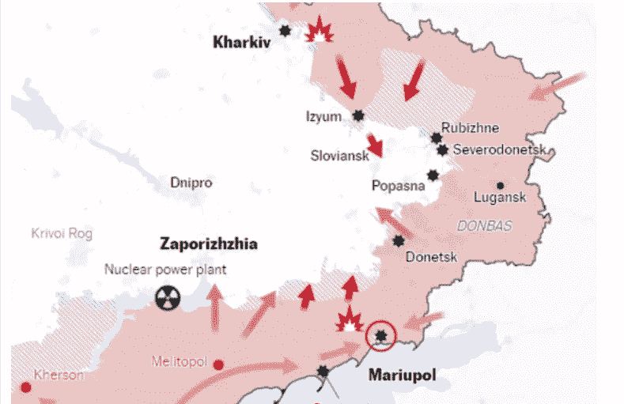

# SVET 市场更新(2022 年 4 月 12 日)

> 原文：<https://medium.com/coinmonks/svet-markets-update-12-april-2022-487e72d2d901?source=collection_archive---------66----------------------->

SVET Is Light, by Svet and Victor

过去几天，BTC 成功测试了从 1 月中旬开始的日线趋势线。此外，市场情绪略有好转，但基本面没有任何明显改善。

例如，最新的 CPI 报告称(根据美国劳工统计局):

(source: bls dot gov)

问:3 月份，所有城市消费者的消费价格指数经季节调整后上涨了 1.2%，未经季节调整，过去 12 个月上涨了 8.5%。3 月份，除食品和能源以外的所有项目指数增长了 0.3%(SA)；全年增长 6.5%(国家统计局)。情商:

与此同时，油价仍徘徊在 100 美元以上。

(source: tradingeconomics)

此外，FOMC 的言论比前几周更加强硬，一些董事会成员呼吁在未来 3-4 个交易日内将利率上调 0.5 个百分点。

至于正在进行的欧洲战争，根据最新消息，一位光彩照人的老将军被侵略者新任命来屠杀更多的无辜者，普遍的预期是这场无意义的暴力狂欢将至少持续两到三个月。

source: ukrainecrisis dot org

尽管如此，一些投资者让自己相信，世界上所有的厄运和阴霾都已经被市场看不见的手消化了。因此，我们可以预计，他们中最大胆的人会慢慢回到高风险高回报的股票市场。

(source: coinmarketcap)

这有望在下一次熊市袭击中为 BTC 提供足够的力量，这可能会使其低于 39k(下一个目标是 34k)。

**更多报道请登陆** [***SVET 平台:****https://svetrating.com/reports_all/Latest/*](https://svetrating.com/reports_all/Latest/)

> 加入 Coinmonks [电报频道](https://t.me/coincodecap)和 [Youtube 频道](https://www.youtube.com/c/coinmonks/videos)了解加密交易和投资

# 另外，阅读

*   [5 款最佳加密交易终端](https://coincodecap.com/crypto-trading-terminals) | [最佳 DeFi 应用](https://coincodecap.com/best-defi-apps)
*   [比特币基地 vs 瓦济克斯](https://coincodecap.com/coinbase-vs-wazirx) | [比特鲁点评](https://coincodecap.com/bitrue-review) | [波洛涅克斯 vs 比特鲁](https://coincodecap.com/poloniex-vs-bittrex)
*   [德国最佳加密交易所](https://coincodecap.com/crypto-exchanges-in-germany) | [Arbitrum:第二层解决方案](https://coincodecap.com/arbitrum)
*   [币安交易机器人](/coinmonks/binance-trading-bots-d0d57bb62c4c) | [OKEx 评论](/coinmonks/okex-review-6b369304110f) | [阿塔尼评论](https://coincodecap.com/atani-review)
*   [最佳加密交易信号电报](/coinmonks/best-crypto-signals-telegram-5785cdbc4b2b) | [MoonXBT 评论](/coinmonks/moonxbt-review-6e4ab26d037)