# 掉期交易——密码买卖变得超级简单

> 原文：<https://medium.com/coinmonks/swap-farming-crypto-buy-and-sell-made-super-simple-881134dd0527?source=collection_archive---------9----------------------->

*立即交易，汇集代币赢取奖励。*

*利用互换耕作进行贸易并索取 BNB 奖励。*

*在农耕时期兑换代币赚取 50%的费用回扣。*

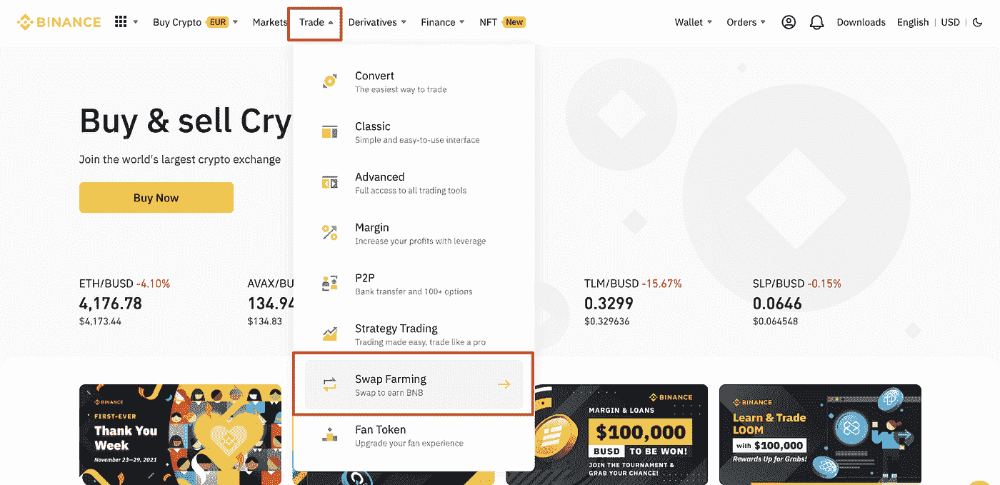

Photo: Binance

**简单地用互换农业进行买卖**

自动做市商(AMM)模型主导的[币安液体掉期](https://www.binance.com/en/swap?ref=P10U1GSP)让你从硬币和代币池中安全地交换加密货币对。币安的掉期农业收费低，回报高(价格稳定)。BSwap 让您在 BNB 兑换时赚取高达 50%交易费回报的 BNB 奖励。基于低佣金的币安流动性掉期息差有限，同时它允许用户作为做市商向池中添加代币。

通过这样做，用户除了赚取一部分交易费(用于池化)之外，还赚取利息。在大宗交易的情况下，由于价格稳定，费用较低，掉期交易与稳定的信用交易很好。基于流动性池的 BSwap 在每个池中有两个令牌；这两种代币的相对数量决定了它的价格。只要池中有代币，就可以进行交换。

通过向资金池提供流动性，可以产生收入，因为下注的代币也可以从资金池交易中获得佣金。用户获得灵活的储蓄利息。但是 BSwap 还是有一定的风险。如果代币价格大幅波动，股东将无法实现预期利润。

**互换农业如何运作** : **互换农业入口**

为了使用互换农业和要求奖励，只需通过币安主页上的“贸易”标签访问币安互换农业。现在让我们来看看互换种植的工作流程。

**1。互换养殖工作流程(网络版)**

登录您的币安帐户。点击“贸易”标签，然后点击“互换农业”

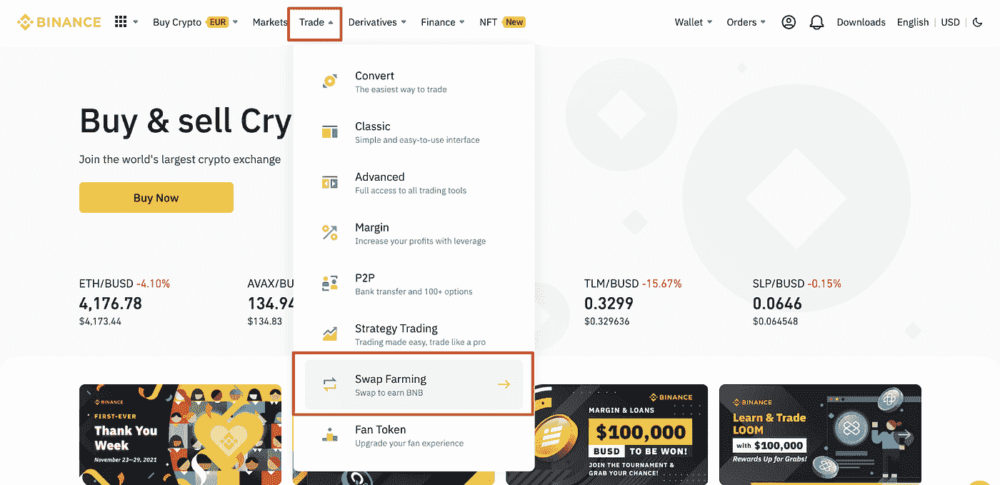

Photo: Binance

访问币安液体交换网页。您将看到两个选项卡:“添加”和“删除”使用“添加”选项卡，您可以通过选择要存入的代币和适当的池来快速添加流动性。通过“Remove”选项卡，您可以通过选择接收令牌存款的任何一个池来从池中提取令牌。同时选择要撤销的令牌。

1.1 **互换耕作移动流程**

要在手机上访问，只需在币安应用程序中点击“更多”。然后点击“贸易”——互换农业，进入币安互换农业部分。

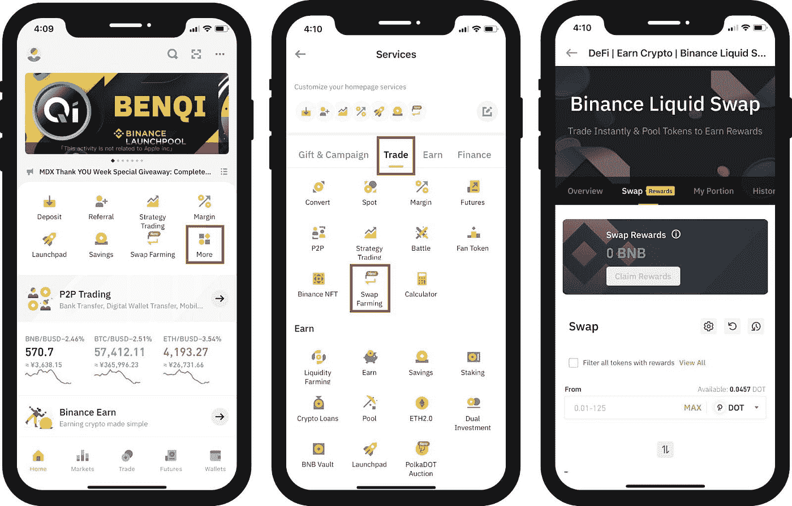

Photo: Binance

2.**令牌选择和流程结束**

分别从“从”和“到”部分的下拉菜单中选择您要交换的令牌。然后提到互换金额。在确认代币加金额之后。系统会显示市场价格，然后自动计算滑点和费用。您也可以选择一个滑动范围，在该范围内，交换不会继续进行，直到它在设定的范围内。然后将显示价格、滑点、有效费用(掉期费用和估计费用回扣)。交易滑点是根据市场情况实时调整的。虽然，显示的价格也可能不是最后的交易滑点价格。要查看所有代币(有奖励和无奖励)，请单击“查看全部”或者，您也可以选择过滤(并显示)所有带奖励的代币。只需点击“交换”即可结束该过程。

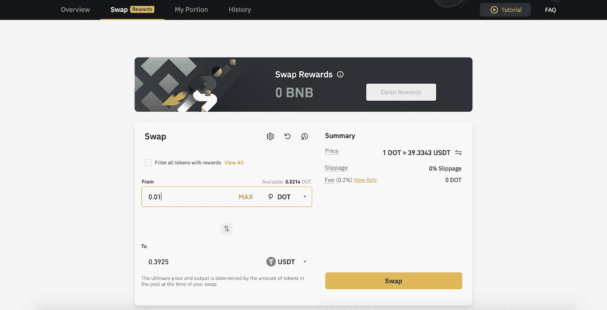

Photo: Binance

考虑到直观易用的掉期交易 UX，浏览币安(网络)上不那么杂乱的掉期交易界面甚至比现货交易更容易。

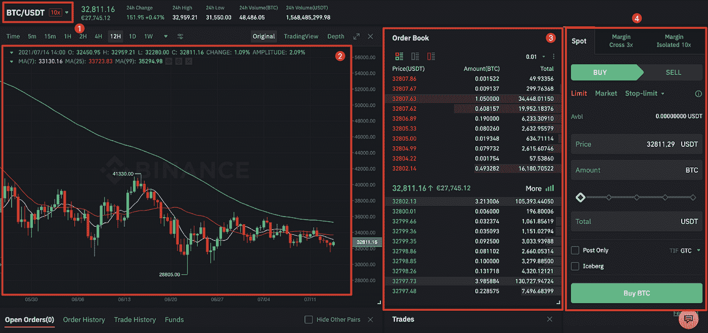

Photo: Binance

**如何查看互换历史**

要查看您的掉期交易历史，只需登录您的币安账户并点击“赚取”然后点击[流动性养殖](https://www.binance.com/en-IN/swap/poolhttps://www.binance.com/en/trade-margin/BTC_USDT?ref=P10U1GSP)

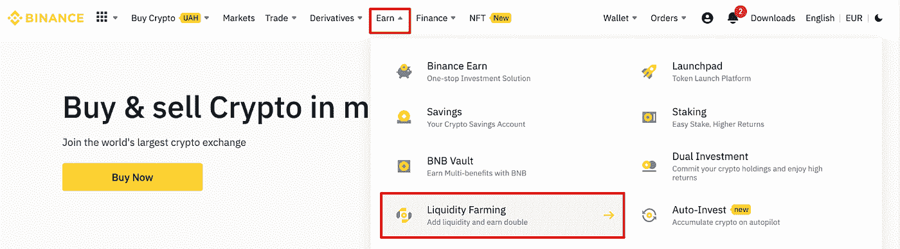

Photo: Binance

点击“概述”选项卡，然后点击“显示我的部分”这样，您可以查看无人认领的奖励总额和部分详细信息。

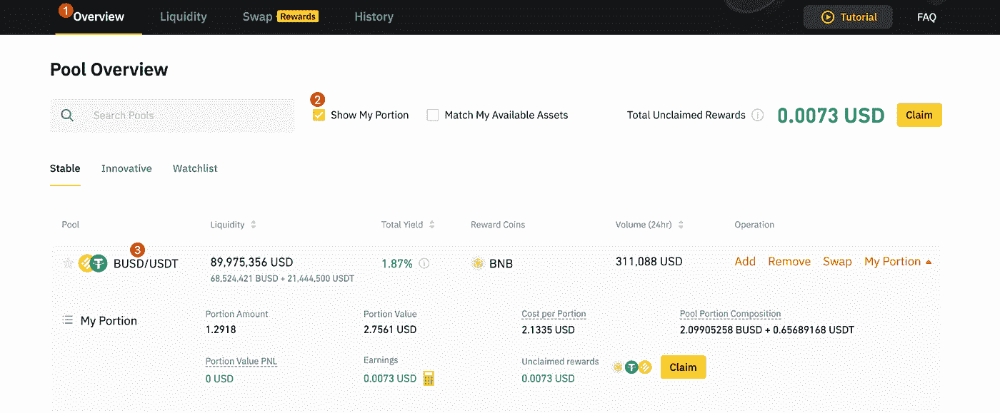

Photo: Binance

**如何获得和申领奖励**

截至目前，只有几个代币有资格获得币安互换农场的互换奖励(BNB 的交易费回扣)。

1.  要查看在 BNB 有资格获得 50%费用折扣的所有合格互换对，请单击“查看全部”互换奖励的计算是按照订单互换率进行的，其中，交易费回扣被交换到 BNB。然后，交易费会存入您的现货钱包。

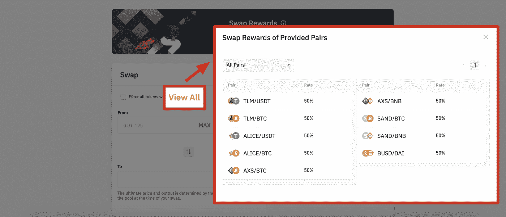

Photo: Binance

2.选择“过滤所有带奖励的代币”选项，仅查看符合交换奖励条件的代币。选择您感兴趣的代币并输入所需金额。

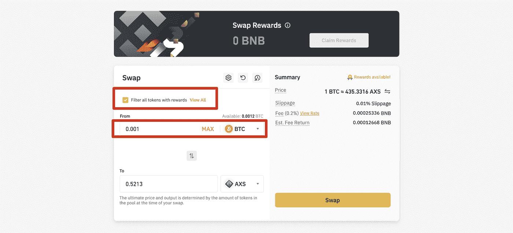

Photo: Binance

注意:在确认兑换之前，请确保您选择了有资格获得兑换奖励的代币，否则您将无法获得 BNB 返点。

3.点击“交换”并确认代币和金额。

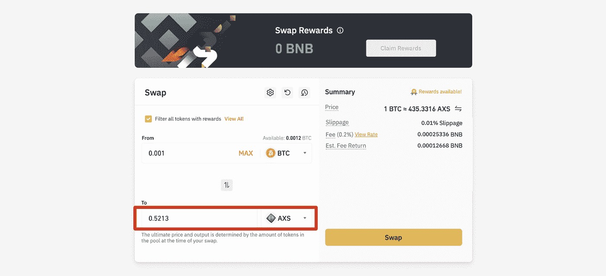

Photo: Binance

4.掉期价格会显示出来，而 BNB 的滑点、费用和估计的掉期回报会自动计算出来。只需点击“交换”即可开始。

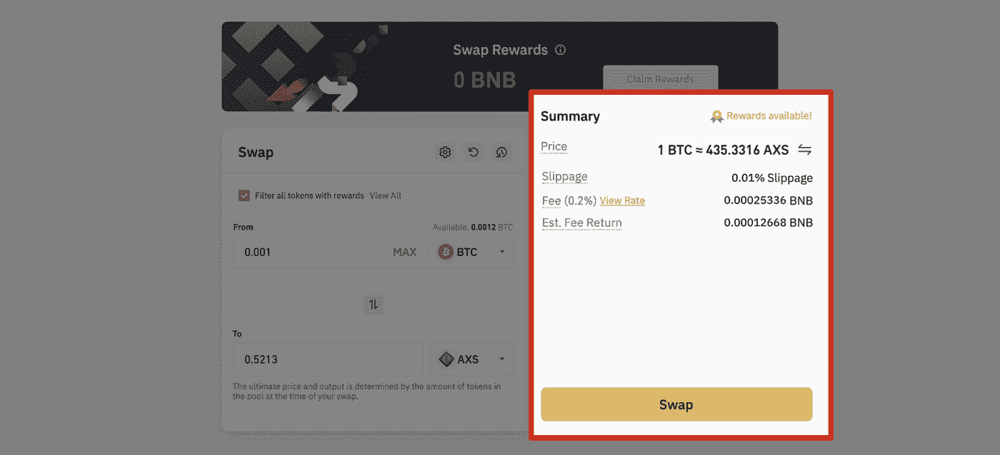

交换完成后，将会发送确认信息。只需点击“查看交换历史”查看订单，或点击“返回交换”开始另一次交换。

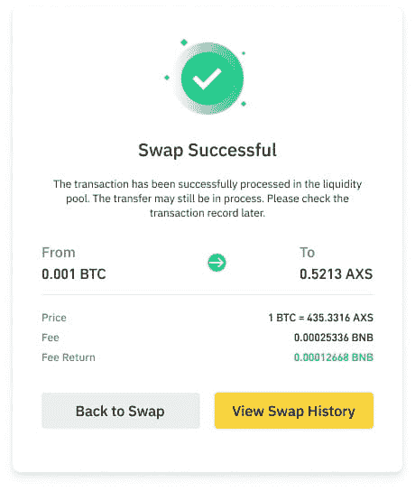

Photo: Binance

[如何在币安互换农业指南中申请互换奖励](https://www.binance.com/en/support/faq/cd431e8082d2437fb7df3da18eadeba7?ref=P10U1GSP)。

**如何查看奖励历史**

点击“历史记录”选项卡，然后点击“交换”，查看流动性历史记录、获得的奖励和分配历史记录。也可以更改日期、配对和类型来查看以前的订单。

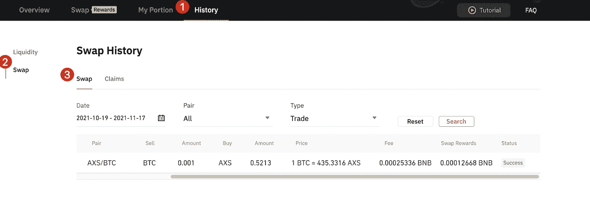

Photo: Binance

点击“历史记录”—“交换”—“申请”，查看奖励申请历史记录过去的订单也可以按日期查看。

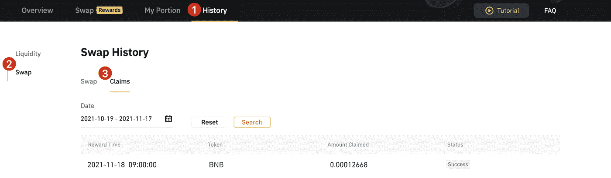

Photo: Binance

注意:最终价格和产量取决于互换期间池中的代币数量。

**互换农业的主要优势**

[**VIP 专属福利——互换养殖**](https://www.binance.com/en/support/announcement/035109342afe4297b29c1e3dd30f8b0b?ref=P10U1GSP)

币安互换农业有几个好处。这些主要包括以下内容:

1.  API 支持套利用户/高频交易者。
2.  与 DeFi 掉期相比，风险较低(安全平台，黑客攻击风险最小，SAFU)。
3.  在 BNB 超过 50%的费用回扣。
4.  支持超过 180+对。
5.  最小的滑动。
6.  易于使用和整洁的界面。

涉及哪些风险？

首先，大额交易会导致滑点费用增加。一般来说，交易或互换包含潜在的滑点风险。这可能会导致价格与你的实际期望有所不同。在互换农业中，由于币安行业领先的流动性，这种风险降低了。掉期交易提供了 100 多个交易对，具有很强的流动性。虽然掉期交易通常提供常规的币安特有的优势，但交易者资金也是 SAFU(或用户的安全资产基金)。

这意味着在互换养殖中损失的风险几乎不存在。没有风险，但回报很高。不，那很诱人，不是吗？访问外部分散式应用程序(dApps ),如 AMM 服务，也不是必须的。只需轻轻一点，所有的掉期交易详情都可以在币安主页上看到。

新来币安吗？[今天就注册](https://accounts.binance.com/en/register?ref=P10U1GSP)！

**免责声明**:本文仅用于教育目的，不应理解为投资建议。