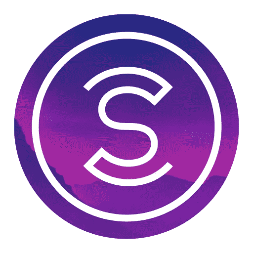
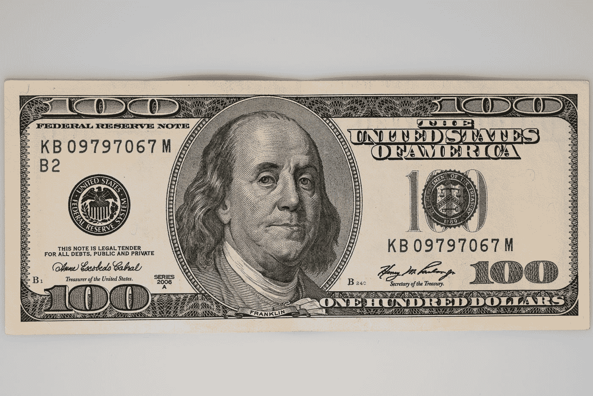
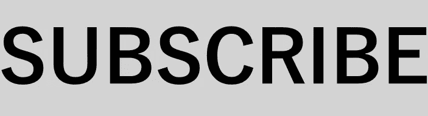

# Sweatcoin App 会为走路买单

> 原文：<https://medium.com/coinmonks/sweatcoin-app-will-pay-you-a32a31a0f6e5?source=collection_archive---------10----------------------->

## 让我们一起探索移动挣钱的世界吧！我们将谈论运动硬币和用行走赚钱。

# **简介**

我们已经看到了移动赚取加密项目的增加，但这个概念并不新鲜。Sweatcoin 是首批专注于为步行付费的应用之一。

原理很简单。你走得越多，[你得到的硬币就越多。](https://sweatco.in/i/jan418420)

Sweatcoin 是一款流行的支付人们步行费用的应用程序，将于今年夏天推出其加密令牌。

The company claims you will be able to earn up to 1,8$ per mile (read below) — this photo is by [engin akyurt](https://unsplash.com/@enginakyurt?utm_source=medium&utm_medium=referral) on [Unsplash](https://unsplash.com?utm_source=medium&utm_medium=referral)

# 有效性

目前，该应用可用于[安卓和 iOS 设备](https://sweatco.in/i/jan418420)。

# 我的旅程

我大约三年前开始使用 Sweatcoin，但在此期间停止了使用。

这可能是我做过的最糟糕的决定之一，因为现在每个汗水币都会自动变成一个加密令牌。我本可以有更多的！

在过去的一年里，我失去了一些联系，但现在我回来了。我每天都走路，尽可能多的挣钱。

想试试的话，[下载免费 app](https://sweatco.in/i/jan418420) 和我比试。看看谁能赚到最多的汗水。

# **这怎么可能？**

有人可能会问——这是怎么回事？钱从哪里来？

Sweatcoin 通过向品牌合作伙伴收取费用来获得收入。它还从应用程序上出现的广告中赚钱。

因为现在的汗权币是不可交易的，不能换钱，只能换 app 里面的服务。

一旦代币变得可以交易，其价格将由自由市场决定。意味着有多少人愿意购买和持有代币，有多少人准备出售代币。简单的供求机制。

# 什么是 Sweatcoin？

Sweatcoin token (SWEAT)是/将是数字资产经济的一部分，它用加密货币奖励人们的户外锻炼活动。

这种新货币也将在交易所上市，因此我们将能够交易法定货币和其他流行的加密货币，如比特币、以太坊等。

# **该公司似乎有一个很好的商业模式**

该应用背后的公司已经筹集了高达 600 万美元的资金，根据他们的计算，每个下载该应用的人每天步行一英里或更多，每天可以赚 1.2 美元至 1.8 美元，这取决于他们住在哪里。

该公司已经与耐克、UberEATS 和 Virgin Active 等品牌建立了合作关系。大部分的合作伙伴都是类似健身房、服装品牌的健身公司。他们专门为应用程序用户创建特殊交易，解锁特殊折扣、代金券或免费服务。

# **不可能都是好事**

从来都不是。我们不知道确切的令牌组学会是什么。我们不知道最初的价格会是多少，我们甚至不知道他们的模式是否可以长期持续。

我认为他们选择加密只是因为错过这个机会太危险了。我们都知道，竞争非常激烈，错过这样的机会可能对公司不利。

但是对于我们这样的人——我们不在乎！我们想要的只是活得更健康，如果我们做自己喜欢的事能得到报酬，为什么不试试呢？健康生活才能长寿——这是我的座右铭，你的呢？

# **风险&回报**

我拥有 SWEATCOIN，我等不及它们上市了！许多事情仍然可能出错，因此我将在接下来的几个月里密切关注他们的进展。

有一些附属链接，如果你用它们来下载应用程序，我会收到 5 个汗币，不花你一分钱。

[Medium](https://jankoak.medium.com/membership)

媒介是为作家制造的。如果你评论我的文章，我会阅读并在你的文章下留下评论。让我们互相支持。

 [## 改变了我对 Crypto.com 的看法——从还好到糟糕

### 我爱 Crypto.com。我喜欢他们的信用卡。我喜欢他们的赌注奖励。我喜欢他们的交流。现在爱是…

blog.cryptostars.is](https://blog.cryptostars.is/changed-my-mind-about-crypto-com-from-ok-to-terrible-3c298016fd75)  [## 加密货币圆周率会(不会)让你富有

### 在没有任何现值的情况下，我们甚至能从这种越来越流行的加密货币中期待什么？甚至它的创造者…

jankoak.medium.com](https://jankoak.medium.com/cryptocurrency-pi-will-not-make-you-rich-da7bb18b53ac) 

> 加入 Coinmonks [电报频道](https://t.me/coincodecap)和 [Youtube 频道](https://www.youtube.com/c/coinmonks/videos)了解加密交易和投资

# 另外，阅读

*   [OKEx vs KuCoin](https://coincodecap.com/okex-kucoin) | [摄氏替代品](https://coincodecap.com/celsius-alternatives) | [如何购买 VeChain](https://coincodecap.com/buy-vechain)
*   [币安期货交易](https://coincodecap.com/binance-futures-trading)|[3 comas vs Mudrex vs eToro](https://coincodecap.com/mudrex-3commas-etoro)
*   [如何购买 Monero](https://coincodecap.com/buy-monero) | [IDEX 评论](https://coincodecap.com/idex-review) | [BitKan 交易机器人](https://coincodecap.com/bitkan-trading-bot)
*   [CoinDCX 评论](/coinmonks/coindcx-review-8444db3621a2) | [加密保证金交易交易所](https://coincodecap.com/crypto-margin-trading-exchanges)
*   [红狗赌场评论](https://coincodecap.com/red-dog-casino-review) | [Swyftx 评论](https://coincodecap.com/swyftx-review) | [CoinGate 评论](https://coincodecap.com/coingate-review)