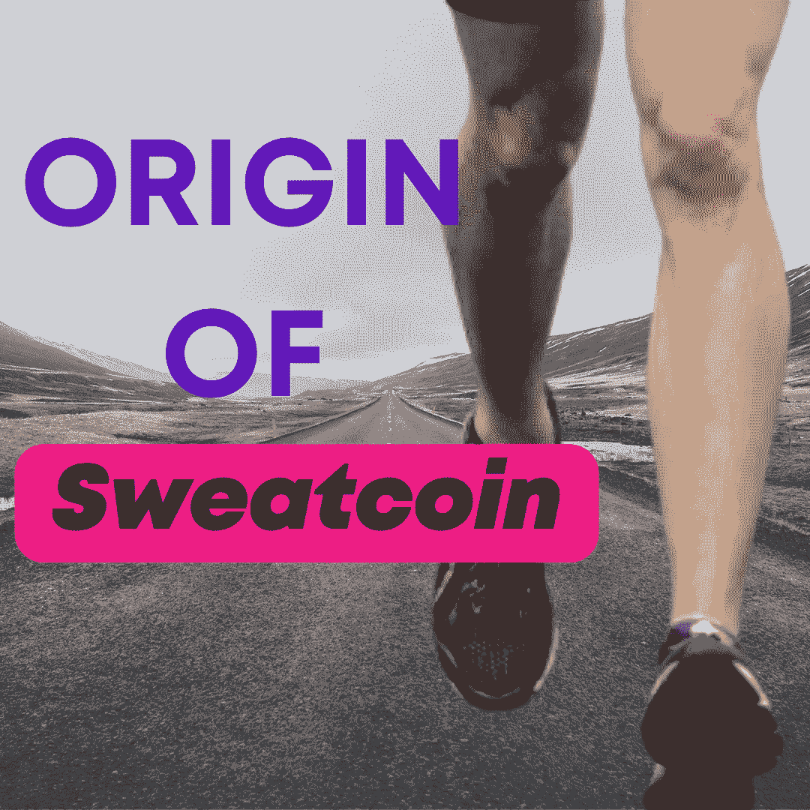
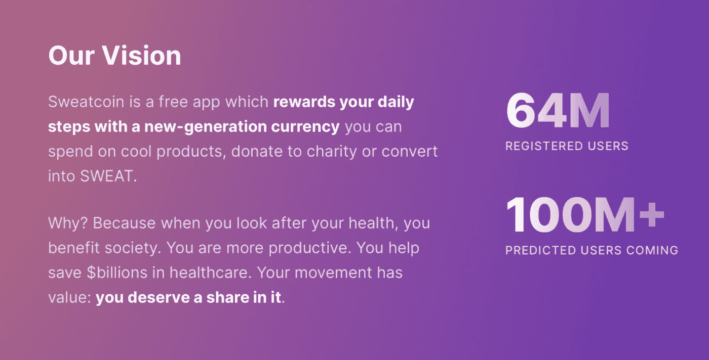

# 运动硬币——让你的脚步货币化的新经济

> 原文：<https://medium.com/coinmonks/sweatcoin-the-new-economy-that-monetizes-your-steps-790458a59022?source=collection_archive---------6----------------------->

## **汗币的一般概念**

缺乏运动与烟草滥用、酒精滥用和不健康饮食一起被认为是全球死亡的主要风险因素。2018 年，世界卫生组织(世卫组织)推出了《2018–2030 年身体活动全球行动计划》。该行动计划概述了四个政策行动领域和 20 项具体的政策建议和行动，以在不小的程度上增加全世界的体育活动。全球行动计划要求世界各地的国家、城市和社区采取整体应对措施。一项涉及所有部门、利益攸关方和个人的对策，在全球、区域和地方各级采取行动，提供支持性环境和机会，帮助人们提高体育活动水平和对其健康益处的认识。2020 年，世界卫生组织进一步提出了世界卫生组织关于身体活动和久坐行为的 2020 指南，这些指南旨在使人们热爱身体活动。

随着技术的进步，发达国家和发展中国家的身体不活动水平急剧上升。这是因为一个人可以从他舒适的卧室去环游世界。也就是说，只要有互联网连接，一个人几乎可以在某一点上生存。例如，一个人可以在他的卧室里进行买卖，事实上，在我们舒适的家中，几乎没有什么事情是我们不能做的，包括履行我们的工作职责。

众所周知，人类总是主要关心如何谋生。因此，几乎大多数人类行为都是为了让他们自己和他们的家属收支平衡。因此，自然地，人类会一直倾听并输入任何有能力为他们赚钱的想法。几乎可以肯定的是，他们会尝试这些想法，尤其是那些需求简单且要求不高的地方。这些因素或想法导致了**汗币**的出现。

Sweatcoin 想出了一个机会，让一个人能够在通过步行参加体育活动来改善健康的同时赚钱。基本上，sweatcoin 需要通过锻炼保持健康，并通过努力保持健康获得报酬。这是一种激励，让人们参与体育活动，从而带来更健康的生活，进而带来更美好的社会。sweatcoin 的创始人认为，当你适当地照顾自己的健康时，你会直接或间接地造福社会，因为你会变得更有生产力、更有用、更快乐。

我们可以把 sweatcoin 比作 gamefi。就像 Gamefi 使用 play2earn (p2e)模式运营一样，sweatcoin 在自己的运营中也使用 move2earn (m2e)模式。要了解更多信息，你可以点击这里查看汗纸

## 汗币的由来

由于我们已经花了足够的时间和空间来详细解释 sweatcoin 的概念，所以我们不会在起源上争论太多。Sweatcoin 于 2015 年由奥列格·福缅科(Oleg Fomenko)与安东·德利亚特卡(Anton Derlyatka)、丹尼尔·佩鲁舍夫(Danil Perushev)和叶戈尔·赫梅列夫(Alexander Khmelev)共同创立并推出。它是一个 web2 项目，已经多元化为发起一个 web3.0 项目(@sweateconomy)，愿景是通过奖励所有形式的运动来激励一个健康富裕的星球。

## 运动硬币的进展

自从 Sweatcoin 被引入我们的空间以来，它一直在进步。该项目花费了创始人 70 多万欧元来开发应用程序。然而，2018 年，该公司通过一轮 570 万欧元的融资加强了资本，以加速 Sweatcoin 的扩张。这个过程是由古德沃特资本和 Seedcamp、硅谷和欧洲的投资者共同领导的。2019 年 1 月 25 日显示，Sweatcoin 通过三轮融资共获得 630 万欧元。创始人能够与众多慈善机构合作，如救助儿童会、癌症研究和国际保护组织，同时与政府组织如国家卫生系统(NHS)合作，通过激励措施帮助激励人们更多地运动。该公司展示了其商业手段，因为该公司在不到一年的时间里拥有超过 500 万注册用户。今天，它在全球拥有超过 6400 万注册用户，最近在 33 个国家的应用商店和 google play 商店排名第一，并且还在继续。

## 运动币的目的地

报告显示，目前仅在英国就有超过 500 万人处于患二型糖尿病的高风险中，这在很大程度上是可以通过改变生活方式来预防的。体育活动也有助于心理健康，包括预防认知障碍和抑郁、焦虑及其他心理失衡症状。

近 40%的美国成年人患有肥胖症。这是根据美国疾病控制中心进行的研究，由疾病控制和预防中心国家健康统计中心健康和营养检查调查部的 Craig M. Hales 医学博士领导。这篇文章发表于 2017 年 10 月 13 日。如果人们能够培养适当和有效的体育活动的习惯，疫情可以大大减少，是的，sweatcoin 就是来帮助你的。

随着时间的推移，随着技术的进步、去中心化和加密货币的采用，越来越需要对每个步骤进行令牌化，因此 sweatcoin 团队宣布他们将创建自己的加密货币。在 2022 年 5 月 25 日撰写本文时，值得注意的是，sweatcoin 团队将于今年夏天在以太坊上推出他们的加密技术，并使用 NEAR 作为其区块链提供商。

该应用程序被编程为读取每个用户的步骤，并将其转换为令牌。目前，1000 步产生 1 个汗水代币，推出后，你的前 5000 步将铸造 1 个汗水代币，随着时间的推移，铸造将变得更加困难(就像比特币一样)。此外，sweatcoin 将从创造的汗水中抽取 5%的费用。所以你明白为什么你需要在发射前开始尽可能多的积累了吧？你猜对了。

## 用你的运动硬币可以做的事情

这更像是“用你的钱可以做的事情”。听起来很好笑，对吧？是的。就像货币和其他加密货币一样，汗水令牌是一种有效的交换手段。尽管它尚未完全推出，但仍可在某些地方兑换/消费，如 sweatcoin 应用程序和 Flare 应用程序上的应用内市场。

此外，您还可以用汗水代币做很多事情，例如:

1.  从 sweatcoin 市场购买数字和实物商品。
2.  捐款。sweatcoin 应用程序允许您通过为人类捐款来利用您的汗水实现更大的利益。就像本周正在进行的活动一样，“达沃斯挑战:为乌克兰而走”的目标是 300 万汗水，而“慈善运动:援助行动中受伤的消防员”的目标是 100 万汗水。不要犹豫捐款。
3.  参与拍卖并出价

希望在未来，有更多的机会用汗水代币购买密码。

## 限制使用流汗币

使用 sweatcoin 的唯一限制是禁止 13 岁以下的人使用本产品。这是公司的隐私政策，最近一次更新是在 2019 年 11 月 22 日。

此外，一些人试图通过将他们的手机绑在他们的宠物(如狗和猫)上来完成这些步骤，这已经影响到了经济，但对他们来说不幸的是，sweatcoin 应用程序只识别和批准人类的身体活动。

## 开始使用 Sweatcoin 要花多少钱？

Sweatcoin 对所有用户完全免费，没有注册费用。你拥有健康的身体和金钱。没有强制包月，没有隐性收费。你什么也不会失去。如前所述，这个想法基本上是鼓励你拥抱健康生活。

## 如何设置您的运动硬币钱包

当然，sweatcoin 钱包是 crypto 中最简单的钱包产品，只需几分钟即可完成设置，其中包括:

1.  点击[此处](https://sweatco.in/i/ihuomamichaels)接受邀请并下载 sweatcoin 应用。你可以选择从苹果商店或者谷歌商店下载。此外，在使用之前，请确保您所在的[国家](https://sweatco.in/select-your-country)可以使用该应用。
2.  登录创建您的 sweatcoin 帐户。
3.  访问市场，然后“加密”，在那里你可以创建汗水钱包。
4.  开始步行赚取运动币。
5.  关注 [T](https://twitter.com/SweatEconomy?t=qV9UTHMeFT7S-EyPBe6jRA&s=09) witter [discord](https://discord.gg/EwgxkaUxF6) 和 [telegram](https://t.me/sweateconomy) 上的汗水经济，保持联系获取更新。

## 用 Sweatcoin 赚钱的最佳方式

基本上，最简单的赚取汗水币的方法就是走路。你愿意每天走多少步？仅仅是走路，你愿意燃烧多少能量？嗯，除非你开始做，否则你永远也不会知道。另一个有趣的方面是，有很多其他方法可以赚取更多的汗水币，其中包括:

1.  每日奖励。这允许你在必须完成一些步骤或甚至创造一天的新纪录后解锁某些奖励。
2.  每日 2 倍加速有效，当你每天步行、跑步或移动约 20 分钟时，你可以获得双倍的步数。为了达到这个目的，你可以选择一天中你最活跃的时间。在 20 分钟任务结束时，你走的步数会翻倍。
3.  加入每月挑战。这通常会激励你在某个特定的月份实现想要的目标，就像最近结束的拯救非洲大象的 50 亿步挑战一样。
4.  获得额外奖励:你知道 sweatcoin 有一个额外奖励版本，通常允许你每走一步获得双倍的 sweatcoin 吗？你只需要点击 sweatcoin 应用程序上的高级版本，选择月度或年度订阅计划，根据您所在国家的货币进行支付，就可以开始了。此外，该应用程序提供了 1 周的免费高级试用，允许您在决定是否取消订阅之前尝试 1 周的高级功能。
5.  加入 Sweatcoin 影响者计划。作为一名影响者，你唯一的责任就是在你不同的社交媒体渠道上推广 sweatcoin 并传播消息。作为回报，你通过 PayPal 或 wise(以前的 transferwise)的银行账户获得报酬。
6.  邀请朋友:Sweatcoin 有一个推荐计划，允许你每成功邀请一个朋友就可以获得 5 个 sweat coin。想象一下，邀请你的朋友、同事和同事使用 sweatcoin 应用程序，同时赚取更多收入。太神奇了，对吧？是的，我知道。不要再浪费时间了，点击我的推荐链接[这里](https://sweatco.in/i/ihuomamichaels)就可以开始了。

事实是，Sweatcoin 给了我们很多健康赚钱的机会。其他活动在 sweatcoin app 中赚到钱只是时间问题。

## 结论

这个项目非常成功。如前所述，在成立仅一年后，Sweatcoin 就获得了超过 500 万的注册用户，截至撰写本文时(2022 年 5 月 25 日)，Sweatcoin 现在在全球拥有超过 6400 万注册用户，并且这个数字还在呈指数级增长。没有比这些数字更好的方式来解释这个项目的成功。

因此，我们鼓励每个人都来参与这个伟大的想法，这个想法已经成为一个基本的成功，对你的健康有益，或者因为它提供的令人兴奋的奖励，或者因为这两个原因。

不要被冷落！保持健康！保持富有！健康就是财富！而这就是 SWEATCOIN 所代表的！

# 关于

Igwe Ihuoma Patience 是一名自学成才的创意和特定行业内容作家，也是一名加密货币爱好者，拥有 2 年多的经验和不断发展的区块链空间的知识。

我擅长内容创作、文案撰写、字幕管理、视频编辑和手机图形设计，我教其他人如何在加密货币和区块链领域起步，我的目标是让区块链的学习和更新易于任何人理解。

> 加入 Coinmonks [电报频道](https://t.me/coincodecap)和 [Youtube 频道](https://www.youtube.com/c/coinmonks/videos)了解加密交易和投资

# 另外，阅读

*   [CoinDCX 评论](/coinmonks/coindcx-review-8444db3621a2) | [加密保证金交易交易所](https://coincodecap.com/crypto-margin-trading-exchanges)
*   [红狗赌场评论](https://coincodecap.com/red-dog-casino-review) | [Swyftx 评论](https://coincodecap.com/swyftx-review) | [CoinGate 评论](https://coincodecap.com/coingate-review)
*   [Bookmap 点评](https://coincodecap.com/bookmap-review-2021-best-trading-software) | [美国 5 大最佳加密交易所](https://coincodecap.com/crypto-exchange-usa)
*   [如何在 FTX 交易所交易期货](https://coincodecap.com/ftx-futures-trading) | [OKEx vs 币安](https://coincodecap.com/okex-vs-binance)
*   [CoinLoan 评论](https://coincodecap.com/coinloan-review) | [YouHodler 评论](/coinmonks/youhodler-4-easy-ways-to-make-money-98969b9689f2) | [BlockFi 评论](https://coincodecap.com/blockfi-review)
*   [XT.COM 评论](https://coincodecap.com/profittradingapp-for-binance)币安评论 |