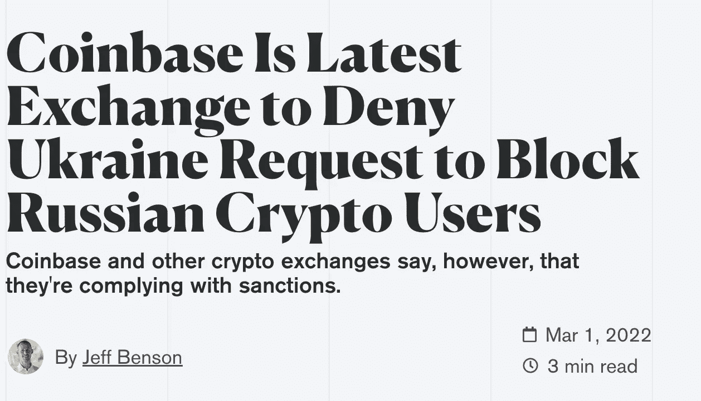
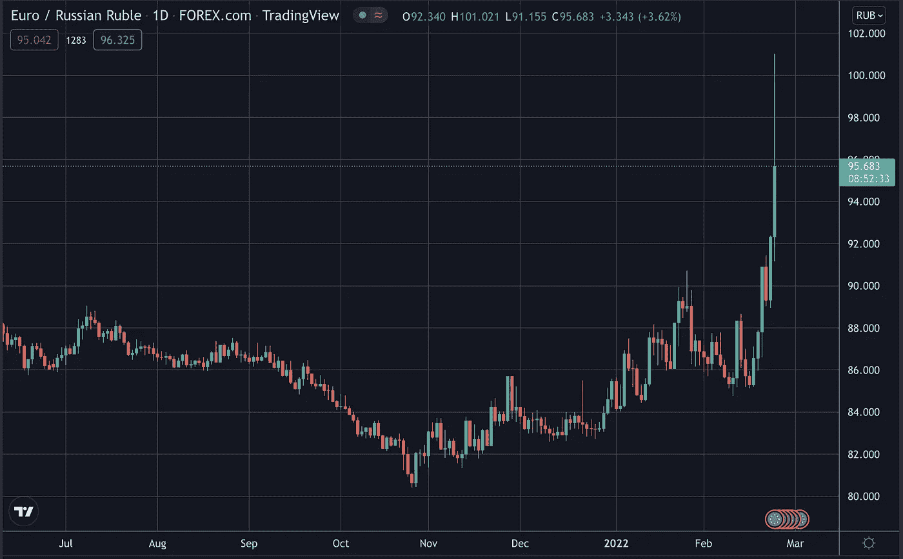
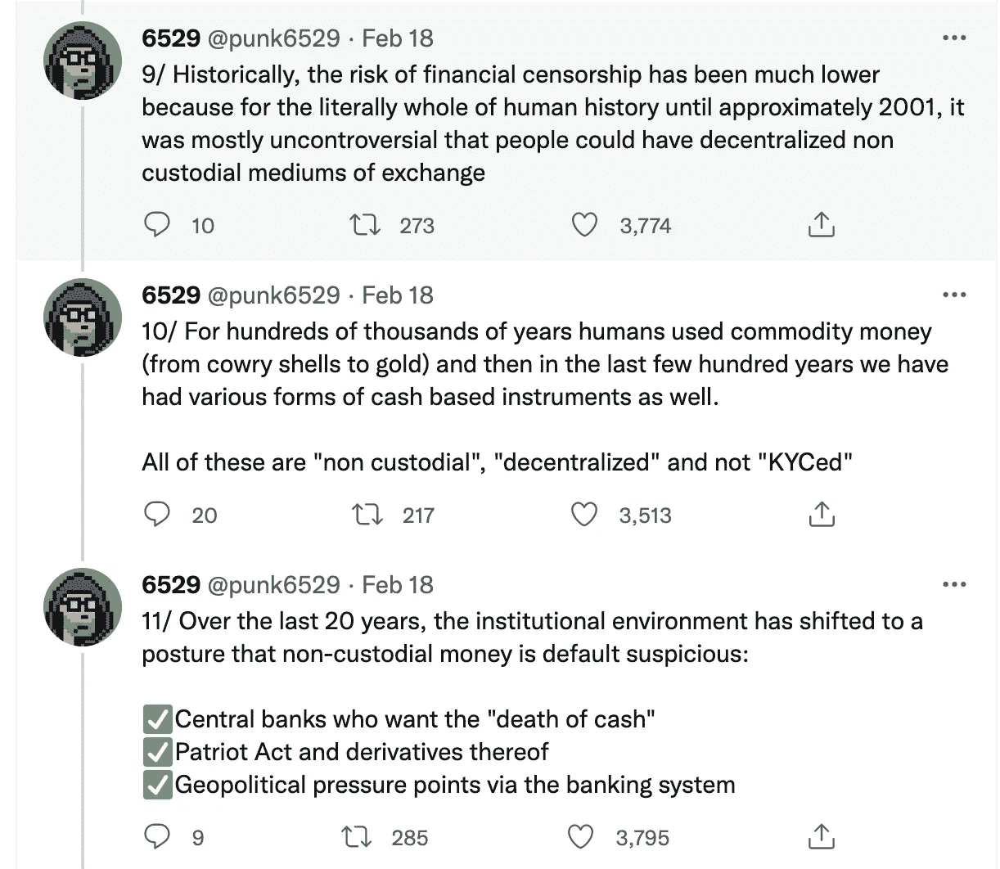

# SWIFT、金融审查、比特币标准(一)

> 原文：<https://medium.com/coinmonks/swift-financial-censorship-and-the-bitcoin-standard-i-2ee24cfe646f?source=collection_archive---------21----------------------->

从俄罗斯的战争制裁到加拿大政府冻结指定用于资助渥太华封锁的捐款，人们正在经历新一轮的金融取消。资本在政治上是中立的，但它的使用或分配方式可能并非如此。

被强行从对全球、本地甚至点对点贸易至关重要的工具中移除，是一个超越意识形态分歧的令人担忧的问题——不管你是亲俄罗斯还是亲乌克兰。主观的价值判断不应成为终止个人基本交易权的理由。

Cryptos 被广泛认为是抗审查的，但 crypto exchanges 不是。乌克兰要求六大加密交易所[关闭](https://www.coindesk.com/policy/2022/02/28/ukraine-asks-binance-coinbase-6-other-crypto-exchanges-to-block-russian-users/)卢布与加密货币配对的现货市场。政府还要求交易所封锁所有俄罗斯客户，以阻止任何形式的卢布资产外逃，从而加强西方施加的制裁。

比特币基地同意禁止被列为制裁对象的个人和实体，但拒绝将禁令扩大到普通俄罗斯平民，并表示他们的使命是继续“增加经济自由”

然而，如果美国在法律上要求交易所遵守这一要求，那该怎么办？正如北海巨妖首席执行官 Jesse Powell[之前在推特](https://twitter.com/jespow/status/1494823102454239237)上发布的加拿大政府冻结与“自由车队”卡车司机抗议活动有关的账户的消息，他说交易所“被迫遵守”关闭相关账户，因此建议相关用户将他们的资产移出交易所。

也许，现在是时候反思把金钱武器化作为实现政治目标的惩罚手段了。

## 作为霸权力量的斯威夫特

西方禁止俄罗斯的部分银行访问环球银行间金融电信协会(SWIFT)支付网络，这是支撑全球金融交易的信息网络。SWIFT 协调全球 11，000 多家主要银行和金融机构进行跨境转账。

这是一种极其有力的惩罚。

自 2012 年被踢出 SWIFT 以来，伊朗经济一直受到重创，依然脆弱。据报道，如果俄罗斯完全脱离 SWIFT 网络，俄罗斯的国内生产总值可能缩减至 [5%](https://carnegiemoscow.org/commentary/84634) 。一些人声称，俄罗斯应该为其军事侵略受到严厉的惩罚，因此不应该对那些进行报复的人仁慈。

普通俄罗斯人，他们中的大多数可能和西方人一样鄙视这场战争，现在正面临着国内动乱，如全国性的银行挤兑和不稳定的卢布 T2 跌至历史最低点。在莫斯科和圣彼得堡街头勇敢地高呼反战口号的抗议者也成为这项全面禁令的牺牲品，一些人面临长达数年的监禁。

这不是道德悲剧，而是金融悲剧。

然而，随着价格上涨、收入和投资下降、移民导致的人力资本加速流失以及战争的进一步升级，末日将会比现在更糟。

Russian ruble has devalued more than 20% against USD

法国财政部长布鲁诺·勒梅尔(Bruno Le Maire)将 SWIFT 禁令称为“[金融核武器](https://www.politico.eu/article/frances-le-maire-not-against-cutting-russia-out-of-swift/)”，其影响可能比核弹更深远。

然而，我们很少把这种迅速驱逐说成是导致普遍贫困的残忍甚至野蛮行为，因为平民基本上被隔绝在国际交易之外。迅速使西方获得压倒性支配地位的霸权力量是一种无所不包的金融独裁，它困扰着任何反对西方势力范围的反对力量。

任何国家，无论其政治正义或精明的实用主义，都不应该被赋予或拥有这种几乎扼杀另一个国家经济的不受约束的权力。如果世界担心核能被滥用，为什么它不会同样关注这种金融核武器的全能？

无论是 SWIFT，还是后来由中国和俄罗斯开发并采用的同等强大的网络，政府对数字支付的控制都存在一个根本问题。自由交易的权利不应受到意识形态差异或金融审查的影响。

## 作为宪法权利的交易自由

一个在 Twitter 上拥有超过 27.7 万粉丝的假名账户 Punk 6529，通过一条长达 56 条 tweets 的[帖子](https://twitter.com/punk6529/status/1494444624630403083)讨论了为什么交易自由应该被视为与言论、集会和宗教自由没有区别的宪法权利。这篇帖子是为了回应特鲁多政府援引紧急法案没收所有资金而写的，其中一些资金是以加密货币的形式捐赠给在渥太华实施封锁的卡车司机。

这一次是自由党冻结了账户，但下一次可能是保守党或社会民主党出于同样的目的做同样的事情——禁止他们认为非法的交易，原因我们可能永远不会知道…

为了打击洗钱和阻止与恐怖活动有牵连的资金转移，政府对交易权的侵犯已经被视为一种无可辩驳的政治正确形式:我们接受并容忍政府记录我们的支付历史并指定允许交易的目的。

"没有交易自由，就没有其他实质性的宪法权利."说朋克 6529。他补充说，事实上，那些买不起电脑设备或互联网接入的人，会被阻止行使言论自由。被禁止开立银行账户的人很可能难以获得住所和医疗保险——这在许多西方国家可能被视为一项基本人权。在当前时代，能够进行数字交易，就相当于在城市中生存的必需品。

此外，隐私和交易自由是彼此固有的。想想看:如果有第三方记录和审查在线对等对话，我们还能声称言论自由完好无损吗？交易自由取决于没有政府和银行等第三方密切监控资金在账户间的流动。

这个问题远远超出了俄罗斯入侵乌克兰所体现的意识形态冲突。政府权力的扩张——由法律授权跟踪、阻止和终止交易——早在数字支付出现时就开始了，取代现金成为主要的交易媒介。

## 金融审查

数字银行的逐步发展概括了金融审查制度的形成。数字应用的历史使银行转账成为主要的支付方式，取代了现金的普遍性，这也是一部将现代银行业武器化以侵犯交易权的历史。

正如朋克 6529 所言，几千年来，我们彼此之间的交易不受金融机构规范要求的限制。如今，“了解你的客户”和“保管”是银行在任何地方维持运营的强制性要求。然而，数字支付极大地提高了交易效率，但也付出了牺牲客户隐私的代价。

如果我们对大型技术公司不恰当地收集和滥用个人数据有问题，为什么我们不能质疑金融机构要求所有私人信息的合法性？谷歌通过向广告公司出售我们的数据获取巨额利润，而银行收集我们的数据仅仅是为了遵守相关法律，这使得人们不断地向看似美好的事业屈服。

银行了解银行转账的收款人和汇款人的身份；对于超过一定限额的金额，汇款人需要告诉他们汇款背后的原因。从什么时候开始——我们发现将政府监管扩大到如此程度是可以接受的？

数字化银行为金融机构的武器化铺平了道路。如果最近的历史告诉我们什么的话，那就是不能指望金融中介站在少数人或不受欢迎的声音一边。

## 作为最后阶段的 CBDCs

央行数字货币(CBDCs)将是政府追踪交易和限制特定个人进行支付的下一个即将采用的致命武器。在一个现金被禁止或效用很小的世界里，购买习惯和支付历史将由第三方记录、收集和分析，我们对其扩展权限没有任何线索。CBD 是权力集中的一个缩影，剥夺了个人的隐私，并赋予国家更大的权力来监督其公民。

那我们怎么能确定执政党没有利用这种技术来压制异见人士呢？不受约束的政府权力可能会给整个民主国家带来前所未有的后果。

尽管存在意识形态上的差异，但各国政府可能会从以下三个普遍诉求中引入 CBD:

1.  通过 CBDCs 进行的所有交易都被政府记录、跟踪和监督，因此腐败、洗钱和其他形式的非法活动可以得到极大的遏制。
2.  逃税问题得到有效解决。
3.  现金被扼杀，支付的匿名性也被扼杀。

有些人可能会说，如果你没有做错什么，你一直都是无辜的，你为什么要担心 CBDCs 和针对非法交易手段的措施？

担心中国实施的公共监控或信用评分系统的人倾向于认为一个权力有限的政府更符合人民的利益。他们在很大程度上被认为是自由主义者，优先考虑小政府，而不是对公民拥有至高无上权力的大政府。

是的，归根结底，这是一个意见分歧，但比特币标准的概念可能是双方都可以考虑的一个选择。

我们将在下一篇文章中详细讨论。

> 加入 Coinmonks [电报频道](https://t.me/coincodecap)和 [Youtube 频道](https://www.youtube.com/c/coinmonks/videos)了解加密交易和投资

# 另外，阅读

*   [最佳期货交易信号](https://coincodecap.com/futures-trading-signals) | [流动性交易回顾](https://coincodecap.com/liquid-exchange-review)
*   【Huobi 的加密交易信号 | [Swapzone 审查](/coinmonks/swapzone-review-crypto-exchange-data-aggregator-e0ad78e55ed7)
*   最佳[密码交易机器人](https://coincodecap.com/best-crypto-trading-bots) | [购买索拉纳](https://coincodecap.com/buy-solana) | [矩阵导出评论](https://coincodecap.com/matrixport-review)
*   [Coldcard 评论](https://coincodecap.com/coldcard-review) | [BOXtradEX 评论](https://coincodecap.com/boxtradex-review)|[uni swap 指南](https://coincodecap.com/uniswap)
*   [比特币基地评论](/coinmonks/coinbase-review-6ef4e0f56064) | [德里比特评论](/coinmonks/deribit-review-options-fees-apis-and-testnet-2ca16c4bbdb2) | [FTX 评论](/coinmonks/ftx-crypto-exchange-review-53664ac1198f)
*   [n 零审核](/coinmonks/ngrave-zero-review-c465cf8307fc) | [Phemex 审核](/coinmonks/phemex-review-4cfba0b49e28) | [PrimeXBT 审核](/coinmonks/primexbt-review-88e0815be858)
*   最佳[区块链分析](https://bitquery.io/blog/best-blockchain-analysis-tools-and-software)工具| [赚比特币](/coinmonks/earn-bitcoin-6e8bd3c592d9)
*   [Cloudbet 赌场评论](https://coincodecap.com/cloudbet-casino-review) | [点火赌场评论](https://coincodecap.com/ignition-casino-review)
*   [加密套利](/coinmonks/crypto-arbitrage-guide-how-to-make-money-as-a-beginner-62bfe5c868f6)指南| [如何做空比特币](/coinmonks/how-to-short-bitcoin-568a2d0b4ae5)