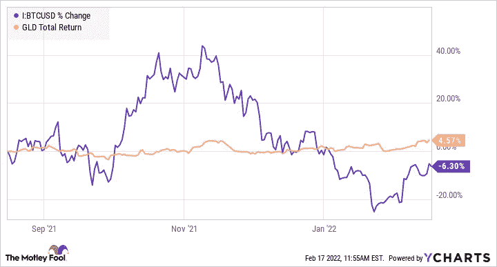

# SWIFT，金融审查，比特币标准(二)

> 原文：<https://medium.com/coinmonks/swift-financial-censorship-and-the-bitcoin-standard-ii-5bce18a02256?source=collection_archive---------25----------------------->

(你可以在这里阅读文章的第一部分)

迄今为止，对俄罗斯实施的最严厉的制裁未能阻止或暂时停止俄罗斯的军事侵略。随着各国加快通过替代货币结算国际交易的步伐，在地缘政治冲突中经常诉诸制裁的美国及其盟友因威胁美元标准的武器化行为而受到[的强烈批评。](https://thehill.com/opinion/finance/596116-the-weaponization-of-finance-may-threaten-the-future-of-the-dollar-standard)

毫无疑问，加密货币因其解除制裁的潜力而再次引起关注。一些人将最近比特币的上涨归因于俄罗斯投资者对卢布崩溃的恐慌，因此放弃了贬值的货币，转而使用比特币。他们希望通过持有既安全又能抵御制裁的资产来保持购买力。据报道，美国财政部正在[针对](https://decrypt.co/94273/yellen-treasury-monitor-crypto-sanctions-evasion)受制裁的实体和个人，他们可能会寻求比特币等数字资产作为逃避制裁的手段。

与此同时，乌克兰政府已经收到了价值 3500 万美元的加密货币捐赠，包括 [Dogecoin](https://www.cnbc.com/2022/03/02/ukraine-dogecoin-other-cryptocurrencies-accepted-for-donations.html) ，所有 meme 硬币中的国王，以及更多。加密交易的快速性、安全性和隐私性优于通常需要几天才能完成的银行转账，并且牵涉到繁琐的官僚程序。对于像乌克兰这样面临被外国吞并威胁的国家来说，日子可能是生死攸关的事情。

加密货币的突出特点在上述场景中得到了有力的展示。加密货币作为一种资产类别显示出巨大的优势，不一定具有挑战性，但补充了自尼克松政府在 1971 年放弃金本位制后实施的美元本位制。

在所有的加密货币中，比特币仍然是最强最有前景的。比特币标准可能会成为保护交易自由和金融隐私权利的新货币体系的基础，这个未来可能不会是革命性的，但肯定会修正我们目前的状况。

## 比特币作为一种商品

比特币最初旨在促进用于绕过金融审查的点对点交易，并为个人重获金融尊严。其内置的工作验证机制，节点在计算机网络中存储和处理，没有记录交易信息的中央“服务器”，保证了前所未有的去中心化水平。

比特币的诞生在很大程度上是对 2008 年金融危机的反动反应，是对企业银行体系和负责货币和财政政策的机构的明显不信任

但是为什么是比特币呢？为什么不是 USDC、瑞士联邦理工学院或 Dogecoin？

首先，比特币被美国商品期货交易委员会(CFTC)视为像黄金和石油一样的商品，因为 1)没有一个共同的企业控制比特币，2)它有 2100 万枚可供开采的有限上限。

然而，这种分类可能不适用于其他加密货币，如市值第二大的加密货币 ETH。Ethereum 向股权证明机制的过渡可能使其成为一种证券，因为其股权机制可以产生无限数量的 ETH，并要求交易验证者持有至少 32 个 ETH。

这就是比特币作为价值储存手段的特殊之处，与其他可能作为证券受到监管的加密货币不同。通货紧缩，供应有限，编程减半，每四年减少一半的开采率，比特币本质上是一种稀缺资产，不同于市场上流通的大多数加密货币。

A bitcoin mining site

相比之下，通过发行类似股票的代币来筹集资金并让投资者获得项目产生的利润的加密业务是类似于上市公司的中央集权实体。在这种情况下，持有数字代币就像持有一家公司的股票——预期代币在未来会变得更有价值。这样，通过协调的令牌组学，细分的所有权被完全资本化。

这一区别非常重要，因为证券销售受到美国和其他国家政府的严格监管，而比特币可能会作为一种商品受到监管。

## 投机还是规避风险

比特币被设计成真正的去中心化，因为它不会从普通企业产生回报，也没有人能够控制或破坏比特币网络(我将在后面解释)。尽管比特币被有影响力的人誉为“数字黄金”，但它仍处于一种模糊的状态，在作为一种像成长型股票一样的投机资产(可能在几周内损失 50%)和作为一种在不确定时期往往会飙升的避险资产之间波动。

随着乌克兰危机的经济影响逐渐显现，溢出效应预计将蔓延至其他地区，比特币价格与其他类似大宗商品的货币一起上涨。随着油价继续突破 2011 年设定的上限，比特币在 7 天内上涨逾 20%，黄金也正在进入接近每盎司 2000 美元的价格探索区。

但是，当查看黄金/比特币图表时，不难看出，与比特币相比，黄金在市场不确定的情况下保持了令人印象深刻的稳定，而比特币则经历了大幅波动。如果我们将图表延展到更长的时间框架，我们甚至可以发现，自黄金诞生以来，BTC 兑黄金一直在升值。比特币能否最终取代 10 万亿美元的黄金市场——几乎是现在比特币的 10 倍？

比特币被广泛宣传为一种替代的安全资产，而图表却显示了相反的情况。自 2021 年下半年以来，比特币的交易一直与增长股票饱和的纳斯达克指数密切相关，这意味着比特币被市场视为一种风险资产。它的高波动性和不可预测性仍然是传统投资者的障碍。在乌克兰危机在更广泛的市场情绪中得到充分反映之前，自去年 11 月以来，比特币和中端成长型股票一直在稳步下跌。

Bitcoin has been traded in closely correlated with S&P 500

因此，比特币不太可能被视为规避风险的资产，比如黄金或美元，在最近的历史中，美元从未在一天之内下跌 20%。从长远来看，随着美联储无意大举逆转低利率政策并停止印钞，预计美元将逐渐贬值。比特币可能会继续处于这种矛盾状态——在通胀依然高涨的情况下被抛售，但每当地缘政治不确定性加深时就会反弹，引发一波又一波的金融动荡。

## 金本位制

罗斯福政府通过[第 6102 号行政命令](https://mises.org/library/great-gold-robbery-1933)没收了所有的金条和金币，迫使公民以远低于 20 世纪 30 年代市场价格出售[。这发生在金本位时代——当时美联储印制的每张美元纸币都必须标明黄金储备的数量。](https://www.exponentialinvestor.com/commodities/if-you-hold-gold-should-you-be-worried-about-executive-order-6102/)

没收黄金是一项有争议的法案，旨在使政府能够印制更多的货币来刺激经济走出萧条，从而减少市场上流通的黄金的总供应量。

这一事件反映了比特币和黄金等通货紧缩货币的内在问题。在金融危机时期，例如，2020 年 3 月新冠肺炎疫情的爆发，如果我们坚持黄金或比特币标准，美联储将无法“印钱”来刺激经济，重复大萧条悲剧的金融灾难将是不可避免的。因此，任何储备货币的固定供应都会削弱美联储根据经济状况调整货币政策的能力。

美联储推出了无情的量化宽松措施，并将利率降至接近零的水平，这促使人们质疑其政策的完整性。当前问题根源的对立面可能不是当前混乱局面的最有效解决方案，但我们往往倾向于以这种方式思考。事实上，我们既需要通缩货币，也需要通胀货币来维持健康的经济。

## 比特币标准？

正如专家和加密评论家所声称的那样，现实地说，比特币和其他加密货币不太可能被用来逃避制裁，因为目前加密市场的规模提供了有限的交易流动性——区块链协会政策负责人杰克·切尔文斯基也持这一观点。

这一障碍不是基于加密货币的属性或技术，而是当前市场规模的限制。当加密货币发展到十几万亿的市场规模，数十亿用户采用分散钱包进行日常交易时，加密货币将成为政府实施制裁的真正挑战。

理想情况下，无论你是亲乌克兰的，[向与乌克兰政府有联系的分散钱包捐赠](https://www.coindesk.com/business/2022/02/26/ukrainian-government-is-seeking-crypto-donations/)密码，还是亲俄罗斯的，试图帮助平民甚至执政党获得密码以保持购买力，你都不会被任何力量阻止，因为交易的权利应该是受宪法保护的基本权利。

然而，它不是！

在追求绕过美元霸权的替代标准的过程中，未来的一大步将是让比特币价格与美元脱钩。1 比特币不等于 4 万美元或 5 万美元；而是 1 个比特币值 1 个比特币。一处房产价值 10 BTC；一特斯拉值 1 BTC。

句号。

一旦比特币作为价值储存手段被普遍接受，随着越来越多的人采用，以及像[lighting Network](https://cointelegraph.com/bitcoin-for-beginners/what-is-the-lightning-network-in-bitcoin-and-how-does-it-work)这样的第二层网络以更低的成本和更快的速度处理交易，比特币标准自然会到来。

作为附属加密银行的交易所，一种取代传统机构的新中介，继续蓬勃发展，部分原因是存在为金融资产提取加密货币的巨大需求。

在乌克兰政府收到所有捐款后，它仍然必须在集中交易所“兑现”，在那里他们将密码兑换成法郎。我们需要信用卡来支付账单和购买杂货。这就是为什么，对于大多数加密用户来说，最后一步总是在受到监管机构密切监督和进一步审查的交易所结束。

未来，人们可能会将 BTC 货币兑换成 USDC 货币，与他们道明银行账户中的美元 1:1 挂钩。美元和加密货币可以共存。人们会根据自己的具体需求来决定哪种货币更实用。

正如世界上最大的密码交易所的创始人兼首席执行官赵昌鹏在推特上所说，我们不需要交易所使用密码，我们需要的只是一个由开源技术推动的去中心化钱包。

我们能想象并努力创造一个加密货币与金融工具共存的未来吗？人们可以选择用密码或现金支付，用 BTC 或你的支票账户中的美元支付账单，还可以申请 BTC 住房抵押贷款。

可能吗？

> 加入 Coinmonks [电报频道](https://t.me/coincodecap)和 [Youtube 频道](https://www.youtube.com/c/coinmonks/videos)了解加密交易和投资

# 另外，阅读

*   [5 款最佳加密交易终端](https://coincodecap.com/crypto-trading-terminals) | [最佳 DeFi 应用](https://coincodecap.com/best-defi-apps)
*   [在美国如何使用 BitMEX？](https://coincodecap.com/use-bitmex-in-usa) | [BitMEX 审查](https://coincodecap.com/bitmex-review)
*   [最佳期货交易信号](https://coincodecap.com/futures-trading-signals) | [流动性交易所评论](https://coincodecap.com/liquid-exchange-review)
*   [南非的加密交易所](https://coincodecap.com/crypto-exchanges-in-south-africa) | [BitMEX 加密信号](https://coincodecap.com/bitmex-crypto-signals)
*   [MoonXBT 副本交易](https://coincodecap.com/moonxbt-copy-trading) | [阿联酋的加密钱包](https://coincodecap.com/crypto-wallets-in-uae)
*   [Remitano 审查](https://coincodecap.com/remitano-review)|[1 英寸协议指南](https://coincodecap.com/1inch) | [购买 Floki](https://coincodecap.com/buy-floki-inu-token)
*   [MoonXBT vs Bybit vs 币安](https://coincodecap.com/bybit-binance-moonxbt) | [Arbitrum:第二层解决方案](https://coincodecap.com/arbitrum)
*   [买 PancakeSwap(蛋糕)](https://coincodecap.com/buy-pancakeswap)|[matrix export Review](https://coincodecap.com/matrixport-review)
*   [最佳免费加密信号](https://coincodecap.com/free-crypto-signals) | [YoBit 评论](/coinmonks/yobit-review-175464162c62) | [Bitbns 评论](/coinmonks/bitbns-review-38256a07e161)