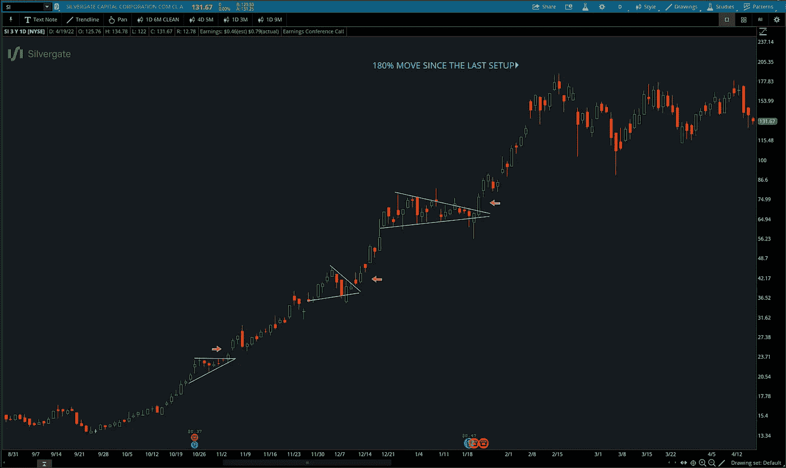

# 摇摆交易:你需要知道的

> 原文：<https://medium.com/coinmonks/swing-trading-what-you-need-to-know-ac28a872fd81?source=collection_archive---------21----------------------->

## 通过搜索互联网，很明显，很多人不太了解波段交易。在这篇文章中，我们将看看一些最常见的问题和误解。

***什么是摇摆交易？***
摇摆交易和日内交易的主要区别在于时间跨度。波动交易通常被认为是持有一个头寸几天到几周，以捕捉市场中短期的波动。持有期超过几周到几个月通常被认为是持仓交易。

波段交易者倾向于把技术分析和基本面分析结合起来，形成一个图像，并建立一个关于未来走势可能性的理论。然而，许多摇摆交易者主要关注技术指标，因为它代表了市场上的大部分信息。

***为什么我在市场上需要交易设置和交易策略？***

所有成功的交易者都有预期的结果。当你进行交易时，你是在赌结果。设置让你定义一组条件，在一系列交易中给你一个积极的结果。长期来看，随机交易不会让你赚钱，而且会让你赔钱，因为你是在赌博。

然后你需要一个策略来捕捉预期的动作。当你有一个结合策略的系统，能产生积极的预期，你就有优势，你会在一系列交易中获利。

***最好的摇摆交易策略有哪些？***

有三种主要的摇摆交易策略，突破策略，回调策略和均值回归策略。人们对他们的交易策略有不同的名字，但是没有一个比其他的更好。这取决于交易者的技术水平和经验。伟大的交易者可以让所有的摇摆交易策略都奏效，但是哪种交易策略适合我呢？嗯，这要看情况，突破策略在特定的市场条件下非常有效，其他两个也一样。

当设置和交易策略运行良好时，有季节和时期。有些人喜欢突破策略，因为它们更容易发现和把握时机，而另一些人希望在被说服入场之前看到一个稳固的突破和回调。​

一种非常典型的摇摆交易方式是关注市场中已经确定的趋势，因为与摇摆交易范围或其他几乎没有优势的特殊方法相比，趋势更有可能沿着它们来的方向继续，而不是崩溃。波动交易趋势为大规模波动提供了机会，因为它们可以永远持续下去(虽然这种情况不会发生，但趋势可以持续很长时间)。当一只股票在趋势市场中走出底部时买入，成功率最高，因为它更容易被发现，有优势，有能力做出巨大的变动。

***摇摆交易真的管用吗？***
人们对各种交易风格都有误解，但是摆动交易真的有效吗？波动交易与日交易或仓位交易没有什么不同，只是持有期。你可以让所有类型的交易风格都起作用，但是你是否会用摇摆交易方法盈利完全取决于你的交易技巧。

当你选择一个专攻的时间段时，专注于适合你的生活方式和个性的时间段。通常，时间段越长，你在市场时段花在屏幕前的时间就越少。没有哪种风格优于其他风格，但有一种风格可能优于你。

***摇摆交易是赌博吗？***
网上常见的一个问题是，摇摆交易到底算不算赌博。像所有其他形式的交易一样，摇摆交易不同于赌博，因为交易者在市场上有固定的优势。这意味着在一系列的交易中，当交易者遵循一个有利可图的系统时，他会赚钱，因为这个系统内置了一个有利因素。如果系统中没有优势，交易者就只是一个赌徒。

一个常见的例子是一个赌徒和赌场，赌场有长期优势，随着时间的推移会赚钱，但赌场中每一次下注的个人结果都是随机的。然而，一个没有优势的赌徒只会经历随机的结果，即使是在很长一段时间内。赌徒可能会时不时地走运，但赌场会持续赚钱，因为系统中有内置的优势。

***如何学习摆动交易？***
波段交易赚钱的方法有很多。有不同的工具，不同的市场，不同的交易系统。如果你想学习如何摇摆交易， [**教育**](https://www.swingtradesetups.com/plans-pricing) 很重要。

发现市场中可利用的优势对新手交易者来说很困难，向别人学习会帮助你加速成为一个盈利的交易者。试图开发和研究你自己的波动交易系统可能会让你在盈利前倒退几年。

对新手的建议是模仿一个有利可图的交易系统，然后把它变成你自己的，一旦你成功了，你就可以拓展业务了。很难走相反的路。最好的方法是找一些导师和/或全面的指导。

为什么你要在日内交易中摇摆交易？
日内交易并不适合所有人。归结为性格和生活方式。有些人不想整天坐在屏幕前搜寻市场机会。

日内交易需要快速思考，不要犹豫，在整个交易过程中要全神贯注。日内交易对某些人来说更好吗？是的，但是对很多人来说，摇摆交易也比日内交易好。摇摆交易不需要白天同样的专注，许多摇摆交易者在开市前扫描并制定计划，然后在前 30 分钟执行他们的订单，然后监控全天的头寸。摆动交易需要更少的努力，所以对许多人来说，摆动交易比日交易更好。

***最佳摇摆交易平台？***
摇摆交易没有最好的交易平台。完全是个人喜好。一些平台速度很快，而另一些平台则非常具有可定制性。您应该选择适合您、您的预算和需求的平台。TC2000 是所有 swing 交易社区的通用平台。

TC2000 是一个付费的选择，所以 TD Ameritrade 的 Thinkorswim 也经常被使用，因为它是免费的。

***作为一个新手交易者，从哪里开始？一个有抱负的场内交易者应该从接受某种形式的教育开始。关于这个主题的 [**书籍**](https://www.swingtradesetups.com/best-trading-books) 有很多，但是有专业的指导肯定是最好的途径，也是最快的学习方法。然而，在这个时代，与 20 年前相比，信息超载，从骗人的信息中找出有价值的信息来源可能会很棘手。***

社交媒体平台上有许多开着豪车、过着奢华生活的欺诈大师，但巨大成功的交易者往往躲在暗处专注于自己的交易。所以，在选择 [**教育**](https://www.swingtradesetups.com/plans-pricing) 的时候，一个小贴士是避开那些宣扬淫秽结果和奢侈生活方式的服务。

***摇摆交易对新手好吗？***
摇摆交易是一种较慢的交易形式，适合新手。日内交易可能是一个非常快节奏的努力，需要快速决策。除非你学会了在一个更长的时间框架内交易，这样你就有时间去思考你的决定，摇摆交易通常是一个不错的选择。那么，对于新手来说，摇摆交易好吗？这可能是最好的开始方式，因为它不是超快的速度，但也不像持仓交易那样痛苦无聊。

一旦你掌握了摆动交易时间框架，迁移到更快的时间框架可能是一条路要走。归结到你的性格上，先试一段时间，看看是否适合你。

***作为波段交易者，什么时候应该止盈？任何风格的交易都很难获利，可能是任何系统中最难的部分，但你必须根据现实数据制定合理的卖出规则。这意味着你制定的销售规则应该基于你所做的回溯测试/研究有某种积极的预期。规则可能很简单，在 10%的收益时卖出 50%，在 20%的收益时卖出 50%，或者在上涨 3 倍时卖出。***

选择是无穷无尽的，但重要的是卖出规则是基于现实的，整个系统有一个积极的预期。例如，你不能有一个 25%胜率的系统，然后总是以 1R 获利，因为这将产生负的预期，因此没有优势。有很多方法可以变得有创意，但是要保持规则简单。

***你能摆动交易所有市场吗？***
是的，你可以摇摆交易所有市场。你可以在所有市场进行日内交易、波动交易和仓位交易。摇摆交易的一个好处是，它不需要像你一样多的杠杆和资金，在大多数情况下，你要寻找比日内交易更大的波动。

当你做日内交易时，你必须通过大量的小交易来弥补%波动的不足，不是所有的市场都适合这种交易。所以，是的，你可以在所有市场交易，尽管有些市场比其他市场更合适。

***摇摆交易时的风险管理和隔夜风险？***
关于摇摆交易的一个常见误解是夸大了隔夜缺口涨跌的风险。如果你研究过去 10 年的成千上万的图表，你会发现很多跳空上涨和跳空下跌，但是它们发生的频率有多高，我们作为波段交易者能做些什么吗？大多数图表中的许多缺口往往发生在收益季节，因此减轻缺口风险的一种方法是在收益发布前摆脱或出售大部分头寸。除非你有大量的利润作为缓冲来吸收潜在的打击，否则坚持盈利就是赌博。

另一种避免 gap 风险的方法是留意任何即将发布的新闻。例如，如果你持有一家生物技术公司的大量股票，你希望了解潜在的 FDA 新闻发布。除非你在生物技术股票方面有非常专业的能力，并且你知道你在做什么，否则你不希望通过 FDA 的试验发布，因为股票在上市前很容易下跌 50%。

通过采取这些预防措施，你将陷入不利缺口的可能性降低了巨大的%。请记住，并不是所有的新闻发布都是可以预测的，如果你决定在未来进行大量的波动交易，或者选择波动交易作为职业，缺口下跌会在某个时候发生在你身上。这就是风险管理极其重要的原因。

一个合理的规则是，永远不要把超过 30%的资金投入到一只股票上，而且要非常小心地把 100%的资金投入到类似的股票上，因为行业新闻也可能冲击市场，整个集团都可能下跌。让我们假设股票在第二天下跌了 50%,在你退出之前，你将损失你账户的 15%,相比之下，如果你投资你的整个账户，你将损失 50%。15%的损失是可控的，但 50%的损失是毁灭性的。

***你能摆动交易期权吗？***
你可以摆动交易所有工具，但摆动交易期权比摆动交易标的工具更难，因为有多种因素影响价格。

摆动交易期权消除了缺口风险，给了买方大量的杠杆，但期权卖方知道这一点，你必须支付一大笔溢价。试想一下，当你是一个保险(期权)的销售者，你知道你承担了所有的风险，难道你不想得到报酬吗？是的，作为卖方，你希望得到报酬，因此你需要高溢价，这是期权卖方的优势。他会向你收取他觉得合适的金额和他承担的风险。除非你知道自己在做什么，并且对希腊期权有深刻的理解，否则我建议你避开。

这又回到了尽可能保持简单的概念，波动交易已经够难了，复杂只会带来挫败感。

***交易中的简单和专注***
正如前面简要提到的，各种交易中的复杂性是一个巨大的干扰。摆动交易是困难的，没有人会质疑这个事实，所以为什么要增加复杂性呢？为什么这么多事情如此复杂？不只是在交易中，而是在生活中。嗯，很多人认为复杂很性感，而且很畅销。谁愿意为超级简单的东西买单，超级简单的东西是行不通的吧？不是应该很复杂吗？不，最具挑战性的任务是将过于复杂的东西转换成简单的东西，比如交易系统。

你总是想把它归结为最简单的解决方案。你不需要 10 个指标；你不需要 10 种不同的新闻服务，也不需要访问来自知名机构的价值数百万的研究。专注于眼前的事情，问问自己，什么才是重要的？这个指标给我提供了什么价值吗？最后，交易中唯一重要的是价格行为。

分析师的意见不重要，只有价格买单，RSI 指标说什么不重要，只有价格买单，美联储是否要加息也不重要，只有价格买单(除非具体到你的交易策略)。保持简单，专注于重要的事情。

***结论:***

所有形式的交易都很难，但如果你是新手，寻求合适的教育是一条路，因为它会帮你省下大量的美元和无数个小时的沮丧和愤怒。如果你正在寻找指导，我推荐你去 https://www.swingtradesetups.com 看看

> *加入 Coinmonks* [*电报频道*](https://t.me/coincodecap) *和* [*Youtube 频道*](https://www.youtube.com/c/coinmonks/videos) *了解加密交易和投资*

# 另外，阅读

*   [3 商业评论](/coinmonks/3commas-review-an-excellent-crypto-trading-bot-2020-1313a58bec92) | [Pionex 评论](https://coincodecap.com/pionex-review-exchange-with-crypto-trading-bot) | [Coinrule 评论](/coinmonks/coinrule-review-2021-a-beginner-friendly-crypto-trading-bot-daf0504848ba)
*   [莱杰 vs Ngrave](/coinmonks/ledger-vs-ngrave-zero-7e40f0c1d694) | [莱杰 nano s vs x](/coinmonks/ledger-nano-s-vs-x-battery-hardware-price-storage-59a6663fe3b0) | [币安评论](/coinmonks/binance-review-ee10d3bf3b6e)
*   [Bybit Exchange 评论](/coinmonks/bybit-exchange-review-dbd570019b71) | [Bityard 评论](https://coincodecap.com/bityard-reivew) | [Jet-Bot 评论](https://coincodecap.com/jet-bot-review)
*   [3 commas vs crypto hopper](/coinmonks/3commas-vs-pionex-vs-cryptohopper-best-crypto-bot-6a98d2baa203)|[赚取加密利息](/coinmonks/earn-crypto-interest-b10b810fdda3)
*   最好的比特币[硬件钱包](/coinmonks/hardware-wallets-dfa1211730c6) | [BitBox02 回顾](/coinmonks/bitbox02-review-your-swiss-bitcoin-hardware-wallet-c36c88fff29)
*   [BlockFi vs 摄氏](/coinmonks/blockfi-vs-celsius-vs-hodlnaut-8a1cc8c26630) | [Hodlnaut 点评](/coinmonks/hodlnaut-review-best-way-to-hodl-is-to-earn-interest-on-your-bitcoin-6658a8c19edf) | [KuCoin 点评](https://coincodecap.com/kucoin-review)