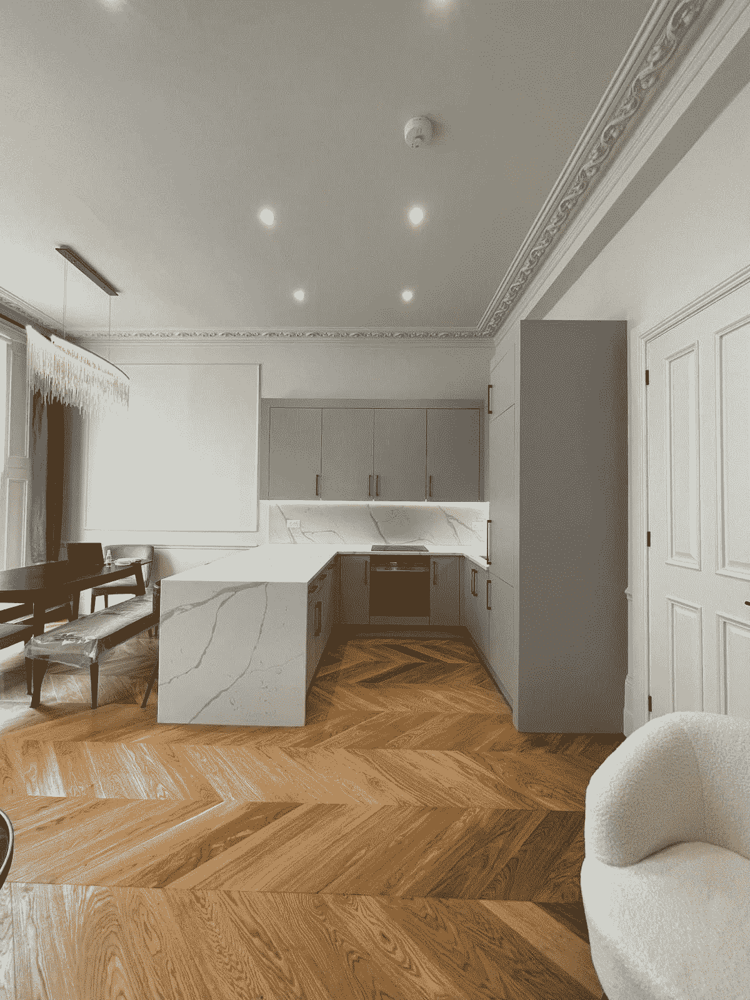
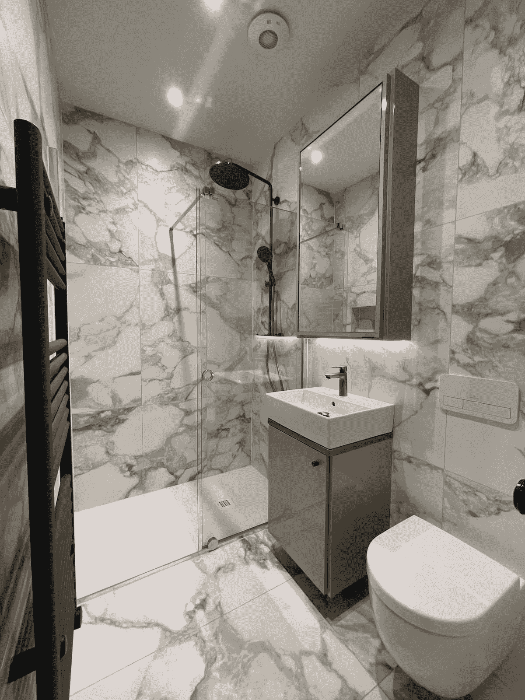

# 揭开第一批 Swix 酒店的面纱

> 原文：<https://medium.com/coinmonks/swix-properties-reveal-7c5d135b7757?source=collection_archive---------17----------------------->

亲爱的瑞士人，

我们一直在努力将 Swix 生态系统带入生活，现在是时候更仔细地看看我们在现实世界中放置了什么。

当 Swix 向导正忙于开发 Swix 预订平台的技术，以及赌注和绑定机制的智能合同时，Swix 球探已经获得了一组伦敦房产，Swix 精灵目前正在为这些房产安装生态生活家具，准备出租。

下面先睹为快，看看前面提到的其中一个属性:

Drawing Room

Drawing Room pt.2

Open Plan Kitchen

Master Bedroom

Master Ensuite

# Swix 伦敦首发组合

一些早期的 Swixies 已经提供了必要的资源来启动一个初步的房地产投资组合，以便在通过 IDO 和 LBP 筹集的资金逐步扩张之前，实现对房地产和真实客人的概念验证。

总共有四处房产将被列入 MVP 预订平台，从位于伦敦市中心超级黄金地段的 1-3 间卧室不等。

一旦筹资完成，Swix 将开始在伦敦和另一个欧洲城市(即将宣布)的房地产扩张计划的第一个月，部署第一批资金，在第 4 周之前购买 30 套公寓。

# 寄宿家庭的新黄金标准

在 Swix，我们相信细节的重要性。我们在世界各地的理想社区提供物业，以其生活设施和设计而闻名，确保奢华、实用和家居舒适的适当平衡。Swix 酒店还通过其在标志性住宅区的定位以及靠近当地和传统而非旅游景点，提供真正的文化沉浸感。

Swix 寻求引入新的寄宿家庭住宿全球标准。每家酒店在入住前都经过仔细审查，然后升级为生态生活家具，以提高家居生态效率，并在舒适性和实用性方面进行外观改进，如:供暖和制冷、视听、电器、床和床上用品、室内室外生活的户外家具等。

# 房产元租赁

最早的财产租赁形式可以追溯到 18 世纪，当时工业化城市的发展需要一种重要的房地产持有契约形式。由于双方平等谈判的基本原则，大规模通过是成功的。最原始形式的租约的条款和条件是由最简单的要素定义的:谁、什么、什么时候和多少。

数百年后，Swix 现在将历史租约现代化为 Swix Property Meta Lease。

Swix 希望重新定义传统物业租赁价值的认知方式。通过将每份租约及其现金流标记化，Swix 现在能够释放其全部经济潜力。

Swix 引入了元租赁，即租赁所有权的 ERC1155 表示，其中包含:

1.  物业详情
2.  每个酒店的连锁预订日历
3.  租约的现值
4.  所有权证书
5.  图片库+酒店的 360 度视角

每份租约的估价考虑了租约期限、平均每晚租金和预期入住率。

**租赁期限**是合同中约定的租赁合同期限。总是可以选择通过续约来延长租约。租赁期限通常为 2 年，可续期 5 年、10 年和 15 年。

酒店的平均**每晚租金**的计算方法是，将所需时间段内的每晚租金总和除以同期的住宿天数。

预期**入住率**是租赁行业平均水平的历史数据的产物，我们将自己与社区共同决定的自主风险系数应用于该数据。

更多关于租赁估价的文章。

在 [Twitter](https://twitter.com/SwixDAO) 上关注我们，跳到我们的 [Discord](https://discord.gg/gXZAbBZbB6) 上保持更新。

# 法律免责声明:

*本文中提供的有关 Swix DAO、其加密资产、商业资产、战略和运营的信息仅用于一般信息目的，并非任何司法管辖区内与证券相关的任何证券、期权、期货或其他衍生品的正式出售要约或购买要约，其内容也不受证券法规定。本文中包含的信息不应被视为买卖或持有此类证券的建议或出售此类证券的要约。此中等职位不考虑也不提供任何税务、法律或投资建议或意见，关于任何人的具体投资目标或财务状况。Swix DAO 及其代理人、顾问、董事、高级职员、员工和股东对这些信息的准确性不作任何明示或暗示的陈述或保证，Swix DAO 明确否认可能基于这些信息或其中的错误或遗漏的任何及所有责任。Swix DAO 保留随时部分或全部修改或替换此处包含的信息的权利，并且没有义务向接收方提供修改后的信息或通知接收方。本媒体帖子中包含的信息取代之前任何关于相同、相似或相关信息的媒体帖子或对话。此处未包含的任何信息、陈述或声明不得用于任何目的。Swix DAO 或其任何代表均不对您或任何人因您或您的任何代表使用本媒体帖子中的信息或因本媒体帖子中的信息遗漏而承担任何合同、侵权、信托或其他责任。此外，Swix DAO 没有义务就第三方对本文所讨论的问题的期望或声明发表评论。*

> 加入 Coinmonks [电报频道](https://t.me/coincodecap)和 [Youtube 频道](https://www.youtube.com/c/coinmonks/videos)了解加密交易和投资

# 另外，阅读

*   [如何开始通过加密贷款赚取被动收入](https://coincodecap.com/passive-income-crypto-lending)
*   [BigONE 交易所评论](/coinmonks/bigone-exchange-review-64705d85a1d4) | [电网交易机器人](https://coincodecap.com/grid-trading)
*   [氹欞侊贸易评论](https://coincodecap.com/anny-trade-review) | [CoinSpot 评论](https://coincodecap.com/coinspot-review)
*   [新加坡十大最佳密码交易所](https://coincodecap.com/crypto-exchange-in-singapore) | [收购 AXS](https://coincodecap.com/buy-axs-token)
*   [投资印度的最佳加密软件](https://coincodecap.com/best-crypto-to-invest-in-india-in-2021) | [WazirX P2P](https://coincodecap.com/wazirx-p2p)
*   [7 个最佳零费用加密交易平台](https://coincodecap.com/zero-fee-crypto-exchanges)