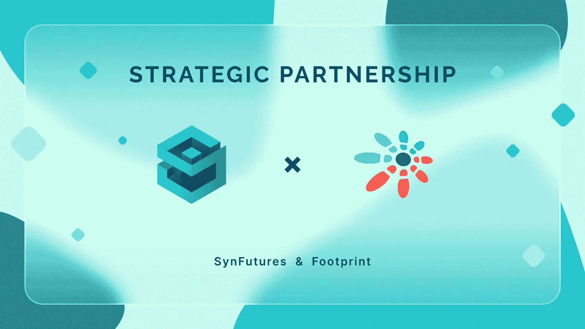

# SynFutures 与足迹分析合作，创建内部仪表板并提供有价值的数据

> 原文：<https://medium.com/coinmonks/synfutures-partners-with-footprint-analytics-to-create-internal-dashboard-and-provide-valuable-data-4c20bf8c0df?source=collection_archive---------87----------------------->

SynFutures 的团队很高兴地宣布我们与 [Footprint Analytics](https://www.footprint.network/) 的合作，这是一个发现和可视化区块链数据的分析平台。Footprint Analytics 将为我们的衍生品交易所带来创新的数据分析工具和专业知识，使我们能够轻松访问重要的内部数据，并识别趋势和机会，以扩展我们在 DeFi 领域的产品。

Footprint Analytics 于 2021 年推出，使用人工智能模型和数据处理技术来大规模收集和清理来自多个不同链的数据。足迹分析将任何人都可以使用的拖放图表功能与强大的专有链上数据处理技术相结合。在过去的 6 个月里，该平台的用户已经增长到了 20，000 人，最近在一轮种子资金中筹集了 150 万美元。

Footprint 将为 SynFutures 创建一个定制的多链仪表板，以显示最新的数据，包括 TVL、市值、交易信息等，以帮助我们的团队在内部监控项目，并让用户了解重要的里程碑。

此外，SynFutures 和 Footprint 将探索合作和营销机会，突出 Footprint 在区块链数据、透明度和其他主题方面的专业知识。

“能够访问数据对于区块链领域的任何项目都很重要，但作为一名 DEX，我们的数据在不断变化。在任何时候，我们都需要能够访问实时信息，”SynFutures 的联合创始人兼首席执行官 Rachel Lin 说。“凭借 Footprint 的专业知识和工具，SynFutures 将能够继续我们的增长轨迹，因为我们准备推出 V2，并欢迎今年更多的生态系统更新。”

Footprint Analytics 的联合创始人兼首席执行官 Navy 表示:“为 DeFi 协议提供数据服务并帮助其运营一直是 Footprint 的重要使命。“我们很高兴成为 SynFutures 生态系统的一部分。Footprint 将为 SynFutures 提供可访问、易于使用的数据和工具，以服务于其增长。”

敬请关注我们与足迹分析合作的更多信息。

**关于 SynFutures**

SynFutures 是一家下一代衍生品交易所，致力于通过在任何设备上以适当的价格进行交易来创建一个开放和无信任的衍生品市场。通过培育自由市场和最大限度地增加可交易资产的种类，SynFutures 正在降低衍生品市场的准入门槛，为数字资产创造一个更加公平的交易市场。

[网站](https://www.synfutures.com/) | [YouTube](https://www.youtube.com/watch?v=jiVP5TIk4P8) | [推特](https://twitter.com/SynFuturesDefi) | [不和](https://discord.com/invite/qMX2kcQk7A) | [电报](https://t.me/synfutures_Defi) | [Github](https://github.com/SynFutures)

**关于足迹分析**

足迹分析是一个一体化的分析平台，用于可视化区块链数据和发现见解。它清理和整合链上数据，因此任何经验水平的用户都可以快速开始研究令牌，项目和协议。凭借一千多个仪表板模板和一个拖放界面，任何人都可以在几分钟内构建自己的定制图表。发掘区块链数据，发现项目背后的价值趋势。

[网站](https://www.footprint.network/) | [推特](https://twitter.com/Footprint_DeFi) | [不和](https://discord.com/invite/3HYaR6USM7) | [电报](https://t.me/joinchat/4-ocuURAr2thODFh)|[Youtube](https://www.youtube.com/channel/UCKwZbKyuhWveetGhZcNtSTg)|[Linkedin](https://www.linkedin.com/company/footprintanalytics/people/)

> 加入 Coinmonks [电报频道](https://t.me/coincodecap)和 [Youtube 频道](https://www.youtube.com/c/coinmonks/videos)了解加密交易和投资

# 另外，阅读

*   [XT.COM 评论](https://coincodecap.com/profittradingapp-for-binance) | [币安评论](https://coincodecap.com/xt-com-review)
*   [SmithBot 评论](https://coincodecap.com/smithbot-review) | [4 款最佳免费开源交易机器人](https://coincodecap.com/free-open-source-trading-bots)
*   [比特币基地僵尸程序](/coinmonks/coinbase-bots-ac6359e897f3) | [AscendEX 审查](/coinmonks/ascendex-review-53e829cf75fa) | [OKEx 交易僵尸程序](/coinmonks/okex-trading-bots-234920f61e60)
*   [如何在印度购买比特币？](/coinmonks/buy-bitcoin-in-india-feb50ddfef94) | [WazirX 评论](/coinmonks/wazirx-review-5c811b074f5b)
*   [CryptoHopper 替代品](/coinmonks/cryptohopper-alternatives-d67287b16d27) | [HitBTC 审查](/coinmonks/hitbtc-review-c5143c5d53c2)
*   [CBET 评论](https://coincodecap.com/cbet-casino-review) | [库科恩 vs 比特币基地](https://coincodecap.com/kucoin-vs-coinbase)
*   [折叠 App 审核](https://coincodecap.com/fold-app-review) | [Kucoin 交易机器人](/coinmonks/kucoin-trading-bot-automate-your-trades-8cf0ca2138e0) | [Probit 审核](https://coincodecap.com/probit-review)
*   [如何匿名购买比特币](https://coincodecap.com/buy-bitcoin-anonymously) | [比特币现金钱包](https://coincodecap.com/bitcoin-cash-wallets)
*   [币安 vs FTX](https://coincodecap.com/binance-vs-ftx) | [最佳(SOL)索拉纳钱包](https://coincodecap.com/solana-wallets)
*   [比诺莫评论](https://coincodecap.com/binomo-review) | [斯多葛派 vs 3Commas vs TradeSanta](https://coincodecap.com/stoic-vs-3commas-vs-tradesanta)