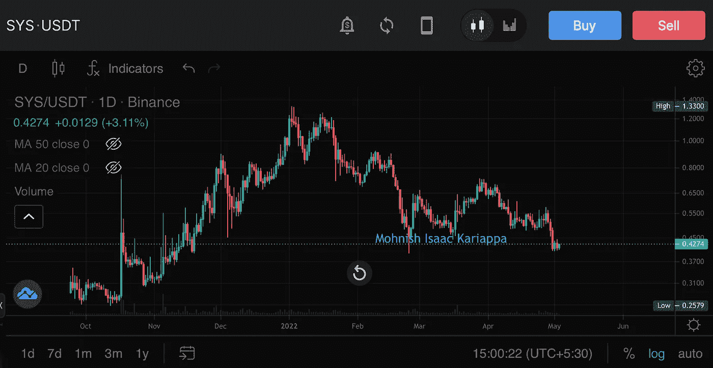
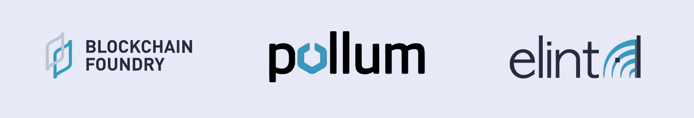
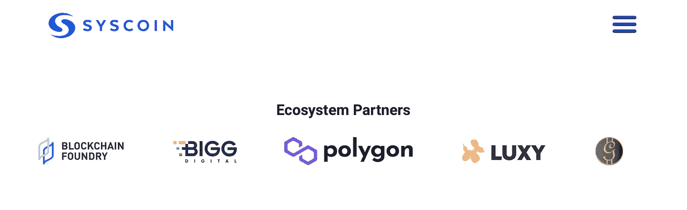
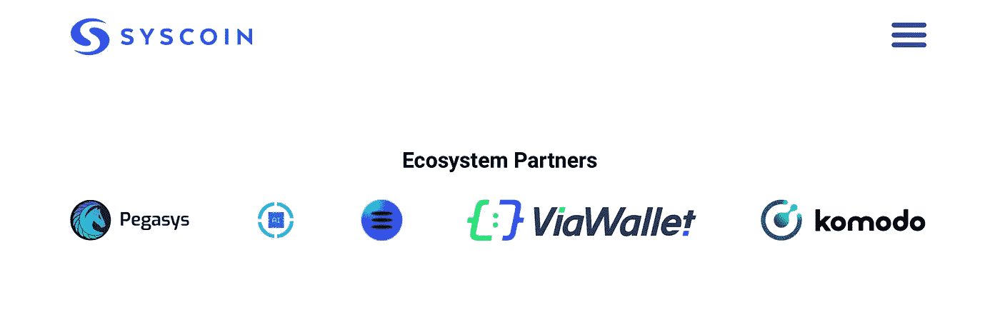
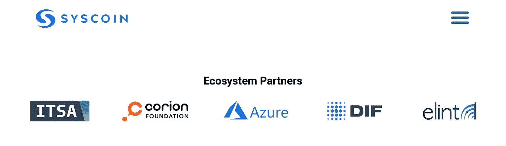
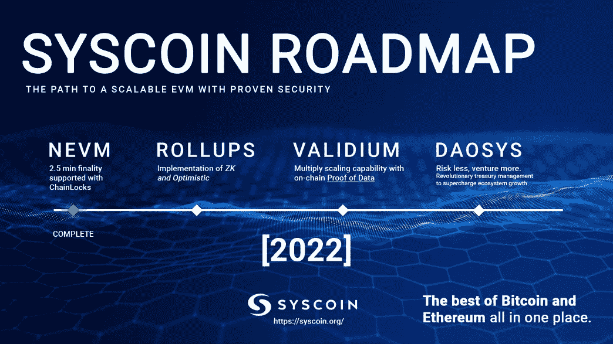
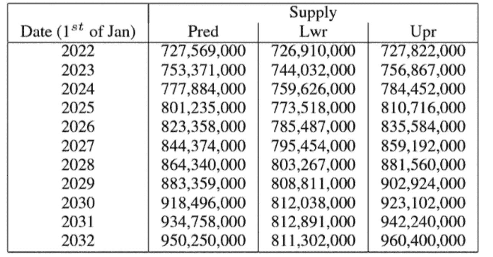

# Syscoin:打造密码的未来

> 原文：<https://medium.com/coinmonks/syscoin-building-the-future-of-crypto-295e7f47a6c8?source=collection_archive---------13----------------------->

# CoinDCXpathbreaker

今天，我们将深入探讨 **Syscoin** 项目，并尝试了解该项目的基本特征，如**令牌组学、路线图、团队、白皮书—** 以帮助您做出明智的投资决策

项目:**Syscoin**；交易所列表: **$SYS**

SYS/USDT on CoinDCX Pro app

**Syscoin** 可在 [CoinDCX](https://coindcx.com/) Pro 上以**USDT**BTC 对交易

为**coincxpathbreaker**计划准备的报告

日期:2022 年 4 月 26 日

# 简介:

直接引自 [Syscoin 网站](https://syscoin.org/about):

> “Syscoin 是一个去中心化的开源项目，由 Blockchain Foundry 的创始人于 2014 年创立，他们仍然是 Syscoin 的核心开发者。核心项目从 2019 年开始接受 Syscoin 基金会的指导。”

**白皮书引用:**

> “为分散式 Web 3.0 业务应用程序构建的点对点电子现金系统”

**通过网络的合同可用性:**

只有$SYS 的包装版本才有合同地址。购买$SYS 的最佳方式是通过中央交易所，如 CoinDCX

## 审计报告:

项目审计已经由 **USBC** (美国区块链公司)完成。

在他们的报告中提到的一个令人担忧的领域是 43%的项目 Masternodes 由一个提供商托管，即数字海洋。这种集中化给任何项目都带来了重大风险，投资者应该加倍小心他们的投资。

[全面审计报告](https://syscoin.org/file/audit1-syscoinnevm-usblockchainco.pdf)

## **sys coin 的独特卖点:**

第一层区块链，可随 EVMs(以太坊虚拟机)扩展，同时拥有比特币的安全性

这是一个开源协议

零知识汇总智能合同和 Validium 支持网络的未来可扩展性

NEVM(网络增强虚拟协议)= EVM(以太坊虚拟机)+ ZKP(零知识证明)-实施的最大亮点

Z-DAG(零确认有向无环图):这是一个即时结算协议，适用于整个 Syscoin 网络

主节点层服务，带安全链锁

工作证明共识模型(PoW)

使用与 EVMs 相同的工具，便于开发人员使用

目标是链上运行时 **210，000 吨/秒**(每秒交易量)，链下运行时**400 万吨/秒**。项目路线图中的更多细节

**可分 NFT**(即分数 NFT)——就像比特币被分解成 Satoshis 一样

2500 多个主动主节点，实现网络的完全去中心化和安全性

预计比**以太坊** **2.0** 提升 1000 倍(关于每秒处理的交易和每笔交易的汽油费)

**抗量子安全** (SHA256 算法)——通俗地说，该项目认为安全协议类似于**量子计算&的水平，网络将不会受到量子计算机黑客的攻击。**

🚩🚩🚩-作为一名技术爱好者，我对这些说法持超级怀疑态度，尽管我的职业或教育背景不是开发人员或工程师，所以我不是从专业知识的角度来说，而只是从逻辑的角度来说。量子级别的计算还没有问世，所以谁能知道在它的力量下什么是安全的呢？我不认为任何人应该公开宣称像 Syscoin 在量子计算和安全方面所做的那样巨大。

## **Syscoin 团队&顾问:**

SYSCOIN Foundation members

目前，该团队还没有完全多元化— 意味着在这方面还没有进行审计，而且公众对他们的了解也很有限。

如果你还想了解这个团队的更多信息，你可以查看 SYSCOIN 的 [LinkedIn 简介](https://www.linkedin.com/mwlite/company/syscoin)

我会给这个项目一个主要的危险信号🚩因为电车不是完全 doxxed，但 Syscoin 已经存在了相当长一段时间，并没有从所有这些时间的团队黑幕业务，所以我会让它为他们航行。

由于关于团队的信息很少甚至没有，我将根据项目的表现来做出判断——项目表现很好，我将在下面列出项目合作伙伴…

## **合伙人&/或风险投资者:**

作为一个开源协议，Syscoin 拥有越来越多的开发团队，他们贡献自己的时间和精力来设计可用的最佳区块链网络。通过他们的努力，Syscoin 已经成为真正规模应用的最强大的区块链解决方案设计者之一。

Contributing Partners

## **生态系统合作伙伴:**

上面的生态圈伙伴名单绝对超赞。以上图片是我拍摄的截图，因为整个合作伙伴列表是网站上一个移动的滚动条。此外，如果您想进一步了解某个特定的生态系统合作伙伴，只需点击合作伙伴徽标，网站就会将您重定向到相应的网站。漂亮的实现。

## **路线图**:

这个路线图非常简单，没有阶段分解。但老实说，在这个领域经营了这么长时间之后，他们除了努力改善已经建立的框架之外，还能做什么呢？

## **Syscoin 的 token omics:**

*   **市值 267，140，228 美元**
*   **循环供应- 638，823，588 美元系统**
*   **总供应量- 640，953，639 美元系统**
*   **最高。供应-8.88 亿系统**

**基础知识要点:**

*   $SYS 是本机令牌，用作节点挖掘者的奖励，并且是一个膨胀令牌
*   根据 Coinmarketcap 提供的数据，总供应量的 72%目前在流通中

**见下图，其中有预计的循环供应量:**

Image Source: Syscoin Discord community member

*   上图显示了采矿奖励:
*   交易费不是固定的，而是纯粹基于算法。然而，该团队仍然预计费用将远低于以太坊 2.0(不确定他们是在合并后才谈论费用，还是包括 2023 年分片的部署)
*   代币供应的分配和上述供应的授权时间表与本项目无关。由于项目的年龄(所以没有拉，诈骗等风险)
*   Syscoin 基于 PoW (Proof-of-Work)机制而不是 PoS(Proof-of-stage)机制工作，因此令牌的发行模型是不同的。

## **社交/社区参与:**

*   **推特**:[https://twitter.com/syscoin](https://twitter.com/syscoin)

2010 年 3 月加入，拥有 159，000 名粉丝。社区对他们活动的参与度非常高。经常发布更新。总体而言，Twitter 的使用非常出色。

*   **电报**:[https://t.me/Syscoin_Official](https://t.me/Syscoin_Official)

14.5k+会员。老实说，就像科斯特电报集团一样，噪音太多，无法过滤出任何有价值的信息。如果我是你，我会坚持使用他们的官方公告频道或他们的不和谐社区。

*   **不和**:[https://discord.gg/d73qTF9](https://discord.gg/d73qTF9)

13.5k+服务器成员。有一个令人惊讶的服务器通道隔离，其中还包括一个 **github bot，**这样人们就可以实时看到开发者完成的任务，如果你有技术知识可以理解的话(我不🥲).该团队非常活跃，并参与到社区的服务器中。极好的不和！

*   **Reddit**:【https://www.reddit.com/r/SysCoin/】T4

从 7.6k 会员的帖子频率来看，Reddit 上有很多社区活动。我只是在这里看了一眼，并没有深究。

## 有用的链接/信息来源:

**中等** : [系统币](https://medium.com/u/5431342d720?source=post_page-----295e7f47a6c8--------------------------------)

**LinkedIn**:[https://www.linkedin.com/company/syscoin/](https://www.linkedin.com/company/syscoin/)

**Github**:[https://github.com/syscoin/syscoin](https://github.com/syscoin/syscoin)

**货币市场基金**(CMC):[https://coinmarketcap.com/currencies/syscoin/](https://coinmarketcap.com/currencies/syscoin/)

**白皮书**:[http://syscoin.org/whitepaper.pdf](http://syscoin.org/whitepaper.pdf)

**网站**:[http://syscoin.org/](http://syscoin.org/)

要购买的上市交易所(以及兼容配对):

**CEX(集中交易所)**

*   CoinDCX(BTC USDT)

还有更多 CEX 的股票在 CoinMarket Cap 网站上市。

**DEX(分散交换)**

Pegasys(仅适用于兼容钱包的 Syscoin 网络)——BNB、BUSD、戴、PSYS、、、、wBTC、wETH、wSYS

## 总结:

研究第一层总是占用我大量的时间，因为每一条有价值的信息都必须被分离出来，我需要确保过滤掉我文章中的噪音，同时让我的读者从根本上清楚明白。我的加密知识真的很好，我可以很容易地理解技术术语，我没有技术背景，所以阅读非常高度技术性的白皮书有时成为一项任务，因为我必须在白皮书和谷歌之间跳跃。

那么，让我们从一个不同的角度来看这个问题， **Syscoin** 与其竞争对手相比表现如何？我认为白皮书非常清晰地向我们展示了其协议明显优于以太坊 2.0 的生动画面。但是，我不确定这有什么大不了。我个人认为以太坊目前是一个落后者，被其他第一层区块链的跳跃式发展远远甩在后面。

Syscoin 肯定比其大多数其他 L1s 竞争对手具有先发优势，另外，根据未来 5-10 年加密项目的预计增长，任何具有半体面技术的项目都将有足够多的市场份额，而这个项目有一半以上体面…

作为一名战俘，没有赌注回报，也没有投资的诱惑。这是一个很好的老式矿工协议。因此，对于其他人来说，这将是对$SYS 价格行为的纯粹投机性投资，这将取决于公众对建筑商采用网络的情绪(信心)。这枚硬币最适合成熟的牛市 IMO *(这不是金融建议)*

$SYS 的价格波动已经表明它本质上是超级不稳定的，没有策略或计划是不能交易的。

…

使用 CoinDCX 以简单易行的步骤开始您的交易之旅:

*   用您的姓名、电子邮件和手机号码注册
*   接受 CoinDCX 的服务条款
*   完成您的 KYC 验证并添加您的银行帐户详细信息
*   一旦批准，存款菲亚特通过您批准的银行帐户或转移加密从您的其他加密钱包，你就完成了。

**# coindcxpathbaker**