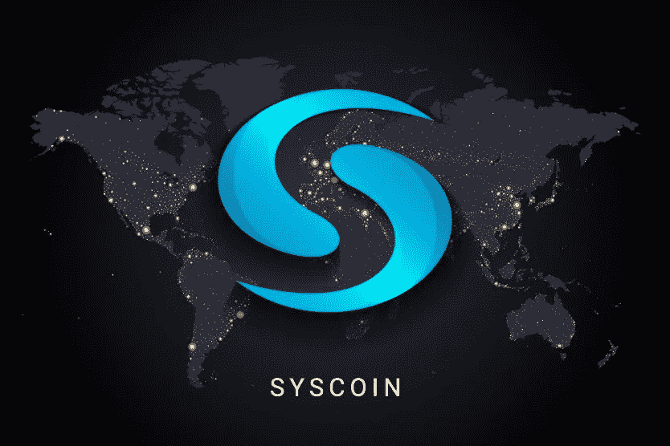

# Syscoin

> 原文：<https://medium.com/coinmonks/syscoin-dc3dcc9db247?source=collection_archive---------67----------------------->

Syscoin 诞生于在性能/成本方面提高第 1 层效率的需求。这是任何加密项目的共同目标，尤其是像 Syscoin 这样的第 1 层。随着时间的推移，该团队意识到，除了将自己定位为支付工具，他们还可以建立一个生态系统，以商店、智能合同等为基础。
Syscoin 诞生于比特币的一个分叉。

Syscoin 如何工作

区块链就像比特币一样基于 PoW，这对于网络的安全性是一个优势。我们都知道采用 PoW 系统的好处，尽管需要矿工做出巨大努力。Syscoin 拥有 EVM，这使得生态系统能够接纳以太坊网络上开发的应用程序。除此之外，Syscoin 可以管理智能合约，这是非常重要的一点。

区块链的象征

该代币名为 SYS，是主要代币，目前有 646，032，588.63 SYS 在流通(最大供应量为 888，000，000)数据取自 coinmarketcap。

Syscoin 生态系统的内容

网络允许你创建独特的数字证书，ASCII 内容。除此之外，为了简化钱包，您可以购买对应于用户地址的别名。
sys coin 网络还可以起到分散市场的作用，用户可以在没有第三方充当中介的情况下交换资源。

总之，我们可以说这个项目确实具有优秀的技术质量，并且提供了丰富系统的服务。此外，它结合了比特币的一些特性，还管理智能合约和其他服务。

> 加入 Coinmonks [电报频道](https://t.me/coincodecap)和 [Youtube 频道](https://www.youtube.com/c/coinmonks/videos)了解加密交易和投资

# 另外，阅读

*   [3 商业评论](/coinmonks/3commas-review-an-excellent-crypto-trading-bot-2020-1313a58bec92) | [Pionex 评论](https://coincodecap.com/pionex-review-exchange-with-crypto-trading-bot) | [Coinrule 评论](/coinmonks/coinrule-review-2021-a-beginner-friendly-crypto-trading-bot-daf0504848ba)
*   [莱杰 vs n rave](/coinmonks/ledger-vs-ngrave-zero-7e40f0c1d694)|[莱杰 nano s vs x](/coinmonks/ledger-nano-s-vs-x-battery-hardware-price-storage-59a6663fe3b0) | [币安评论](/coinmonks/binance-review-ee10d3bf3b6e)
*   [Bybit 交易所评论](/coinmonks/bybit-exchange-review-dbd570019b71) | [Bityard 评论](https://coincodecap.com/bityard-reivew) | [Jet-Bot 评论](https://coincodecap.com/jet-bot-review)
*   [3 commas vs crypto hopper](/coinmonks/3commas-vs-pionex-vs-cryptohopper-best-crypto-bot-6a98d2baa203)|[赚取加密利息](/coinmonks/earn-crypto-interest-b10b810fdda3)
*   最好的比特币[硬件钱包](/coinmonks/hardware-wallets-dfa1211730c6) | [BitBox02 回顾](/coinmonks/bitbox02-review-your-swiss-bitcoin-hardware-wallet-c36c88fff29)
*   [block fi vs Celsius](/coinmonks/blockfi-vs-celsius-vs-hodlnaut-8a1cc8c26630)|[Hodlnaut 审核](/coinmonks/hodlnaut-review-best-way-to-hodl-is-to-earn-interest-on-your-bitcoin-6658a8c19edf) | [KuCoin 审核](https://coincodecap.com/kucoin-review)