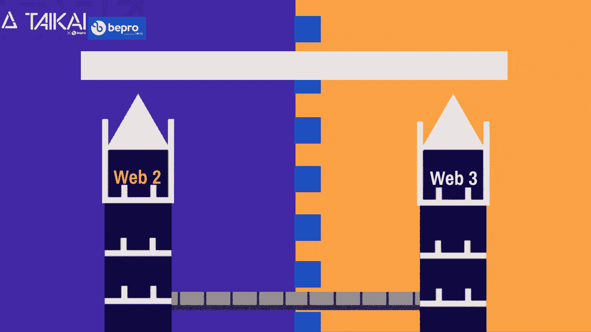
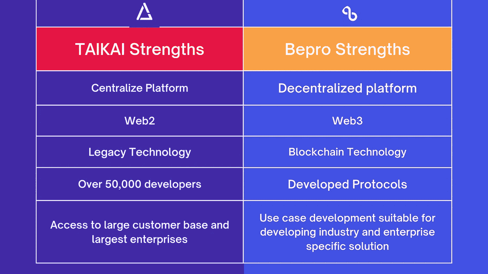

# TAIKAI x Bepro:企业的 Web2 到 Web3 桥梁建设者

> 原文：<https://medium.com/coinmonks/taikai-x-bepro-the-web-2-0-to-web-3-0-bridge-builder-for-enterprise-2ab7442736e4?source=collection_archive---------42----------------------->

## 从 Web2 到 Web3 的过渡——去中心化的区块链已经开始，你的行动可以成就或摧毁你的组织

TAIKAI x Bepro: Bridging Web2 and Web3 — Valuefirst

对于一个已经在 Web2 技术上建立了竞争优势和效率的企业来说，这意味着如果你在向 web3 的过渡中落后，你很可能最终失去你的竞争优势和领导地位，如果你选择获得早期采用者的优势，你将需要 Taikai/Bepro。

在现实生活中，企业将在很大程度上继续在 Web 2.0 平台上运行，并逐渐将更过时的功能转移到 Web3，尝试对组织影响较小的变化，这样在将核心运营转移到 Web 3 之前，中断的可能性极小

**关于 Web 2.0 和 Web 3.0 技术的一点信息**

根据 [Investopedia](https://www.investopedia.com/terms/w/web-20.asp) 的说法，Web 2.0 描述了互联网的现状，与 Web 1.0 相比，它拥有更多用户生成的内容(社交媒体)和最终用户的可用性。同时，根据 [Coindesk](https://www.coindesk.com/learn/what-is-web-3-and-why-is-everyone-talking-about-it/) 的说法，Web3 是下一代互联网，专注于将权力从大型科技公司转移到个人用户，并促进区块链等去中心化协议。

**泰凯/贝普罗的完美搭档**

[Taikai](https://taikai.network/en) / [Bepro](https://www.bepro.network/) 这两个品牌合二为一，是您的组织今天、未来以及从 Web 2 过渡到 Web 3 所需的完美技术合作伙伴。泰凯以 Web2 为传统平台，Bepro 以 web 3/区块链为搭建平台，两者无缝融合，形成一体。

Taikai/Bepro 为您的组织提供了竞争优势，我们确保您的组织拥有全新构建的解决方案，将 Web2 协议和 Web3 协议的原生功能整合在一个解决方案中，因此集成和过渡变得无缝，而不是采用复杂的解决方案，具有功能限制和不愉快的用户体验

TAIKAI x Bepro Features — ValueFirst

没有一个组织愿意落在后面。与 Taikai/bepro 联系

[电报](https://t.me/betprotocol) | [不和](https://discord.gg/bepronetwork) | [推特](https://twitter.com/bepronet) | [LinkedIn](https://www.linkedin.com/company/betprotocol/) | [网站](https://www.bepro.network/)

> *加入 Coinmonks* [*电报频道*](https://t.me/coincodecap) *和* [*Youtube 频道*](https://www.youtube.com/c/coinmonks/videos) *了解加密交易和投资*

# 另外，阅读

*   [有哪些交易信号？](https://coincodecap.com/trading-signal) | [Bitstamp vs 比特币基地](https://coincodecap.com/bitstamp-coinbase) | [买索拉纳](https://coincodecap.com/buy-solana)
*   [ProfitFarmers 回顾](https://coincodecap.com/profitfarmers-review) | [如何使用 Cornix Trading Bot](https://coincodecap.com/cornix-trading-bot)
*   [十大最佳加密货币博客](https://coincodecap.com/best-cryptocurrency-blogs) | [YouHodler 评论](https://coincodecap.com/youhodler-review)
*   [my constant Review](https://coincodecap.com/myconstant-review)|[8 款最佳摇摆交易机器人](https://coincodecap.com/best-swing-trading-bots)
*   [MXC 交易所评论](/coinmonks/mxc-exchange-review-3af0ec1cba8c) | [Pionex vs 币安](https://coincodecap.com/pionex-vs-binance) | [Pionex 套利机器人](https://coincodecap.com/pionex-arbitrage-bot)