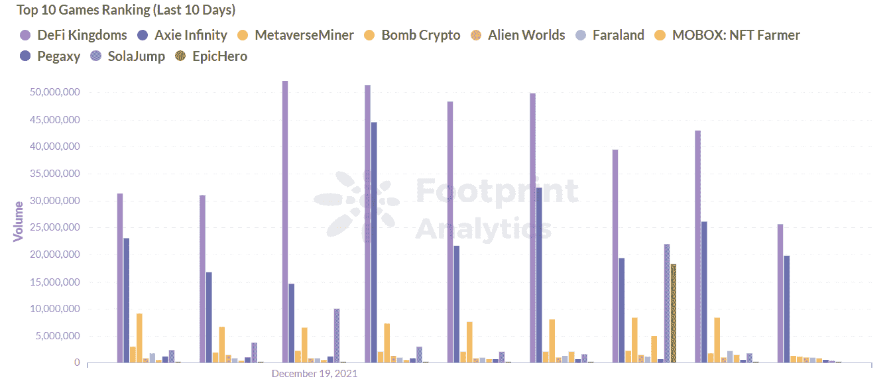

# 从 5 个方面了解 GameFi 足迹分析

> 原文：<https://medium.com/coinmonks/take-a-look-at-gamefi-from-5-aspects-footprint-analytics-39cb2867681b?source=collection_archive---------5----------------------->

数据来源:[足迹分析 GameFi 仪表盘](https://www.footprint.network/guest/dashboard/game-fi-overview-fp-c358ff97-6bf6-491c-b9fd-645fb8262e3f?channel=u-QytebM#secret=1CEF1D4E76499E7E20AD7BE2D827FCD2)

根据 Newzoo 的 *2021 年全球游戏市场报告*，从 2015 年到 2021 年，全球游戏玩家数量同比增长 5.3%，现已超过 30 亿。该报告还预测，未来将有更多的玩家进入游戏市场。

目前，亚洲占所有视频游戏玩家的 55%，其次是中东和非洲(合计占 15%)。

*Screenshot Source:Newzoo Website (Percentage of Game Player Data By Region)*

游戏是娱乐业的一个关键转变，区块链可能是第一个从根本上改变游戏本质的技术。 [me](https://docs.google.com/document/d/1wJUglRWWvBmVqWAe0gHMFS6txAff1hupEntcd_6FBPo/edit#) taverse 的可能性是主要的例子，但 [GameFi](https://www.footprint.network/guest/dashboard/game-fi-overview-fp-c358ff97-6bf6-491c-b9fd-645fb8262e3f?channel=u-DBc983) 是下一个合乎逻辑的发展，可以作为从传统的玩到赚游戏到这种全新娱乐形式的桥梁。

*Footprint Analytics: Top GameFi & Affiliation Chains (Latest Day)*

# 什么是 GameFi

GameFi 代表游戏金融。它结合了 DeFi、NFTs 和游戏的概念。这个想法是由区块链游戏发布平台 MixMarvel 的首席战略官马艳丽在 2019 年乌镇世界区块链大会上首次提出的，该大会由全球领先的区块链媒体 8btc 主办。

从那以后，区块链上出现了数百种“玩到赚”的游戏，让用户能够在享受游戏的同时赚取收入。一些游戏，如众所周知的 Axie Infinity，甚至为菲律宾等欠发达国家的人们提供了支持家庭的生计。

目前，两种主要类型的游戏是“农业游戏”和“黄金游戏”。

*   **农耕游戏:**根据玩家玩游戏的时间量产生道具装备等资产的游戏。
*   **基于黄金的游戏。**需要玩家承诺一个代币或购买游戏内物品才能开始的游戏。

# GameFi 数据性能

早期的 GameFi 项目主要部署在以太坊上，以太坊的拥堵和燃气费阻碍了用户体验。随着 BSC、Flow 和 Sidechain 的引入，开发者有了更多的选择。

根据 [Footprint Analytics](https://www.footprint.network/) 的数据，7 月之后游戏数量开始飙升，截至 12 月 26 日超过 1000 款，以太坊占比 43.14%，其次是 BSC 26.13%，其他区块链占比不足 10%。

*Footprint Analytics: Current Month Number of Games*

*Footprint Analytics: Monthly Number of Games & Trend*

每日跨链 GameFi 用户的数量正在增加，游戏领域的区块链超过 30 个。最突出的是 WAX，它自 4 月以来一直保持着 30 万至 35 万的持续用户群，与其他区块链相比相对稳定。

WAX 是 NFT 和游戏领域的独家区块链，使用基于委托股权证明(DPOS)的共识机制来提高游戏中物品的交易吞吐量。用户不需要创建一个钱包来玩，这要归功于云钱包技术。

此外，Hive 和 BSC 在 8 月至 12 月期间增长迅速，Hive 和 BSC 用户数量分别达到 49 万(10 月 31 日)和 48 万(12 月 7 日)的峰值。BSC 主要受 EpicHero，Bomb Crypto 和 MOBOX: NFT 农民的影响，在 11-12 月超过了 WAX。

Hive 的快速增长是由连锁游戏 Splinterlands(一种卡牌游戏)推动的。其他区块链也在增加势头，但无法与这三家连锁店相比。

*Footprint Analytics: Daily Number of GameFi Users Cross-chain*

*Footprint Analytics: Latest Number & GameFi Users*

# 现在最热门的游戏

GameFi 应用多种多样，前 10 名 GameFi 交易显示大部分都是建立在[和声](https://www.footprint.network/guest/dashboard/harmony-dashboard-fp-7a996026-0812-4f0c-a0ce-2ddd7e604230?date_filter=2021-02-28~&channel=u-DBc983)，浪人，[索拉纳](https://www.footprint.network/guest/dashboard/solana-analysis-dashboard-fp-e22e8f10-57e5-4ce8-bb34-aa8d1c65bbe1?date_filter=2021-02-28~&channel=u-DBc983)，BSC 和以太坊是少数常见的区块链。

今天一些比较活跃的 GameFi 项目有 DeFi 王国、Axie Infinity、MetaverseMiner、Bomb Crypto、Alien Worlds 和 Faraland。

下面，我们将分析最大的 DeFi 王国，以便更好地理解 GameFi。

*Footprint Analytics: Top 10 Games Ranking (Last 10 Days)*

*Footprint Analytics: Market Share Distribution of Chains and Games (Latest Day)*

## DeFi 王国凭借广泛的功能在交易量方面领先

DeFi 王国是一款基于和谐、指数、流动性池和 NFT 市场的游戏，由稀有的公用事业公司提供动力。开发团队的愿景是将 DeFi 元素打包成一个有趣的协同游戏，为其令牌 JEWEL 的持有者提供有意义且切实的价值。

*Footprint Analytics: JEWEL Token Price*

宝石不同于其他普通的加密令牌。

*   宝石是 DeFi 王国游戏的主要价值象征和统治象征。
*   宝石可以用来购买有用的装备和独特的 NFT，允许游戏增益效果和更快的建造时间以及耐力恢复。
*   JEWEL 可用于流动性开采，通过跑马圈地赚取收入。

在其核心，DeFi 王国是一个分散的交换，使用 DEX 头协议 [UniswapV2](https://www.footprint.network/guest/dashboard/uniswap-dashboard-fp-bb9f3421-2f24-40b5-8adb-14ce834bb324?channel=u-DBc983) 。还可以使用以下功能。

*   开发团队为最初的 ONE/JEWEL 对提供了大约 15，000 美元的 ONE(和谐)。
*   可以通过用户希望成为流动性提供者的任何代币池增加流动性，一旦交易完成，就为用户赚取费用。
*   充当银行存款宝石接收 x 宝石股份。

*Screenshot Source：DeFi Kingdoms Game Gardens*

DeFi 王国还建造了花园，在那里可以展示独特的功能，如令牌对和流动性挖掘，从而提高用户收入和游戏赚取体验。

# 为 GameFi 筹款

根据 Footprint Analytics 数据和早期新闻报道，9 月、10 月和 11 月是融资高峰，种子轮的突出反映了全球区块链行业仍处于早期投资阶段的事实。

*Footprint Analytics:Fundraising Number by Round Per Month*

*Footprint Analytics:Fundraising Amount by Round Per Month*

# GameFi 面临的挑战

GameFi 是游戏赚取游戏中的一项重大创新，既可以增加游戏的乐趣，又可以为玩家创造收入。然而，GameFi 仍然面临一些障碍:

*   **区块链技术不成熟:**例如，高气费、低容量和网络容量问题。
*   **安全问题:**例如元宇宙游戏 Roblox 中普遍存在的数字被盗，以及其他数据隐私问题的存在。
*   **可玩性问题:**很多游戏的玩法都不是很创新，显得很基础。
*   **集中化:**目前玩家的数据以集中的形式存储在游戏服务器中，违背了去中心化的前提。

# 结论

为了克服挑战，GameFi 需要像传统游戏一样逐步走向社交 R&D，并将其与道的属性相结合，这就需要游戏内社交。结合区块链技术的能力，它开启了成为游戏和娱乐的关键变革的可能性。

**什么是足迹分析**

足迹分析是一个一体化的分析平台，用于可视化区块链数据和发现见解。它清理和整合链上数据，因此任何经验水平的用户都可以快速开始研究令牌，项目和协议。凭借一千多个仪表板模板和一个拖放界面，任何人都可以在几分钟内构建自己的定制图表。发掘区块链数据，利用足迹进行更明智的投资。

*足迹网址:*[*https://www . Footprint . network*](https://www.footprint.network/)

*不和:*

**推特:*[*https://twitter.com/Footprint_DeFi*](https://twitter.com/Footprint_DeFi)*

**电报:*[*https://t.me/joinchat/4-ocuURAr2thODFh*](https://t.me/joinchat/4-ocuURAr2thODFh)*

**Youtube:https://www . Youtube . com/channel/UCKwZbKyuhWveetGhZcNtSTg**