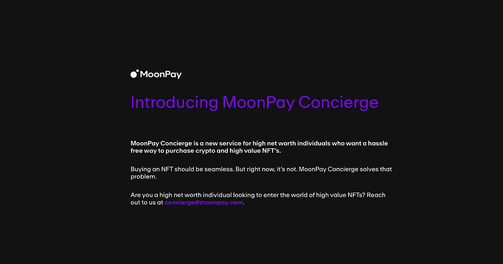

# 带名人去购物

> 原文：<https://medium.com/coinmonks/taking-celebrities-shopping-for-nfts-64f4439d5909?source=collection_archive---------11----------------------->

一线明星不会自己购物。他们有一个造型师和助理团队来为他们做这件事。当然，自然法则不仅仅止于元宇宙的边界。

因此，自然，名人需要个人 NFT 购物者。

输入:月工资。

MoonPay 通常被认为是一家支付基础设施公司，是菲亚特世界和加密世界之间的连接器。

从为普通加密投资者提供服务开始，MoonPay 为名人提供类似服务并不算太难。

还记得吉米·法伦把他的推特头像换成了一条鲨鱼吗？

如果你想象过法伦在家里抱怨汽油费，手忙脚乱地寻找他的种子短语，你会非常失望。法伦通过 MoonPay 的“礼宾服务”购买了 Ape，这意味着 MoonPay 代表富人和名人经纪蓝筹 NFT 交易，然后向买家的钱包转账。

在这种情况下，MoonPay [在 11 月 8 日凌晨 12:28 以 46.6 ETH(224191.20 美元)的价格购买了](https://etherscan.io/tx/0xc25b524618ac595953be96f88ac286eb790258aba6f7a328484a8348a0b44fd7) Bored Ape #599。九分钟后，这只猩猩被[转移](https://etherscan.io/tx/0x25d594eab6dd5ea7c2189d2cf30b702f64ff3c75590d7c41638c9d9a55cf0f76)到一个【匿名】[钱包](https://opensea.io/0x0394451c1238cec1e825229e692aa9e428c107d8)里，那几乎肯定是法伦的。

虽然这一切看起来很神秘，但法伦在接受 Beeple 采访时确实提到了 MoonPay。

这是他们登陆页面的截屏，上面写着“高净值个人”

既然 MoonPay 的服务已经曝光，来自他们钱包的每一笔交易都会引起轰动。

MoonPay 也不仅限于 BAYC。2022 年 1 月 6 日，他们在 CryptoPunk #2681 上投了 900 ETH(300 万美元)。根据 DappRadar 的数据，这是历史上第 12 大的 CryptoPunk 销量。

这个朋克还没有被转移，仍然在 MoonPay 的 OpenSea 钱包里，作为最昂贵的 NFT。

目前，MoonPay 持有两个密码朋克，九个无聊的猿，13 个女人的世界，以及其他一些物品，根据 Zapper 的估计，这些物品的总价值超过 700 万美元。

同样值得注意的是，ETH MoonPay 目前持有 100 多万美元，这可能意味着他们正在为另一项重大收购做准备。

> ***如果你喜欢你读的东西，就关注我的*** [***推特***](https://twitter.com/Will_Stern4) ***。***

> 加入 Coinmonks [电报频道](https://t.me/coincodecap)和 [Youtube 频道](https://www.youtube.com/c/coinmonks/videos)了解加密交易和投资

# 另外，阅读

*   [3 商业评论](/coinmonks/3commas-review-an-excellent-crypto-trading-bot-2020-1313a58bec92) | [Pionex 评论](https://coincodecap.com/pionex-review-exchange-with-crypto-trading-bot) | [Coinrule 评论](/coinmonks/coinrule-review-2021-a-beginner-friendly-crypto-trading-bot-daf0504848ba)
*   [莱杰 vs n rave](/coinmonks/ledger-vs-ngrave-zero-7e40f0c1d694)|[莱杰 nano s vs x](/coinmonks/ledger-nano-s-vs-x-battery-hardware-price-storage-59a6663fe3b0) | [币安评论](/coinmonks/binance-review-ee10d3bf3b6e)
*   [Bybit Exchange 审查](/coinmonks/bybit-exchange-review-dbd570019b71) | [Bityard 审查](https://coincodecap.com/bityard-reivew) | [Jet-Bot 审查](https://coincodecap.com/jet-bot-review)
*   [3 commas vs crypto hopper](/coinmonks/3commas-vs-pionex-vs-cryptohopper-best-crypto-bot-6a98d2baa203)|[赚取加密利息](/coinmonks/earn-crypto-interest-b10b810fdda3)
*   最好的比特币[硬件钱包](/coinmonks/hardware-wallets-dfa1211730c6) | [BitBox02 回顾](/coinmonks/bitbox02-review-your-swiss-bitcoin-hardware-wallet-c36c88fff29)
*   [block fi vs Celsius](/coinmonks/blockfi-vs-celsius-vs-hodlnaut-8a1cc8c26630)|[Hodlnaut 审核](/coinmonks/hodlnaut-review-best-way-to-hodl-is-to-earn-interest-on-your-bitcoin-6658a8c19edf) | [KuCoin 审核](https://coincodecap.com/kucoin-review)