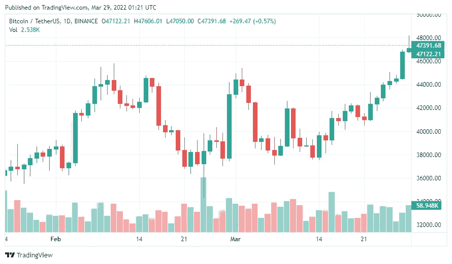

# 乘风破浪:比特币、以太坊和 ADA 价格上涨

> 原文：<https://medium.com/coinmonks/taking-flight-prices-of-bitcoin-ethereum-and-ada-rising-e3643b4386f3?source=collection_archive---------98----------------------->

密码市场上周已经变绿。 [**比特币**](https://blog.alfa.cash/alfacash-glossary/bitcoin/) **在最近一周上涨了 6%，所有加密货币的总市值已经突破 2 万亿美元**。ETH、ADA 和 AXS 是获得最多关注的替代硬币。

本周一，在经历了几周的艰难之后，BTC 达到了 48K 美元。自今年 2 月以来，BTC 尚未达到这一水平。此外，相对于其他加密市场，BTC 的市场资本总额有所增加，表明 BTC 的下滑趋势在短期内有所逆转。

Bitcoin price / TradingView

# 比特币:交易所交易基金、石油和天然气

北美比特币交易所交易基金的新 ATHs 可能会再次使比特币价格[受益](https://blog.alfa.cash/2022/02/07/new-bitcoin-etf-approved-us-market-recovers/)。Proshares 比特币策略交易所交易基金(美国)在两周的交易中已经积累了超过 28000 BTC。比特币交易所交易基金(加拿大)ATH 的目的是上周五收集超过 36，000 BTC。

另一方面，俄罗斯能源委员会主席[表示](http://pressmia.ru/pressclub/20220324/953580633.html)俄罗斯对接受比特币支付其原油和天然气出口持开放态度。

类似地，美国最大的石油公司之一[启动了一项试点计划](https://www.bloomberg.com/news/articles/2022-03-24/exxon-considers-taking-gas-to-bitcoin-pilot-to-four-countries)，利用剩余天然气来喂养比特币矿场。这个项目将很快在尼日利亚、阿根廷、圭亚那和德国开始。

# 以太坊、卡尔达诺和 Axie Infinity

3 月 14 日以太坊测试网上的*合并*的推出提振了[加密货币](https://blog.alfa.cash/alfacash-glossary/cryptocurrency/)。周一，该股上涨约 25%，至 3400 美元。就是以太坊从 PoS 到 PoW 的迁移。在被多次推迟后，现在预计将于 2022 年第二季度抵达。

比特币基地[扩大](https://blog.coinbase.com/coinbase-expands-staking-offerings-to-include-cardano-e5cb35f7fb0e?gi=21d351837045)其赌注发售增加[卡达诺](https://blog.alfa.cash/2021/09/12/cardano-vs-ethereum-which-one-better/) (ADA)，加密货币价格达到 2 月以来的最高水平。周一，ADA 达到 1.24 美元。

上周四，**[**Axie Infinity**](https://blog.alfa.cash/2021/11/11/play-to-earn-cryptos-axie-future-videogames/)**【AXS】令牌在第 20 季**结束前上涨了 40%，等待游戏新版本的发布。这个名为 Origin 的新版本承诺改善游戏机制。**

**从本周初的 50.27 美元，上周五收于 71.53 美元。**

**Solana 与比特币和以太坊一样，也是上周的赢家，价格上涨了 8%，前一个月上涨了 25%。**

# **今年四月的密码市场有什么值得期待的**

**4 月是加密货币的好月份吗？[美国和英国的法规](https://blog.alfa.cash/2022/03/20/overview-new-crypto-regulations-worldwide-2022/)对比特币的限制越来越少，而[历史](https://forbes.co/2021/03/29/actualidad/por-que-abril-podria-ser-el-mes-en-el-que-bitcoin-repunte/)证据也可能指向这种情况。**

**想要交易 BTC、阿达和其他密码吗？在 Alfacash *上可以放心的做* [*！别忘了我们正在我们的社交媒体*上谈论这个和许多其他的事情。](https://www.alfa.cash/buy/ethereum)**

**[推特](https://twitter.com/alfacash_crypto) * [电报](https://t.me/AlfacashCommunity)*[insta gram](https://www.instagram.com/alfacashstore)*[Youtube](https://www.youtube.com/channel/UCOl4fdRHj8AseQ5b6z9udaw)*[脸书](https://www.facebook.com/alfacashstore) * [Vkontakte](https://vk.com/alfacashcrypto)**

***原载于 2022 年 3 月 28 日*[*https://blog . alfa . cash*](https://blog.alfa.cash/2022/03/28/taking-flight-prices-bitcoin-ethereum-ada-rising/)*。***

> **加入 Coinmonks [电报频道](https://t.me/coincodecap)和 [Youtube 频道](https://www.youtube.com/c/coinmonks/videos)了解加密交易和投资**

# **另外，阅读**

*   **[3 商业评论](/coinmonks/3commas-review-an-excellent-crypto-trading-bot-2020-1313a58bec92) | [Pionex 评论](https://coincodecap.com/pionex-review-exchange-with-crypto-trading-bot) | [Coinrule 评论](/coinmonks/coinrule-review-2021-a-beginner-friendly-crypto-trading-bot-daf0504848ba)**
*   **[莱杰 vs n rave](/coinmonks/ledger-vs-ngrave-zero-7e40f0c1d694)|[莱杰 nano s vs x](/coinmonks/ledger-nano-s-vs-x-battery-hardware-price-storage-59a6663fe3b0) | [币安评论](/coinmonks/binance-review-ee10d3bf3b6e)**
*   **[Bybit Exchange 审查](/coinmonks/bybit-exchange-review-dbd570019b71) | [Bityard 审查](https://coincodecap.com/bityard-reivew) | [Jet-Bot 审查](https://coincodecap.com/jet-bot-review)**
*   **[3 commas vs crypto hopper](/coinmonks/3commas-vs-pionex-vs-cryptohopper-best-crypto-bot-6a98d2baa203)|[赚取加密利息](/coinmonks/earn-crypto-interest-b10b810fdda3)**
*   **最好的比特币[硬件钱包](/coinmonks/hardware-wallets-dfa1211730c6) | [BitBox02 回顾](/coinmonks/bitbox02-review-your-swiss-bitcoin-hardware-wallet-c36c88fff29)**