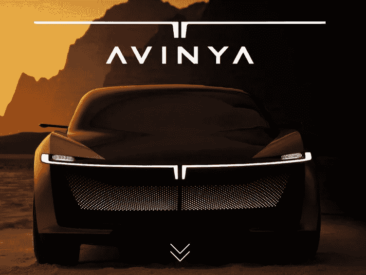

# Tata avi nya-以其非凡的特性探索未来的不可思议性

> 原文：<https://medium.com/coinmonks/tata-avinya-explore-the-incredibility-of-the-future-with-its-extraordinary-features-8a550646a461?source=collection_archive---------35----------------------->

塔塔客运电动汽车公司的 AVINYA 概念是未来一代电动汽车(TPEM)的一大进步。它基于 **GEN 3** 架构，体现了该公司 100%电动汽车的愿景。在梵语中，“AVINYA”的意思是**、【创新】、**，这个新概念有着光明的未来，有着各种各样的特性。在适当的时候，人们可以期待并被塔塔的未来发展所打动。

TATA Motors -AVINYA

[**AVINYA**](https://ev.tatamotors.com/Avinya/) 理念重视以人为本的设计，提供独一无二的感官体验。天穹，提升整体空间感和自然光；受控制台启发的功能性方向盘、为所有乘客提供更深层次界面的声控系统、传达产品精神的环保材料，以及将您包裹在宁静和舒缓氛围中的香味扩散器，您可以穿着全新的“AVINYA”在这一场合保持时尚。

> 加入 Coinmonks [电报频道](https://t.me/coincodecap)和 [Youtube 频道](https://www.youtube.com/c/coinmonks/videos)了解加密交易和投资

# 另外，阅读

*   [如何在 FTX 交易所交易期货](https://coincodecap.com/ftx-futures-trading) | [OKEx vs 币安](https://coincodecap.com/okex-vs-binance)
*   [CoinLoan 评论](https://coincodecap.com/coinloan-review) | [YouHodler 评论](/coinmonks/youhodler-4-easy-ways-to-make-money-98969b9689f2) | [BlockFi 评论](https://coincodecap.com/blockfi-review)
*   [XT.COM 评论](https://coincodecap.com/profittradingapp-for-binance)币安评论 |
*   [SmithBot 评论](https://coincodecap.com/smithbot-review) | [4 款最佳免费开源交易机器人](https://coincodecap.com/free-open-source-trading-bots)
*   [比特币基地僵尸程序](/coinmonks/coinbase-bots-ac6359e897f3) | [AscendEX 审查](/coinmonks/ascendex-review-53e829cf75fa) | [OKEx 交易僵尸程序](/coinmonks/okex-trading-bots-234920f61e60)