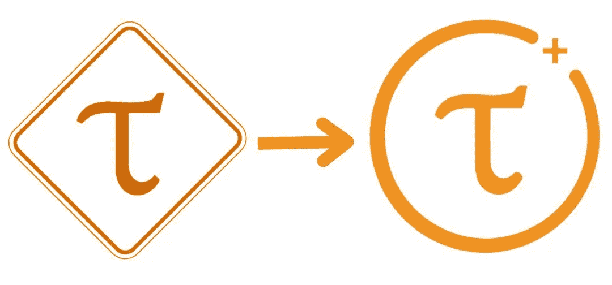

# TAU:第一个分散的移动采矿硬币

> 原文：<https://medium.com/coinmonks/tau-decentralized-mobile-mining-coin-da9eb065c014?source=collection_archive---------16----------------------->

Image by: Kriptolab

你可能已经听说过适者生存的理论；你一定也听过一句话:风平浪静的大海，永远出不了好水手。当我们来到创业公司的真实世界时，上述两种说法都非常符合。创业公司的世界充满了暴力。

我们都知道成功不会独自到来，它会带来期望，而这些期望在现实世界中有时是不现实的。渐进式工作是 TAU 团队的哲学，他们相信这将使他们能够在这个技术娴熟、充满挑战的区块链世界中成功实现可持续增长和进步的高度。

下面是 TAU progressive development，the road，解释了他们(团队)设法工作的方式，以及加密市场中所有的牛市和熊市，他们仍然坚持不懈。这能解释他们的健康吗？沿着音符走。

第一代 TAUcoin 在交易共识的证明下作为区块链的本地硬币运行。TAUT 代表 TAU Testnet，它于 2018 年 8 月开始，以其独特的移动挖掘(电话加密挖掘)创新思想为标志，由自己最新的共识-交易证明(PoT)组成。在准备确保想法实现的过程中，只能通过使用 ubuntu 软件的 PC 来开采 TAU，因为这个想法开始时还没有一个移动开采应用程序。

除了 PoW(在硬件上竞争)和 PoS(持有硬币数量)之外，在交易共识的证明上，采矿者必须在交易历史上竞争，其中较高的交易量(采矿能力)将有高概率验证和开采区块。

**状态:**
testnet 成功部署，但从未关闭，因为它足够强大和安全，可以作为一个独立的区块链继续运行，挖掘继续在 PC 上进行，TAU(最初的电话挖掘想法)开发人员必须在 TAUT left 作为一个相当以社区为中心的时候制作一个新的 mainnet。

在带领团队成功选举(通过机构群体投票)TAUT 主席几个月后，由于机构群体选出的团队没有取得显著进展，TAUT Blockchain 暂时停止运作，最终总裁失踪(据报道他去世了)。从那时起至今，该团队决定暂时停止拉紧区块链，并主张社区成员安全地存储他们的私钥，直到下一次宣布。

**TAU 2:IPFS(IPLD+libp2p)**
第二代 TAUcoin 在交易共识证明上作为自己区块链的原生币运行。在将名称[从 TAU(活动单位)更名为 TAU(真实资产单位)后，一个新的应用程序建立在 IPFS(行星间文件系统)之上，具有相同的原始愿景，即创建电话挖掘技术，并在完整的 mainnet 中运行。这是人们第一次通过真实的电话挖掘(而不是像其他人那样的模拟挖掘)来挖掘街区和赚取真实硬币(TAUcoin ),而每个地址(设备)都充当完整节点。](https://www.reddit.com/r/Tau_coin/comments/afcf4s/tau_weekly_jan_12th/)

**状态:**
在社区(以及团队本身，内部)对 IPFS 应用程序版本进行持续测试后，发现 IPFS 存在问题，因为要求设备每天使用 600mb 的数据，超过这个值是不健康和不可接受的，目标是让 node 每天使用不超过 50mn。因此，要使其工作团队这三个选项:使用 torrent magnet DHT(分布式哈希表)来取代 IPFS DHT，用更轻的协议取代 IPLD，合并 ChainID 与 bittorrent info hash，并为应用程序功能运行创建一个良好的环境，无需服务器层(无服务器)。

TAU 3: libtorrent 在以每天少于 50mb 为目标努力提高更好的数据消耗时，该团队发现，在无服务器环境下，可以在单个应用程序中添加聊天功能和挖掘功能。这引起了开发人员更多的兴趣来学习 libtorrent 作为主线 DHT 技术，作为对附加功能的主要支持。

**状态:**
团队确保将此应用程序更新到最新版本 v1.9.1，在相同的数据消耗下运行，到目前为止没有更多应用程序更新，不幸的是，一些用户已经报告应用程序不同步(启动时不同步数据，是的，唯一的原因是，团队发现了比 libtorrent 更有用的技术，但所有的编码工作都没有让团队和社区满意。

**TAU4: libTAU**
第四代 TAUcoin 在交易共识证明上作为自己区块链的原生币运行。libTAU 的想法出现了，之前的代码只是一个教训，团队决定从头开始重新编写他们自己的代码，同样的愿景是创造一种手机挖掘技术，并且不依赖于服务器。

libTAU 是 TAU API java 库(c++ ),用于设备通信，实际上非常适合手机，更好的是 libTAU 是一个跨平台和多语言的通信包。

从 libtorrent 升级到 libTAU 是为了有更好的性能，因为 libtorrent 仍然没有带来预期的更好的结果，以及给开发者更多的空间来构建软件和其他通信 dapps。请注意，libTAU 是纯 100%无服务器的主要代码基础。

**状态:**
在撰写本文时，一个纯粹 100%无服务器的 TAU 应用程序(beta 测试版)已经推出，而令人兴奋的是他们如何设法将流量数据减少到每天 5mb 或更少，这是令人难以置信的惊人，对于 WiFi，流量数据每天高达 100mb。

**区块链共识升级:**从 POT —交易证明到 [PPOT](https://github.com/wuzhengy/TAU/blob/master/Company/Homepage.md) —易腐交易证明。Pot 是不可变的链，而 ppot 是易腐的链，它们都依赖于交易量(历史)竞争，其中更多的 tx 有很高的机会生成新的块并赚取/收集奖励。

在 pot 中，tx 历史将永久保留，而 [ppot](https://www.taucoin.io/video) 遵循非委托原则(比特币),即只记住最近 6 个月的历史，而 6 个月内没有 tx 的帐户将被删除并遗忘。

在 TAU 中，IP2 是帮助提供最佳通用 p2p 连接的通信层。
PPOT 和 IP2 是 TAU 蛋白的核心。

有了 TAUcoin，你不再需要购买和持有，而是交易，这将促进更多的硬币在生态系统中流通！

**主要生态系统组件:**
**聊天即服务**
这是应用程序内置的通信服务，用户可以在其中进行群组互动或 p2p 聊天

**挖矿即服务**
不用再买挖矿戒指了，省下成本花点钱买个好的安卓设备(至少 v5.1 以上)开始移动挖矿 100 多区块链。

**libTAU** 将用于区块链 API。是聊天和 PPOT 共识在 IP2 上的实现

互联网协议 2 (IP2) 旨在提供尽最大努力的通用 p2p 连接。

**TAU App:功能一目了然
物超所值**TAU coin 带来巨大价值？是的，你没看错。在比特币和以太坊时代，如果你需要创建一家加密初创企业，在 cex 上市，做广告你需要一大笔预算，从 2 万美元到 200 万美元以上，这是不可避免的！

**不再雇佣开发人员**
TAU 开发团队已经为此工作了近 3 年零 8 个月(~ 4 年)。他们旨在消除发展中国家和非发展中国家之间的差距。有了 TAUcoin，你可以在一次点击中自由地创造硬币。因此，没有更多的支付开发奠定基础，因为它都设置好了，公平。

**自由空投硬币**
不像 Eth 或 btc 需要你支付数千美元的汽油费，所以发送空投。使用 TAU，在您创建了您的硬币后，您可以设置 airdrop 链接，并通过 SMS、telegram、whatsApp、电子邮件等免费与您的社区共享，只需利用应用程序中的 airdrop 工具集，有趣。

**享受 p2p 托管交易**
因此，忘掉通常数额巨大的 CEX 交易所上市费用吧，它在 CEX 上市显然需要一个良好的预算。TAU app 为所有用户提供内置的 p2p 托管交易，买家和卖家将毫不费力地执行他们的交易，是的，忘记被除名。

**低准入门槛**
TAU app 最初有 0 余额交易能力，是的你可以发送 0 余额交易，至少在初期会吸引更多用户，但将来可能会被移除。

**关于 TAU**

TAU devs 对赢得技术非常有信心和活力，他们继续工作，移动非常慢，但没有停止，最终他们学习并赢得每个连续的阶段。这个故事告诉我们，缓慢而稳定地做事比快速行动更能取得成功。对 TAU devs 来说，速度越慢越好，这是物有所值的。

**tau coin Socials**
[Reddit](https://www.reddit.com/r/Tau_coin)| |[Twitter](https://twitter.com/tau_io)| |[Telegram](https://t.me/taucoin)| |[Telegram Ann](https://t.me/taucoinann)

> 加入 Coinmonks [电报频道](https://t.me/coincodecap)和 [Youtube 频道](https://www.youtube.com/c/coinmonks/videos)了解加密交易和投资

# 另外，阅读

*   [Botsfolio vs nap bots vs Mudrex](/coinmonks/botsfolio-vs-napbots-vs-mudrex-c81344970c02)|[gate . io 交流回顾](/coinmonks/gate-io-exchange-review-61bf87b7078f)
*   [CoinFLEX 评论](https://coincodecap.com/coinflex-review) | [AEX 交易所评论](https://coincodecap.com/aex-exchange-review) | [UPbit 评论](https://coincodecap.com/upbit-review)
*   [AscendEx 保证金交易](https://coincodecap.com/ascendex-margin-trading) | [Bitfinex 赌注](https://coincodecap.com/bitfinex-staking) | [bitFlyer 审核](https://coincodecap.com/bitflyer-review)
*   [Bitget 评论](https://coincodecap.com/bitget-review) | [双子星 vs BlockFi](https://coincodecap.com/gemini-vs-blockfi) cmd| [OKEx 期货交易](https://coincodecap.com/okex-futures-trading)
*   [AscendEx Staking](https://coincodecap.com/ascendex-staking)|[Bot Ocean Review](https://coincodecap.com/bot-ocean-review)|[最佳比特币钱包](https://coincodecap.com/bitcoin-wallets-india)