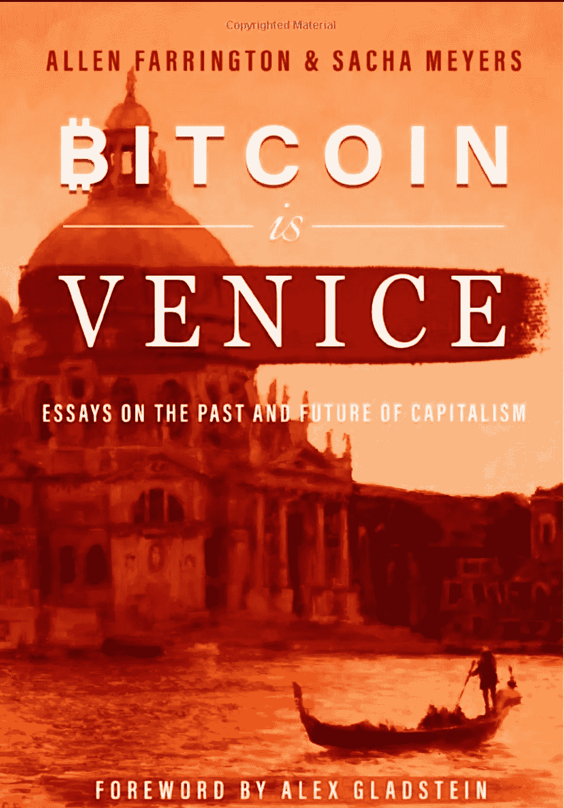
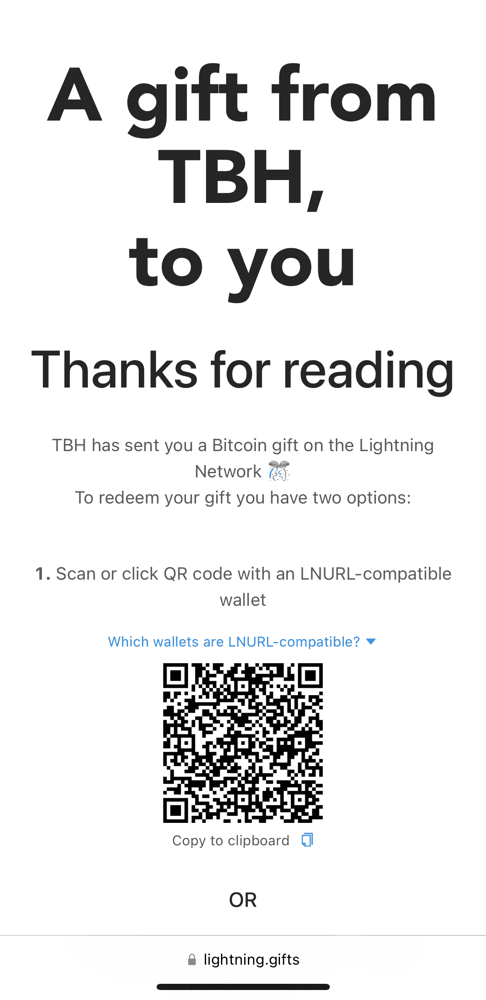

# TBH:书评——比特币是威尼斯

> 原文：<https://medium.com/coinmonks/tbh-book-review-bitcoin-is-venice-5293301ea8ea?source=collection_archive---------26----------------------->

Source: Amazon.com

又一个书评的爱好者。这次我们复习的是比特币是威尼斯。

## 我是如何发现这本书的？

我相信《比特币》杂志在推特上发表了相关文章。作者谈到了这本书，以及为什么像我这样的比特币人应该读这本书。这本书得到了《比特币》杂志的大力推广，我在 Twitter 上看到了它的相关内容。在我听的所有比特币播客中，没有一个邀请作者来讨论这本书。在发布日之后，这本书的出版就停止了，到今天为止，它还没有被真正的讨论过。

## 图书详细信息

页数:347 商店:比特币杂志费用:30.95 美元(21.00 美元+9.99 美元运费)更小的紧凑型字体。有很多深入信息的脚注。这本书在亚马逊上更便宜，但在比特币杂志 Twitter spaces 上，作者提到从比特币杂志购买，因为收入将用于比特币事业。我想他们是向人权基金会(HRF)认捐的，但我不确定。因此，我支付了更高的价格，而不是让亚马逊获得利润。

## 摘要

亚历克斯·格拉德斯坦的前锋非常迷人。我准备一头扎进一本将历史和比特币可能带给人类的积极未来交织在一起的书里。然后，作者警告说，这本书是如何被写成一个散文集，试图通过以邮件形式绘制历史和其他作家的作品来展示思想的全貌。我认为这种方法是有意义的，直到我开始阅读，我必须说这本书是一本难读的书。对我来说有点太抽象了。我经常发现自己迷失在他们试图表达的不同观点的文本中，并把这些信息与一些旧的背景或一些作者的书面作品联系起来。我确实捕捉到了一些引起我注意的更重要的引语和段落，我希望将来能回忆起来。在所有的页面中，我保存了大约 30 页的段落。以下是其中的一些:

引用第 33 页顶部的话:

第 49 页:“正如经济学家亚历克斯·塔巴罗克所说，”打赌是对胡说八道的征税。或者，别说话:做。"

第 79 页:“通过破坏资本的价格信号和耗尽资本存量来刺激无目的的消费，主要是无抵押的债务。”

第 85 页:“很明显，你不想要机器是因为它本身；你想要它是因为它会产生什么。机器必须用流动资本购买，然后作为非流动资本存在。如果需要的话，它可以被清算(即出售以获得现金)，但是它的主要价值是作为一种经济势能的形式。是一只创造流量的股票。”

第 112 页:“测量人类时间和精力的成本”

第 113 页:“不管在此期间不可避免地发生了什么变化，钱是有用的，因为它让我们在某个时间点为网络贡献时间和精力，知道我们的要求不会被稀释，而且在任何未来的时间点，我们都可以收回相同的比例。”

第 122 页:“只有在堕落的菲亚特经济学家的头脑中，他们相信消费是繁荣的原因而不是结果，杠杆毫无疑问是好的，因为它总是在任何地方“刺激投资”，保持独立的非投资储蓄和投资在个人层面上看起来很奇怪，在社会层面上是有害的。

125 页“货币提供了一种协调创造资本的风险的手段，使得那些承担风险的人不一定就是承担风险的人！”

(钱不是资本)使用资本不要消费它！

第 139 页“美元由自我参照错误定价的有毒贷款支持，并由与沙特阿拉伯的军事和商品卡特尔化协议稳定”

第 151 页“比特币将被禁止，很多次，在很多地方。但禁令是对实践和道德失败的公开承认，可以说是最好的广告。禁令是柏林墙。任何禁令的碎片总有一天会成为镇压的愚蠢和残酷的纪念品。比特币不会强迫任何人留下。他们来了，然后留下来，因为他们想——因为

它在实践和道德上都是优越的。"

自 1945 年以来，在全球范围内，中度到极度的土壤侵蚀已经退化了 12 亿公顷的农业用地，相当于中国和印度的总和。

第 269 页“政府决定通过补贴中产阶级拥有的东西来扩大中产阶级:如果中产阶级上大学并拥有自己的房子，那么如果更多的人上大学并拥有自己的房子，我们肯定会有更多的中产阶级。但是，拥有住房和大学并不是中产阶级地位的原因，它们是拥有某种特质的标志——自律，推迟满足的能力，等等。让你进入并停留在中间

班级。补贴标记不会产生特征；如果有什么不同的话，那就是削弱了他们。"

## 比特币爱好者的主要收获

在这本书受到大肆宣传之后，它成了一件大事。这并不可怕，但我肯定可以把我的时间留给更有趣或更有知识性的书。如果你是一个优秀的比特币玩家，并且更了解数据、事实和试图证明观点的实质，那就帮自己一个忙，跳过这本书。身处比特币世界，听播客，这本书并没有建立在我已经知道的关于这个领域的知识之上。我认为有英语和哲学背景的人可能会更喜欢这本书，但如果你是一个平民，我会跳过这本书，读比特币亿万富翁。你会学到更多关于比特币历史的东西，用一种更容易理解的语气。

## **排名和推荐**

⭐️⭐️⭐️和半颗星星

如果你不是一个抽象的思考者，跳过这本书。很难记住我读过的信息。我不断地回顾阅读过的页面和章节，以保持我头脑中的想法新鲜。上面的引用是很好的信息，这些小宝石让我在某种程度上推荐这本书，但大多数人甚至不应该打扰

感谢你花时间阅读这篇文章！使用 lightning 钱包扫描下面的二维码可获得 500 次免费 sat 考试(仅提供一次扫描)。

业余爱好者出局！

> 加入 Coinmonks [电报频道](https://t.me/coincodecap)和 [Youtube 频道](https://www.youtube.com/c/coinmonks/videos)了解加密交易和投资

# 另外，阅读

*   [火币交易机器人](https://coincodecap.com/huobi-trading-bot) | [如何购买 ADA](https://coincodecap.com/buy-ada-cardano) | [Geco？一次回顾](https://coincodecap.com/geco-one-review)
*   [加密副本交易平台](/coinmonks/top-10-crypto-copy-trading-platforms-for-beginners-d0c37c7d698c) | [五大 BlockFi 替代方案](https://coincodecap.com/blockfi-alternatives)
*   [CoinLoan 审核](https://coincodecap.com/coinloan-review)|[Crypto.com 审核](/coinmonks/crypto-com-review-f143dca1f74c) | [火币保证金交易](/coinmonks/huobi-margin-trading-b3b06cdc1519)
*   [Bybit vs 币安](https://coincodecap.com/bybit-binance-moonxbt)|[stealth x 回顾](/coinmonks/stealthex-review-396c67309988) | [Probit 回顾](https://coincodecap.com/probit-review)
*   [顶级付费加密货币和区块链课程](https://coincodecap.com/blockchain-courses)
*   [CBET 评论](https://coincodecap.com/cbet-casino-review) | [库科恩 vs 比特币基地](https://coincodecap.com/kucoin-vs-coinbase) | [拜比特 vs 比特币基地](https://coincodecap.com/bybit-vs-coinbase)